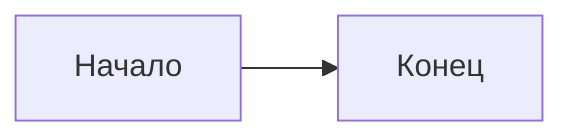

# Руководство для контрибьюторов

Спасибо за интерес к развитию учебника "Искусство Vibe-Coding"! Этот документ описывает, как вы можете внести свой вклад.

---

## 📋 Оглавление

- [Виды вклада](#виды-вклада)
- [Как начать](#как-начать)
- [Стиль и форматирование](#стиль-и-форматирование)
- [Процесс Pull Request](#процесс-pull-request)
- [Переводы](#переводы)
- [Кодекс поведения](#кодекс-поведения)

---

## 🎯 Виды вклада

### 1. Исправления (Fixes)
- Опечатки и грамматические ошибки
- Неработающие ссылки
- Неточности в коде или примерах
- Устаревшая информация

### 2. Дополнения (Additions)
- Новые примеры и use cases
- Дополнительные чек-листы
- Шаблоны промптов
- Ссылки на полезные ресурсы

### 3. Улучшения (Improvements)
- Более понятные объяснения
- Улучшенная структура
- Дополнительные диаграммы (Mermaid)
- Оптимизация для чтения

### 4. Переводы (Translations)
- Перевод глав на другие языки
- Локализация примеров
- Адаптация терминологии

---

## 🚀 Как начать

### Шаг 1: Форк репозитория

Нажмите кнопку "Fork" в правом верхнем углу страницы репозитория.

### Шаг 2: Клонируйте свой форк

```bash
git clone https://github.com/YOUR_USERNAME/vibe-coding-textbook.git
cd vibe-coding-textbook
```

### Шаг 3: Создайте ветку

```bash
# Для исправлений
git checkout -b fix/typo-chapter-5

# Для новых функций
git checkout -b feature/new-checklist

# Для переводов
git checkout -b translation/english
```

### Шаг 4: Внесите изменения

Редактируйте файлы в соответствии со [стилем](#стиль-и-форматирование).

### Шаг 5: Закоммитьте изменения

```bash
git add .
git commit -m "Тип: Краткое описание изменения"
```

**Примеры commit-сообщений:**
```
fix: Исправлена опечатка в Главе 3
feat: Добавлен чек-лист для работы с API
docs: Улучшено объяснение паттерна Scaffolding
translation: Перевод Главы 1 на английский
```

### Шаг 6: Отправьте изменения

```bash
git push origin your-branch-name
```

### Шаг 7: Откройте Pull Request

1. Перейдите на страницу вашего форка на GitHub
2. Нажмите "Compare & pull request"
3. Заполните описание изменений
4. Отправьте PR

---

## 📝 Стиль и форматирование

### Структура файлов

```
├── README.md           # Главная страница репозитория
├── Introduction.md     # Введение в учебник
├── Chapter_chapter_N.md # Главы (N = 1-17)
├── CONTRIBUTING.md     # Этот файл
├── LICENSE.md          # Лицензия
└── translations/       # Переводы (если есть)
    └── en/
        └── Chapter_chapter_1.md
```

### Форматирование Markdown

#### Заголовки
```markdown
# Глава N. Название главы

## N.1. Раздел

### Подраздел

#### Мелкий подраздел
```

#### Код
```markdown
Инлайн: `function_name()`

Блок:
```python
def example():
    return "Hello"
```
```

#### Таблицы
```markdown
| Колонка 1 | Колонка 2 |
|-----------|-----------|
| Значение  | Значение  |
```

#### Диаграммы Mermaid
```markdown

```

#### Предупреждения и заметки
```markdown
> **Совет:** Полезная информация

> **Внимание!** Важное предупреждение

> **Примечание:** Дополнительные детали
```

### Терминология

| Предпочтительно | Избегать |
|----------------|----------|
| Vibe-Coding | вайб-кодинг, vibe coding |
| Coder-LLM | AI-кодер, ИИ-помощник |
| Интенция (intent) | намерение |
| Промпт | prompt (без перевода) |
| Контекстное окно | context window |

---

## 🔄 Процесс Pull Request

### Что должен содержать хороший PR:

1. **Понятный заголовок** — что изменено
2. **Описание** — почему изменено
3. **Ссылка на Issue** — если есть связанный issue
4. **Тесты** — проверьте, что ссылки работают

### Чек-лист перед отправкой PR:

- [ ] Код/текст соответствует стилю проекта
- [ ] Нет опечаток в добавленном тексте
- [ ] Ссылки работают
- [ ] Mermaid-диаграммы отображаются корректно
- [ ] Изменения описаны в commit-сообщении

### Время рассмотрения

Мы стараемся рассматривать PR в течение **7 дней**. Если вы не получили ответа, напомните о себе в комментарии к PR.

---

## 🌍 Переводы

### Как начать перевод

1. Откройте Issue с пометкой `translation` и укажите язык
2. Дождитесь подтверждения (чтобы избежать дублирования работы)
3. Создайте ветку `translation/язык`
4. Переводите главы по одной

### Структура переводов

```
translations/
├── en/           # Английский
│   ├── README.md
│   ├── Introduction.md
│   └── Chapter_chapter_1.md
├── zh/           # Китайский
└── es/           # Испанский
```

### Рекомендации по переводу

1. **Сохраняйте структуру** — заголовки, разделы, форматирование
2. **Адаптируйте примеры** — если нужно, для целевой аудитории
3. **Не переводите термины буквально** — используйте устоявшиеся переводы
4. **Оставляйте оригинал в скобках** — для ключевых терминов
   - Пример: "Контекстный якорь (Context Anchor)"

---

## 🤝 Кодекс поведения

### Мы ценим:
- ✅ Уважительное общение
- ✅ Конструктивную критику
- ✅ Помощь новичкам
- ✅ Терпение и понимание

### Мы не принимаем:
- ❌ Оскорбления и агрессию
- ❌ Дискриминацию любого рода
- ❌ Спам и рекламу
- ❌ Плагиат без указания источника

---

## ❓ Вопросы?

Если у вас есть вопросы:

1. Проверьте [существующие Issues](https://github.com/FineINK/vibe-coding-textbook/issues)
2. Откройте новый Issue с пометкой `question`
3. Свяжитесь с автором через GitHub

---

<p align="center">
  <b>Спасибо за вклад в развитие Vibe-Coding сообщества! 🚀</b>
</p>
