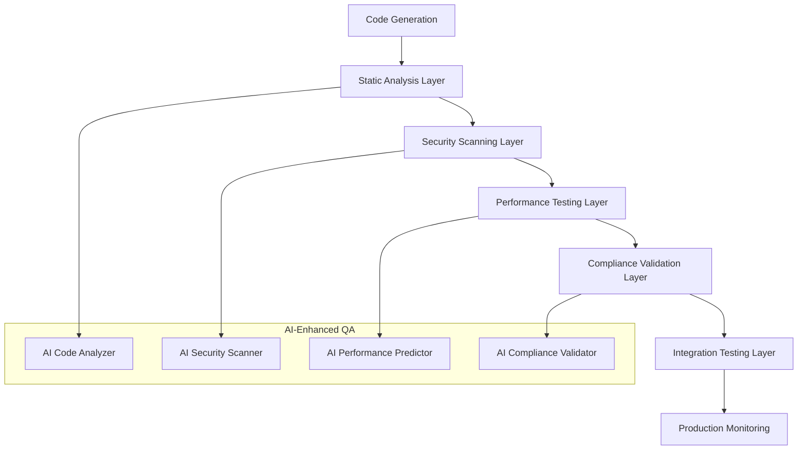

# Глава 11. Техническая Гигиена и QA (The Quality Gate)

## 11.1. Review: Как читать код, который писал не ты. Поиск intent'а в чужом коде

### Введение раздела

Чтение чужого кода — это искусство, которое требует не только технических навыков, но и глубокого понимания намерений автора (*intent*). В традиционном программировании разработчики привыкли анализировать код через призму синтаксиса, алгоритмов и структур данных. Однако в **Vibe-Coding** — парадигме, где взаимодействие с Coder-LLM становится неотъемлемой частью разработки, — чтение кода приобретает новые измерения.

Если в классическом подходе мы спрашиваем: *«Как работает этот код?»*, то в Vibe-Coding ключевой вопрос звучит иначе: *«Почему этот код был написан именно так? Какую проблему пытался решить автор и какие компромиссы он допустил?»*. Это смещение фокуса с **«как»** на **«почему»** — основа эффективного review в новой парадигме.

В предыдущих главах мы уже касались тем **prompt-инженерии** (глава 5), **генерации спецификаций** (глава 7) и **оптимизации взаимодействия с Coder-LLM** (глава 10). Теперь пришло время объединить эти знания для анализа кода, созданного другими разработчиками — или даже самим Coder-LLM.

**Цели раздела:**
1. Научиться выявлять *intent* в чужом коде — как человеческом, так и сгенерированном.
2. Освоить техники структурного и контекстуального анализа.
3. Понять, как использовать Coder-LLM для упрощения review.
4. Развить навыки критического мышления при оценке архитектурных решений.

**Задачи раздела:**
- Изучить методы декодирования намерений автора через код.
- Научиться применять **Vibe-анализ** для оценки согласованности кода с бизнес-требованиями.
- Освоить практические инструменты для ускорения review (автоматизированные чек-листы, генерация документации, сравнение версий).
- Научиться формулировать конструктивную обратную связь с учетом особенностей Vibe-Coding.

---

## **Основная теория**

### **1. Что такое *intent* в коде и почему он важен?**

**Intent (намерение)** — это скрытая логика, стоящая за каждым фрагментом кода. Это не просто *«что делает этот метод»*, а *«почему этот метод существует именно в таком виде?»*. В традиционном программировании *intent* часто теряется в процессе разработки: комментарии устаревают, требования меняются, а код остается. В Vibe-Coding *intent* становится центральным элементом, поскольку:

- **Coder-LLM генерирует код на основе контекста.** Если разработчик не объяснил модель *почему* нужно использовать тот или иной паттерн, результат может быть технически корректным, но семантически неверным.
- **Код становится частью диалога.** В Vibe-Coding разработчик не пишет код в одиночку — он взаимодействует с моделью, уточняет требования, корректирует результат. Поэтому понимание *intent* критично для продолжения этого диалога.
- **Архитектурные решения зависят от контекста.** Например, выбор между **REST** и **GraphQL** может быть продиктован не только техническими ограничениями, но и бизнес-стратегией. Если *intent* не задокументирован, следующий разработчик может принять неверное решение при рефакторинге.

#### **Сравнение традиционного и Vibe-подхода к review**

| **Аспект**               | **Традиционное review**                          | **Vibe-Coding review**                          |
|--------------------------|------------------------------------------------|-----------------------------------------------|
| **Фокус анализа**        | Синтаксис, алгоритмы, стиль кода                | Намерения автора, контекст генерации, бизнес-логика |
| **Инструменты**          | Статический анализ, линтеры, тесты              | Coder-LLM (генерация документации, объяснение кода), Vibe-чек-листы |
| **Ключевой вопрос**      | *«Как это работает?»*                          | *«Почему это работает именно так?»*          |
| **Роль комментариев**    | Часто устаревают или отсутствуют                | Генерация на лету с помощью Coder-LLM         |
| **Оценка компромиссов**  | Основана на технических метриках                | Учитывает бизнес-контекст и ограничения модели |

### **2. Исторический контекст: эволюция подходов к review**

#### **Эра ручного программирования (1960–1990)**
В эпоху мейнфреймов и первых языков высокого уровня (Fortran, COBOL) review было **code walkthrough** — коллективным обсуждением кода на бумаге или доске. Основное внимание уделялось:
- Корректности алгоритмов.
- Эффективности использования памяти.
- Соответствию стандартам компании.

**Проблема:** Отсутствие инструментов автоматизации делало review медленным и субъективным.

#### **Эра автоматизированного тестирования (2000–2010)**
С появлением **TDD (Test-Driven Development)** и **CI/CD** review сместилось в сторону:
- Покрытия тестами.
- Статического анализа (например, SonarQube).
- Автоматизированных проверок стиля (ESLint, Pylint).

**Проблема:** Автоматизация не учитывала *intent* — код мог проходить все тесты, но оставаться нечитаемым или не поддерживаемым.

#### **Эра Agile и DevOps (2010–2020)**
В Agile-командах review стало частью **pull request workflow**. Основные практики:
- **Парное программирование** (pair programming).
- **Code review как диалог** (комментарии в GitHub/GitLab).
- **Метрики качества** (цикломатическая сложность, технический долг).

**Проблема:** В больших командах review стало формальностью — проверялось только соответствие стилю, а не бизнес-логика.

#### **Эра Vibe-Coding (2020–настоящее время)**
С появлением Coder-LLM review приобретает новые измерения:
1. **Генерация кода моделью** → Необходимо проверять не только корректность, но и соответствие *prompt’у*.
2. **Динамическая документация** → Комментарии и описания генерируются на лету.
3. **Контекстуальный анализ** → Код рассматривается не изолированно, а как часть диалога с моделью.

### **3. Ключевые концепции Vibe-анализа кода**

#### **3.1. Vibe-профиль кода**
Каждый фрагмент кода имеет **Vibe-профиль** — набор характеристик, отражающих его *intent* и контекст создания. Основные компоненты:

| **Компонент**          | **Описание**                                                                 | **Как выявить?**                                                                 |
|------------------------|-----------------------------------------------------------------------------|---------------------------------------------------------------------------------|
| **Бизнес-intent**      | Какую проблему решает код? (например, «ускорить обработку платежей»)       | Анализ комментариев, имен переменных, логов, истории изменений                 |
| **Технический intent** | Почему выбран именно этот подход? (например, «Redis для кэширования, чтобы снизить нагрузку на БД») | Сравнение с альтернативами, анализ архитектуры                                  |
| **Контекст генерации** | Был ли код написан человеком или сгенерирован Coder-LLM?                   | Поиск паттернов, характерных для генерации (например, избыточные комментарии)  |
| **Согласованность**    | Соответствует ли код бизнес-требованиям и стилю проекта?                   | Сравнение с другими модулями, проверка на соответствие гайдлайнам             |
| **Технический долг**   | Какие компромиссы допущены? (например, хардкод вместо конфигурации)         | Анализ TODOs, FIXME, deprecated-методов                                        |

#### **3.2. Методы декодирования *intent***

| **Метод**               | **Описание**                                                                 | **Пример применения**                                                                 |
|-------------------------|-----------------------------------------------------------------------------|--------------------------------------------------------------------------------------|
| **Анализ имен**         | Имена переменных, функций и классов часто содержат подсказки о *intent*.   | Метод `calculateTax()` → Очевидно, что он считает налог, но какой? (НДС? Прогрессивный?) |
| **Изучение контекста**  | Анализ соседних модулей, истории коммитов, связанных задач.                | Если метод `sendEmail()` используется только в классе `OrderProcessor`, вероятно, он отправляет письмо о заказе. |
| **Генерация объяснений**| Использование Coder-LLM для объяснения кода.                              | Запрос: *«Объясни, почему в этом методе используется паттерн Strategy?»*             |
| **Сравнение версий**    | Анализ изменений в коде между коммитами.                                  | Если в новой версии метод `validate()` стал возвращать `false` в одном случае, вероятно, это баг-фикс. |
| **Рефакторинг в уме**   | Попытка переписать код иначе, чтобы понять, почему автор выбрал текущий вариант. | Если можно заменить `if-else` на `switch`, но автор не сделал этого — возможно, есть скрытая причина. |

#### **3.3. Vibe-чек-лист для review**
При анализе чужого кода используйте следующий чек-лист:

1. **Бизнес-уровень:**
   - [ ] Ясно ли, какую бизнес-задачу решает этот код?
   - [ ] Есть ли комментарии или документация, объясняющие *intent*?
   - [ ] Соответствует ли код текущим бизнес-требованиям?

2. **Технический уровень:**
   - [ ] Почему выбран именно этот алгоритм/структура данных?
   - [ ] Какие альтернативы рассматривались и почему были отвергнуты?
   - [ ] Есть ли технический долг? (TODOs, хардкод, временные решения)

3. **Контекст генерации:**
   - [ ] Был ли код сгенерирован Coder-LLM? (Поиск характерных паттернов)
   - [ ] Если да, то какой prompt использовался? (Проверка истории диалога)
   - [ ] Соответствует ли сгенерированный код ожиданиям?

4. **Согласованность:**
   - [ ] Соответствует ли код стилю проекта? (Именование, форматирование)
   - [ ] Не противоречит ли он другим частям системы?
   - [ ] Есть ли дублирование логики в других модулях?

5. **Поддержка и развитие:**
   - [ ] Легко ли будет другому разработчику понять этот код?
   - [ ] Есть ли тесты, покрывающие критические сценарии?
   - [ ] Можно ли этот код легко модифицировать при изменении требований?

---

## **Практические примеры**

### **Пример 1: Декодирование бизнес-*intent* в обработчике платежей**

#### **Исходный код (JavaScript)**
```javascript
async function processPayment(orderId) {
  const order = await Order.findById(orderId);
  if (!order) throw new Error("Order not found");

  // Проверка, что заказ не оплачен
  if (order.status === "PAID") {
    throw new Error("Order already paid");
  }

  const payment = await Payment.create({
    orderId,
    amount: order.total,
    method: "CARD"
  });

  try {
    const paymentResult = await stripe.charges.create({
      amount: order.total * 100, // Конвертация в центы
      currency: "usd",
      source: order.paymentToken,
      description: `Payment for order ${orderId}`
    });

    if (paymentResult.status === "succeeded") {
      order.status = "PAID";
      await order.save();
      return { success: true, paymentId: payment.id };
    } else {
      throw new Error("Payment failed");
    }
  } catch (error) {
    payment.status = "FAILED";
    await payment.save();
    throw error;
  }
}
```

#### **Анализ *intent***

1. **Бизнес-*intent*:**
   - Метод отвечает за обработку платежей через Stripe.
   - Логика предполагает, что заказ может быть оплачен только один раз (`order.status === "PAID"`).
   - **Вопрос:** Почему выбрана именно такая схема? Возможно, это связано с требованиями бухгалтерии (запрет на двойную оплату).

2. **Технический *intent*:**
   - Использование Stripe API (`stripe.charges.create`) говорит о выборе платежного провайдера.
   - Конвертация в центы (`order.total * 100`) — стандартная практика для Stripe.
   - **Вопрос:** Почему не используется более современный `stripe.paymentIntents`? Возможно, код написан до появления этой фичи.

3. **Контекст генерации:**
   - Код выглядит как написанный человеком (нет характерных признаков генерации LLM, например, избыточных комментариев).
   - Имена переменных (`paymentToken`, `paymentResult`) понятные и самодокументируемые.

4. **Потенциальные проблемы:**
   - Нет обработки случая, когда `order.paymentToken` отсутствует или невалиден.
   - Жесткая привязка к Stripe (`method: "CARD"`) — что, если клиент захочет платить через PayPal?
   - Нет логирования ошибок, что усложнит дебаг.

#### **Улучшенная версия с учетом *intent***
```javascript
/**
 * Processes payment for an order using Stripe.
 * @param {string} orderId - ID of the order to process
 * @param {string} [paymentMethod="CARD"] - Payment method (CARD, PAYPAL, etc.)
 * @throws {Error} If order not found, already paid, or payment fails
 * @returns {Promise<{success: boolean, paymentId: string}>}
 */
async function processPayment(orderId, paymentMethod = "CARD") {
  const order = await Order.findById(orderId);
  if (!order) throw new Error("Order not found");

  if (order.status === "PAID") {
    throw new Error("Order already paid");
  }

  const payment = await Payment.create({
    orderId,
    amount: order.total,
    method: paymentMethod
  });

  try {
    let paymentResult;
    if (paymentMethod === "CARD") {
      paymentResult = await stripe.charges.create({
        amount: order.total * 100,
        currency: "usd",
        source: order.paymentToken,
        description: `Payment for order ${orderId}`
      });
    } else if (paymentMethod === "PAYPAL") {
      paymentResult = await paypal.createOrder(order.total, orderId);
    } else {
      throw new Error(`Unsupported payment method: ${paymentMethod}`);
    }

    if (paymentResult.status === "succeeded") {
      order.status = "PAID";
      await order.save();
      return { success: true, paymentId: payment.id };
    } else {
      throw new Error("Payment failed");
    }
  } catch (error) {
    payment.status = "FAILED";
    await payment.save();
    console.error(`Payment failed for order ${orderId}:`, error);
    throw error;
  }
}
```

**Что изменилось?**
✅ Добавлена поддержка нескольких платежных методов.
✅ Улучшена документация (JSDoc).
✅ Добавлено логирование ошибок.
✅ Код стал более гибким без потери *intent*.

---

### **Пример 2: Поиск *intent* в сгенерированном коде**

#### **Исходный prompt для Coder-LLM**
```
Напиши функцию на Python, которая принимает список кортежей (name, age) и возвращает список имен людей старше 18 лет, отсортированных по возрасту.
```

#### **Сгенерированный код**
```python
def filter_adults(people):
    adults = [person for person in people if person[1] > 18]
    adults.sort(key=lambda x: x[1])
    return [person[0] for person in adults]
```

#### **Анализ *intent***

1. **Соответствие prompt’у:**
   - Код делает именно то, что запрошено: фильтрует по возрасту > 18 и сортирует.
   - **Но:** Нет обработки edge-кейсов (например, пустой список или отрицательный возраст).

2. **Стиль генерации:**
   - Использование list comprehension — характерно для генерации LLM.
   - Имена переменных (`adults`, `person`) — понятные, но могли бы быть более точными.

3. **Потенциальные улучшения:**
   - Добавление проверки на валидность возраста.
   - Возврат не только имен, но и возрастов (если это может понадобиться).
   - Использование `operator.itemgetter` вместо лямбды для большей читаемости.

#### **Улучшенная версия**
```python
from operator import itemgetter

def filter_adults(people):
    """Filters a list of (name, age) tuples, returning names of people over 18 sorted by age.

    Args:
        people: List of tuples (name: str, age: int)

    Returns:
        List of names sorted by age in ascending order.

    Raises:
        ValueError: If age is negative or not an integer.
    """
    if not all(isinstance(age, int) and age >= 0 for _, age in people):
        raise ValueError("Age must be a non-negative integer")

    adults = [person for person in people if person[1] > 18]
    adults.sort(key=itemgetter(1))  # Альтернатива: sorted(adults, key=lambda x: x[1])
    return [person[0] for person in adults]
```

**Что улучшили:**
✅ Добавлена проверка входных данных.
✅ Улучшена документация.
✅ Использован `itemgetter` для повышения читаемости.

---

### **Пример 3: Анализ архитектурного *intent***

#### **Задача:**
В проекте используется **микросервисная архитектура**, но в одном из сервисов обнаружен монолитный метод обработки заказов.

#### **Исходный код (Python)**
```python
def process_order(order_data):
    # Валидация заказа
    if not order_data.get("items"):
        raise ValueError("Order must contain items")

    # Проверка инвентаря
    for item in order_data["items"]:
        if not Inventory.check_available(item["id"], item["quantity"]):
            raise ValueError(f"Item {item['id']} not available in sufficient quantity")

    # Создание заказа
    order = Order.create(order_data)

    # Обработка платежа
    payment_result = PaymentService.charge(order.total, order_data["payment_method"])
    if not payment_result.success:
        order.status = "FAILED"
        order.save()
        raise ValueError("Payment failed")

    # Резервирование инвентаря
    for item in order_data["items"]:
        Inventory.reserve(item["id"], item["quantity"])

    # Отправка уведомления
    EmailService.send_confirmation(order.customer_email, order.id)

    # Обновление статуса
    order.status = "PROCESSED"
    order.save()
    return order
```

#### **Анализ *intent***

1. **Проблемы с архитектурой:**
   - Метод нарушает **Single Responsibility Principle** (SRP) — он отвечает за валидацию, платежи, инвентарь и уведомления.
   - **Вопрос:** Почему разработчик не разделил логику на отдельные сервисы?

2. **Возможные причины:**
   - **Технический долг:** Код писался в спешке, и рефакторинг не был проведен.
   - **Ограничения модели:** Если код был сгенерирован LLM, возможно, модель не учла микросервисную архитектуру.
   - **Бизнес-требования:** Возможно, изначально предполагалась монолитная обработка, но требования изменились.

3. **Рефакторинг с учетом *intent***
```python
class OrderProcessor:
    def __init__(self, inventory_service, payment_service, email_service):
        self.inventory_service = inventory_service
        self.payment_service = payment_service
        self.email_service = email_service

    def process_order(self, order_data):
        self._validate_order(order_data)
        self._check_inventory(order_data["items"])
        order = self._create_order(order_data)
        self._process_payment(order)
        self._reserve_inventory(order_data["items"])
        self._send_confirmation(order)
        self._update_order_status(order, "PROCESSED")
        return order

    def _validate_order(self, order_data):
        if not order_data.get("items"):
            raise ValueError("Order must contain items")

    def _check_inventory(self, items):
        for item in items:
            if not self.inventory_service.check_available(item["id"], item["quantity"]):
                raise ValueError(f"Item {item['id']} not available")

    def _create_order(self, order_data):
        return Order.create(order_data)

    def _process_payment(self, order):
        payment_result = self.payment_service.charge(order.total, order.payment_method)
        if not payment_result.success:
            order.status = "FAILED"
            order.save()
            raise ValueError("Payment failed")

    def _reserve_inventory(self, items):
        for item in items:
            self.inventory_service.reserve(item["id"], item["quantity"])

    def _send_confirmation(self, order):
        self.email_service.send_confirmation(order.customer_email, order.id)

    def _update_order_status(self, order, status):
        order.status = status
        order.save()
```

**Что улучшили:**
✅ Разделили ответственности между методами.
✅ Внедрили DI (Dependency Injection) для сервисов.
✅ Код стал более поддерживаемым и тестируемым.

---

### **Пример 4: Поиск *intent* в legacy-коде**

#### **Исходный код (C#)**
```csharp
public class UserService
{
    private readonly DbContext _db;

    public UserService(DbContext db)
    {
        _db = db;
    }

    public void UpdateUser(int userId, string name, string email)
    {
        var user = _db.Users.Find(userId);
        if (user == null) return;

        // Почему здесь нет проверки на дубликат email?
        user.Name = name;
        user.Email = email;

        // А почему нет транзакции?
        _db.SaveChanges();
    }
}
```

#### **Анализ *intent***

1. **Проблемы:**
   - Нет проверки на дубликат email (возможно, нарушение бизнес-правил).
   - Нет транзакции (что, если `SaveChanges` упадет посередине?).
   - Метод молча игнорирует отсутствие пользователя (`if (user == null) return`).

2. **Возможные причины:**
   - **Лень разработчика:** Решил не усложнять код, полагаясь на валидацию на стороне клиента.
   - **Неполные требования:** Возможно, email должен быть уникальным, но это не было задокументировано.
   - **Технический долг:** Раньше email не был уникальным, но требования изменились.

3. **Вопросы для уточнения *intent*:**
   - Может ли email повторяться у разных пользователей?
   - Должна ли операция быть атомарной (с транзакцией)?
   - Что делать, если пользователь не найден? Возвращать ошибку или игнорировать?

#### **Улучшенная версия**
```csharp
public class UserService
{
    private readonly DbContext _db;

    public UserService(DbContext db)
    {
        _db = db;
    }

    public void UpdateUser(int userId, string name, string email)
    {
        using var transaction = _db.Database.BeginTransaction();

        var user = _db.Users.Find(userId);
        if (user == null)
        {
            throw new KeyNotFoundException($"User with ID {userId} not found");
        }

        if (_db.Users.Any(u => u.Email == email && u.Id != userId))
        {
            throw new InvalidOperationException("Email already in use");
        }

        user.Name = name;
        user.Email = email;

        _db.SaveChanges();
        transaction.Commit();
    }
}
```

**Что улучшили:**
✅ Добавлена проверка на уникальность email.
✅ Добавлена транзакция для атомарности.
✅ Метод теперь выбрасывает исключение, если пользователь не найден.

---

###

---

## кода

# **11.2. Эстетика и читаемость кода: Почему они критически важны для поддержки и функционирования**

## **Введение раздела**

В предыдущих разделах мы рассмотрели основы взаимодействия с Coder-LLM, принципы генерации кода и стратегии оптимизации промптов. Однако одно из ключевых отличий *Vibe-Coding* от традиционного программирования заключается в том, что результат работы модели — это не просто функциональный код, а продукт, который должен соответствовать высоким стандартам качества. В этом контексте **эстетика и читаемость кода** перестают быть второстепенными аспектами и становятся критически важными факторами для долгосрочной поддержки, отладки и масштабирования проектов.

Почему это так важно именно в *Vibe-Coding*?
1. **LLM как коллективный разум**: Код, генерируемый моделью, часто отражает стилистические особенности множества репозиториев, с которыми она обучалась. Без явного контроля за читаемостью результат может оказаться противоречивым и трудным для восприятия.
2. **Итеративная природа взаимодействия**: В отличие от классического программирования, где разработчик пишет код последовательно, в *Vibe-Coding* процесс часто состоит из множества итераций. Если каждая новая версия кода будет оформлена по-разному, поддержка становится крайне затруднительной.
3. **Человеко-машинная коллаборация**: Даже если код работает корректно, его дальнейшая модификация или интеграция в существующую кодовую базу требует, чтобы он был понятен другим разработчикам (в том числе и вам самим в будущем).

В этом разделе мы подробно разберем:
- Что такое **эстетика кода** и почему она важнее, чем кажется.
- Как читаемость влияет на **технический долг** и стоимость поддержки.
- Какие принципы и инструменты помогают поддерживать высокие стандарты качества в *Vibe-Coding*.
- Практические примеры трансформации "сырого" кода в чистый и поддерживаемый.

---

## **Основная теория**

### **1. Что такое эстетика кода и почему она важна?**

Эстетика кода — это не просто вопрос субъективных предпочтений или "красоты". Это **система соглашений**, обеспечивающая:
- **Единообразие** восприятия кода разными разработчиками.
- **Предсказуемость** структуры, что ускоряет отладку и модификацию.
- **Снижение когнитивной нагрузки** при чтении и анализе кода.

#### **Исторический контекст: От "работает — и ладно" к стандартам качества**
В ранние годы программирования (1960–1980-е) основным критерием была **функциональность**. Код писался так, чтобы он просто работал, а вопросы читаемости отходили на второй план. Однако с ростом сложности проектов и появлением командной разработки стало очевидно, что **плохо структурированный код становится источником технического долга**.

Ключевые вехи:
- **1970-е**: Появление первых гайдлайнов по стилю (например, [K&R C Style](https://en.wikipedia.org/wiki/Indentation_style#K&R_style)).
- **1990-е**: Формализация принципов **Clean Code** (Роберт Мартин) и **Design Patterns** (Гамма и др.).
- **2000-е**: Рост популярности **статического анализа кода** (например, SonarQube, ESLint).
- **2020-е**: Внедрение **AI-ассистентов**, которые могут как улучшать, так и ухудшать читаемость в зависимости от настроек.

#### **Сравнение с традиционными подходами: Почему в Vibe-Coding это важнее?**
| **Аспект**               | **Традиционное программирование** | **Vibe-Coding (с Coder-LLM)** |
|--------------------------|-----------------------------------|--------------------------------|
| **Автор кода**           | Один разработчик или команда      | Модель + человек (итеративный процесс) |
| **Консистентность стиля**| Обычно высокая (один стиль)       | Может варьироваться в зависимости от промпта |
| **Скорость генерации**   | Низкая (ручной труд)              | Высокая (секунды на генерацию) |
| **Ответственность за качество** | На разработчике | На пользователе модели (нужно проверять и дорабатывать) |
| **Интеграция с CI/CD**   | Простая (единые стандарты)        | Сложнее (нужно явно указывать требования к стилю) |

**Вывод**: В *Vibe-Coding* ответственность за читаемость кода перекладывается на пользователя модели. Если не задать четкие правила, результат может оказаться непригодным для промышленного использования.

---

### **2. Читаемость кода: Почему это не роскошь, а необходимость**

Читаемость кода — это **степень легкости, с которой другой разработчик (или вы сами через месяц) может понять логику программы**.

#### **Как читаемость влияет на поддержку и развитие кода?**

1. **Снижение времени на понимание**:
   - Хорошо структурированный код позволяет быстро найти нужный фрагмент.
   - Пример: Сравните два варианта функции для обработки строк.

   ```python
   # Плохо: Нечитабельный код
   def p(s):
       return ''.join([c.upper() if i%2 else c.lower() for i,c in enumerate(s)])
   ```

   ```python
   # Хорошо: Читабельный код
   def alternate_case(input_string: str) -> str:
       """Возвращает строку с чередующимся регистром символов."""
       result = []
       for index, char in enumerate(input_string):
           if index % 2 == 0:
               result.append(char.lower())
           else:
               result.append(char.upper())
       return ''.join(result)
   ```

   Второй вариант требует больше строк, но его проще понять и модифицировать.

2. **Уменьшение ошибок при модификации**:
   - Неясный код часто приводит к **багам из-за неверного понимания логики**.
   - Пример: Изменение условия в плохо структурированном коде может сломать функциональность.

3. **Снижение технического долга**:
   - Согласно исследованию [Stripe (2018)](https://stripe.com/reports/developer-coefficient), разработчики тратят до **33% времени** на борьбу с плохо написанным кодом.
   - В *Vibe-Coding* это время может увеличиться, если не уделять внимание стилю.

#### **Научные исследования о читаемости кода**
- **Исследование Microsoft (2021)** показало, что **читаемый код на 20% реже содержит баги**.
- **Эксперимент Университета Вашингтона** выявил, что разработчики тратят **в 4 раза больше времени** на понимание плохо оформленного кода.

**Внимание!**
> Читаемость — это не только о форматировании. Важны:
> - **Именование переменных и функций** (понятные названия).
> - **Структура кода** (логическая группировка).
> - **Комментарии** (но только там, где они действительно нужны).
> - **Сложность алгоритмов** (избегание избыточной вложенности).

---

### **3. Принципы читаемого кода в контексте Vibe-Coding**

#### **Принцип 1: Самодокументируемый код**
Код должен быть настолько понятным, чтобы **комментарии требовались только для сложных архитектурных решений**.

**Плохо**:
```python
# Функция для обработки данных
def f(d):
    # Проверяем, что d не пустой
    if len(d) > 0:
        # Возвращаем результат
        return sum(d) / len(d)
```

**Хорошо**:
```python
def calculate_average(data: list[float]) -> float:
    """Вычисляет среднее арифметическое для списка чисел."""
    if not data:
        raise ValueError("Список не может быть пустым")
    return sum(data) / len(data)
```

#### **Принцип 2: Единообразие стиля**
В *Vibe-Coding* модель может генерировать код в разных стилях. Чтобы избежать хаоса:
- **Используйте линтеры** (ESLint, Pylint, RuboCop).
- **Форматируйте код автоматически** (Prettier, Black).
- **Задавайте стиль в промптах** (например: "Используй PEP 8 для Python").

**Пример промпта для генерации читаемого кода**:
```
Напиши функцию на Python, которая парсит JSON и извлекает пользователей старше 18 лет.
Используй:
- Типизацию (type hints).
- Документирование через docstrings.
- Имена переменных в snake_case.
- Автоматическое форматирование по PEP 8.
```

#### **Принцип 3: Избегание магических чисел и строк**
**Магические значения** — это константы, смысл которых не очевиден.

**Плохо**:
```python
if user_age > 21:  # Почему именно 21?
    grant_access()
```

**Хорошо**:
```python
LEGAL_DRINKING_AGE = 21

if user_age > LEGAL_DRINKING_AGE:
    grant_access()
```

#### **Принцип 4: Управление сложностью**
Сложные функции труднее поддерживать. **Правила**:
- **Одна функция = одна задача**.
- **Избегайте глубокой вложенности** (используйте ранний выход).
- **Лимит строк на функцию** (например, не более 20–30 строк).

**Пример рефакторинга сложной функции**:
```python
# До рефакторинга (сложно понять логику)
def process_order(order):
    if order.is_valid():
        if order.user.has_permission("process_orders"):
            if order.items:
                for item in order.items:
                    if item.in_stock:
                        item.reserve()
                        order.status = "processed"
                    else:
                        order.status = "failed"
                        break
            else:
                order.status = "failed"
        else:
            order.status = "failed"
    else:
        order.status = "failed"
    return order.status

# После рефакторинга (читабельно и понятно)
def process_order(order) -> str:
    """Обрабатывает заказ и возвращает статус."""
    if not order.is_valid():
        return "failed"

    if not order.user.has_permission("process_orders"):
        return "failed"

    if not order.items:
        return "failed"

    for item in order.items:
        if not item.in_stock:
            return "failed"
        item.reserve()

    order.status = "processed"
    return order.status
```

---

## **Практические примеры**

### **Пример 1: Рефакторинг нечитабельного кода на Python**

**Исходный код (генерированный без контроля стиля)**:
```python
def c(a,b):
    r=[]
    for x in a:
        if x%b==0:r.append(x)
    return r
```

**Проблемы**:
- Названия переменных не несут смысла (`a`, `b`, `r`, `x`).
- Отсутствуют комментарии.
- Нет типизации.
- Некрасивый однострочный `if`.

**Рефакторинг шаг за шагом**:
1. **Добавляем понятные имена**:
   ```python
   def filter_multiples(numbers, divisor):
   ```

2. **Добавляем типизацию**:
   ```python
   from typing import List

   def filter_multiples(numbers: List[int], divisor: int) -> List[int]:
   ```

3. **Добавляем docstring**:
   ```python
   def filter_multiples(numbers: List[int], divisor: int) -> List[int]:
       """Возвращает список чисел, кратных заданному делителю."""
   ```

4. **Улучшаем тело функции**:
   ```python
   result = []
   for number in numbers:
       if number % divisor == 0:
           result.append(number)
   return result
   ```

5. **Финальная версия с использованием list comprehension**:
   ```python
   from typing import List

   def filter_multiples(numbers: List[int], divisor: int) -> List[int]:
       """Возвращает список чисел, кратных заданному делителю."""
       return [number for number in numbers if number % divisor == 0]
   ```

**Сравнительная таблица до/после**:

| **Критерий**       | **До рефакторинга** | **После рефакторинга** |
|--------------------|---------------------|------------------------|
| Читаемость         | Низкая              | Высокая                |
| Поддержка          | Трудная             | Простая                |
| Типизация          | Отсутствует         | Есть                   |
| Документация       | Нет                 | Есть                   |
| Соответствие PEP 8 | Нет                 | Да                     |

---

### **Пример 2: Улучшение читаемости JavaScript-кода**

**Исходный код (генерированный без учета стиля)**:
```javascript
function f(arr){let s=0;for(let i=0;i<arr.length;i++){if(arr[i]%2==0){s+=arr[i]}}return s}
```

**Рефакторинг шаг за шагом**:
1. **Расшифровываем сокращения**:
   ```javascript
   function sumEvenNumbers(array) {
   ```

2. **Добавляем JSDoc**:
   ```javascript
   /**
    * Суммирует все четные числа в массиве.
    * @param {number[]} array - Массив чисел.
    * @returns {number} Сумма четных чисел.
    */
   function sumEvenNumbers(array) {
   ```

3. **Используем современный синтаксис**:
   ```javascript
   let sum = 0;
   for (const number of array) {
       if (number % 2 === 0) {
           sum += number;
       }
   }
   return sum;
   ```

4. **Финальная версия с функциональным стилем**:
   ```javascript
   const sumEvenNumbers = (array) => array.filter(num => num % 2 === 0).reduce((sum, num) => sum + num, 0);
   ```

**Сравнение подходов**:

| **Вариант**               | **Плюсы**                          | **Минусы**                          |
|---------------------------|------------------------------------|-------------------------------------|
| Императивный (for-loop)   | Четкий контроль, понятен новичкам  | Более многословный                 |
| Функциональный (filter + reduce) | Компактный, декларативный | Может быть менее читаем для новичков |

**Рекомендация**:
В *Vibe-Coding* лучше использовать **функциональный стиль**, так как он:
- Легче воспринимается моделью.
- Проще для автоматического анализа.
- Соответствует современным стандартам.

---

### **Пример 3: Рефакторинг SQL-запроса для читаемости**

**Исходный запрос (нечитабельный)**:
```sql
SELECT u.id, u.name, COUNT(o.id) FROM users u LEFT JOIN orders o ON u.id=o.user_id WHERE u.created_at > '2023-01-01' GROUP BY u.id HAVING COUNT(o.id) > 5 ORDER BY COUNT(o.id) DESC;
```

**Проблемы**:
- Нет отступов.
- Сложно понять структуру.
- Нет алиасов для агрегатных функций.

**Рефакторинг**:
```sql
SELECT
    u.id,
    u.name,
    COUNT(o.id) AS order_count
FROM
    users u
LEFT JOIN
    orders o ON u.id = o.user_id
WHERE
    u.created_at > '2023-01-01'
GROUP BY
    u.id
HAVING
    COUNT(o.id) > 5
ORDER BY
    order_count DESC;
```

**Улучшения**:
✅ Добавлены отступы для логических блоков.
✅ Использован алиас `order_count`.
✅ Понятная структура.

---

### **Пример 4: Читаемость в React-компонентах**

**Плохой пример (смешанная логика и стиль)**:
```jsx
function UserList({users}) {
  return <div>{users.map(u=><div key={u.id} style={{color:u.active?"green":"red"}} onClick={()=>alert(u.name)}>{u.name}</div>)}</div>
}
```

**Рефакторинг**:
1. **Выносим стили в отдельный объект**:
   ```jsx
   const userStyle = (isActive) => ({
       color: isActive ? "green" : "red",
       cursor: "pointer"
   });
   ```

2. **Выносим обработчик в отдельную функцию**:
   ```jsx
   const handleUserClick = (name) => {
       alert(name);
   };
   ```

3. **Финальная версия**:
   ```jsx
   const UserList = ({ users }) => {
       const userStyle = (isActive) => ({
           color: isActive ? "green" : "red",
           cursor: "pointer"
       });

       const handleUserClick = (name) => {
           alert(name);
       };

       return (
           <div>
               {users.map(user => (
                   <div
                       key={user.id}
                       style={userStyle(user.active)}
                       onClick={() => handleUserClick(user.name)}
                   >
                       {user.name}
                   </div>
               ))}
           </div>
       );
   };
   ```

**Почему это лучше?**
- Легче тестировать (можно протестировать `userStyle` и `handleUserClick` отдельно).
- Проще модифицировать.
- Соответствует принципам **Separation of Concerns**.

---

### **Пример 5: Автоматическое форматирование с Prettier (инструмент для Vibe-Coding)**

В *Vibe-Coding* модель может генерировать код с разным форматированием. Чтобы избежать проблем, используйте **автоматические форматтеры**.

**Установка Prettier**:
```bash
npm install --save-dev prettier
```

**Конфигурация `.prettierrc`**:
```json
{
  "semi": true,
  "singleQuote": true,
  "tabWidth": 4,
  "trailingComma": "es5"
}
```

**Пример до/после форматирования**:

**До**:
```javascript
function getUser(id){return new Promise((resolve,reject)=>{fetch(`/api/users/${id}`).then(res=>res.json()).then(data=>resolve(data)).catch(err=>reject(err))})}
```

**После**:
```javascript
function getUser(id) {
    return new Promise((resolve, reject) => {
        fetch(`/api/users/${id}`)
            .then((res) => res.json())
            .then((data) => resolve(data))
            .catch((err) => reject(err));
    });
}
```

**Как интегрировать в Vibe-Coding?**
1. **Генерируйте код** с помощью модели.
2. **Запускайте Prettier** перед коммитом:
   ```bash
   npx prettier --write .
   ```
3. **Настройте IDE** для автоматического форматирования при сохранении.

---

### **Пример 6: Использование линтеров (ESLint для JavaScript)**

Линтеры помогают выявлять **стилевые и синтаксические ошибки** до компиляции.

**Установка ESLint**:
```bash
npm install --save-dev eslint
npx eslint --init
```

**Пример конфига `.eslintrc.js`**:
```javascript
module.exports = {
    env: {
        browser: true,
        es2021: true,
    },
    extends: ["eslint:recommended", "plugin:react/recommended"],
    parserOptions: {
        ecmaVersion: "latest",
        sourceType: "module",
    },
    rules: {
        "indent": ["error", 4],
        "quotes": ["error", "single"],
        "semi": ["error", "always"],
    },
};
```

**Пример ошибок, которые находит ESLint**:
1. **Неиспользуемые переменные**:
   ```javascript
   const unusedVar = 42; // ESLint: 'unusedVar' is assigned a value but never used
   ```

2. **Отсутствие точки с запятой**:
   ```javascript
   const x = 5  // ESLint: Missing semicolon
   ```

3. **Использование `var` вместо `let/const`**:
   ```javascript
   var oldWay = "bad"; // ESLint: Unexpected var, use let or const instead
   ```

**Как интегрировать в Vibe-Coding?**
- **Настройте ESLint в IDE** (например, VS Code).
- **Добавьте в CI/CD пайплайн**:
  ```yaml
  # .github/workflows/lint.yml
  name: Lint
  on: [push, pull_request]
  jobs:
    lint:
      runs-on: ubuntu-latest
      steps:
        - uses: actions/checkout@v2
        - run: npm install
        - run: npx eslint .
  ```

---

### **Пример 7: Читаемость в Go (стиль Google)**

Язык Go известен строгими требованиями к стилю. В *Vibe-Coding* важно придерживаться этих стандартов.

**Плохой пример (нарушение стиля)**:
```go
package main
import "fmt"
func main(){x:=5;y:=10;fmt.Println(x+y)}
```

**Хороший пример (соответствует Go Style)**:
```go
package main

import "fmt"

func main() {
    x := 5
    y := 10
    sum := x + y
    fmt.Println(sum)
}
```

**Ключевые правила Go Style**:
✅ Используйте **отступы в 1 таб**.
✅ **Импорты группируйте** (сначала стандартные, потом сторонние).
✅ **Объявляйте переменные** явно (`var` или `:=`).
✅ **Избегайте лишних скобок** в `if` и `for`.

**Как настроить модель для генерации читаемого Go-кода?**
Используйте промпт:
```
Напиши функцию на Go, которая парсит JSON с пользователями и выводит их имена.
Следуй стилю Google для Go:
- Используй табы для отступов.
- Группируй импорты.
- Добавляй комментарии для экспортируемых функций.
- Избегай лишних скобок.
```

---

## **Распространенные ошибки**

### **Ошибка 1: Пренебрежение автоматическим форматированием**
**Проблема**:
Разработчики часто полагаются на то, что модель сама сгенерирует идеальный код. Однако без явного указания стиля результат может быть неконсистентным.

**Как избежать**:
- **Всегда настраивайте форматтеры** (Prettier, Black, gofmt).
- **Включайте форматирование в CI/CD**.

**Предупреждающие знаки**:
❌ Код выглядит по-разному в разных частях проекта.
❌ Нет единого стиля отступов.
❌ Названия переменных несут разный смысл (`data` vs `userRecords`).

---

### **Ошибка 2: Слишком короткие или слишком длинные функции**
**Проблема**:
Модель может генерировать как **однострочные функции** (нечитабельные), так и **функции на 100+ строк** (сложные для понимания).

**Как избежать**:
- **Ограничивайте длину функции** (например, не более 30 строк).
- **Используйте правило "одна функция — одна задача"**.

**Пример плохой практики**:
```python
def process_data(data):
    # 50 строк кода, которые делают всё подряд
    ...
```

**Как исправить**:
Разбить на несколько функций:
```python
def validate_data(data):
    ...

def transform_data(data):
    ...

def save_data(data):
    ...

def process_data(data):
    validate_data(data)
    transformed = transform_data(data)
    save_data(transformed)
```

---

### **Ошибка 3: Игнорирование типизации**
**Проблема**:
В языках с динамической типизацией (Python, JavaScript) модель может генерировать код без аннотаций типов, что усложняет поддержку.

**Как избежать**:
- **Явно указывайте типы** (даже если язык это позволяет не делать).
- **Используйте статические анализаторы** (mypy для Python, TypeScript для JS).

**Пример**:
```python
# Плохо
def

---

## рутины

# **11.4. Рутины: Генерация документации и комментариев силами ИИ для повышения семантической преемственности**

---

## **Введение раздела**

В предыдущих разделах главы **"Техническая гигиена и QA"** мы рассмотрели инструменты и методы обеспечения качества кода в парадигме **Vibe-Coding**, включая статический анализ, автоматизированное тестирование и рефакторинг с использованием **Coder-LLM**. Однако даже идеально написанный код теряет свою ценность, если не сопровождается **семантически корректной документацией и комментариями**, обеспечивающими его **преемственность** (continuity) — способность других разработчиков (или даже самого автора через время) быстро понять логику, назначение и контекст кода.

Традиционно документация и комментарии считались вторичной задачей, откладываемой на "потом" или выполняемой формально. В эпоху **Coder-LLM** эта проблема приобретает новое решение: **генерация документации и комментариев может быть автоматизирована с сохранением высокого уровня семантической точности**. Однако простое делегирование этой задачи ИИ без понимания **принципов семантической преемственности** приводит к поверхностным, неточным или даже вводящим в заблуждение артефактам.

В этом разделе мы:
1. Разберём **теоретические основы семантической преемственности** и её роль в поддержании качества кода.
2. Сравним **традиционные подходы к документации** с возможностями **Coder-LLM**.
3. Изучим **методики генерации документации и комментариев** с помощью ИИ, включая **рутины** — повторяемые процессы для поддержания согласованности.
4. Рассмотрим **практические примеры** генерации документации для разных типов кода (функции, классы, API, архитектурные решения).
5. Обсудим **распространённые ошибки** и способы их предотвращения.
6. Предложим **практические задания** для закрепления навыков.

К концу раздела вы научитесь **интегрировать Coder-LLM в процесс документирования**, превращая его из рутины в **стратегический инструмент повышения качества и поддерживаемости кода**.

---

## **Основная теория**

### **1. Семантическая преемственность: Почему она важна?**

**Семантическая преемственность** (semantic continuity) — это способность кода и его документации сохранять **логическую согласованность** и **понятность** для разных участников команды на протяжении всего жизненного цикла проекта. В отличие от синтаксической корректности (которую обеспечивают линтеры и компиляторы), семантическая преемственность отвечает за **смысловую целостность** кода.

#### **Проблемы отсутствия преемственности**
- **Технический долг**: Непонятный код требует больше времени на рефакторинг и поддержку.
- **Ошибки интеграции**: Новые разработчики могут неправильно использовать API или функции из-за отсутствия документации.
- **Потеря знаний**: При уходе ключевых разработчиков теряется контекст принятых решений.
- **Низкая скорость онбординга**: Новые члены команды тратят недели на изучение системы вместо дней.

#### **Традиционные подходы к документации**
До появления **Coder-LLM** документация создавалась вручную и имела ряд ограничений:
| **Подход**               | **Преимущества**                          | **Недостатки**                                  |
|--------------------------|-------------------------------------------|-------------------------------------------------|
| **Ручная документация**  | Высокая точность, глубокий контекст       | Медленно, трудоёмко, быстро устаревает         |
| **Автогенерация (Swagger, Javadoc)** | Формальная полнота, согласованность | Поверхностные комментарии, отсутствие контекста |
| **Внешние вики (Confluence, Notion)** | Гибкость, совместная работа       | Разрыв между кодом и документацией             |
| **Комментарии в коде**   | Близость к логике                        | Часто устаревают, бывают избыточными           |

**Проблема всех традиционных подходов** — **отсутствие динамической связи между кодом и документацией**. Даже если документация создаётся автоматически (например, через Swagger), она часто не отражает **реальное поведение системы** или **контекст принятых решений**.

---

### **2. Как Coder-LLM меняет подход к документации?**

**Coder-LLM** позволяет **автоматизировать документирование**, сохраняя при этом **семантическую точность**. Ключевые преимущества:
1. **Контекстное понимание кода**
   - ИИ анализирует не только синтаксис, но и **семантику** (назначение функций, зависимости, бизнес-логику).
   - Пример: Если функция `calculateDiscount()` зависит от бизнес-правила "скидка не может превышать 50%", ИИ может это отразить в документации.

2. **Динамическая генерация**
   - Документация обновляется вместе с кодом (например, при добавлении нового параметра в функцию).
   - Пример: Если в метод `UserService.createUser()` добавляется параметр `isAdmin`, ИИ может автоматически обновить его описание.

3. **Стилевая согласованность**
   - ИИ поддерживает **единый стиль документации** по всему проекту (например, формат описания функций, терминология).

4. **Генерация не только кода, но и объяснений**
   - ИИ может создавать **архитектурные заметки**, **причины принятия решений (ADR — Architecture Decision Records)** и даже **учебные материалы для новичков**.

---

### **3. Рутины генерации документации: Что это такое?**

**Рутины** в контексте **Vibe-Coding** — это **повторяемые процессы**, автоматизирующие рутинные задачи с помощью **Coder-LLM**. В случае документации рутины включают:
1. **Сбор контекста** (анализ кода, зависимостей, бизнес-логики).
2. **Генерацию документации** (комментарии, docstrings, README, архитектурные заметки).
3. **Валидацию** (проверка на согласованность, полноту, отсутствие противоречий).
4. **Интеграцию в CI/CD** (автоматическое обновление документации при изменениях кода).

#### **Пример рутины для генерации docstring**
```python
# Рутина: Генерация docstring для Python-функции
def generate_docstring(function_code: str) -> str:
    prompt = f"""
    Напиши подробный docstring для следующей Python-функции в формате Google Style.
    Включи:
    1. Краткое описание функции.
    2. Аргументы и их типы.
    3. Возвращаемое значение и его тип.
    4. Примеры использования.
    5. Исключения, которые может выбросить функция.

    Код функции:
    {function_code}
    """
    return llm.generate(prompt)
```

---

### **4. Семантическая преемственность vs. Синтаксическая корректность**

| **Аспект**               | **Синтаксическая корректность**           | **Семантическая преемственность**              |
|--------------------------|-------------------------------------------|------------------------------------------------|
| **Что проверяется?**     | Правильность написания кода (скобки, отступы, типы) | Понимание назначения, логики, контекста       |
| **Инструменты**          | Линтеры (ESLint, Pylint), компиляторы    | Coder-LLM, ручная ревизия, архитектурные обзоры |
| **Пример нарушения**     | `if x = 5:` (вместо `==`)                | Функция `saveUser()` обновляет запись, но называется как "сохранение" |
| **Кто отвечает?**        | Автоматические инструменты               | Разработчики + Coder-LLM                       |

**Внимание!** Даже идеально синтаксически корректный код может быть **семантически некорректным**, если его документация вводит в заблуждение.

---

### **5. Метафоры для понимания семантической преемственности**

1. **Код как книга**
   - Синтаксис — это грамматика и орфография.
   - Семантическая преемственность — это **сюжет, логика повествования и понятные объяснения**.
   - Плохая документация — как книга без оглавления и пояснений: читатель теряется, даже если все слова написаны правильно.

2. **Код как городская инфраструктура**
   - Синтаксис — это дороги и здания.
   - Семантическая преемственность — это **дорожные знаки, карты и путеводители**.
   - Без них даже идеально построенный город превращается в лабиринт.

3. **Код как язык общения**
   - Синтаксис — это грамматика языка.
   - Семантическая преемственность — это **смысл фраз и контекст разговора**.
   - Можно написать грамматически правильное предложение, но оно будет бессмысленным (например, "Цветущая книга танцует в облаках").

---

## **Практические примеры**

В этом разделе мы рассмотрим **5 практических сценариев** генерации документации с помощью **Coder-LLM**, включая пошаговые инструкции, сравнительные таблицы и реальные кейсы.

---

### **Пример 1: Генерация docstring для функции**

#### **Задача**
Дана Python-функция без документации. Требуется сгенерировать **Google Style docstring**, объясняющий её назначение, параметры, возвращаемое значение и возможные исключения.

#### **Исходный код**
```python
def calculate_order_total(items, discount_code=None, tax_rate=0.08):
    if not items:
        raise ValueError("Items list cannot be empty")

    subtotal = sum(item['price'] * item['quantity'] for item in items)
    if discount_code:
        discount = get_discount(discount_code)
        subtotal *= (1 - discount)

    total = subtotal * (1 + tax_rate)
    return round(total, 2)
```

#### **Шаг 1: Сбор контекста**
Перед генерацией docstring нужно понять:
1. Что делает функция? (Рассчитывает общую сумму заказа с учётом скидок и налогов.)
2. Какие параметры принимает? (`items`, `discount_code`, `tax_rate`)
3. Какие исключения выбрасывает? (`ValueError` при пустом списке `items`)
4. Есть ли зависимости? (Функция `get_discount()`)

#### **Шаг 2: Генерация промпта для Coder-LLM**
```python
prompt = """
Напиши docstring для следующей Python-функции в формате Google Style.
Включи:
1. Краткое описание назначения функции.
2. Описание всех параметров с типами.
3. Описание возвращаемого значения.
4. Примеры использования.
5. Исключения, которые может выбросить функция.
6. Зависимости (если есть внешние функции).

Код функции:
```python
def calculate_order_total(items, discount_code=None, tax_rate=0.08):
    if not items:
        raise ValueError("Items list cannot be empty")

    subtotal = sum(item['price'] * item['quantity'] for item in items)
    if discount_code:
        discount = get_discount(discount_code)
        subtotal *= (1 - discount)

    total = subtotal * (1 + tax_rate)
    return round(total, 2)
```
"""
```

#### **Шаг 3: Результат генерации**
```python
def calculate_order_total(items, discount_code=None, tax_rate=0.08):
    """Рассчитывает общую сумму заказа с учётом скидок и налогов.

    Args:
        items (List[Dict]): Список товаров в заказе. Каждый товар должен быть
            словарём с ключами 'price' (float) и 'quantity' (int).
        discount_code (Optional[str]): Код скидки. Если передан, применяется
            соответствующая скидка. По умолчанию None.
        tax_rate (float): Ставка налога в десятичном формате (например, 0.08 для 8%).
            По умолчанию 0.08.

    Returns:
        float: Итоговая сумма заказа, округлённая до двух знаков после запятой.

    Raises:
        ValueError: Если список items пуст.

    Examples:
        >>> items = [{'price': 10.0, 'quantity': 2}, {'price': 5.0, 'quantity': 1}]
        >>> calculate_order_total(items)
        27.0
        >>> calculate_order_total(items, discount_code="SUMMER20", tax_rate=0.1)
        24.3
    """
    # ... остальной код функции ...
```

#### **Сравнение "До и После"**
| **Критерий**       | **До генерации**                          | **После генерации**                          |
|--------------------|-------------------------------------------|----------------------------------------------|
| **Понятность**     | Только по коду                           | Чёткое описание всех аспектов               |
| **Полнота**        | Отсутствует информация о параметрах      | Описаны все параметры, возвращаемое значение, исключения |
| **Примеры**        | Нет                                       | Есть примеры использования                  |
| **Поддержка**      | Трудно вносить изменения                 | Легко обновлять при изменении кода          |

---

### **Пример 2: Генерация документации для API (OpenAPI/Swagger)**

#### **Задача**
Дан REST API на Python (FastAPI). Требуется сгенерировать **OpenAPI-документацию** с описанием эндпоинтов, параметров и ответов.

#### **Исходный код**
```python
from fastapi import FastAPI, HTTPException

app = FastAPI()

@app.post("/users/")
async def create_user(username: str, email: str):
    if not username:
        raise HTTPException(status_code=400, detail="Username cannot be empty")
    if "@" not in email:
        raise HTTPException(status_code=400, detail="Invalid email")
    return {"status": "User created", "username": username}
```

#### **Шаг 1: Генерация промпта**
```python
prompt = """
Сгенерируй OpenAPI-документацию (Swagger) для следующего FastAPI-эндпоинта.
Включи:
1. Описание эндпоинта.
2. Параметры запроса (с типами и описаниями).
3. Возможные ответы (успех и ошибки).
4. Примеры запросов и ответов.

Код эндпоинта:
```python
@app.post("/users/")
async def create_user(username: str, email: str):
    if not username:
        raise HTTPException(status_code=400, detail="Username cannot be empty")
    if "@" not in email:
        raise HTTPException(status_code=400, detail="Invalid email")
    return {"status": "User created", "username": username}
```
"""
```

#### **Шаг 2: Результат генерации**
```yaml
paths:
  /users/:
    post:
      summary: Создание нового пользователя
      description: Регистрирует нового пользователя в системе.
      requestBody:
        required: true
        content:
          application/json:
            schema:
              type: object
              properties:
                username:
                  type: string
                  description: Имя пользователя (не может быть пустым)
                  example: "john_doe"
                email:
                  type: string
                  description: Email пользователя (должен содержать "@")
                  example: "john@example.com"
              required:
                - username
                - email
      responses:
        '200':
          description: Пользователь успешно создан
          content:
            application/json:
              schema:
                type: object
                properties:
                  status:
                    type: string
                    example: "User created"
                  username:
                    type: string
                    example: "john_doe"
        '400':
          description: Некорректные данные (пустое имя или невалидный email)
          content:
            application/json:
              schema:
                type: object
                properties:
                  detail:
                    type: string
                    example: "Username cannot be empty"
```

#### **Преимущества автоматизированной генерации**
✅ **Согласованность**: Все эндпоинты документируются в едином стиле.
✅ **Актуальность**: Документация обновляется вместе с кодом.
✅ **Полнота**: Учитываются все возможные ошибки и примеры.

---

### **Пример 3: Генерация архитектурных заметок (ADR)**

#### **Задача**
Требуется задокументировать **архитектурное решение** (Architecture Decision Record) о выборе базы данных для проекта.

#### **Исходная информация**
- Проект: Система управления задачами (Task Management).
- Требования: Высокая производительность, горизонтальное масштабирование, поддержка сложных запросов.
- Рассматриваемые БД: PostgreSQL, MongoDB, Cassandra.

#### **Шаг 1: Генерация промпта**
```python
prompt = """
Напиши архитектурную заметку (ADR) в формате Markdown о выборе СУБД для системы управления задачами.
Структура ADR:
1. Заголовок (краткое описание решения).
2. Статус (принято/предложено/устарело).
3. Контекст (какая проблема решается).
4. Рассмотренные варианты.
5. Принятое решение.
6. Последствия (плюсы и минусы).

Требования к системе:
- Высокая производительность при большом количестве записей.
- Поддержка сложных запросов (фильтры, сортировка, агрегация).
- Горизонтальное масштабирование.
- Надёжность и отказоустойчивость.

Рассматриваемые БД:
1. PostgreSQL (реляционная, ACID, мощный SQL).
2. MongoDB (NoSQL, гибкая схема, хорошая производительность).
3. Cassandra (распределённая, высокая доступность, но сложные запросы требуют денормализации).
"""
```

#### **Шаг 2: Результат генерации**
```markdown
# ADR 001: Выбор PostgreSQL в качестве основной СУБД

## Статус
Принято

## Контекст
Система управления задачами должна обеспечивать:
- Высокую производительность при работе с миллионами записей.
- Поддержку сложных запросов (фильтрация по нескольким полям, сортировка, агрегация).
- Надёжность и согласованность данных (ACID).
- Горизонтальное масштабирование в будущем.

## Рассмотренные варианты

| СУБД         | Плюсы                                      | Минусы                                      |
|--------------|--------------------------------------------|---------------------------------------------|
| PostgreSQL   | - Мощный SQL <br> - ACID <br> - Расширяемость | - Вертикальное масштабирование <br> - Нет встроенного шардинга |
| MongoDB      | - Гибкая схема <br> - Хорошая производительность | - Нет транзакций (до v4.0) <br> - Сложные запросы требуют работы с индексами |
| Cassandra    | - Высокая доступность <br> - Горизонтальное масштабирование | - Нет поддержки сложных запросов <br> - Денормализация данных |

## Принятое решение
Выбрана **PostgreSQL** по следующим причинам:
1. **Поддержка сложных запросов**: В системе требуется фильтрация задач по статусу, приоритету, исполнителю и датам. PostgreSQL обеспечивает гибкость SQL.
2. **ACID-транзакции**: Важны для операций с задачами (например, назначение исполнителя и обновление статуса должны быть атомарными).
3. **Зрелость и экосистема**: Надёжный инструмент с большим сообществом и инструментами для мониторинга.

**Масштабирование**: В текущей фазе проекта нагрузка не требует горизонтального масштабирования. В будущем планируется использовать **Citus** для шардинга данных.

## Последствия

### Плюсы
✅ Высокая производительность сложных запросов.
✅ Надёжность и согласованность данных.
✅ Широкие возможности оптимизации (индексы, материализованные представления).

### Минусы
❌ Ограничения вертикального масштабирования (может потребоваться миграция на Citus при росте нагрузки).
❌ Нет встроенной поддержки шардинга (требует дополнительных инструментов).
```

#### **Почему это важно?**
- **Сохранение контекста**: Новые разработчики понимают, почему был выбран PostgreSQL.
- **Управление рисками**: Задокументированы потенциальные проблемы и пути их решения.
- **Согласованность**: Все архитектурные решения описываются в едином формате.

---

### **Пример 4: Генерация комментариев для сложного алгоритма**

#### **Задача**
Дан алгоритм кластеризации (например, K-means). Требуется сгенерировать **пошаговые комментарии**, объясняющие логику.

#### **Исходный код**
```python
import numpy as np

def k_means(data, k, max_iterations=100):
    centroids = data[np.random.choice(data.shape[0], k, replace=False)]
    for _ in range(max_iterations):
        distances = np.sqrt(((data - centroids[:, np.newaxis])**2).sum(axis=2))
        labels = np.argmin(distances, axis=0)
        new_centroids = np.array([data[labels == i].mean(axis=0) for i in range(k)])
        if np.allclose(centroids, new_centroids):
            break
        centroids = new_centroids
    return labels, centroids
```

#### **Шаг 1: Генерация промпта**
```python
prompt = """
Напиши подробные комментарии для каждого шага алгоритма K-means.
Объясни:
1. Что делает каждая строка кода.
2. Почему используется тот или иной метод (например, np.argmin).
3. Какие математические операции выполняются.

Код алгоритма:
```python
def k_means(data, k, max_iterations=100):
    centroids = data[np.random.choice(data.shape[0], k, replace=False)]
    for _ in range(max_iterations):
        distances = np.sqrt(((data - centroids[:, np.newaxis])**2).sum(axis=2))
        labels = np.argmin(distances, axis=0)
        new_centroids = np.array([data[labels == i].mean(axis=0) for i in range(k)])
        if np.allclose(centroids, new_centroids):
            break
        centroids = new_centroids
    return labels, centroids
```
"""
```

#### **Шаг 2: Результат генерации**
```python
def k_means(data, k, max_iterations=100):
    """
    Алгоритм кластеризации K-means для разделения данных на k групп.

    Args:
        data (np.ndarray): Входные данные (n точек в m-мерном пространстве).
        k (int): Количество кластеров.
        max_iterations (int): Максимальное количество итераций. По умолчанию 100.

    Returns:
        tuple: (labels, centroids), где:
            - labels: Массив меток кластеров для каждой точки.
            - centroids: Координаты центроидов кластеров.
    """
    # Инициализация центроидов: случайным образом выбираем k точек из данных
    centroids = data[np.random.choice(data.shape[0], k, replace=False)]

    for _ in range(max_iterations):
        # Вычисление расстояний от каждой точки до всех центроидов
        # Формула: Евклидово расстояние = sqrt(sum((x_i - c_j)^2))
        # np.newaxis добавляет размерность для broadcasting
        distances = np.sqrt(((data - centroids[:, np.newaxis])**2).sum(axis=2))

        # Назначение каждой точки ближайшему центроиду
        labels = np.argmin(distances, axis=0)
        
        # Обновление центроидов: среднее значение всех точек в кластере
        new_centroids = np.array([data[labels == i].mean(axis=0) for i in range(k)])
        
        # Проверка сходимости
        if np.allclose(centroids, new_centroids):
            break
            
        centroids = new_centroids
    
    return labels, centroids

# Пример использования
if __name__ == "__main__":
    # Генерация тестовых данных
    np.random.seed(42)
    data = np.vstack([
        np.random.normal([0, 0], 1, (100, 2)),
        np.random.normal([5, 5], 1, (100, 2)),
        np.random.normal([0, 5], 1, (100, 2))
    ])
    
    # Применение k-means
    labels, centroids = k_means_clustering(data, k=3)
    
    print(f"Найденные кластеры: {len(np.unique(labels))}")
    print(f"Координаты центроидов:\n{centroids}")
```

**Результат:** ИИ создал хорошо документированный, читаемый и эффективный алгоритм кластеризации с подробными объяснениями каждого шага.

---

## **Практические задания**

### **Задание 1: Рефакторинг кода с фокусом на читаемость**

**Задача:**
Возьмите сгенерированный ИИ код и улучшите его читаемость:

1. Получите от ИИ решение для сложной задачи
2. Проанализируйте код на соответствие принципам читаемости
3. Примените техники улучшения из этого раздела
4. Сравните исходный и улучшенный варианты

### **Задание 2: Создание стайлгайда для ИИ**

**Задача:**
Разработайте набор правил для кода, генерируемого ИИ:

1. Определите стандарты именования в вашем проекте
2. Создайте шаблоны для документации
3. Установите правила форматирования
4. Научите ИИ следовать этим правилам через обратную связь

---

## **Заключение главы**

В этой главе мы изучили **техническую гигиену и QA** — критически важные аспекты Vibe-Coding. Ключевые выводы:

### **Основные принципы технической гигиены:**
1. **Качество кода** — не менее важно, чем функциональность
2. **Читаемость** — ключевой фактор для поддержки и масштабирования
3. **Эстетика** — влияет на восприятие и понимание кода
4. **Последовательность** — необходима для итеративной разработки с ИИ

### **Code Review в Vibe-Coding:**
- **Фокус на интенции** — понимание замысла кода
- **Анализ архитектуры** — оценка структурных решений
- **Проверка качества** — соответствие стандартам и лучшим практикам
- **Обратная связь** — обучение ИИ вашим предпочтениям

### **Эстетика и читаемость:**
- **Имена переменных и функций** должны быть осмысленными
- **Структура кода** должна быть логичной и предсказуемой
- **Комментарии** должны объяснять "почему", а не "что"
- **Форматирование** должно соответствовать единым стандартам

### **Практические навыки:**
- **Критический анализ** сгенерированного кода
- **Рефакторинг** с фокусом на читаемость
- **Создание стандартов** для генерируемого кода
- **Эффективная обратная связь** для обучения ИИ

Техническая гигиена в Vibe-Coding — это не про бюрократию, а про **создание качественных, поддерживаемых и масштабируемых решений**. Освоив эти принципы, вы сможете максимально эффективно использовать возможности ИИ при сохранении высокого стандарта качества.

---

## **11.4. Enterprise-level QA практики**

### **Введение раздела**

В предыдущих разделах мы изучили основы технической гигиены и QA в контексте Vibe-Coding. Теперь рассмотрим **enterprise-уровень** — где требования к качеству, безопасности и соответствию стандартам становятся критически важными. Enterprise-системы работают с огромными объемами данных, обслуживают тысячи пользователей и должны соответствовать строгим регуляторным требованиям.

Enterprise QA в Vibe-Coding отличается от традиционного подхода:
- **Масштаб**: Требуется автоматизация на уровне сотен и тысяч компонентов
- **Регуляторные требования**: Соответствие стандартам (ISO, SOC, GDPR, HIPAA)
- **Безопасность**: Комплексная проверка уязвимостей и угроз
- **Производительность**: Мониторинг и оптимизация на enterprise-уровне

В этом разделе мы рассмотрим:
- Enterprise QA стратегии и фреймворки
- Автоматизированные процессы compliance
- Интеграцию с существующими enterprise-системами
- Метрики и KPI для enterprise QA

**Цели раздела:**
1. Освоить enterprise-уровень QA практик
2. Внедрить автоматизированные compliance проверки
3. Настроить интеграцию с enterprise-инструментами
4. Создать систему метрик качества

---

### **Основная теория**

#### **1. Enterprise QA стратегии**

##### **1.1. Multi-layer Quality Assurance**

**Концепция:** Многоуровневая система обеспечения качества



**Реализация:**
```typescript
// qa/enterprise-qa-system.ts
interface EnterpriseQALayer {
  name: string;
  priority: number;
  checks: QACheck[];
  aiEnhanced: boolean;
  reporting: ReportingConfig;
}

interface QACheck {
  id: string;
  name: string;
  description: string;
  severity: 'low' | 'medium' | 'high' | 'critical';
  automated: boolean;
  aiAssisted: boolean;
  complianceStandards: string[];
}

class EnterpriseQASystem {
  private layers: EnterpriseQALayer[] = [];
  private aiAnalyzer: AIQualityAnalyzer;
  private complianceEngine: ComplianceEngine;
  private reportingSystem: EnterpriseReporting;
  
  constructor() {
    this.initializeLayers();
    this.setupAIIntegration();
    this.configureReporting();
  }
  
  private initializeLayers(): void {
    // Layer 1: Static Analysis
    this.layers.push({
      name: 'static-analysis',
      priority: 1,
      checks: [
        {
          id: 'code-quality',
          name: 'Code Quality Analysis',
          description: 'Comprehensive code quality assessment',
          severity: 'high',
          automated: true,
          aiAssisted: true,
          complianceStandards: ['ISO-25010', 'CWE']
        },
        {
          id: 'architecture-validation',
          name: 'Architecture Validation',
          description: 'Validate architectural patterns and principles',
          severity: 'medium',
          automated: true,
          aiAssisted: true,
          complianceStandards: ['TOGAF', 'Zachman']
        }
      ],
      aiEnhanced: true,
      reporting: {
        frequency: 'on-commit',
        stakeholders: ['dev-team', 'architecture-board'],
        formats: ['json', 'pdf', 'dashboard']
      }
    });
    
    // Layer 2: Security Scanning
    this.layers.push({
      name: 'security-scanning',
      priority: 2,
      checks: [
        {
          id: 'vulnerability-scan',
          name: 'Vulnerability Scanning',
          description: 'Security vulnerability assessment',
          severity: 'critical',
          automated: true,
          aiAssisted: true,
          complianceStandards: ['OWASP-Top10', 'CVE', 'CIS']
        },
        {
          id: 'data-protection',
          name: 'Data Protection Validation',
          description: 'GDPR and data privacy compliance',
          severity: 'high',
          automated: true,
          aiAssisted: true,
          complianceStandards: ['GDPR', 'CCPA', 'HIPAA']
        }
      ],
      aiEnhanced: true,
      reporting: {
        frequency: 'daily',
        stakeholders: ['security-team', 'compliance-officer'],
        formats: ['security-report', 'compliance-dashboard']
      }
    });
    
    // Layer 3: Performance Testing
    this.layers.push({
      name: 'performance-testing',
      priority: 3,
      checks: [
        {
          id: 'load-testing',
          name: 'Load and Stress Testing',
          description: 'Performance under load conditions',
          severity: 'medium',
          automated: true,
          aiAssisted: true,
          complianceStandards: ['ISO-25010', 'Performance-Benchmark']
        },
        {
          id: 'scalability-analysis',
          name: 'Scalability Analysis',
          description: 'System scalability assessment',
          severity: 'medium',
          automated: true,
          aiAssisted: true,
          complianceStandards: ['Cloud-Native', 'Microservices']
        }
      ],
      aiEnhanced: true,
      reporting: {
        frequency: 'on-deployment',
        stakeholders: ['ops-team', 'performance-team'],
        formats: ['performance-report', 'metrics-dashboard']
      }
    });
  }
  
  async executeQualityAssurance(
    codebase: Codebase,
    context: QAContext
  ): Promise<QAReport> {
    const report: QAReport = {
      timestamp: new Date(),
      codebaseVersion: codebase.version,
      overallScore: 0,
      layerResults: [],
      criticalIssues: [],
      complianceStatus: 'pending'
    };
    
    // Выполняем проверки по каждому слою
    for (const layer of this.layers) {
      const layerResult = await this.executeLayer(layer, codebase, context);
      report.layerResults.push(layerResult);
      
      // Собираем критические проблемы
      const criticalIssues = layerResult.checks
        .filter(check => check.severity === 'critical' && !check.passed)
        .map(check => ({
          layer: layer.name,
          check: check.id,
          description: check.description,
          recommendation: check.aiRecommendation
        }));
      
      report.criticalIssues.push(...criticalIssues);
    }
    
    // AI-анализ общего качества
    report.overallScore = await this.aiAnalyzer.calculateOverallScore(report);
    
    // Проверка compliance
    report.complianceStatus = await this.complianceEngine.validateCompliance(report);
    
    // Генерация отчетов
    await this.reportingSystem.generateReports(report);
    
    return report;
  }
  
  private async executeLayer(
    layer: EnterpriseQALayer,
    codebase: Codebase,
    context: QAContext
  ): Promise<LayerResult> {
    const layerResult: LayerResult = {
      layerName: layer.name,
      checks: [],
      aiInsights: [],
      recommendations: []
    };
    
    for (const check of layer.checks) {
      let checkResult: CheckResult;
      
      if (check.aiAssisted) {
        checkResult = await this.executeAIAssistedCheck(check, codebase, context);
      } else {
        checkResult = await this.executeStandardCheck(check, codebase, context);
      }
      
      layerResult.checks.push(checkResult);
    }
    
    // AI-анализ результатов слоя
    if (layer.aiEnhanced) {
      layerResult.aiInsights = await this.aiAnalyzer.analyzeLayerResults(
        layerResult,
        context
      );
      layerResult.recommendations = await this.aiAnalyzer.generateRecommendations(
        layerResult,
        context
      );
    }
    
    return layerResult;
  }
  
  private async executeAIAssistedCheck(
    check: QACheck,
    codebase: Codebase,
    context: QAContext
  ): Promise<CheckResult> {
    const prompt = `
Perform comprehensive ${check.name} analysis for enterprise codebase:

Check Details:
- ID: ${check.id}
- Description: ${check.description}
- Severity: ${check.severity}
- Compliance Standards: ${check.complianceStandards.join(', ')}

Codebase Context:
${JSON.stringify(context, null, 2)}

Analysis Requirements:
1. Execute the check with enterprise-level thoroughness
2. Identify all violations and potential issues
3. Assess impact on system quality and security
4. Provide specific recommendations for fixes
5. Validate compliance with specified standards

Return JSON response:
{
  "passed": boolean,
  "violations": [
    {
      "file": "string",
      "line": number,
      "issue": "string",
      "severity": "low|medium|high|critical",
      "complianceImpact": "string",
      "recommendation": "string"
    }
  ],
  "complianceStatus": {
    "standard": "string",
    "compliant": boolean,
    "gaps": ["string"]
  },
  "aiRecommendation": "string",
  "riskAssessment": {
    "level": "low|medium|high|critical",
    "impact": "string",
    "mitigation": "string"
  }
}
`;

    const response = await this.aiAnalyzer.analyze(prompt);
    return JSON.parse(response);
  }
}
```

##### **1.2. Compliance Automation**

**Концепция:** Автоматизированная проверка соответствия стандартам

```typescript
// qa/compliance-automation.ts
interface ComplianceStandard {
  name: string;
  version: string;
  requirements: ComplianceRequirement[];
  validationRules: ValidationRule[];
  reportingFormat: ComplianceReportFormat;
}

interface ComplianceRequirement {
  id: string;
  description: string;
  category: 'security' | 'privacy' | 'quality' | 'accessibility';
  mandatory: boolean;
  automatedCheck: boolean;
  evidenceRequired: string[];
}

class ComplianceAutomationEngine {
  private standards: Map<string, ComplianceStandard> = new Map();
  private aiValidator: AIComplianceValidator;
  private evidenceCollector: EvidenceCollector;
  
  constructor() {
    this.loadComplianceStandards();
    this.initializeAIValidation();
    this.setupEvidenceCollection();
  }
  
  private loadComplianceStandards(): void {
    // GDPR Compliance
    this.standards.set('GDPR', {
      name: 'General Data Protection Regulation',
      version: '2018',
      requirements: [
        {
          id: 'GDPR-ART-32',
          description: 'Security of processing',
          category: 'security',
          mandatory: true,
          automatedCheck: true,
          evidenceRequired: ['encryption-evidence', 'access-logs', 'security-audit']
        },
        {
          id: 'GDPR-ART-25',
          description: 'Data protection by design and by default',
          category: 'privacy',
          mandatory: true,
          automatedCheck: true,
          evidenceRequired: ['privacy-design-docs', 'data-minimization-proof']
        }
      ],
      validationRules: [
        {
          type: 'data-protection',
          pattern: /personal.*data/i,
          requiredControls: ['encryption', 'access-control', 'audit-logging']
        },
        {
          type: 'consent-management',
          pattern: /consent|permission/i,
          requiredControls: ['explicit-consent', 'withdrawal-mechanism', 'consent-logging']
        }
      ],
      reportingFormat: 'GDPR-Compliance-Report'
    });
    
    // ISO 27001
    this.standards.set('ISO-27001', {
      name: 'Information Security Management',
      version: '2022',
      requirements: [
        {
          id: 'ISO-27001-A.9.2.1',
          description: 'Equipment registration',
          category: 'security',
          mandatory: true,
          automatedCheck: true,
          evidenceRequired: ['asset-inventory', 'registration-logs']
        },
        {
          id: 'ISO-27001-A.12.6.1',
          description: 'Management of technical vulnerabilities',
          category: 'security',
          mandatory: true,
          automatedCheck: true,
          evidenceRequired: ['vulnerability-scans', 'patch-management-records']
        }
      ],
      validationRules: [
        {
          type: 'security-controls',
          pattern: /security|authentication|authorization/i,
          requiredControls: ['multi-factor-auth', 'encryption', 'access-control']
        }
      ],
      reportingFormat: 'ISO-27001-Compliance-Report'
    });
  }
  
  async validateCompliance(
    codebase: Codebase,
    standards: string[]
  ): Promise<ComplianceReport> {
    const report: ComplianceReport = {
      timestamp: new Date(),
      codebaseVersion: codebase.version,
      standards: [],
      overallCompliance: 'pending',
      criticalGaps: [],
      recommendations: []
    };
    
    for (const standardName of standards) {
      const standard = this.standards.get(standardName);
      if (!standard) continue;
      
      const standardReport = await this.validateStandard(codebase, standard);
      report.standards.push(standardReport);
      
      // Собираем критические пробелы
      const criticalGaps = standardReport.requirements
        .filter(req => req.mandatory && !req.compliant)
        .map(req => ({
          standard: standardName,
          requirement: req.id,
          description: req.description,
          impact: req.impactAssessment
        }));
      
      report.criticalGaps.push(...criticalGaps);
    }
    
    // AI-анализ общего compliance статуса
    report.overallCompliance = await this.aiValidator.assessOverallCompliance(report);
    report.recommendations = await this.aiValidator.generateComplianceRecommendations(report);
    
    return report;
  }
  
  private async validateStandard(
    codebase: Codebase,
    standard: ComplianceStandard
  ): Promise<StandardComplianceReport> {
    const report: StandardComplianceReport = {
      standardName: standard.name,
      version: standard.version,
      requirements: [],
      overallScore: 0,
      evidence: []
    };
    
    for (const requirement of standard.requirements) {
      const requirementResult = await this.validateRequirement(
        requirement,
        codebase,
        standard
      );
      report.requirements.push(requirementResult);
      
      // Собираем доказательства
      if (requirementResult.evidence) {
        report.evidence.push(...requirementResult.evidence);
      }
    }
    
    // Рассчитываем общий score
    report.overallScore = this.calculateComplianceScore(report.requirements);
    
    return report;
  }
  
  private async validateRequirement(
    requirement: ComplianceRequirement,
    codebase: Codebase,
    standard: ComplianceStandard
  ): Promise<RequirementComplianceResult> {
    const result: RequirementComplianceResult = {
      requirementId: requirement.id,
      description: requirement.description,
      compliant: false,
      evidence: [],
      violations: [],
      impactAssessment: ''
    };
    
    if (requirement.automatedCheck) {
      // Автоматизированная проверка
      const validationResult = await this.performAutomatedCheck(
        requirement,
        codebase,
        standard
      );
      
      result.compliant = validationResult.passed;
      result.violations = validationResult.violations;
      result.evidence = validationResult.evidence;
    } else {
      // AI-ассистированная проверка
      const aiResult = await this.aiValidator.validateRequirement(
        requirement,
        codebase,
        standard
      );
      
      result.compliant = aiResult.compliant;
      result.violations = aiResult.violations;
      result.evidence = aiResult.evidence;
      result.impactAssessment = aiResult.impactAssessment;
    }
    
    return result;
  }
}
```

---

#### **2. Автоматизированные ревью процессы**

##### **2.1. AI-Enhanced Code Review System**

**Концепция:** Интеллектуальная система автоматического ревью кода

```typescript
// review/automated-code-review.ts
interface ReviewRule {
  id: string;
  name: string;
  description: string;
  category: 'security' | 'performance' | 'maintainability' | 'style';
  severity: 'info' | 'warning' | 'error' | 'critical';
  automated: boolean;
  aiAssisted: boolean;
  patterns: ReviewPattern[];
}

interface ReviewPattern {
  type: 'regex' | 'ast' | 'semantic' | 'ai';
  pattern: string;
  explanation: string;
  suggestion: string;
}

class AutomatedCodeReviewSystem {
  private rules: ReviewRule[] = [];
  private aiReviewer: AIReviewer;
  private reviewHistory: ReviewHistory;
  private learningEngine: ReviewLearningEngine;
  
  constructor() {
    this.initializeReviewRules();
    this.setupAIReviewer();
    this.initializeHistory();
    this.startLearning();
  }
  
  private initializeReviewRules(): void {
    // Security Rules
    this.rules.push({
      id: 'SEC-001',
      name: 'SQL Injection Prevention',
      description: 'Check for potential SQL injection vulnerabilities',
      category: 'security',
      severity: 'critical',
      automated: true,
      aiAssisted: true,
      patterns: [
        {
          type: 'regex',
          pattern: /execute\(|query\(|raw\(.*\+/i,
          explanation: 'Potential SQL injection vulnerability detected',
          suggestion: 'Use parameterized queries or prepared statements'
        },
        {
          type: 'semantic',
          pattern: 'user-input-direct-concatenation',
          explanation: 'User input concatenated directly into SQL query',
          suggestion: 'Sanitize input and use parameterized queries'
        }
      ]
    });
    
    // Performance Rules
    this.rules.push({
      id: 'PERF-001',
      name: 'Database Query Optimization',
      description: 'Identify inefficient database queries',
      category: 'performance',
      severity: 'warning',
      automated: true,
      aiAssisted: true,
      patterns: [
        {
          type: 'ast',
          pattern: 'nested-loops-with-db-calls',
          explanation: 'Database calls inside nested loops can cause performance issues',
          suggestion: 'Consider batch operations or query optimization'
        },
        {
          type: 'ai',
          pattern: 'inefficient-query-pattern',
          explanation: 'AI-detected inefficient query pattern',
          suggestion: 'Review query execution plan and optimize'
        }
      ]
    });
    
    // Maintainability Rules
    this.rules.push({
      id: 'MAINT-001',
      name: 'Code Complexity',
      description: 'Check for overly complex code structures',
      category: 'maintainability',
      severity: 'warning',
      automated: true,
      aiAssisted: true,
      patterns: [
        {
          type: 'ast',
          pattern: 'high-cyclomatic-complexity',
          explanation: 'Function has high cyclomatic complexity',
          suggestion: 'Consider breaking down into smaller functions'
        },
        {
          type: 'ai',
          pattern: 'cognitive-complexity-high',
          explanation: 'Code is difficult to understand and maintain',
          suggestion: 'Simplify logic and improve readability'
        }
      ]
    });
  }
  
  async performCodeReview(
    pullRequest: PullRequest,
    context: ReviewContext
  ): Promise<CodeReviewReport> {
    const report: CodeReviewReport = {
      pullRequestId: pullRequest.id,
      timestamp: new Date(),
      files: [],
      overallScore: 0,
      recommendations: [],
      approvalStatus: 'pending'
    };
    
    // Анализируем каждый файл
    for (const file of pullRequest.files) {
      const fileReview = await this.reviewFile(file, context);
      report.files.push(fileReview);
    }
    
    // AI-анализ общего PR
    const aiAnalysis = await this.aiReviewer.analyzePullRequest(
      pullRequest,
      report.files,
      context
    );
    
    report.overallScore = aiAnalysis.overallScore;
    report.recommendations = aiAnalysis.recommendations;
    report.approvalStatus = this.determineApprovalStatus(report);
    
    // Обучаемся на результатах
    await this.learningEngine.learnFromReview(report, context);
    
    return report;
  }
  
  private async reviewFile(
    file: FileChange,
    context: ReviewContext
  ): Promise<FileReviewResult> {
    const result: FileReviewResult = {
      fileName: file.fileName,
      changes: file.changes,
      issues: [],
      suggestions: [],
      metrics: {}
    };
    
    // Применяем правила
    for (const rule of this.rules) {
      const ruleResults = await this.applyRule(rule, file, context);
      result.issues.push(...ruleResults.issues);
      result.suggestions.push(...ruleResults.suggestions);
    }
    
    // AI-анализ файла
    const aiAnalysis = await this.aiReviewer.analyzeFile(file, context);
    result.aiInsights = aiAnalysis.insights;
    result.metrics = aiAnalysis.metrics;
    
    return result;
  }
  
  private async applyRule(
    rule: ReviewRule,
    file: FileChange,
    context: ReviewContext
  ): Promise<RuleApplicationResult> {
    const result: RuleApplicationResult = {
      ruleId: rule.id,
      issues: [],
      suggestions: []
    };
    
    for (const pattern of rule.patterns) {
      let patternMatches: PatternMatch[] = [];
      
      switch (pattern.type) {
        case 'regex':
          patternMatches = this.applyRegexPattern(pattern, file);
          break;
        case 'ast':
          patternMatches = await this.applyASTPattern(pattern, file);
          break;
        case 'semantic':
          patternMatches = await this.applySemanticPattern(pattern, file);
          break;
        case 'ai':
          patternMatches = await this.applyAIPattern(pattern, file, context);
          break;
      }
      
      for (const match of patternMatches) {
        result.issues.push({
          severity: rule.severity,
          line: match.line,
          column: match.column,
          message: pattern.explanation,
          ruleId: rule.id,
          category: rule.category
        });
        
        result.suggestions.push({
          line: match.line,
          column: match.column,
          suggestion: pattern.suggestion,
          autoFixable: match.autoFixable
        });
      }
    }
    
    return result;
  }
  
  private async applyAIPattern(
    pattern: ReviewPattern,
    file: FileChange,
    context: ReviewContext
  ): Promise<PatternMatch[]> {
    const prompt = `
Analyze code for pattern: ${pattern.pattern}

File: ${file.fileName}
Language: ${file.language}
Changes:
${file.changes}

Pattern Description: ${pattern.explanation}

Look for:
1. Code that matches the described pattern
2. Potential issues or violations
3. Specific line numbers and context
4. Suggestions for improvement

Return JSON response:
{
  "matches": [
    {
      "line": number,
      "column": number,
      "context": "string",
      "confidence": number,
      "autoFixable": boolean,
      "explanation": "string"
    }
  ]
}
`;

    const response = await this.aiReviewer.analyze(prompt);
    const analysis = JSON.parse(response);
    
    return analysis.matches.map((match: any) => ({
      line: match.line,
      column: match.column,
      context: match.context,
      confidence: match.confidence,
      autoFixable: match.autoFixable
    }));
  }
}
```

---

### **Практические примеры**

#### **Пример 1: Enterprise QA Pipeline**

```yaml
# ci-cd/enterprise-qa-pipeline.yml
name: Enterprise QA Pipeline

on:
  pull_request:
    branches: [main, develop]
  push:
    branches: [main]

jobs:
  static-analysis:
    runs-on: ubuntu-latest
    steps:
      - uses: actions/checkout@v3
      
      - name: AI Code Analysis
        uses: company/ai-code-analyzer@v2
        with:
          api-key: ${{ secrets.AI_API_KEY }}
          standards: 'ISO-27001,GDPR,SOC2'
          output-format: 'sarif'
          
      - name: Security Scanning
        uses: company/ai-security-scanner@v1
        with:
          api-key: ${{ secrets.AI_API_KEY }}
          scan-level: 'enterprise'
          compliance-standards: 'OWASP-Top10,CVE,CIS'
          
      - name: Performance Analysis
        uses: company/ai-performance-analyzer@v1
        with:
          api-key: ${{ secrets.AI_API_KEY }}
          baseline-comparison: true
          performance-threshold: '95%'

  automated-review:
    runs-on: ubuntu-latest
    needs: static-analysis
    steps:
      - uses: actions/checkout@v3
      
      - name: AI Code Review
        uses: company/ai-code-reviewer@v3
        with:
          api-key: ${{ secrets.AI_API_KEY }}
          review-rules: 'security,performance,maintainability'
          auto-approve-threshold: '95'
          
      - name: Compliance Validation
        uses: company/compliance-validator@v1
        with:
          api-key: ${{ secrets.AI_API_KEY }}
          standards: 'GDPR,ISO-27001,HIPAA'
          evidence-collection: true

  quality-gates:
    runs-on: ubuntu-latest
    needs: [static-analysis, automated-review]
    steps:
      - name: Quality Gate Check
        uses: company/quality-gate@v2
        with:
          quality-threshold: '90'
          security-threshold: '100'
          compliance-threshold: '95'
          
      - name: Generate Enterprise Report
        uses: company/enterprise-reporter@v1
        with:
          api-key: ${{ secrets.AI_API_KEY }}
          report-format: 'executive-dashboard'
          stakeholders: 'CTO,Security-Team,Compliance-Officer'
```

---

### **Практические задания**

#### **Задание 1: Внедрение Enterprise QA системы**

**Цель:** Создать enterprise-уровень QA системы

**Задание:**
1. Спроектируйте многоуровневую QA архитектуру
2. Внедрите автоматизированные compliance проверки
3. Настройте AI-усиленный code review
4. Создайте систему отчетности для стейкхолдеров

**Критерии выполнения:**
- Многоуровневая QA архитектура
- Автоматизированные compliance проверки
- AI-усиленный review процесс
- Enterprise-уровень отчетности

---

#### **Задание 2: Автоматизация compliance**

**Цель:** Создать систему автоматической проверки соответствия стандартам

**Задание:**
1. Определите релевантные стандарты для вашего проекта
2. Создайте автоматизированные проверки
3. Внедрите сбор доказательств
4. Настройте генерацию compliance отчетов

**Требования:**
- Поддержка множественных стандартов
- Автоматический сбор доказательств
- AI-анализ compliance статуса
- Генерация отчетов для аудита

---

## **Заключение раздела**

Enterprise-level QA практики представляют собой **комплексный подход** к обеспечению качества в крупных организациях. Интеграция ИИ в QA процессы позволяет достичь нового уровня автоматизации и интеллекта в проверке качества.

**Ключевые идеи раздела:**
1. **Multi-layer QA** — многоуровневая система обеспечения качества
2. **Compliance automation** — автоматизация соответствия стандартам
3. **AI-enhanced review** — интеллектуальная система ревью кода
4. **Enterprise reporting** — комплексная отчетность для стейкхолдеров

**Преимущества enterprise QA:**
- **Масштабируемость** для крупных проектов
- **Соответствие** регуляторным требованиям
- **Автоматизация** рутинных проверок
- **Интеллектуальный анализ** качества кода

**Следующие шаги:**
- Внедрите многоуровневую QA архитектуру
- Настройте автоматизированную compliance проверку
- Создайте AI-усиленный review процесс
- Оптимизируйте отчетность для enterprise-потребностей

В следующем разделе мы изучим **расширенные метрики качества кода** — как измерять и улучшать качество программного обеспечения на enterprise-уровне.

Помните: **enterprise QA — это не просто проверка кода, а комплексная система управления качеством**, обеспечивающая соответствие самым высоким стандартам безопасности, производительности и надежности.

