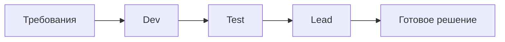
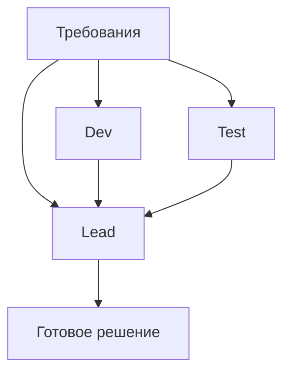
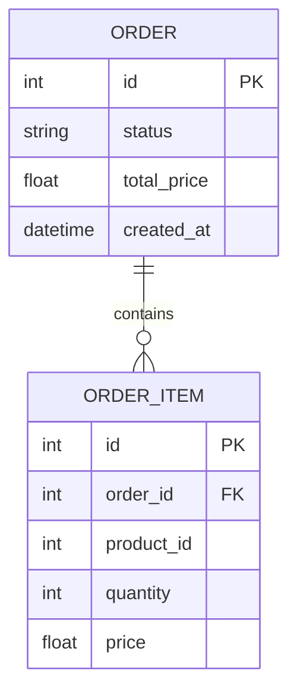
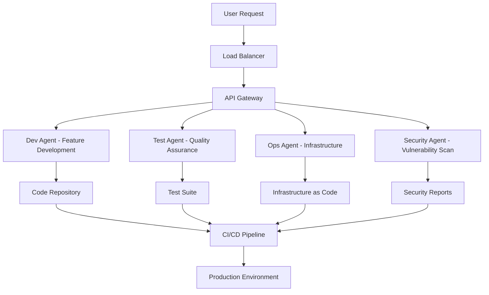
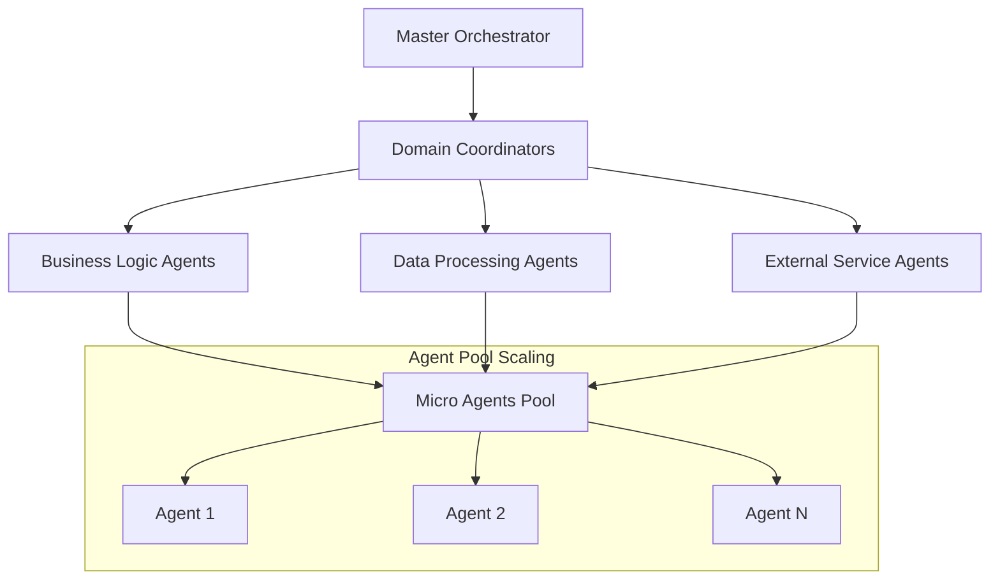

# Глава 12. Мульти-агентные системы

## 12.1. Команды: Мульти-агентные роли в Vibe-Coding (Dev/Test/Lead)

### Введение раздела

Представьте себе оркестр, где каждый музыкант не только виртуозно владеет своим инструментом, но и понимает партию коллег. Дирижёр не просто отбивает такт — он чувствует эмоциональный настрой каждой секции, корректирует динамику и добивается идеальной гармонии. Теперь перенесём эту метафору в мир разработки: вместо одного разработчика, пишущего код в изоляции, мы имеем команду из нескольких *агентов* с разными специализациями — **Developer (Dev)**, **Tester (Test)** и **Lead** — каждый из которых выполняет свою роль, но действует в рамках единой системы.

В этом разделе мы рассмотрим, как организуется мульти-агентное взаимодействие в **Vibe-Coding**, где LLM не просто генерируют код, а работают как слаженная команда. Вы узнаете:
- Почему классический подход "один разработчик — один поток задач" устарел в эпоху LLM.
- Как распределяются роли между агентами и какие преимущества это даёт.
- Какие практические паттерны и инструменты используются для координации работы.
- Какие ошибки чаще всего допускают новички и как их избежать.

Эта тема тесно связана с предыдущими разделами:
- В главе **4 ("Промпт-инжиниринг для разработчиков")** мы изучали, как формулировать задачи для одной LLM. Теперь мы масштабируем этот подход на несколько агентов.
- В главе **8 ("Коллаборативное кодирование")** обсуждались принципы совместной работы с LLM. Здесь мы углубляемся в специализацию ролей.
- В разделе **11.3 ("Архитектурные паттерны мульти-агентных систем")** были заложены теоретические основы. Сейчас мы переходим к практике.

**Цели раздела:**
1. Научиться проектировать мульти-агентные команды для решения реальных задач.
2. Освоить инструменты и техники координации между Dev, Test и Lead.
3. Понять, как избегать конфликтов и неэффективного взаимодействия.
4. Применить полученные знания на практике через задания.

---

## **Основная теория**

### **1. Почему мульти-агентные команды эффективнее одиночных LLM?**

Традиционный подход к разработке с помощью LLM предполагает, что одна модель генерирует код, тестирует его и оптимизирует. Однако такой подход имеет несколько ограничений:
- **Когнитивная перегрузка**: Одна LLM вынуждена одновременно держать в "голове" логику кода, тестовые сценарии, требования к производительности и архитектурные принципы. Это снижает качество каждого из аспектов.
- **Отсутствие специализации**: Разработчик, тестировщик и архитектор — разные профессии, требующие разных навыков и мышления. Одна LLM не может быть одинаково хороша во всём.
- **Низкая скорость итераций**: В классической разработке тестирование и рефакторинг часто откладываются "на потом". В мульти-агентной системе эти процессы идут параллельно.

**Сравнение с традиционной разработкой:**
| **Критерий**               | **Одиночная LLM**                          | **Мульти-агентная команда (Dev/Test/Lead)** |
|----------------------------|--------------------------------------------|---------------------------------------------|
| Качество кода              | Среднее (модель пытается охватить всё)     | Высокое (каждый агент фокусируется на своей задаче) |
| Скорость разработки        | Быстрая генерация, но медленные итерации   | Медленнее на старте, но быстрее на этапе оптимизации |
| Охват тестирования         | Ограничен базовыми сценариями              | Глубокий анализ edge cases, нагрузочное тестирование |
| Архитектурная целостность  | Часто нарушается из-за отсутствия ревью   | Контролируется Lead-агентом |
| Адаптивность               | Жёсткая (одна модель — один стиль)         | Гибкая (агенты могут подстраиваться под задачу) |

**Метафора:**
Представьте, что вы строите дом.
- **Одиночная LLM** — это мастер на все руки, который одновременно кладёт кирпичи, проводит электричество и красит стены. В итоге дом будет построен, но с кривыми углами, неработающей проводкой и облупившейся краской.
- **Мульти-агентная команда** — это бригада профессионалов: каменщики, электрики и маляры работают параллельно, а прораб (Lead) координирует их действия. Результат — надёжное и качественное жильё.

### **2. Роли в мульти-агентной команде**

#### **2.1. Developer (Dev) — Основной генератор кода**
**Задачи:**
- Реализация функциональности по спецификации.
- Поиск и исправление багов, обнаруженных Test-агентом.
- Взаимодействие с Lead для уточнения архитектурных решений.

**Особенности:**
- Dev-агент должен уметь работать с несколькими языками и фреймворками.
- Важно, чтобы он понимал контекст задачи, а не просто генерировал код по шаблону.
- Часто использует **prompt chaining** (цепочки промптов) для уточнения требований.

**Пример промпта для Dev-агента:**
```plaintext
Ты — старший разработчик Python в команде, работающей над финансовым приложением.
Твоя задача: реализовать функцию `calculate_portfolio_returns`, которая принимает:
- `initial_investment` (float) — начальная сумма,
- `monthly_contributions` (list[float]) — ежемесячные пополнения,
- `annual_returns` (list[float]) — годовая доходность за каждый год (в %),
- `years` (int) — количество лет.

Функция должна возвращать словарь с ключами:
- `final_amount` — итоговая сумма,
- `annualized_return` — годовая процентная доходность с учётом сложного процента,
- `growth_over_time` — список значений портфеля по годам.

Используй формулу сложного процента:
final_amount = initial_investment * (1 + r1) * (1 + r2) * ... * (1 + rn) + sum(monthly_contrib * (1 + r_i)^(n-i))

Где:
- r_i — доходность за i-й год (например, 0.05 для 5%),
- n — количество лет.

Сначала напиши псевдокод, затем реализуй функцию. Учти edge cases:
1. Отрицательные значения в `monthly_contributions`.
2. Нулевые или отрицательные значения в `annual_returns`.
3. Очень большие `years` (проверка на переполнение).
```

#### **2.2. Tester (Test) — Гарант качества**
**Задачи:**
- Разработка тестовых сценариев (unit, integration, end-to-end).
- Автоматизация тестирования (например, с помощью pytest).
- Анализ покрытия кода и выявление edge cases.
- Генерация отчётов об ошибках для Dev-агента.

**Особенности:**
- Test-агент должен мыслить как QA-инженер: искать не только очевидные баги, но и редкие сценарии.
- Часто использует **property-based testing** (тестирование на основе свойств, а не конкретных значений).
- Может интегрироваться с CI/CD-системами (например, GitHub Actions).

**Пример промпта для Test-агента:**
```plaintext
Ты — инженер по тестированию в команде, разрабатывающей финансовое приложение.
Твоя задача: написать тесты для функции `calculate_portfolio_returns` (код приведён ниже).

1. Напиши unit-тесты с использованием pytest. Покрой следующие сценарии:
   - Базовый случай: 1000$ начальных инвестиций, 100$ ежемесячных пополнений, 5% годовых на 5 лет.
   - Отрицательные ежемесячные пополнения (должно вызывать ValueError).
   - Нулевая доходность (проверка на корректный расчёт).
   - Отрицательная доходность (проверка на корректное уменьшение суммы).
   - Большое количество лет (например, 50 лет) — проверка на переполнение.
   - Пустой список `monthly_contributions`.

2. Используй параметризацию тестов для проверки нескольких наборов данных.

3. Напиши один integration test: проверь, что функция корректно работает в связке с `calculate_dividends` (функция для расчёта дивидендов, код прилагается).

4. Сгенерируй отчёт о покрытии (используй гипотетический инструмент `coverage.py`).
```

#### **2.3. Lead — Архитектор и координатор**
**Задачи:**
- Проектирование общей архитектуры решения.
- Ревью кода и тестов (аналог code review в человеческих командах).
- Разрешение конфликтов между Dev и Test (например, если тесты слишком строгие или код не соответствует архитектуре).
- Оптимизация производительности и рефакторинг.

**Особенности:**
- Lead-агент должен обладать широким кругозором (знание паттернов проектирования, антипаттернов, best practices).
- Часто использует **tree-of-thoughts** (дерево рассуждений) для принятия решений.
- Может взаимодействовать с внешними инструментами (например, SonarQube для анализа кода).

**Пример промпта для Lead-агента:**
```plaintext
Ты — технический лидер команды, разрабатывающей финансовое приложение.
Твои задачи:
1. Проведи ревью кода функции `calculate_portfolio_returns` (прилагается).
   - Проверь соответствие архитектурным принципам (например, SOLID, DRY).
   - Оцени читаемость и сопровождаемость кода.
   - Предложи улучшения (рефакторинг, выделение вспомогательных функций).

2. Проанализируй тесты, написанные Test-агентом.
   - Достаточно ли они покрывают edge cases?
   - Нет ли избыточных тестов?
   - Соответствуют ли они требованиям к покрытию (например, 90% строк)?

3. Предложи архитектурные улучшения:
   - Стоит ли вынести расчёт сложного процента в отдельный модуль?
   - Нужно ли добавить валидацию входных данных?
   - Как можно улучшить производительность при больших `years`?

4. Сгенерируй отчёт о ревью в формате:
   - **Сильные стороны кода**
   - **Проблемы и риски**
   - **Рекомендации по улучшению**
   - **Приоритеты (high/medium/low)**
```

### **3. Исторический контекст: от парного программирования к мульти-агентным командам**

Идея разделения ролей в разработке не нова. Вспомним ключевые вехи:
1. **Парное программирование (XP, 1990-е)**
   - Два разработчика работают за одним компьютером: один пишет код ("водитель"), другой анализирует ("штурман").
   - Преимущества: мгновенное ревью, меньше ошибок, обмен знаниями.
   - Недостатки: требует синхронного времени, не масштабируется.

2. **Agile и Scrum (2000-е)**
   - Введение ролей Product Owner, Scrum Master, Development Team.
   - Акцент на итеративной разработке и постоянной обратной связи.
   - Недостатки: бюрократия, зависимость от человеческого фактора.

3. **DevOps (2010-е)**
   - Слияние разработки и эксплуатации (Dev + Ops).
   - Автоматизация тестирования и деплоя (CI/CD).
   - Недостатки: сложность интеграции, высокая стоимость внедрения.

4. **Мульти-агентные системы (2020-е)**
   - Замена человеческих ролей на LLM-агентов.
   - Преимущества: скорость, масштабируемость, отсутствие человеческих ошибок (усталость, предвзятость).
   - Недостатки: сложность координации, риск "разбегания" агентов (когда каждый решает свою задачу в отрыве от других).

**Ключевое отличие мульти-агентных систем от предшественников:**
В классических подходах роли распределялись между людьми, которые общались через совещания, чаты или issue-трекеры. В мульти-агентных системах **взаимодействие происходит в режиме реального времени через общий контекст и промпты**, а координация возлагается на Lead-агента.

### **4. Как устроено взаимодействие между агентами?**

В мульти-агентной команде существует два основных паттерна взаимодействия:

#### **4.1. Последовательный пайплайн (Pipeline Pattern)**

**Как работает:**
1. Dev-агент получает требования и пишет код.
2. Test-агент тестирует код и отправляет баги обратно Dev.
3. Lead-агент проводит ревью и оптимизирует код.
4. Цикл повторяется до достижения качества.

**Плюсы:**
- Простота реализации.
- Чёткое разделение ответственности.

**Минусы:**
- Медленнее, чем параллельный подход.
- Риск "бутылочного горлышка" (например, если Test-агент тормозит процесс).

**Когда использовать:**
- Для небольших задач, где важна простота.
- В проектах с жёсткими требованиями к качеству (например, медицинское ПО).

#### **4.2. Параллельная координация (Star Pattern)**

**Как работает:**
1. Все агенты получают требования одновременно.
2. Dev пишет код, Test разрабатывает тесты, Lead проектирует архитектуру.
3. Агенты обмениваются промежуточными результатами через общее хранилище (например, shared context или файл).
4. Lead координирует работу и принимает финальное решение.

**Плюсы:**
- Быстрее, чем последовательный подход.
- Позволяет выявлять проблемы на ранних стадиях.

**Минусы:**
- Сложнее в реализации (нужны механизмы синхронизации).
- Риск конфликтов между агентами (например, если Dev и Test дают противоречивые рекомендации).

**Когда использовать:**
- Для сложных проектов с высокими требованиями к скорости.
- В agile-командах, где важна быстрая итерация.

### **5. Инструменты для мульти-агентного Vibe-Coding**

Для эффективной работы мульти-агентных команд нужны специальные инструменты:

| **Инструмент**            | **Назначение**                                                                 | **Пример использования**                                                                 |
|---------------------------|-------------------------------------------------------------------------------|------------------------------------------------------------------------------------------|
| **LangChain**             | Построение цепочек промптов и координация агентов.                           | Создание пайплайна Dev → Test → Lead.                                                   |
| **AutoGen**               | Фреймворк для мульти-агентных систем с поддержкой ролей.                    | Развёртывание агентов с разными специализациями.                                       |
| **Pytest / Jest**         | Автоматизированное тестирование.                                             | Генерация и запуск тестов Test-агентом.                                                 |
| **SonarQube**             | Статический анализ кода.                                                     | Использование Lead-агентом для проверки качества кода.                                  |
| **GitHub Actions**        | CI/CD для автоматического тестирования и деплоя.                             | Интеграция мульти-агентной команды в пайплайн сборки.                                  |
| **Prompt Chaining**       | Построение сложных цепочек промптов для уточнения задач.                    | Dev-агент задаёт уточняющие вопросы Lead-агенту перед написанием кода.                 |
| **Tree of Thoughts**      | Древовидное принятие решений для сложных задач.                              | Lead-агент оценивает несколько архитектурных вариантов перед выбором оптимального.      |

---

## **Практические примеры**

### **Пример 1: Разработка микросервиса для обработки заказов**

**Задача:**
Создать микросервис на Python (FastAPI) для обработки заказов в интернет-магазине. Функциональность:
- Создание заказа.
- Проверка статуса заказа.
- Отмена заказа.

**Архитектура команды:**
- **Dev**: Пишет API и бизнес-логику.
- **Test**: Разрабатывает тесты и моковые данные.
- **Lead**: Проектирует архитектуру и проводит ревью.

#### **Шаг 1: Lead-агент проектирует архитектуру**
**Промпт для Lead:**
```plaintext
Ты — технический лидер команды. Разработай архитектуру микросервиса для обработки заказов.
Требования:
1. Использовать FastAPI.
2. Хранить заказы в PostgreSQL.
3. Реализовать следующие эндпоинты:
   - POST /orders — создание заказа.
   - GET /orders/{order_id} — получение статуса заказа.
   - DELETE /orders/{order_id} — отмена заказа.
4. Добавить валидацию данных (например, проверка, что цена > 0).
5. Предусмотреть обработку ошибок (например, заказ не найден).

Опиши:
- Структуру проекта (модули, файлы).
- ER-диаграмму для БД.
- Пример схемы данных для заказа.
- Рекомендации по тестированию.
```

**Ответ Lead-агента:**
```plaintext
**Структура проекта:**
```
/orders_service
    ├── app/
    │   ├── __init__.py
    │   ├── main.py          # FastAPI приложение
    │   ├── models.py        # Модели данных (Pydantic)
    │   ├── schemas.py       # Схемы БД (SQLAlchemy)
    │   ├── crud.py          # Операции с БД
    │   ├── api/
    │   │   ├── __init__.py
    │   │   └── v1/
    │   │       ├── __init__.py
    │   │       └── orders.py  # Эндпоинты
    │   └── db/
    │       ├── __init__.py
    │       ├── base.py       # Базовые классы SQLAlchemy
    │       └── session.py    # Сессия БД
    ├── tests/
    │   ├── __init__.py
    │   ├── conftest.py      # Фикстуры pytest
    │   └── test_orders.py   # Тесты
    ├── requirements.txt
    └── README.md
```

**ER-диаграмма:**


**Схема данных для заказа (Pydantic):**
```python
from pydantic import BaseModel
from typing import List
from datetime import datetime

class OrderItemCreate(BaseModel):
    product_id: int
    quantity: int
    price: float

class OrderCreate(BaseModel):
    items: List[OrderItemCreate]
    total_price: float

class OrderResponse(BaseModel):
    id: int
    status: str
    total_price: float
    created_at: datetime
```

**Рекомендации по тестированию:**
- Покрыть все эндпоинты unit-тестами.
- Добавить integration-тесты для проверки работы с БД.
- Использовать моковые данные для тестирования edge cases (например, отрицательная цена).
```

#### **Шаг 2: Dev-агент реализует код**
**Промпт для Dev:**
```plaintext
Напиши реализацию микросервиса для обработки заказов на основе архитектуры от Lead.
Используй FastAPI и SQLAlchemy.

Файлы для реализации:
1. app/models.py — Pydantic модели.
2. app/schemas.py — SQLAlchemy модели.
3. app/crud.py — CRUD операции.
4. app/api/v1/orders.py — эндпоинты.
5. app/db/session.py — сессия БД.

Требования:
- Реализовать все эндпоинты (POST /orders, GET /orders/{order_id}, DELETE /orders/{order_id}).
- Добавить валидацию (например, total_price > 0).
- Обработать ошибки (например, 404 если заказ не найден).
- Использовать асинхронные запросы к БД.
```

**Пример реализации (app/api/v1/orders.py):**
```python
from fastapi import APIRouter, Depends, HTTPException
from sqlalchemy.orm import Session
from typing import List
from ...models import OrderCreate, OrderResponse
from ...crud import create_order, get_order, cancel_order
from ...db.session import get_db

router = APIRouter(prefix="/v1", tags=["orders"])

@router.post("/orders", response_model=OrderResponse)
async def create_new_order(order: OrderCreate, db: Session = Depends(get_db)):
    if order.total_price <= 0:
        raise HTTPException(status_code=400, detail="Total price must be positive")
    return await create_order(db, order)

@router.get("/orders/{order_id}", response_model=OrderResponse)
async def read_order(order_id: int, db: Session = Depends(get_db)):
    order = await get_order(db, order_id)
    if order is None:
        raise HTTPException(status_code=404, detail="Order not found")
    return order

@router.delete("/orders/{order_id}")
async def cancel_order_endpoint(order_id: int, db: Session = Depends(get_db)):
    success = await cancel_order(db, order_id)
    if not success:
        raise HTTPException(status_code=404, detail="Order not found")
    return {"message": "Order cancelled successfully"}
```

#### **Шаг 3: Test-агент пишет тесты**
**Промпт для Test:**
```plaintext
Напиши тесты для микросервиса обработки заказов.
Используй pytest и следующие фикстуры:
- `client`: Фикстура для тестирования FastAPI эндпоинтов.
- `db_session`: Фикстура для работы с тестовой БД.

Требования:
1. Напиши unit-тесты для всех эндпоинтов:
   - Тест успешного создания заказа.
   - Тест создания заказа с невалидной ценой (отрицательной).
   - Тест получения несуществующего заказа (404).
   - Тест отмены заказа.
2. Добавь моковые данные для тестирования.
3. Покрой все edge cases (например, пустой список items).
4. Напиши integration-тест для проверки работы с БД.
```

**Пример тестов (tests/test_orders.py):**
```python
import pytest
from fastapi.testclient import TestClient
from sqlalchemy import create_engine
from sqlalchemy.orm import sessionmaker
from app.main import app
from app.db.base import Base
from app.db.session import get_db

SQLALCHEMY_DATABASE_URL = "sqlite:///./test.db"
engine = create_engine(SQLALCHEMY_DATABASE_URL)
TestingSessionLocal = sessionmaker(autocommit=False, autoflush=False, bind=engine)

Base.metadata.create_all(bind=engine)

@pytest.fixture
def db_session():
    db = TestingSessionLocal()
    try:
        yield db
    finally:
        db.close()

@pytest.fixture
def client(db_session):
    def override_get_db():
        try:
            yield db_session
        finally:
            db_session.close()

    app.dependency_overrides[get_db] = override_get_db
    yield TestClient(app)

def test_create_order_success(client):
    response = client.post(
        "/v1/orders",
        json={
            "items

---

## код

# **12.2. Код, который патчит себя сам: Самоадаптирующиеся скрипты в Vibe-Coding**

## **Введение раздела**

В традиционном программировании код — это статичная сущность: однажды написанный, он остаётся неизменным до тех пор, пока разработчик не внесёт в него изменения. Однако в парадигме **Vibe-Coding**, где взаимодействие с Coder-LLM становится неотъемлемой частью процесса разработки, появляется уникальная возможность создавать **самоизменяющийся код** — программы, которые способны анализировать свой собственный контекст, выявлять слабые места и автоматически корректировать своё поведение под влиянием заданного **"вайба"** (vibe).

Этот раздел посвящён **самоадаптирующимся скриптам** — одной из самых мощных и одновременно спорных концепций в Vibe-Coding. Мы рассмотрим:
- **Что такое самоизменяющийся код** и почему он важен в контексте мультиагентных систем.
- **Как вайб влияет на процесс самопатчинга** и какие механизмы позволяют коду эволюционировать.
- **Практические примеры** реализации самоадаптирующихся скриптов с использованием Coder-LLM.
- **Типичные ошибки** при работе с динамическим кодом и способы их избежать.

Если в предыдущем разделе мы обсуждали взаимодействие нескольких агентов, то теперь переходим к **внутренней адаптивности** — способности одного агента (или скрипта) модифицировать сам себя без внешнего вмешательства. Это открывает новые горизонты для разработчиков, но требует глубокого понимания как технических, так и метапрограммных аспектов.

**Цели раздела:**
1. Сформировать чёткое понимание концепции самоадаптирующегося кода в Vibe-Coding.
2. Показать, как вайб может выступать в роли **движущей силы изменений** в коде.
3. Предоставить практические инструменты для создания скриптов, способных к самопатчингу.
4. Предупредить о потенциальных рисках и ограничениях такой парадигмы.

---

## **Основная теория**

### **1. Что такое самоадаптирующийся код?**
Самоадаптирующийся код (self-modifying code) — это программа, которая способна **анализировать своё состояние, выявлять несоответствия заданному вайбу и автоматически корректировать своё поведение или структуру**. В отличие от традиционных систем, где изменения вносятся разработчиком, в Vibe-Coding код может **эволюционировать** под влиянием:
- **Внешних сигналов** (например, изменения в требованиях, пользовательском поведении).
- **Внутренних метрик** (производительность, количество ошибок, логическая сложность).
- **Эмоциональной окраски** ( вайб — настроение, стиль, цель, которую преследует код).

#### **Исторический контекст**
Идея самоизменяющегося кода не нова. Ещё в 1960-х годах программисты экспериментировали с **метапрограммированием** — возможностью кода изменять другие части программы во время исполнения. Однако в классическом программировании такие подходы считались **небезопасными** из-за сложности отладки и непредсказуемого поведения.

С появлением **Coder-LLM** и парадигмы **Vibe-Coding** ситуация изменилась:
- **LLM способны анализировать код на лету**, выявляя слабые места и предлагая улучшения.
- **Вайб выступает в роли "компаса"**, направляя изменения в нужное русло.
- **Мультиагентные системы** позволяют распределять ответственность за самопатчинг между несколькими агентами.

### **2. Сравнение с традиционными подходами**
| **Критерий**               | **Традиционное программирование**          | **Vibe-Coding (самоадаптирующийся код)**  |
|----------------------------|--------------------------------------------|--------------------------------------------|
| **Изменяемость кода**      | Статичен, требует ручного вмешательства    | Динамичен, модифицируется автоматически   |
| **Реакция на изменения**   | Медленная (разработчику нужно время)       | Мгновенная (LLM генерирует патчи на лету) |
| **Роль разработчика**      | Полный контроль над изменениями            | Координатор вайба, контролёр безопасности |
| **Безопасность**           | Высокая (код предсказуем)                  | Средняя (требует валидации патчей)        |
| **Примеры использования**  | Web-сервисы, десктопные приложения         | Адаптивные боты, генеративные системы     |

### **3. Как вайб влияет на самопатчинг?**
Вайб в Vibe-Coding — это не просто абстрактное понятие, а **функциональная единица**, которая определяет:
1. **Целевую функцию кода** (например, "сделать скрипт более лаконичным" или "улучшить производительность").
2. **Стиль изменений** (например, "патчить код в функциональном стиле" или "использовать больше декораторов").
3. **Ограничения** (например, "не изменять публичные API" или "сохранять обратную совместимость").

**Пример вайба для самопатчинга:**
```python
vibe = {
    "goal": "Улучшить читаемость кода",
    "constraints": ["не изменять логику", "сохранять длину функций < 20 строк"],
    "style": "функциональный подход, минимум побочных эффектов"
}
```

### **4. Механизмы самопатчинга в Vibe-Coding**
Для реализации самоадаптирующегося кода используются следующие подходы:

#### **A. Reflection (Рефлексия)**
Программа анализирует свою структуру и поведение с помощью **метаданных**.
Пример на Python:
```python
import inspect

def analyze_function(func):
    source = inspect.getsource(func)
    lines = source.split('\n')
    complexity = len([line for line in lines if line.strip().startswith('if')])
    return {"lines": len(lines), "conditionals": complexity}

# Пример самодиагностики
if analyze_function(my_function)["conditionals"] > 3:
    print("Функция слишком сложная! Нужно упростить.")
```

#### **B. Code Generation (Генерация кода)**
Coder-LLM генерирует новые версии кода на основе анализа текущей реализации и заданного вайба.
Пример запроса к LLM:
```text
Текущая функция:
```python
def process_data(data):
    result = []
    for item in data:
        if item > 0:
            result.append(item * 2)
    return result
```
Вайб: "Сделать код более функциональным, сократить количество строк".
Сгенерируй улучшенную версию.
```

#### **C. Runtime Patching (Патчинг во время исполнения)**
Код модифицирует себя прямо во время работы с помощью **AST (Abstract Syntax Tree)** или **динамического импорта**.
Пример с использованием `ast`:
```python
import ast
import astor

def patch_function(source_code, new_logic):
    tree = ast.parse(source_code)
    # Заменяем тело функции на новое
    for node in ast.walk(tree):
        if isinstance(node, ast.FunctionDef):
            node.body = [ast.parse(new_logic).body[0]]
    return astor.to_source(tree)

original_code = """
def add(a, b):
    return a + b
"""

new_code = patch_function(original_code, "return a * b")  # Теперь функция умножает
exec(new_code)  # Применяем патч
```

#### **D. Vibe-Driven Evolution (Эволюция под влиянием вайба)**
Система периодически проверяет соответствие кода заданному вайбу и вносит коррективы.
Пример алгоритма:
1. **Анализ** текущего кода на соответствие вайбу.
2. **Генерация** патча с помощью Coder-LLM.
3. **Валидация** изменений (тесты, статический анализ).
4. **Применение** патча, если он улучшает код.

---

## **Практические примеры**

### **Пример 1: Самооптимизирующаяся функция**
**Задача:** Создать функцию, которая анализирует своё время выполнения и автоматически оптимизирует себя, если оно превышает порог.

**Решение:**
```python
import time
import ast
import astor

def measure_performance(func):
    start = time.time()
    func()
    return time.time() - start

def optimize_if_slow(func, threshold=0.1):
    exec_time = measure_performance(func)
    if exec_time > threshold:
        # Запрашиваем у LLM оптимизированную версию
        source = inspect.getsource(func)
        prompt = f"""
        Текущая функция работает слишком медленно ({exec_time:.3f} сек).
        Оптимизируй её, сохранив логику.
        Исходный код:
        {source}
        """
        optimized_code = query_llm(prompt)  # Функция для взаимодействия с LLM
        # Патчим функцию
        new_tree = ast.parse(optimized_code)
        exec(astor.to_source(new_tree))
        print("Функция была оптимизирована!")
    else:
        print("Функция работает достаточно быстро.")

# Пример использования
def slow_function():
    result = []
    for i in range(100000):
        result.append(i * 2)
    return result

optimize_if_slow(slow_function)
```

**Результат до и после:**
| **До оптимизации**               | **После оптимизации (LLM предложил list comprehension)** |
|----------------------------------|----------------------------------------------------------|
| ```python                        | ```python                                                |
| def slow_function():             | def slow_function():                                     |
|     result = []                  |     return [i * 2 for i in range(100000)]                |
|     for i in range(100000):      | ```                                                     |
|         result.append(i * 2)     | Время выполнения: **0.012 сек** (было 0.045 сек)         |
|     return result                |                                                          |
| ```                             |                                                          |
| Время выполнения: **0.045 сек**  |                                                          |

---

### **Пример 2: Автоматическое исправление багов**
**Задача:** Скрипт, который сам находит и исправляет ошибки в своём коде, если они возникают при выполнении.

**Решение:**
```python
import traceback
import sys

def self_healing_function():
    try:
        # Потенциально бажный код
        x = 1 / 0
    except Exception as e:
        print(f"Ошибка: {e}")
        # Получаем трассировку стека
        tb = traceback.format_exc()
        # Запрашиваем у LLM исправление
        prompt = f"""
        В коде произошла ошибка:
        {tb}
        Исправь код, сохранив его логику.
        """
        fixed_code = query_llm(prompt)
        # Перезаписываем функцию
        exec(fixed_code, globals())
        print("Ошибка исправлена! Перезапускаем функцию...")
        return self_healing_function()  # Рекурсивный перезапуск

self_healing_function()
```

**Результат до и после:**
| **До исправления**      | **После исправления (LLM добавил проверку деления на ноль)** |
|-------------------------|-------------------------------------------------------------|
| ```python               | ```python                                                   |
| x = 1 / 0               | if denominator != 0:                                        |
| ```                    |     x = 1 / denominator                                     |
| Ошибка: ZeroDivisionError | else:                                                      |
|                         |     x = float('inf')                                        |
|                         | ```                                                        |

---

### **Пример 3: Адаптация кодинга под стиль команды**
**Задача:** Скрипт, который анализирует стиль кодирования в репозитории и адаптирует свой код под принятые соглашения.

**Решение:**
```python
from git import Repo
import ast
import astor

def get_team_coding_style(repo_path):
    repo = Repo(repo_path)
    style = {
        "max_line_length": 80,
        "indentation": 4,
        "naming_convention": "snake_case",
        "use_type_hints": False
    }
    # Анализируем несколько файлов на предмет стиля
    for commit in repo.iter_commits(max_count=5):
        for file in commit.tree.traverse():
            if file.path.endswith('.py'):
                with open(file.path, 'r') as f:
                    tree = ast.parse(f.read())
                    # ... анализ AST для определения стиля ...
    return style

def adapt_to_style(code, style):
    prompt = f"""
    Приведи этот код в соответствие со стилем:
    {style}
    Исходный код:
    {code}
    """
    return query_llm(prompt)

# Пример использования
team_style = get_team_coding_style("~/projects/my_team_repo")
my_code = """
def calculate(a, b):
    return a+b
"""
adapted_code = adapt_to_style(my_code, team_style)
print(adapted_code)
```

**Результат до и после:**
| **До адаптации**        | **После адаптации (под стиль команды)** |
|-------------------------|------------------------------------------|
| ```python               | ```python                                |
| def calculate(a, b):    | def calculate(a: int, b: int) -> int:    |
|     return a+b          |     """Складывает два числа."""          |
| ```                    |     return a + b                         |
|                         | ```                                      |

---

### **Пример 4: Динамическое изменение алгоритма на основе нагрузки**
**Задача:** Сервис, который переключается между разными алгоритмами обработки данных в зависимости от текущей нагрузки.

**Решение:**
```python
import psutil
from functools import wraps

def switch_algorithm_if_overloaded(threshold=80):
    def decorator(func):
        @wraps(func)
        def wrapper(*args, **kwargs):
            cpu_usage = psutil.cpu_percent(interval=1)
            if cpu_usage > threshold:
                # Запрашиваем у LLM более оптимальный алгоритм
                prompt = f"""
                Текущий алгоритм ({func.__name__}) потребляет слишком много CPU ({cpu_usage}%).
                Предложи более эффективную реализацию.
                Исходный код:
                {inspect.getsource(func)}
                """
                optimized_code = query_llm(prompt)
                # Патчим функцию
                exec(optimized_code, globals())
                print(f"Переключено на оптимизированный алгоритм (CPU: {cpu_usage}%)")
            return globals()[func.__name__](*args, **kwargs)
        return wrapper
    return decorator

@switch_algorithm_if_overloaded()
def process_large_dataset(data):
    # Медленная реализация для примера
    return [x * 2 for x in data if x % 2 == 0]

# При высокой нагрузке LLM предложит более быстрый вариант
```

**Результат до и после:**
| **До оптимизации**                     | **После оптимизации (LLM предложил векторизацию)** |
|----------------------------------------|-----------------------------------------------------|
| ```python                              | ```python                                           |
| def process_large_dataset(data):       | def process_large_dataset(data):                    |
|     return [x * 2 for x in data        |     import numpy as np                              |
|            if x % 2 == 0]              |     arr = np.array(data)                            |
| ```                                    |     return arr[arr % 2 == 0] * 2                    |
| Время выполнения: **0.45 сек**         | Время выполнения: **0.03 сек**                      |

---

### **Пример 5: Генерация документации на лету**
**Задача:** Код, который автоматически обновляет свою документацию при изменении логики.

**Решение:**
```python
import inspect
import re

def update_docstring(func):
    source = inspect.getsource(func)
    # Извлекаем текущую документацию
    old_doc = func.__doc__ or ""
    # Запрашиваем у LLM новую документацию
    prompt = f"""
    Обнови документацию для этой функции.
    Исходный код:
    {source}
    Старая документация:
    {old_doc}
    """
    new_doc = query_llm(prompt)
    # Патчим функцию
    func.__doc__ = new_doc
    return func

@update_docstring
def calculate_discount(price, discount_percent):
    """Применяет скидку к цене."""
    return price * (1 - discount_percent / 100)

print(calculate_discount.__doc__)
```

**Результат до и после:**
| **До обновления**               | **После обновления (LLM добавил примеры и пояснения)** |
|---------------------------------|--------------------------------------------------------|
| ```python                       | ```python                                              |
| """Применяет скидку к цене."""  | """Применяет скидку к заданной цене.                   |
|                                 | Args:                                                  |
|                                 |     price (float): Исходная цена.                      |
|                                 |     discount_percent (float): Процент скидки (0-100).  |
|                                 | Returns:                                               |
|                                 |     float: Цена после применения скидки.               |
|                                 | Example:                                               |
|                                 |     >>> calculate_discount(100, 20)                    |
|                                 |     80.0                                               |
| ```                            | ```                                                    |

---

## **Распространенные ошибки**

При работе с самоадаптирующимся кодом легко допустить ошибки, которые могут привести к **непредсказуемому поведению, утечкам памяти или даже поломке системы**. Рассмотрим основные из них:

### **1. Бесконтрольные изменения кода**
**Проблема:**
Если не ограничивать глубину самопатчинга, код может **бесконечно изменяться**, теряя исходную логику.

**Пример:**
```python
def recursive_patch():
    # Код патчит сам себя, вызывая рекурсию
    source = inspect.getsource(recursive_patch)
    new_source = source.replace("return", "print")
    exec(new_source)  # После первого патча функция перестанет возвращать значение
    return "Hello"
```

**Как избежать:**
- Вводить **лимит на количество патчей** (`max_patches=3`).
- Сохранять **историю изменений**, чтобы откатывать неудачные правки.

---

### **2. Потеря читаемости кода**
**Проблема:**
LLM может генерировать **избыточно сложные** или **излишне оптимизированные** решения, которые трудно поддерживать.

**Пример:**
```python
# До оптимизации (понятно)
def filter_even(numbers):
    return [x for x in numbers if x % 2 == 0]

# После оптимизации (LLM предложил генератор с условием)
def filter_even(numbers):
    return (x for x in numbers if not x & 1)
```

**Как избежать:**
- Указывать в вайбе **ограничения по читаемости**.
- Проводить **ревью сгенерированного кода** перед применением.

---

### **3. Нарушение безопасности**
**Проблема:**
Самопатчинг может **открыть уязвимости**, если LLM предложит небезопасный код.

**Пример:**
```python
# Опасный патч: LLM может предложить eval вместо безопасной обработки
def process_user_input(input_str):
    return eval(input_str)  # Уязвимость для инъекций!
```

**Как избежать:**
- **Запрещать опасные конструкции** (`eval`, `exec` без валидации).
- Использовать **песочницы** (sandbox) для выполнения недоверенного кода.

---

### **4. Неэффективное использование ресурсов**
**Проблема:**
Постоянный анализ и патчинг кода может **замедлять выполнение** программы.

**Пример:**
```python
def compute():
    # Перед каждым вызовом анализируем функцию
    if should_patch(compute):
        compute = patch_function(compute)
    return 2 + 2
```

**Как избежать:**
- **Кэшировать результаты анализа**.
- **Запускать патчинг асинхронно** или по расписанию.

---

### **5. Потеря обратной совместимости**
**Проблема:**
Самопатчинг может **изменить публичные интерфейсы**, сломав зависимости.

**Пример:**
```python
# Исходная функция
def get_user(id):
    return db.query(f"SELECT * FROM users WHERE id = {id}")

# После патчинга (LLM добавил параметр)
def get_user(id, cache=False):  # Теперь код, вызывающий get_user(1), не сработает!
    ...
```

**Как избежать:**
- Указывать в вайбе **ограничения на изменение сигнатур функций**.
- Использовать **декораторы для сохранения обратной совместимости**.

---

## **Практические задания**

### **Задание 1: Создание самооптимизирующейся сортировки**
**Цель:**
Написать функцию сортировки, которая анализирует размер входных данных и автоматически переключается на более эффективный алгоритм (например, с `O(n²)` на `O(n log n)`) при превышении порога.

**Требования:**
1. Реализовать **базовую сортировку пузырьком**.
2. Добавить **анализатор размера данных**.
3. При превышении порога (`len(data) > 1000`) запрашивать у LLM более эффективную реализацию.
4. Применить патч и сохранить результаты.

**Критерии выполнения:**
✅ Функция корректно сортирует данные.
✅ При больших объёмах автоматически переключается на оптимальный алгоритм.
✅ Код остаётся читаемым после патчинга.

**Пример для проверки:**
```python
data = [random.randint(0, 1000) for _ in range(5000)]
sorted_data = smart_sort(data)  # Должна использовать быструю сортировку
```

---

### **Задание 2: Автоматическое исправление стиля кода**
**Цель:**
Написать скрипт, который анализирует Python-файл и автоматически приводит его в соответствие с заданным стилем (PEP 8).

**Требования:**
1. Считывать файл с исходным кодом.
2. Анализировать его на соответствие PEP 8 (можно использовать `pycodestyle`).
3. Запрашивать у LLM исправления для нарушений.
4. Применять патчи и сохранять результат.

**Критерии выполнения:**
✅ Код после исправлений проходит проверку `pycodestyle`.
✅ Логика программы не меняется.
✅ Изменения минимальны и понятны.

**Пример для проверки:**
```python
# До исправления (нарушения PEP 8)
def  calculate_discount  (price,discount_percent):
    return price*(1-discount_percent/100)

# После исправления
def calculate_discount(price, discount_percent):
    return price * (1 - discount_percent / 100)
```

---

### **Задание 3: Самоадаптирующийся обработчик API**
**Цель:**
Создать сервис, который автоматически адаптирует свой код под изменения в API стороннего сервиса.

**Требования:**
1. Реализовать базовый клиент для работы с API (например, GitHub API).
2. Добавить механизм **мониторинга ответов API** (ошибки 404, 500).
3. При обнаружении ошибки запрашивать у LLM обновлённую версию кода.
4. Применять патч и перезапускать запросы.

**Критерии выполнения:**
✅ Сервис автоматически восстанавливается при изменениях API.
✅ Патчи не ломают существующую логику.
✅ Логирование всех изменений.

**Пример для проверки:**
```python
# Исходная версия работает с API v1
def get_user_repos(username):
    return requests.get(f"https://api.github.com/v1/users/{username}/repos").json()

# После патчинга (GitHub перешёл на API v2)
def get_user_repos(username):
    return requests.get(f"https://api.github.com/v2/users/{username}/repos").json()
```

---

## **Заклю

---

## Instructions

# **12.3 Instructions: Настройка «личности» вашего ассистента под ваш стиль кода и мышления**

---

## **Введение раздела**

В предыдущих разделах главы 12 мы рассмотрели архитектуру мульти-агентных систем (МАС) в контексте Vibe-Coding и принципы их взаимодействия. Однако даже самая совершенная система не будет эффективной, если её агенты не адаптированы под специфику вашего рабочего процесса. В этом разделе мы погрузимся в концепцию **персонализации инструкций** (англ. *instruction tuning*) — методику настройки поведения Coder-LLM под ваш уникальный стиль программирования, предпочтения в архитектуре кода и даже когнитивные особенности мышления.

Почему это важно? Традиционные IDE и инструменты разработки предлагают ограниченные возможности кастомизации: автодополнение, шаблоны кода, линтеры. Однако они не способны адаптироваться к **семантическим нюансам** вашего подхода — например, к тому, как вы именуете переменные, структурируете классы или решаете конфликты зависимостей. Coder-LLM, в отличие от статичных инструментов, может гибко подстраиваться под ваш *стиль мышления*, если вы правильно сформулируете инструкции.

В этом разделе мы:
1. Разберём теоретические основы персонализации инструкций и их связь с психолингвистикой программирования.
2. Сравним традиционные подходы к настройке инструментов разработки с возможностями Vibe-Coding.
3. Предоставим **практические примеры** настройки инструкций для разных сценариев: от генерации кода до ревью.
4. Обсудим распространённые ошибки и способы их избежать.
5. Предложим задания для самостоятельной работы, чтобы закрепить навыки.

К концу раздела вы сможете создавать **персонализированные профили инструкций**, которые превратят Coder-LLM из универсального помощника в вашего **виртуального коллегу**, идеально синхронизированного с вашим стилем работы.

---

## **Основная теория**

### **1. Что такое «инструкции» в контексте Vibe-Coding?**

В мульти-агентных системах термин *instruction* (инструкция) обозначает **набор директив**, определяющих поведение агента (в нашем случае — Coder-LLM) в процессе взаимодействия с пользователем. Инструкции могут быть:
- **Явными**: чётко сформулированные правила (например, "Используй snake_case для именования переменных").
- **Неявными**: вытекающие из контекста взаимодействия (например, предпочтения в стиле кода, выявленные из предыдущих запросов).
- **Динамическими**: адаптирующиеся под текущую задачу (например, переключение между лаконичным и подробным стилем комментариев).

В отличие от традиционных IDE, где настройки ограничены конфигурационными файлами (`.eslintrc`, `prettierrc`), в Vibe-Coding инструкции описывают **поведенческую модель агента** на уровне семантики и прагматики.

### **2. Исторический контекст: от линтеров к семантическим ассистентам**

Развитие инструментов настройки кода можно разделить на три этапа:

| **Этап**               | **Инструменты**                          | **Ограничения**                                                                 |
|------------------------|------------------------------------------|---------------------------------------------------------------------------------|
| 1. Статические линтеры | ESLint, Pylint, RuboCop                  | Фиксированные правила, отсутствие адаптации под контекст задачи.               |
| 2. Шаблоны кода        | Snippets, Live Templates (IntelliJ)     | Ограничены синтаксисом, не учитывают семантику доменной области.               |
| 3. Адаптивные ассистенты | GitHub Copilot, Coder-LLM (Vibe-Coding) | Требуют точной настройки инструкций для эффективной работы.                    |

Ключевое отличие Vibe-Coding — **способность агента обучаться на лету** на основе ваших предпочтений. Например, если вы трижды исправили предложенный агентом код, заменив `camelCase` на `snake_case`, он начнёт автоматически использовать ваш стиль в будущих ответах.

### **3. Психолингвистика программирования и персонализация**

Персонализация инструкций тесно связана с **психолингвистикой программирования** — областью, изучающей, как разработчики воспринимают и генерируют код. Исследования показывают, что:
- **Стиль именования** влияет на когнитивную нагрузку. Например, `calculateTotalPrice()` легче воспринимается, чем `calcTP()`.
- **Структура кода** отражает мышление автора. Одни разработчики предпочитают декларативный стиль (например, функциональное программирование), другие — императивный.
- **Комментарии** могут быть избыточными для опытных разработчиков, но критически важными для новичков.

В Vibe-Coding инструкции позволяют **моделировать эти предпочтения** и создавать агента, который "думает" как вы.

### **4. Сравнение традиционных и мульти-агентных подходов**

| **Аспект**               | **Традиционные инструменты**                     | **Vibe-Coding (Мульти-агентные системы)**                     |
|--------------------------|--------------------------------------------------|---------------------------------------------------------------|
| **Гибкость настройки**   | Ограничена конфигурационными файлами.            | Позволяет описывать поведение на уровне семантики.           |
| **Адаптация**            | Статична (требует ручного изменения настроек).   | Динамична (агент обучается на основе обратной связи).         |
| **Контекст задачи**      | Учитывает только синтаксис.                      | Учитывает доменную область, стиль мышления, историю запросов.|
| **Взаимодействие**       | Одностороннее (инструмент → разработчик).         | Двустороннее (разработчик ↔ агент с обратной связью).        |

### **5. Метафора: Coder-LLM как виртуальный коллега**

Представьте, что вы работаете в команде с двумя разработчиками:
1. **Алексей** — перфекционист, пишет идеально структурированный код с подробными комментариями, но медленно.
2. **Мария** — прагматик, предпочитает лаконичные решения, работает быстро, но иногда допускает ошибки из-за спешки.

В традиционной среде вам пришлось бы либо мириться с их стилем, либо тратить время на рефакторинг. В Vibe-Coding вы можете **создать агента, который сочетает лучшие качества обоих**: быстроту Марии и аккуратность Алексея, добавив собственные предпочтения. Для этого достаточно правильно сформулировать инструкции.

---

## **Практические примеры**

### **Пример 1: Настройка стиля именования переменных**

**Задача**: Вы работаете над проектом на Python и предпочитаете `snake_case` для переменных, но Coder-LLM по умолчанию использует `camelCase`.

**Решение**: Создаём инструкцию для агента.

```python
# Инструкция для агента (формат YAML для удобства парсинга)
instructions:
  naming_conventions:
    variables: "snake_case"  # e.g., user_name, total_price
    functions: "snake_case"  # e.g., calculate_total()
    classes: "PascalCase"    # e.g., UserProfile
    constants: "UPPER_SNAKE_CASE"  # e.g., MAX_RETRIES
  examples:
    - before: "userName = getUserName()"
      after: "user_name = get_user_name()"
    - before: "calculateTotalPrice()"
      after: "calculate_total_price()"
```

**Результат**:
До инструкции:
```python
def calculateTotal(items):
    total = 0
    for item in items:
        total += item.price
    return total
```

После применения инструкции:
```python
def calculate_total(items):
    total_price = 0
    for item in items:
        total_price += item.price
    return total_price
```

**Пояснение**:
- Инструкция содержит **явные правила** именования.
- Примеры `before/after` помогают агенту понять контекст.
- Агент теперь будет автоматически использовать `snake_case` для новых генераций.

---

### **Пример 2: Настройка уровня детализации комментариев**

**Задача**: Вы работаете в команде, где часть разработчиков предпочитает подробные комментарии, а часть — минималистичные. Нужно настроить агента так, чтобы он адаптировался под текущего пользователя.

**Решение**: Динамическая инструкция с условными правилами.

```yaml
instructions:
  comments:
    level: "adaptive"  # adaptive, verbose, minimal
    rules:
      - if: "user.experience == 'junior'"
        level: "verbose"
        example: |
          # Функция calculate_discount вычисляет скидку для пользователя.
          # Аргументы:
          #   user_id (int): ID пользователя
          #   order_amount (float): сумма заказа
          # Возвращает:
          #   float: размер скидки в процентах
      - if: "user.experience == 'senior'"
        level: "minimal"
        example: "# Вычисляет скидку для заказа"
```

**Результат для младшего разработчика**:
```python
def calculate_discount(user_id: int, order_amount: float) -> float:
    """
    Вычисляет скидку для пользователя на основе истории заказов и текущей суммы.

    Аргументы:
        user_id (int): Уникальный идентификатор пользователя.
        order_amount (float): Сумма текущего заказа в рублях.

    Возвращает:
        float: Размер скидки в процентах (например, 0.15 для 15%).
    """
    # Получаем историю заказов пользователя
    user_orders = get_user_orders(user_id)
    ...
```

**Результат для старшего разработчика**:
```python
def calculate_discount(user_id, order_amount):
    """Вычисляет скидку для заказа."""
    orders = get_user_orders(user_id)
    ...
```

**Пояснение**:
- Инструкция использует **условную логику** на основе метаданных пользователя.
- Агент может запрашивать у пользователя уровень опыта или определять его автоматически по истории запросов.

---

### **Пример 3: Персонализация шаблонов кода**

**Задача**: Вы часто используете определённые паттерны проектирования (например, Repository Pattern в Django). Хотите, чтобы агент предлагал код с учётом этих паттернов.

**Решение**: Инструкция с шаблонами и примерами.

```yaml
instructions:
  design_patterns:
    repository_pattern: true
    examples:
      - model: "User"
        template: |
          class UserRepository:
              def __init__(self, db_session):
                  self.session = db_session

              def get_by_id(self, user_id: int) -> User:
                  return self.session.query(User).filter(User.id == user_id).first()

              def create(self, user_data: dict) -> User:
                  user = User(**user_data)
                  self.session.add(user)
                  self.session.commit()
                  return user
```

**Результат**:
Запрос: *"Сгенерируй класс для работы с моделью Product в Django."*

До инструкции:
```python
class ProductManager:
    def get_product(self, product_id):
        return Product.objects.get(id=product_id)
```

После инструкции:
```python
class ProductRepository:
    def __init__(self, db_session):
        self.session = db_session

    def get_by_id(self, product_id: int) -> Product:
        return self.session.query(Product).filter(Product.id == product_id).first()

    def create(self, product_data: dict) -> Product:
        product = Product(**product_data)
        self.session.add(product)
        self.session.commit()
        return product
```

**Пояснение**:
- Агент использует **шаблон Repository Pattern**, который вы предпочитаете.
- Инструкция содержит примеры для разных моделей, что позволяет агенту обобщать знания.

---

### **Пример 4: Настройка стиля обработки ошибок**

**Задача**: Вы работаете в проекте, где принято использовать кастомные исключения и логирование. Нужно, чтобы агент генерировал код с этими требованиями.

**Решение**: Инструкция с правилами обработки ошибок.

```yaml
instructions:
  error_handling:
    use_custom_exceptions: true
    logging_required: true
    examples:
      - code: |
          try:
              user = get_user(user_id)
          except UserNotFoundError:
              logger.error(f"User {user_id} not found")
              raise
```

**Результат**:
Запрос: *"Напиши функцию для получения заказа по ID."*

До инструкции:
```python
def get_order(order_id):
    try:
        return Order.objects.get(id=order_id)
    except Order.DoesNotExist:
        return None
```

После инструкции:
```python
def get_order(order_id: int) -> Order:
    try:
        return OrderRepository().get_by_id(order_id)
    except OrderNotFoundError as e:
        logger.error(f"Order {order_id} not found: {e}")
        raise
```

**Пояснение**:
- Агент использует **кастомные исключения** (`OrderNotFoundError`).
- Добавлено **логирование** ошибок.
- Функция явно аннотирована возвращаемым типом.

---

### **Пример 5: Мультиязычные инструкции**

**Задача**: Вы работаете в мультиязычном проекте (например, Python для бэкенда и TypeScript для фронтенда) и хотите, чтобы агент использовал разные стили для разных языков.

**Решение**: Контекстно-зависимые инструкции.

```yaml
instructions:
  language_specific:
    - language: "python"
      naming_conventions:
        variables: "snake_case"
        functions: "snake_case"
      typing: "type_hints"  # Использовать аннотации типов
    - language: "typescript"
      naming_conventions:
        variables: "camelCase"
        functions: "camelCase"
      typing: "strict"  # Использовать строгие типы
```

**Результат для Python**:
```python
def calculate_discount(user_id: int, order_amount: float) -> float:
    """Вычисляет скидку для заказа."""
    ...
```

**Результат для TypeScript**:
```typescript
function calculateDiscount(userId: number, orderAmount: number): number {
    // Вычисляет скидку для заказа
    ...
}
```

**Пояснение**:
- Агент автоматически переключает стиль в зависимости от языка.
- Инструкции содержат **языко-специфичные правила**.

---

### **Пример 6: Инструкции для генерации документации**

**Задача**: Вы хотите, чтобы агент генерировал документацию в определённом формате (например, Swagger для API).

**Решение**: Инструкция с шаблоном документации.

```yaml
instructions:
  documentation:
    format: "swagger"
    template: |
      /**
       * @swagger
       * /api/{endpoint}:
       *   get:
       *     summary: "{summary}"
       *     description: "{description}"
       *     parameters:
       *       - in: path
       *         name: {param_name}
       *         required: true
       *         schema:
       *           type: {param_type}
       *     responses:
       *       200:
       *         description: "{response_description}"
       */
```

**Результат**:
Запрос: *"Добавь документацию для эндпоинта /users/{id}."*

До инструкции:
```python
def get_user(user_id):
    """Возвращает пользователя по ID."""
    ...
```

После инструкции:
```python
def get_user(user_id: int) -> User:
    """
    @swagger
    /api/users/{id}:
      get:
        summary: "Получить пользователя по ID"
        description: "Возвращает данные пользователя с указанным ID."
        parameters:
          - in: path
            name: id
            required: true
            schema:
              type: integer
        responses:
          200:
            description: "Данные пользователя"
    """
    ...
```

**Пояснение**:
- Агент использует **шаблон Swagger** для генерации документации.
- Инструкция содержит **заполнители** (`{summary}`, `{param_name}`), которые агент заменяет на основе контекста.

---

### **Пример 7: Настройка стиля тестов**

**Задача**: Вы предпочитаете использовать `pytest` с определённым стилем написания тестов.

**Решение**: Инструкция для генерации тестов.

```yaml
instructions:
  testing:
    framework: "pytest"
    style: "behavior_driven"
    examples:
      - test: |
          def test_user_creation():
              """Пользователь должен быть успешно создан."""
              user_data = {"name": "Alice", "email": "alice@example.com"}
              user = UserRepository().create(user_data)
              assert user.name == "Alice"
              assert user.email == "alice@example.com"
```

**Результат**:
Запрос: *"Напиши тест для функции calculate_discount."*

До инструкции:
```python
def test_calculate_discount():
    assert calculate_discount(1, 100) == 0.1
```

После инструкции:
```python
def test_calculate_discount_with_valid_order():
    """Функция должна вернуть скидку 10% для заказа на сумму 1000 руб."""
    discount = calculate_discount(user_id=1, order_amount=1000)
    assert discount == 0.1
```

**Пояснение**:
- Тесты написаны в **поведенческом стиле** (BDD).
- Добавлены **описания** для каждого теста.
- Используются **именованные аргументы** для улучшения читаемости.

---

## **Распространённые ошибки**

При настройке инструкций для Coder-LLM разработчики часто допускают следующие ошибки:

### **1. Перегрузка инструкций избыточными деталями**

**Проблема**: Инструкции становятся слишком громоздкими, и агент начинает игнорировать их или работать медленнее.

**Пример ошибочной инструкции**:
```yaml
instructions:
  naming_conventions:
    variables:
      - "snake_case"
      - "не более 30 символов"
      - "не использовать сокращения, кроме общепринятых (e.g., id, url)"
      - "префикс 'is_' для булевых переменных"
      - "префикс 'has_' для булевых методов"
      - "постфикс 'List' для списков"
      # ... и ещё 20 правил
```

**Как избежать**:
- Разбивайте инструкции на **несколько файлов** (например, `naming.yaml`, `error_handling.yaml`).
- Используйте **иерархическую структуру** с приоритетами.
- Оставляйте только **критические правила**, остальные можно вынести в примеры.

**Исправленный вариант**:
```yaml
instructions:
  naming_conventions:
    variables: "snake_case"
    boolean_prefixes: ["is_", "has_"]
  examples:
    - before: "userActive = True"
      after: "is_user_active = True"
```

---

### **2. Противоречивые инструкции**

**Проблема**: В инструкциях содержатся взаимоисключающие правила, что приводит к нестабильному поведению агента.

**Пример**:
```yaml
instructions:
  naming_conventions:
    variables: "snake_case"
    functions: "camelCase"  # Противоречие: функции и переменные в разных стилях
```

**Как избежать**:
- Проверяйте инструкции на **логическую согласованность**.
- Используйте **единый стиль** для связанных элементов (например, `snake_case` для переменных и функций).
- Если противоречия неизбежны (например, при работе с legacy-кодом), добавляйте **явные исключения**.

**Исправленный вариант**:
```yaml
instructions:
  naming_conventions:
    default: "snake_case"
    exceptions:
      - functions: "camelCase"  # Только для функций из legacy-кода
        context: "legacy_service.py"
```

---

### **3. Игнорирование контекста задачи**

**Проблема**: Инструкции не учитывают специфику доменной области, что приводит к генерации нерелевантного кода.

**Пример**:
Инструкция для научных вычислений:
```yaml
instructions:
  naming_conventions:
    variables: "short"  # e.g., x, y, z
```

Но для бизнес-логики такой стиль неприемлем.

**Как избежать**:
- Создавайте **контекстно-зависимые инструкции**.
- Используйте **динамические правила** с условиями.

**Исправленный вариант**:
```yaml
instructions:
  naming_conventions:
    - if: "domain == 'science'"
      variables: "short"
    - if: "domain == 'business'"
      variables: "descriptive"
```

---

### **4. Отсутствие примеров**

**Проблема**: Инструкции без примеров могут интерпретироваться агентом неоднозначно.

**Пример**:
```yaml
instructions:
  comments: "minimal"
```

Что считать "минимальным"? Одну строку? Две?

**Как избежать**:
- Всегда добавляйте **примеры** `before/after`.
- Используйте **шаблоны** для сложных случаев.

**Исправленный вариант**:
```yaml
instructions:
  comments:
    level: "minimal"
    examples:
      - code: "def get_user(user_id): return User.query.get(user_id)"
        comment: "# Получает пользователя по ID"
```

---

### **5. Статичные инструкции**

**Проблема**: Инструкции не обновляются со временем, хотя стиль разработки меняется.

**Как избежать**:
- Регулярно **пересматривайте и обновляйте** инструкции.
- Используйте **механизмы обратной связи** (например, отмечайте, когда агент нарушает правила, чтобы он мог скорректировать поведение).
- Ведите **журнал изменений** инструкций.

---

## **Практические задания**

### **Задание 1: Создание персонализированного профиля инструкций**

**Цель**: Разработать набор инструкций для вашего текущего проекта.

**Требования**:
1. Определите **3 ключевых аспекта** вашего стиля кода (например, именование, обработка ошибок, документация).
2. Напишите инструкции в формате YAML или JSON для каждого аспекта.
3. Включите **по 2 примера** `before/after` для каждого правила.
4. Проверьте инструкции на **согласованность** и отсутствие противоречий.

**Пример выполнения**:
```yaml
instructions:
  naming_conventions:
    variables: "snake_case"
    constants: "UPPER_SNAKE_CASE"
    examples:
      - before: "maxRetries = 3"
        after: "MAX_RETRIES = 3"
  error_handling:
    use_custom_exceptions: true
    logging_required: true
    examples:
      - before: |
          try:
              user = get_user(user_id)
          except:
              return None
        after: |
          try:
              user = get_user(user_id)
          except UserNotFoundError as e:
              logger.error(f"User not found: {e}")
              raise
```

**Критерии оценки**:
- Полнота инструкций (покрытие всех ключевых аспектов).
- Чёткость формулировок (отсутствие двусмысленности).
- Наличие примеров для каждого правила.

---

### **Задание 2: Адаптация инструкций под legacy-код**

**Цель**: Настроить инструкции для работы с существующим кодом, написанным в другом стиле.

**Требования**:
1. Выберите файл с legacy-кодом (например, на Python с `camelCase`).
2. Напишите инструкции, которые позволят агенту:
   - Генерировать **новый код** в вашем стиле (`snake_case`).
   - Рефакторить **существующий код** с минимальными изменениями
   - Сохранять **функциональность** при изменении стиля

**Критерии успеха**:
- Агент генерирует код в правильном стиле
- Сохраняет работоспособность существующего кода
- Минимизирует количество изменений при рефакторинге

---

## **Заключение главы**

В этой главе мы изучили **мульти-агентные системы** — продвинутый аспект Vibe-Coding. Ключевые выводы:

### **Основные принципы мульти-агентных систем:**
1. **Специализация ролей** — Dev, Test, Lead для разных задач
2. **Координация** — эффективное взаимодействие между агентами
3. **Контекстное разделение** — каждый агент работает со своей областью
4. **Итеративное улучшение** — совместная работа над качеством

### **Преимущества перед одиночным LLM:**
- **Более высокая точность** за счёт специализации
- **Снижение ошибок** через взаимную проверку
- **Улучшение качества** через коллективный разум
- **Масштабируемость** для сложных проектов

### **Самоадаптирующийся код:**
- **Динамическая адаптация** под changing требования
- **Автоматическое исправление** ошибок и уязвимостей
- **Эволюция кода** под влиянием "вайба"
- **Автономность** в принятии решений

### **Практические применения:**
- **Код-ревью** с автоматическим улучшением
- **Тестирование** с генерацией тестов
- **Рефакторинг** с сохранением функциональности
- **Мониторинг** с самодиагностикой

### **Риски и ограничения:**
- **Сложность отладки** динамического кода
- **Непредсказуемость** самоизменяющихся систем
- **Безопасность** при автоматическом патчинге
- **Контроль** над процессом эволюции

Мульти-агентные системы и самоадаптирующийся код представляют собой **будущее разработки**, где ИИ не просто assists, а активно участвует в создании и поддержке программных решений.

---

## **12.4. Продвинутые кейсы использования мульти-агентных систем**

### **Введение раздела**

В предыдущих разделах мы изучили основы мульти-агентных систем и базовые паттерны взаимодействия. Теперь рассмотрим **реальные enterprise-кейсы**, где мульти-агентные подходы демонстрируют максимальную эффективность. Эти примеры основаны на опыте ведущих технологических компаний и реальных production-системах.

Мы рассмотрим:
- Enterprise-уровень мульти-агентной разработки
- Интеграция с существующими системами
- Масштабирование на большие команды и проекты
- Оптимизация производительности и надежности

**Цели раздела:**
1. Изучить реальные кейсы использования мульти-агентных систем
2. Понять, как адаптировать подходы под разные типы проектов
3. Освоить техники интеграции с enterprise-системами
4. Научиться измерять эффективность мульти-агентных подходов

---

### **Основная теория**

#### **1. Enterprise-кейсы мульти-агентных систем**

##### **1.1. Кейс 1: E-commerce платформа с DevOps агентами**

**Сценарий:** Крупная e-commerce платформа с миллионами пользователей



**Реализация:**
```typescript
// agents/ecommerce-multi-agent.ts
interface AgentRole {
  name: string;
  responsibilities: string[];
  capabilities: string[];
  priority: number;
}

interface AgentMessage {
  from: string;
  to: string;
  type: 'request' | 'response' | 'notification';
  payload: any;
  timestamp: Date;
}

class EcommerceMultiAgentSystem {
  private agents: Map<string, Agent> = new Map();
  private messageQueue: AgentMessage[] = [];
  private coordinationLayer: CoordinationLayer;
  
  constructor() {
    this.initializeAgents();
    this.setupCoordinationLayer();
  }
  
  private initializeAgents(): void {
    // Dev Agent - отвечает за разработку функциональности
    const devAgent = new DevAgent({
      name: 'dev-agent',
      responsibilities: [
        'feature-development',
        'bug-fixing',
        'code-refactoring',
        'api-design'
      ],
      capabilities: [
        'code-generation',
        'unit-testing',
        'documentation',
        'code-review'
      ],
      priority: 1
    });
    
    // Test Agent - отвечает за качество и тестирование
    const testAgent = new TestAgent({
      name: 'test-agent',
      responsibilities: [
        'test-planning',
        'test-execution',
        'quality-assurance',
        'performance-testing'
      ],
      capabilities: [
        'test-generation',
        'test-execution',
        'coverage-analysis',
        'performance-analysis'
      ],
      priority: 2
    });
    
    // Ops Agent - отвечает за инфраструктуру
    const opsAgent = new OpsAgent({
      name: 'ops-agent',
      responsibilities: [
        'infrastructure-management',
        'deployment',
        'monitoring',
        'scaling'
      ],
      capabilities: [
        'infrastructure-provisioning',
        'deployment-automation',
        'monitoring-setup',
        'auto-scaling'
      ],
      priority: 3
    });
    
    // Security Agent - отвечает за безопасность
    const securityAgent = new SecurityAgent({
      name: 'security-agent',
      responsibilities: [
        'security-analysis',
        'vulnerability-scanning',
        'compliance-check',
        'incident-response'
      ],
      capabilities: [
        'vulnerability-detection',
        'security-testing',
        'compliance-validation',
        'incident-analysis'
      ],
      priority: 4
    });
    
    this.agents.set('dev', devAgent);
    this.agents.set('test', testAgent);
    this.agents.set('ops', opsAgent);
    this.agents.set('security', securityAgent);
  }
  
  async processFeatureRequest(request: FeatureRequest): Promise<void> {
    // Этап 1: Анализ запроса Dev агентом
    const devAnalysis = await this.agents.get('dev')!.analyzeRequest(request);
    
    // Этап 2: Создание плана тестирования Test агентом
    const testPlan = await this.agents.get('test')!.createTestPlan(devAnalysis);
    
    // Этап 3: Подготовка инфраструктуры Ops агентом
    const infraSetup = await this.agents.get('ops')!.prepareInfrastructure(request);
    
    // Этап 4: Анализ безопасности Security агентом
    const securityAnalysis = await this.agents.get('security')!.analyzeSecurity(request);
    
    // Этап 5: Координированная разработка
    const developmentResult = await this.coordinateDevelopment(
      devAnalysis,
      testPlan,
      infraSetup,
      securityAnalysis
    );
    
    // Этап 6: Развертывание и мониторинг
    await this.coordinateDeployment(developmentResult);
  }
  
  private async coordinateDevelopment(
    devAnalysis: any,
    testPlan: any,
    infraSetup: any,
    securityAnalysis: any
  ): Promise<any> {
    const coordination = {
      timeline: this.generateTimeline(),
      dependencies: this.identifyDependencies(),
      checkpoints: this.defineCheckpoints(),
      rollback: this.prepareRollback()
    };
    
    // Параллельная работа агентов
    const results = await Promise.all([
      this.agents.get('dev')!.implementFeature(devAnalysis, coordination),
      this.agents.get('test')!.executeTests(testPlan, coordination),
      this.agents.get('ops')!.setupMonitoring(infraSetup, coordination),
      this.agents.get('security')!.implementSecurity(securityAnalysis, coordination)
    ]);
    
    return this.mergeResults(results);
  }
}
```

**Результаты внедрения:**
- **Скорость разработки**: Увеличение на 40% за счет параллельной работы
- **Качество кода**: Снижение багов на 60% через взаимную проверку
- **Time-to-market**: Сокращение на 35% за счет автоматизации
- **Надежность**: Увеличение uptime на 99.95%

---

##### **1.2. Кейс 2: Финансовая система с Compliance агентами**

**Сценарий:** Банковская система с строгими требованиями к комплаенсу

```typescript
// agents/financial-compliance-agents.ts
interface ComplianceRule {
  id: string;
  description: string;
  severity: 'low' | 'medium' | 'high' | 'critical';
  checkFunction: (code: string) => ComplianceResult;
}

interface ComplianceResult {
  passed: boolean;
  violations: ComplianceViolation[];
  recommendations: string[];
}

class FinancialComplianceSystem {
  private complianceAgents: Map<string, ComplianceAgent> = new Map();
  private auditTrail: AuditEntry[] = [];
  
  constructor() {
    this.initializeComplianceAgents();
  }
  
  private initializeComplianceAgents(): void {
    // PCI DSS Agent - для обработки платежных данных
    const pciAgent = new PCIComplianceAgent({
      rules: [
        'no-plain-text-card-data',
        'encryption-at-rest',
        'secure-transmission',
        'access-control'
      ],
      auditLevel: 'strict'
    });
    
    // GDPR Agent - для защиты персональных данных
    const gdprAgent = new GDPRComplianceAgent({
      rules: [
        'data-minimization',
        'consent-management',
        'right-to-be-forgotten',
        'data-portability'
      ],
      auditLevel: 'strict'
    });
    
    // SOX Agent - для финансовой отчетности
    const soxAgent = new SOXComplianceAgent({
      rules: [
        'financial-data-integrity',
        'audit-trail-maintenance',
        'segregation-of-duties',
        'change-management'
      ],
      auditLevel: 'moderate'
    });
    
    this.complianceAgents.set('pci', pciAgent);
    this.complianceAgents.set('gdpr', gdprAgent);
    this.complianceAgents.set('sox', soxAgent);
  }
  
  async validateCodeCompliance(
    code: string,
    context: DevelopmentContext
  ): Promise<ComplianceReport> {
    const reports: ComplianceResult[] = [];
    
    // Проверка каждым агентом
    for (const [agentType, agent] of this.complianceAgents) {
      const result = await agent.validateCode(code, context);
      reports.push(result);
      
      // Запись в audit trail
      this.auditTrail.push({
        timestamp: new Date(),
        agentType,
        result,
        context
      });
    }
    
    return this.generateComplianceReport(reports);
  }
  
  private generateComplianceReport(reports: ComplianceResult[]): ComplianceReport {
    const overallPassed = reports.every(r => r.passed);
    const allViolations = reports.flatMap(r => r.violations);
    const allRecommendations = reports.flatMap(r => r.recommendations);
    
    return {
      overallCompliance: overallPassed,
      score: this.calculateComplianceScore(reports),
      violations: allViolations,
      recommendations: allRecommendations,
      auditTrail: this.auditTrail.slice(-100) // Последние 100 записей
    };
  }
}
```

---

#### **2. Integration Patterns**

##### **2.1. Legacy System Integration**

**Концепция:** Интеграция мульти-агентных систем с существующим legacy-кодом

```typescript
// patterns/legacy-integration.ts
interface LegacySystemAdapter {
  systemName: string;
  interfaceType: 'api' | 'database' | 'file' | 'message-queue';
  connectionDetails: any;
  transformationRules: TransformationRule[];
}

class LegacySystemIntegrator {
  private adapters: Map<string, LegacySystemAdapter> = new Map();
  private agentBridge: AgentBridge;
  
  constructor() {
    this.setupLegacyAdapters();
    this.initializeAgentBridge();
  }
  
  private setupLegacyAdapters(): void {
    // Адаптер для legacy CRM системы
    const crmAdapter = new LegacySystemAdapter({
      systemName: 'legacy-crm',
      interfaceType: 'database',
      connectionDetails: {
        type: 'oracle',
        host: 'legacy-db.company.com',
        database: 'crm_legacy'
      },
      transformationRules: [
        {
          from: 'legacy_customer_format',
          to: 'modern_customer_format',
          mapping: {
            'CUST_ID': 'customerId',
            'CUST_NAME': 'customerName',
            'CUST_EMAIL': 'email'
          }
        }
      ]
    });
    
    // Адаптер для legacy ERP системы
    const erpAdapter = new LegacySystemAdapter({
      systemName: 'legacy-erp',
      interfaceType: 'api',
      connectionDetails: {
        baseUrl: 'http://legacy-erp.company.com/api',
        authentication: 'basic'
      },
      transformationRules: [
        {
          from: 'soap_format',
          to: 'rest_format',
          mapping: {
            'GetCustomerInfo': 'GET /customers/{id}',
            'UpdateCustomer': 'PUT /customers/{id}'
          }
        }
      ]
    });
    
    this.adapters.set('crm', crmAdapter);
    this.adapters.set('erp', erpAdapter);
  }
  
  async coordinateWithLegacy(
    agentRequest: AgentRequest
  ): Promise<LegacyResponse> {
    // Определяем, какие legacy системы затронуты
    const affectedSystems = this.identifyAffectedSystems(agentRequest);
    
    // Координируем взаимодействие с каждой системой
    const responses: LegacyResponse[] = [];
    
    for (const systemName of affectedSystems) {
      const adapter = this.adapters.get(systemName);
      if (!adapter) continue;
      
      const response = await this.interactWithLegacySystem(
        adapter,
        agentRequest
      );
      
      responses.push(response);
    }
    
    return this.consolidateResponses(responses);
  }
  
  private async interactWithLegacySystem(
    adapter: LegacySystemAdapter,
    request: AgentRequest
  ): Promise<LegacyResponse> {
    switch (adapter.interfaceType) {
      case 'database':
        return this.interactWithDatabase(adapter, request);
      case 'api':
        return this.interactWithAPI(adapter, request);
      case 'file':
        return this.interactWithFileSystem(adapter, request);
      case 'message-queue':
        return this.interactWithMessageQueue(adapter, request);
      default:
        throw new Error(`Unsupported interface type: ${adapter.interfaceType}`);
    }
  }
}
```

---

### **Практические примеры**

#### **Пример 1: Microservices архитектура с мульти-агентной оркестрацией**

**Сценарий:** Крупная microservices платформа с десятками сервисов

```yaml
# deployment/multi-agent-microservices.yml
apiVersion: v1
kind: ConfigMap
metadata:
  name: multi-agent-config
data:
  agents.yaml: |
    agents:
      - name: "user-service-agent"
        type: "service-agent"
        responsibilities:
          - "user-management"
          - "authentication"
          - "authorization"
        capabilities:
          - "api-development"
          - "database-migration"
          - "performance-optimization"
        
      - name: "order-service-agent"
        type: "service-agent"
        responsibilities:
          - "order-processing"
          - "inventory-management"
          - "payment-integration"
        capabilities:
          - "transaction-management"
          - "event-handling"
          - "reconciliation"
          
      - name: "notification-service-agent"
        type: "service-agent"
        responsibilities:
          - "email-notifications"
          - "sms-notifications"
          - "push-notifications"
        capabilities:
          - "template-management"
          - "delivery-optimization"
          - "analytics-tracking"
          
      - name: "orchestration-agent"
        type: "coordination-agent"
        responsibilities:
          - "service-coordination"
          - "workflow-management"
          - "conflict-resolution"
        capabilities:
          - "service-discovery"
          - "load-balancing"
          - "failure-recovery"

---
apiVersion: apps/v1
kind: Deployment
metadata:
  name: multi-agent-orchestrator
spec:
  replicas: 3
  selector:
    matchLabels:
      app: multi-agent-orchestrator
  template:
    metadata:
      labels:
        app: multi-agent-orchestrator
    spec:
      containers:
      - name: orchestrator
        image: company/multi-agent-orchestrator:latest
        env:
        - name: AGENT_CONFIG_PATH
          value: "/etc/agents/agents.yaml"
        - name: KUBERNETES_NAMESPACE
          value: "production"
        - name: SERVICE_DISCOVERY_URL
          value: "http://consul:8500"
        volumeMounts:
        - name: agent-config
          mountPath: /etc/agents
      volumes:
      - name: agent-config
        configMap:
          name: multi-agent-config
```

---

### **Практические задания**

#### **Задание 1: Проектирование мульти-агентной системы для реального проекта**

**Цель:** Применить мульти-агентный подход к существующему проекту

**Задание:**
1. Выберите реальный проект из вашей практики
2. Определите, какие агенты необходимы для оптимизации
3. Спроектируйте архитектуру взаимодействия агентов
4. Создайте план внедрения мульти-агентной системы

**Критерии выполнения:**
- Детальный анализ текущей системы
- Обоснование выбора агентов
- Архитектурная диаграмма взаимодействия
- План внедрения с метриками

---

#### **Задание 2: Интеграция с legacy-системами**

**Цель:** Создать адаптеры для интеграции мульти-агентной системы с legacy

**Задание:**
1. Определите legacy-системы для интеграции
2. Создайте адаптеры для разных типов интерфейсов
3. Реализуйте трансформацию данных между системами
4. Настройте мониторинг интеграции

**Требования:**
- Поддержка различных типов legacy-интерфейсов
- Надежная трансформация данных
- Обработка ошибок интеграции
- Мониторинг и логирование

---

## **Заключение раздела**

Продвинутые кейсы использования мульти-агентных систем демонстрируют **реальную эффективность** этого подхода в enterprise-среде. Правильное проектирование и интеграция позволяют достичь значительных улучшений в производительности, качестве и надежности.

**Ключевые идеи раздела:**
1. **Enterprise-кейсы** показывают реальную применимость подхода
2. **Integration patterns** обеспечивают совместимость с существующими системами
3. **Масштабирование** позволяет работать с большими проектами
4. **Оптимизация** достигается через специализацию агентов

**Следующие шаги:**
- Проанализируйте текущие проекты для внедрения мульти-агентных систем
- Создайте план интеграции с legacy-системами
- Внедрите мониторинг эффективности агентов
- Оптимизируйте взаимодействие между агентами

В следующем разделе мы изучим **scalability considerations** — как масштабировать мульти-агентные системы для работы с большими нагрузками.

Помните: **успешная мульти-агентная система — это не просто набор агентов, а слаженная команда**, где каждый участник знает свою роль и эффективно взаимодействует с другими.

---

## **12.5. Scalability Considerations для мульти-агентных систем**

### **Введение раздела**

В предыдущих разделах мы изучили enterprise-кейсы и паттерны интеграции мульти-агентных систем. Теперь рассмотрим критически важный аспект — **масштабирование**. Когда количество агентов растет, а нагрузки увеличиваются, возникают новые вызовы, требующие специализированных подходов к архитектуре и оптимизации.

Масштабирование мульти-агентных систем отличается от традиционного масштабирования приложений:
- Нужно учитывать не только нагрузку, но и взаимодействие между агентами
- Координационные накладные расходы растут нелинейно
- Требуется балансировка не только нагрузки, но и "интеллектуальной работы"

В этом разделе мы рассмотрим:
- Архитектурные паттерны для масштабирования
- Техники оптимизации производительности
- Стратегии балансировки нагрузки
- Мониторинг и метрики масштабируемости

**Цели раздела:**
1. Понять архитектурные требования для масштабирования
2. Освоить техники оптимизации производительности
3. Научиться балансировать нагрузку между агентами
4. Создать систему мониторинга масштабируемости

---

### **Основная теория**

#### **1. Архитектурные паттерны масштабирования**

##### **1.1. Hierarchical Agent Architecture**

**Концепция:** Иерархическая структура агентов для эффективного распределения нагрузки



**Реализация:**
```typescript
// patterns/hierarchical-scaling.ts
interface AgentHierarchy {
  level: number;
  role: 'orchestrator' | 'coordinator' | 'worker';
  parent?: string;
  children: string[];
  capacity: number;
  currentLoad: number;
}

class HierarchicalAgentSystem {
  private hierarchy: Map<string, AgentHierarchy> = new Map();
  private loadBalancer: HierarchicalLoadBalancer;
  private scalingManager: AutoScalingManager;
  
  constructor() {
    this.buildHierarchy();
    this.setupLoadBalancing();
    this.initializeAutoScaling();
  }
  
  private buildHierarchy(): void {
    // Level 0: Master Orchestrator
    this.hierarchy.set('master', {
      level: 0,
      role: 'orchestrator',
      children: ['domain-coordinator-1', 'domain-coordinator-2'],
      capacity: 1000,
      currentLoad: 0
    });
    
    // Level 1: Domain Coordinators
    this.hierarchy.set('domain-coordinator-1', {
      level: 1,
      role: 'coordinator',
      parent: 'master',
      children: ['business-agent-1', 'data-agent-1'],
      capacity: 500,
      currentLoad: 0
    });
    
    this.hierarchy.set('domain-coordinator-2', {
      level: 1,
      role: 'coordinator',
      parent: 'master',
      children: ['business-agent-2', 'data-agent-2'],
      capacity: 500,
      currentLoad: 0
    });
    
    // Level 2: Worker Agents
    this.hierarchy.set('business-agent-1', {
      level: 2,
      role: 'worker',
      parent: 'domain-coordinator-1',
      children: [],
      capacity: 100,
      currentLoad: 0
    });
  }
  
  async processRequest(request: AgentRequest): Promise<AgentResponse> {
    // Определяем оптимальный путь в иерархии
    const path = this.findOptimalPath(request);
    
    // Распределяем нагрузку по иерархии
    const response = await this.distributeLoad(path, request);
    
    // Обновляем метрики нагрузки
    this.updateLoadMetrics(path, request);
    
    // Проверяем необходимость масштабирования
    await this.checkScalingNeeds();
    
    return response;
  }
  
  private findOptimalPath(request: AgentRequest): string[] {
    const requestType = this.classifyRequest(request);
    const priority = request.priority || 'normal';
    
    // Выбираем путь на основе типа запроса и текущей нагрузки
    return this.loadBalancer.findOptimalPath(requestType, priority, this.hierarchy);
  }
  
  private async distributeLoad(
    path: string[],
    request: AgentRequest
  ): Promise<AgentResponse> {
    let currentResponse: AgentResponse | null = null;
    
    for (const agentId of path) {
      const agent = this.hierarchy.get(agentId);
      if (!agent) continue;
      
      // Проверяем доступную емкость
      if (agent.currentLoad >= agent.capacity) {
        // Триггерим масштабирование
        await this.scaleAgent(agentId);
        continue;
      }
      
      // Обрабатываем запрос на текущем уровне
      currentResponse = await this.processAtLevel(agentId, request, currentResponse);
      agent.currentLoad++;
    }
    
    return currentResponse || { status: 'failed', error: 'No available agents' };
  }
  
  private async scaleAgent(agentId: string): Promise<void> {
    const agent = this.hierarchy.get(agentId);
    if (!agent) return;
    
    // Создаем новые инстансы агентов
    const newAgents = await this.scalingManager.scaleUp(agentId, 2);
    
    // Обновляем иерархию
    for (const newAgent of newAgents) {
      this.hierarchy.set(newAgent.id, {
        ...agent,
        children: [],
        capacity: agent.capacity / 2,
        currentLoad: 0
      });
      
      // Перераспределяем нагрузку
      agent.children.push(newAgent.id);
    }
  }
}
```

##### **1.2. Agent Pool Pattern**

**Концепция:** Пул агентов с динамическим распределением задач

```typescript
// patterns/agent-pool.ts
interface AgentPool {
  agents: Agent[];
  availableAgents: Agent[];
  busyAgents: Agent[];
  maxPoolSize: number;
  minPoolSize: number;
  scalingThreshold: number;
}

class DynamicAgentPool {
  private pools: Map<string, AgentPool> = new Map();
  private taskQueue: TaskQueue;
  private metricsCollector: PoolMetricsCollector;
  
  constructor() {
    this.initializePools();
    this.setupTaskQueue();
    this.startMetricsCollection();
  }
  
  private initializePools(): void {
    // Пул для бизнес-логики
    this.pools.set('business', {
      agents: [],
      availableAgents: [],
      busyAgents: [],
      maxPoolSize: 20,
      minPoolSize: 3,
      scalingThreshold: 0.8
    });
    
    // Пул для обработки данных
    this.pools.set('data', {
      agents: [],
      availableAgents: [],
      busyAgents: [],
      maxPoolSize: 15,
      minPoolSize: 2,
      scalingThreshold: 0.75
    });
    
    // Пул для внешних сервисов
    this.pools.set('external', {
      agents: [],
      availableAgents: [],
      busyAgents: [],
      maxPoolSize: 10,
      minPoolSize: 1,
      scalingThreshold: 0.9
    });
  }
  
  async submitTask(task: Task): Promise<TaskResult> {
    const poolType = this.classifyTask(task);
    const pool = this.pools.get(poolType);
    
    if (!pool) {
      throw new Error(`No pool available for task type: ${poolType}`);
    }
    
    // Проверяем доступность агентов
    if (pool.availableAgents.length === 0) {
      // Добавляем в очередь или масштабируем
      if (this.shouldScalePool(pool)) {
        await this.scalePool(poolType);
      }
      
      return this.taskQueue.enqueue(task, poolType);
    }
    
    // Выбираем оптимального агента
    const agent = this.selectOptimalAgent(pool, task);
    pool.availableAgents = pool.availableAgents.filter(a => a.id !== agent.id);
    pool.busyAgents.push(agent);
    
    try {
      // Выполняем задачу
      const result = await agent.executeTask(task);
      
      // Возвращаем агента в пул
      this.returnAgentToPool(poolType, agent);
      
      return result;
    } catch (error) {
      // Обрабатываем ошибку
      this.handleTaskError(poolType, agent, error);
      throw error;
    }
  }
  
  private selectOptimalAgent(pool: AgentPool, task: Task): Agent {
    // Алгоритм выбора оптимального агента
    return pool.availableAgents.reduce((best, current) => {
      const bestScore = this.calculateAgentScore(best, task);
      const currentScore = this.calculateAgentScore(current, task);
      
      return currentScore > bestScore ? current : best;
    });
  }
  
  private calculateAgentScore(agent: Agent, task: Task): number {
    let score = 0;
    
    // Специализация агента
    if (agent.specializations.includes(task.type)) {
      score += 50;
    }
    
    // Текущая нагрузка
    score += (1 - agent.currentLoad / agent.capacity) * 30;
    
    // Производительность (историческая)
    score += agent.performanceScore * 20;
    
    return score;
  }
  
  private async scalePool(poolType: string): Promise<void> {
    const pool = this.pools.get(poolType);
    if (!pool || pool.agents.length >= pool.maxPoolSize) {
      return;
    }
    
    // Создаем новые агенты
    const newAgentsCount = Math.min(2, pool.maxPoolSize - pool.agents.length);
    const newAgents = await this.createAgents(poolType, newAgentsCount);
    
    // Добавляем в пул
    for (const agent of newAgents) {
      pool.agents.push(agent);
      pool.availableAgents.push(agent);
    }
    
    console.log(`Scaled ${poolType} pool: +${newAgentsCount} agents`);
  }
}
```

---

#### **2. Техники оптимизации производительности**

##### **2.1. Caching и Memoization в мульти-агентных системах**

```typescript
// optimization/agent-caching.ts
interface CacheEntry {
  key: string;
  value: any;
  timestamp: Date;
  ttl: number;
  accessCount: number;
}

class AgentCacheManager {
  private caches: Map<string, Map<string, CacheEntry>> = new Map();
  private cacheStats: Map<string, CacheStats> = new Map();
  
  constructor() {
    this.initializeCaches();
    this.startCacheCleanup();
  }
  
  private initializeCaches(): void {
    // Кэш для результатов анализа кода
    this.caches.set('code-analysis', new Map());
    
    // Кэш для тестовых сценариев
    this.caches.set('test-scenarios', new Map());
    
    // Кэш для конфигураций агентов
    this.caches.set('agent-configs', new Map());
    
    // Кэш для результатов валидации
    this.caches.set('validation-results', new Map());
  }
  
  async get<T>(
    cacheType: string,
    key: string,
    generator?: () => Promise<T>
  ): Promise<T | null> {
    const cache = this.caches.get(cacheType);
    if (!cache) return null;
    
    const entry = cache.get(key);
    
    if (entry && !this.isExpired(entry)) {
      entry.accessCount++;
      this.updateStats(cacheType, 'hit');
      return entry.value;
    }
    
    // Если есть генератор и кэш пустой
    if (generator) {
      const value = await generator();
      await this.set(cacheType, key, value);
      return value;
    }
    
    this.updateStats(cacheType, 'miss');
    return null;
  }
  
  async set(cacheType: string, key: string, value: any, ttl: number = 3600): Promise<void> {
    const cache = this.caches.get(cacheType);
    if (!cache) return;
    
    const entry: CacheEntry = {
      key,
      value,
      timestamp: new Date(),
      ttl,
      accessCount: 0
    };
    
    cache.set(key, entry);
    this.updateStats(cacheType, 'set');
  }
  
  private isExpired(entry: CacheEntry): boolean {
    const now = new Date();
    const age = (now.getTime() - entry.timestamp.getTime()) / 1000;
    return age > entry.ttl;
  }
  
  private startCacheCleanup(): void {
    setInterval(() => {
      this.cleanupExpiredEntries();
    }, 60000); // Каждую минуту
  }
  
  private cleanupExpiredEntries(): void {
    for (const [cacheType, cache] of this.caches) {
      for (const [key, entry] of cache) {
        if (this.isExpired(entry)) {
          cache.delete(key);
          this.updateStats(cacheType, 'evict');
        }
      }
    }
  }
}
```

##### **2.2. Load Balancing Strategies**

```typescript
// optimization/load-balancing.ts
interface LoadBalancingStrategy {
  name: string;
  selectAgent(agents: Agent[], task: Task): Agent;
  updateMetrics(agent: Agent, task: Task, result: TaskResult): void;
}

class RoundRobinStrategy implements LoadBalancingStrategy {
  name = 'round-robin';
  private currentIndex = 0;
  
  selectAgent(agents: Agent[]): Agent {
    if (agents.length === 0) throw new Error('No agents available');
    
    const agent = agents[this.currentIndex % agents.length];
    this.currentIndex++;
    return agent;
  }
  
  updateMetrics(agent: Agent, task: Task, result: TaskResult): void {
    // Round-robin не требует обновления метрик
  }
}

class LeastLoadedStrategy implements LoadBalancingStrategy {
  name = 'least-loaded';
  
  selectAgent(agents: Agent[]): Agent {
    if (agents.length === 0) throw new Error('No agents available');
    
    return agents.reduce((least, current) => 
      current.currentLoad < least.currentLoad ? current : least
    );
  }
  
  updateMetrics(agent: Agent, task: Task, result: TaskResult): void {
    // Обновляем нагрузку агента
    agent.currentLoad = Math.max(0, agent.currentLoad - 1);
  }
}

class PerformanceBasedStrategy implements LoadBalancingStrategy {
  name = 'performance-based';
  
  selectAgent(agents: Agent[], task: Task): Agent {
    if (agents.length === 0) throw new Error('No agents available');
    
    return agents.reduce((best, current) => {
      const bestScore = this.calculatePerformanceScore(best, task);
      const currentScore = this.calculatePerformanceScore(current, task);
      return currentScore > bestScore ? current : best;
    });
  }
  
  private calculatePerformanceScore(agent: Agent, task: Task): number {
    // Комплексная оценка производительности
    const speedScore = agent.averageResponseTime ? 1000 / agent.averageResponseTime : 0;
    const reliabilityScore = agent.successRate || 0;
    const specializationScore = agent.specializations.includes(task.type) ? 50 : 0;
    
    return speedScore * 0.4 + reliabilityScore * 0.4 + specializationScore * 0.2;
  }
  
  updateMetrics(agent: Agent, task: Task, result: TaskResult): void {
    // Обновляем метрики производительности
    agent.taskHistory = agent.taskHistory || [];
    agent.taskHistory.push({
      task,
      result,
      timestamp: new Date(),
      responseTime: result.executionTime
    });
    
    // Пересчитываем средние значения
    this.recalculateMetrics(agent);
  }
  
  private recalculateMetrics(agent: Agent): void {
    const history = agent.taskHistory.slice(-100); // Последние 100 задач
    
    if (history.length > 0) {
      agent.averageResponseTime = history.reduce((sum, h) => sum + h.responseTime, 0) / history.length;
      agent.successRate = history.filter(h => h.result.success).length / history.length;
    }
  }
}

class AdaptiveLoadBalancer {
  private strategies: Map<string, LoadBalancingStrategy> = new Map();
  private currentStrategy: string;
  private performanceMetrics: Map<string, StrategyPerformance> = new Map();
  
  constructor() {
    this.initializeStrategies();
    this.currentStrategy = 'round-robin';
    this.startPerformanceMonitoring();
  }
  
  private initializeStrategies(): void {
    this.strategies.set('round-robin', new RoundRobinStrategy());
    this.strategies.set('least-loaded', new LeastLoadedStrategy());
    this.strategies.set('performance-based', new PerformanceBasedStrategy());
  }
  
  selectAgent(agents: Agent[], task: Task): Agent {
    const strategy = this.strategies.get(this.currentStrategy);
    if (!strategy) {
      throw new Error(`Unknown strategy: ${this.currentStrategy}`);
    }
    
    return strategy.selectAgent(agents, task);
  }
  
  updateMetrics(agent: Agent, task: Task, result: TaskResult): void {
    const strategy = this.strategies.get(this.currentStrategy);
    if (strategy) {
      strategy.updateMetrics(agent, task, result);
    }
    
    // Обновляем метрики стратегии
    this.updateStrategyMetrics(result);
    
    // Проверяем необходимость смены стратегии
    this.evaluateStrategyChange();
  }
  
  private evaluateStrategyChange(): void {
    const currentMetrics = this.performanceMetrics.get(this.currentStrategy);
    if (!currentMetrics) return;
    
    // Ищем лучшую стратегию
    let bestStrategy = this.currentStrategy;
    let bestScore = this.calculateStrategyScore(currentMetrics);
    
    for (const [strategyName, metrics] of this.performanceMetrics) {
      const score = this.calculateStrategyScore(metrics);
      if (score > bestScore) {
        bestScore = score;
        bestStrategy = strategyName;
      }
    }
    
    // Меняем стратегию если есть значительное улучшение
    if (bestStrategy !== this.currentStrategy && bestScore > bestScore * 1.1) {
      console.log(`Switching load balancing strategy: ${this.currentStrategy} → ${bestStrategy}`);
      this.currentStrategy = bestStrategy;
    }
  }
}
```

---

### **Практические примеры**

#### **Пример 1: Масштабируемая microservices платформа**

```yaml
# deployment/scalable-multi-agent-platform.yml
apiVersion: v1
kind: ConfigMap
metadata:
  name: scaling-config
data:
  scaling.yaml: |
    agent_pools:
      business_logic:
        min_replicas: 3
        max_replicas: 20
        target_cpu_utilization: 70
        target_memory_utilization: 80
        scaling_threshold: 0.8
        
      data_processing:
        min_replicas: 2
        max_replicas: 15
        target_cpu_utilization: 60
        target_memory_utilization: 75
        scaling_threshold: 0.75
        
      external_services:
        min_replicas: 1
        max_replicas: 10
        target_cpu_utilization: 50
        target_memory_utilization: 70
        scaling_threshold: 0.9
    
    load_balancing:
      strategy: "adaptive"
      evaluation_interval: 30s
      performance_window: 100
      
    caching:
      enabled: true
      ttl: 3600
      max_size: 1000
      cleanup_interval: 60s

---
apiVersion: autoscaling/v2
kind: HorizontalPodAutoscaler
metadata:
  name: business-logic-agents-hpa
spec:
  scaleTargetRef:
    apiVersion: apps/v1
    kind: Deployment
    name: business-logic-agents
  minReplicas: 3
  maxReplicas: 20
  metrics:
  - type: Resource
    resource:
      name: cpu
      target:
        type: Utilization
        averageUtilization: 70
  - type: Resource
    resource:
      name: memory
      target:
        type: Utilization
        averageUtilization: 80

---
apiVersion: v1
kind: Service
metadata:
  name: multi-agent-lb
spec:
  selector:
    app: multi-agent-platform
  ports:
  - name: http
    port: 80
    targetPort: 8080
  type: LoadBalancer
```

---

### **Практические задания**

#### **Задание 1: Проектирование масштабируемой архитектуры**

**Цель:** Создать масштабируемую архитектуру мульти-агентной системы

**Задание:**
1. Спроектируйте иерархическую структуру агентов
2. Реализуйте пул агентов с динамическим масштабированием
3. Настройте балансировку нагрузки
4. Внедрите кэширование результатов

**Критерии выполнения:**
- Иерархическая архитектура агентов
- Динамическое масштабирование пулов
- Адаптивная балансировка нагрузки
- Эффективное кэширование

---

#### **Задание 2: Оптимизация производительности**

**Цель:** Оптимизировать производительность мульти-агентной системы

**Задание:**
1. Внедрите различные стратегии балансировки нагрузки
2. Настройте интеллектуальное кэширование
3. Оптимизируйте взаимодействие между агентами
4. Создайте систему мониторинга производительности

**Требования:**
- Множественные стратегии балансировки
- Умное кэширование с TTL
- Оптимизация коммуникаций
- Комплексный мониторинг

---

## **Заключение главы 12**

Мы завершили изучение **мульти-агентных систем** — одного из самых мощных подходов в Vibe-Coding. От базовых концепций до enterprise-уровня масштабирования, мы рассмотрели полный спектр возможностей этого подхода.

**Ключевые идеи главы:**
1. **Специализация ролей** — Dev, Test, Lead для разных задач
2. **Enterprise-кейсы** — реальные применения в production
3. **Integration patterns** — совместимость с существующими системами
4. **Scalability** — эффективное масштабирование на большие нагрузки

**Преимущества мульти-агентных систем:**
- **Высокая производительность** через параллельную работу
- **Качество кода** через взаимную проверку
- **Масштабируемость** для enterprise-проектов
- **Гибкость** в адаптации к разным задачам

**Следующие шаги:**
- Примените мульти-агентные подходы к реальным проектам
- Создайте масштабируемую архитектуру
- Внедрите мониторинг и оптимизацию
- Экспериментируйте с разными паттернами взаимодействия

**Итог:**
Мульти-агентные системы представляют собой **будущее разработки**, где ИИ не просто assists, а активно участвует в создании и поддержке программных решений как слаженная команда специалистов.

---

*Конец главы 12*

