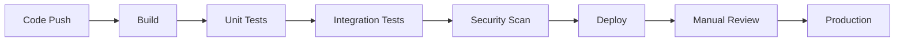
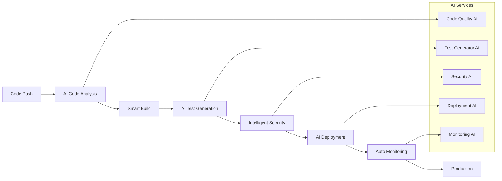
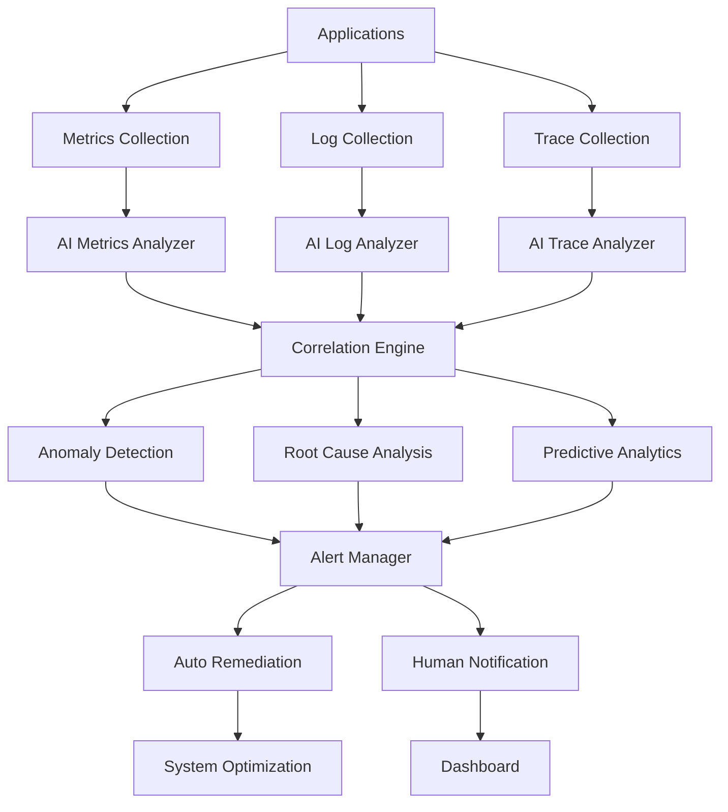

# Глава 15. CI/CD Integration

## 15.1. Автоматизированные пайплайны с ИИ

### Введение раздела

В предыдущих главах мы изучили паттерны разработки кода с ИИ, но для эффективной работы в production-среде необходимо интегрировать ИИ в **CI/CD пайплайны**. Автоматизация процессов с участием ИИ позволяет значительно ускорить разработку, улучшить качество кода и снизить риски при деплое.

Этот раздел основан на лучших практиках из современных DevOps-инструментов и реальном опыте интеграции ИИ в enterprise-пайплайны. Мы рассмотрим, как создать умные CI/CD системы, которые не просто выполняют команды, а принимают решения на основе анализа кода.

В этом разделе мы рассмотрим:
- Архитектуру AI-драйвенных CI/CD пайплайнов
- Автоматическую генерацию тестов и валидацию
- Интеллектуальный деплой и мониторинг
- Практические примеры для разных платформ

**Цели раздела:**
1. Понять, как интегрировать ИИ в существующие CI/CD системы
2. Научиться создавать умные автоматизированные пайплайны
3. Освоить техники автоматической генерации тестов
4. Создать систему мониторинга с ИИ-аналитикой

---

### **Основная теория**

#### **1. Архитектура AI-драйвенных CI/CD пайплайнов**

##### **1.1. Традиционный vs AI-драйвленный подход**

**Традиционный CI/CD:**


**AI-драйвенный CI/CD:**


##### **1.2. Компоненты AI-драйвенного пайплайна**

**1. AI Code Analyzer:**
```yaml
# .github/workflows/ai-analysis.yml
name: AI Code Analysis

on:
  push:
    branches: [main, develop]
  pull_request:
    branches: [main]

jobs:
  ai-analysis:
    runs-on: ubuntu-latest
    steps:
      - uses: actions/checkout@v3
      
      - name: AI Code Quality Check
        uses: ai-tools/code-analyzer@v2
        with:
          api-key: ${{ secrets.AI_API_KEY }}
          model: gpt-4
          analysis-types: |
            code-quality
            security-vulnerabilities
            performance-issues
            test-coverage-gaps
          threshold: 0.8
          
      - name: Generate Improvement Suggestions
        if: failure()
        uses: ai-tools/suggestion-generator@v1
        with:
          api-key: ${{ secrets.AI_API_KEY }}
          output-format: markdown
          file: improvement-suggestions.md
          
      - name: Comment PR with Suggestions
        if: github.event_name == 'pull_request'
        uses: actions/github-script@v6
        with:
          script: |
            const fs = require('fs');
            const suggestions = fs.readFileSync('improvement-suggestions.md', 'utf8');
            github.rest.issues.createComment({
              issue_number: context.issue.number,
              owner: context.repo.owner,
              repo: context.repo.repo,
              body: `## 🤖 AI Code Analysis Results\n\n${suggestions}`
            });
```

**2. Smart Test Generator:**
```yaml
# .github/workflows/ai-test-generation.yml
name: AI Test Generation

on:
  push:
    paths:
      - 'src/**/*.js'
      - 'src/**/*.ts'
      - 'src/**/*.py'

jobs:
  generate-tests:
    runs-on: ubuntu-latest
    steps:
      - uses: actions/checkout@v3
      
      - name: Setup Node.js
        uses: actions/setup-node@v3
        with:
          node-version: '18'
          
      - name: Install Dependencies
        run: npm ci
        
      - name: Generate Tests with AI
        uses: ai-tools/test-generator@v3
        with:
          api-key: ${{ secrets.AI_API_KEY }}
          source-directory: src/
          test-directory: tests/
          coverage-target: 80
          frameworks: jest, mocha, pytest
          
      - name: Run Generated Tests
        run: npm test
        
      - name: Update Coverage Badge
        uses: actions/coverage-badge@v2
        with:
          coverage-file: coverage/coverage-summary.json
          badge-output: coverage-badge.svg
```

**3. Intelligent Security Scanner:**
```yaml
# .github/workflows/ai-security.yml
name: AI Security Analysis

on:
  push:
    branches: [main]
  pull_request:
    branches: [main]

jobs:
  ai-security:
    runs-on: ubuntu-latest
    steps:
      - uses: actions/checkout@v3
      
      - name: AI Security Analysis
        uses: ai-tools/security-scanner@v2
        with:
          api-key: ${{ secrets.AI_API_KEY }}
          scan-types: |
            vulnerability-detection
            dependency-analysis
            code-injection-checks
            data-leak-detection
          severity-threshold: medium
          
      - name: Generate Security Report
        uses: ai-tools/report-generator@v1
        with:
          template: security-report
          output: security-report.html
          
      - name: Upload Security Report
        uses: actions/upload-artifact@v3
        with:
          name: security-report
          path: security-report.html
```

---

#### **2. Автоматическая генерация тестов**

##### **2.1. AI-драйвенная генерация unit тестов**

**JavaScript/TypeScript пример:**
```typescript
// scripts/ai-test-generator.ts
import OpenAI from 'openai';
import * as fs from 'fs';
import * as path from 'path';

interface TestGenerationConfig {
  sourceFile: string;
  testFramework: 'jest' | 'mocha' | 'vitest';
  coverageTarget: number;
  includeEdgeCases: boolean;
}

class AITestGenerator {
  private openai: OpenAI;
  
  constructor(apiKey: string) {
    this.openai = new OpenAI({ apiKey });
  }
  
  async generateTests(config: TestGenerationConfig): Promise<string> {
    const sourceCode = fs.readFileSync(config.sourceFile, 'utf8');
    const fileName = path.basename(config.sourceFile, path.extname(config.sourceFile));
    
    const prompt = `
Generate comprehensive ${config.testFramework} tests for the following code:

File: ${config.sourceFile}
Code:
\`\`\`typescript
${sourceCode}
\`\`\`

Requirements:
1. Target ${config.coverageTarget}% code coverage
2. Include edge cases${config.includeEdgeCases ? ' and error scenarios' : ''}
3. Use proper mocking for external dependencies
4. Follow ${config.testFramework} best practices
5. Include descriptive test names
6. Add setup/teardown where needed

Generate only the test code, no explanations.
`;

    const response = await this.openai.chat.completions.create({
      model: 'gpt-4',
      messages: [{ role: 'user', content: prompt }],
      temperature: 0.3,
    });

    return response.choices[0].message.content || '';
  }
  
  async generateTestsForDirectory(
    sourceDir: string,
    testDir: string,
    config: Partial<TestGenerationConfig>
  ): Promise<void> {
    const files = fs.readdirSync(sourceDir, { withFileTypes: true })
      .filter(dirent => dirent.isFile() && dirent.name.match(/\.(js|ts)$/))
      .map(dirent => dirent.name);
    
    for (const file of files) {
      const sourcePath = path.join(sourceDir, file);
      const testFileName = file.replace(/\.(js|ts)$/, '.test.$1');
      const testPath = path.join(testDir, testFileName);
      
      const testCode = await this.generateTests({
        sourceFile: sourcePath,
        testFramework: config.testFramework || 'jest',
        coverageTarget: config.coverageTarget || 80,
        includeEdgeCases: config.includeEdgeCases || true,
      });
      
      fs.writeFileSync(testPath, testCode);
      console.log(`Generated tests for ${file} -> ${testFileName}`);
    }
  }
}

// CLI Usage
async function main() {
  const generator = new AITestGenerator(process.env.OPENAI_API_KEY!);
  
  await generator.generateTestsForDirectory(
    'src/services',
    'tests/services',
    {
      testFramework: 'jest',
      coverageTarget: 85,
      includeEdgeCases: true,
    }
  );
}

if (require.main === module) {
  main().catch(console.error);
}
```

**Python пример:**
```python
# scripts/ai_test_generator.py
import openai
import os
import ast
import inspect
from typing import List, Dict, Any

class AITestGenerator:
    def __init__(self, api_key: str):
        self.client = openai.OpenAI(api_key=api_key)
    
    def analyze_function(self, func_node: ast.FunctionDef) -> Dict[str, Any]:
        """Analyze Python function to determine test requirements"""
        return {
            'name': func_node.name,
            'args': [arg.arg for arg in func_node.args.args],
            'returns': ast.unparse(func_node.returns) if func_node.returns else None,
            'docstring': ast.get_docstring(func_node),
            'complexity': self._calculate_complexity(func_node)
        }
    
    def _calculate_complexity(self, node: ast.FunctionDef) -> int:
        """Simple complexity calculation"""
        complexity = 1
        for child in ast.walk(node):
            if isinstance(child, (ast.If, ast.For, ast.While, ast.Try)):
                complexity += 1
        return complexity
    
    def generate_test_for_function(self, func_info: Dict[str, Any], 
                                source_code: str) -> str:
        """Generate pytest test for a specific function"""
        
        prompt = f"""
Generate comprehensive pytest tests for this Python function:

Function: {func_info['name']}
Arguments: {func_info['args']}
Returns: {func_info['returns']}
Docstring: {func_info['docstring'] or 'No docstring'}
Complexity: {func_info['complexity']}

Source code:
```python
{source_code}
```

Requirements:
1. Test all argument combinations and edge cases
2. Include negative test cases where appropriate
3. Use pytest fixtures for setup/teardown
4. Mock external dependencies
5. Add parameterized tests for multiple inputs
6. Include assertions for return values and exceptions

Generate only the test code:
"""
        
        response = self.client.chat.completions.create(
            model="gpt-4",
            messages=[{"role": "user", "content": prompt}],
            temperature=0.3
        )
        
        return response.choices[0].message.content
    
    def generate_tests_for_file(self, source_file: str, test_file: str):
        """Generate tests for entire Python file"""
        with open(source_file, 'r') as f:
            source_code = f.read()
        
        tree = ast.parse(source_code)
        functions = [node for node in ast.walk(tree) 
                   if isinstance(node, ast.FunctionDef)]
        
        test_code = []
        test_code.append(f"# Auto-generated tests for {os.path.basename(source_file)}")
        test_code.append("import pytest")
        test_code.append("from unittest.mock import Mock, patch")
        test_code.append(f"from {os.path.splitext(os.path.basename(source_file))[0]} import *")
        test_code.append("")
        
        for func in functions:
            func_info = self.analyze_function(func)
            func_source = ast.get_source_segment(source_code, func)
            if func_source:
                generated_test = self.generate_test_for_function(func_info, func_source)
                test_code.append(generated_test)
                test_code.append("")
        
        with open(test_file, 'w') as f:
            f.write('\n'.join(test_code))
        
        print(f"Generated tests for {source_file} -> {test_file}")

# Usage
if __name__ == "__main__":
    generator = AITestGenerator(os.getenv("OPENAI_API_KEY"))
    generator.generate_tests_for_file("src/calculator.py", "tests/test_calculator.py")
```

##### **2.2. Генерация integration и E2E тестов**

**Cypress/Playwright E2E тесты:**
```typescript
// scripts/e2e-test-generator.ts
interface E2ETestConfig {
  application: string;
  userFlows: string[];
  browsers: string[];
  viewports: { width: number; height: number }[];
}

class E2ETestGenerator {
  async generateE2ETests(config: E2ETestConfig): Promise<string> {
    const prompt = `
Generate comprehensive Playwright E2E tests for ${config.application}.

User flows to test:
${config.userFlows.map(flow => `- ${flow}`).join('\n')}

Requirements:
1. Use Playwright with TypeScript
2. Include tests for: ${config.browsers.join(', ')}
3. Test responsive design for viewports: ${config.viewports.map(v => `${v.width}x${v.height}`).join(', ')}
4. Include proper waits and assertions
5. Add error handling and retry logic
6. Use page object pattern
7. Include accessibility tests
8. Add visual regression tests

Generate complete test files with proper imports and setup.
`;

    const response = await this.openai.chat.completions.create({
      model: 'gpt-4',
      messages: [{ role: 'user', content: prompt }],
      temperature: 0.3,
    });

    return response.choices[0].message.content || '';
  }
}

// Example usage
const generator = new E2ETestGenerator();
const e2eTests = await generator.generateE2ETests({
  application: 'E-commerce platform',
  userFlows: [
    'User registration and login',
    'Product search and filtering',
    'Shopping cart management',
    'Checkout process',
    'Order tracking'
  ],
  browsers: ['chromium', 'firefox', 'webkit'],
  viewports: [
    { width: 1920, height: 1080 },
    { width: 768, height: 1024 },
    { width: 375, height: 667 }
  ]
});
```

---

#### **3. Интеллектуальный деплоймент**

##### **3.1. AI-драйвенный deployment strategy**

**Smart Deployment Pipeline:**
```yaml
# .github/workflows/ai-deployment.yml
name: AI-Driven Deployment

on:
  push:
    branches: [main]
  workflow_dispatch:
    inputs:
      environment:
        description: 'Deployment environment'
        required: true
        default: 'staging'
        type: choice
        options:
          - staging
          - production

jobs:
  analyze-deployment:
    runs-on: ubuntu-latest
    outputs:
      deployment-strategy: ${{ steps.ai-analysis.outputs.strategy }}
      risk-level: ${{ steps.ai-analysis.outputs.risk }}
      rollback-plan: ${{ steps.ai-analysis.outputs.rollback }}
    
    steps:
      - uses: actions/checkout@v3
      
      - name: AI Deployment Analysis
        id: ai-analysis
        uses: ai-tools/deployment-analyzer@v2
        with:
          api-key: ${{ secrets.AI_API_KEY }}
          environment: ${{ github.event.inputs.environment || 'staging' }}
          analysis-factors: |
            code-changes-impact
            dependency-updates
            database-migrations
            api-compatibility
            performance-impact
          risk-threshold: medium
          
      - name: Generate Deployment Plan
        run: |
          echo "Deployment Strategy: ${{ steps.ai-analysis.outputs.strategy }}"
          echo "Risk Level: ${{ steps.ai-analysis.outputs.risk }}"
          echo "Rollback Plan: ${{ steps.ai-analysis.outputs.rollback }}"

  deploy-staging:
    needs: analyze-deployment
    if: needs.analyze-deployment.outputs.risk-level != 'high'
    runs-on: ubuntu-latest
    environment: staging
    
    steps:
      - uses: actions/checkout@v3
      
      - name: Setup Environment
        run: |
          echo "Setting up staging environment"
          # Environment setup commands
          
      - name: Smart Deploy
        uses: ai-tools/smart-deploy@v3
        with:
          api-key: ${{ secrets.AI_API_KEY }}
          strategy: ${{ needs.analyze-deployment.outputs.deployment-strategy }}
          monitoring-enabled: true
          auto-rollback: true
          health-checks: |
            - endpoint: /health
              expected-status: 200
              timeout: 30s
            - endpoint: /api/users
              expected-status: 200
              timeout: 10s
              
      - name: Post-Deployment AI Analysis
        uses: ai-tools/post-deployment-check@v1
        with:
          api-key: ${{ secrets.AI_API_KEY }}
          monitoring-window: 10m
          metrics: |
            response-time
            error-rate
            throughput
            cpu-usage
            memory-usage

  deploy-production:
    needs: [analyze-deployment, deploy-staging]
    if: |
      github.ref == 'refs/heads/main' && 
      needs.analyze-deployment.outputs.risk-level == 'low' &&
      needs.deploy-staging.result == 'success'
    runs-on: ubuntu-latest
    environment: production
    
    steps:
      - uses: actions/checkout@v3
      
      - name: Production Deployment Approval
        uses: ai-tools/approval-check@v2
        with:
          api-key: ${{ secrets.AI_API_KEY }}
          staging-results: ${{ needs.deploy-staging.outputs }}
          approval-criteria: |
            no-errors-in-staging
            performance-within-threshold
            security-scan-passed
            tests-passing
            
      - name: Deploy to Production
        uses: ai-tools/smart-deploy@v3
        with:
          api-key: ${{ secrets.AI_API_KEY }}
          environment: production
          strategy: blue-green
          monitoring-enabled: true
          auto-rollback: true
          canary-percentage: 10
```

##### **3.2. AI-драйвенный rollback и recovery**

**Automated Rollback System:**
```typescript
// scripts/ai-rollback-manager.ts
interface DeploymentMetrics {
  timestamp: Date;
  errorRate: number;
  responseTime: number;
  throughput: number;
  cpuUsage: number;
  memoryUsage: number;
}

interface RollbackDecision {
  shouldRollback: boolean;
  reason: string;
  confidence: number;
  suggestedActions: string[];
}

class AIRollbackManager {
  private metrics: DeploymentMetrics[] = [];
  private rollbackThresholds = {
    errorRate: 0.05, // 5%
    responseTime: 2000, // 2 seconds
    cpuUsage: 0.8, // 80%
    memoryUsage: 0.85, // 85%
  };
  
  async analyzeDeploymentHealth(
    currentMetrics: DeploymentMetrics
  ): Promise<RollbackDecision> {
    this.metrics.push(currentMetrics);
    
    const prompt = `
Analyze the following deployment metrics and determine if rollback is needed:

Current Metrics:
- Error Rate: ${(currentMetrics.errorRate * 100).toFixed(2)}%
- Response Time: ${currentMetrics.responseTime}ms
- Throughput: ${currentMetrics.throughput} req/s
- CPU Usage: ${(currentMetrics.cpuUsage * 100).toFixed(1)}%
- Memory Usage: ${(currentMetrics.memoryUsage * 100).toFixed(1)}%

Historical Context (last 10 data points):
${this.metrics.slice(-10).map(m => `
- ${m.timestamp}: Error ${(m.errorRate * 100).toFixed(2)}%, RT ${m.responseTime}ms
`).join('')}

Thresholds:
- Error Rate: ${(this.rollbackThresholds.errorRate * 100)}%
- Response Time: ${this.rollbackThresholds.responseTime}ms
- CPU Usage: ${(this.rollbackThresholds.cpuUsage * 100)}%
- Memory Usage: ${(this.rollbackThresholds.memoryUsage * 100)}%

Analyze:
1. Are current metrics beyond thresholds?
2. Is there a trend indicating degradation?
3. Are there patterns suggesting specific issues?
4. What is the confidence level for rollback decision?
5. What immediate actions should be taken?

Provide JSON response:
{
  "shouldRollback": boolean,
  "reason": "string",
  "confidence": number (0-1),
  "suggestedActions": ["string"]
}
`;

    const response = await this.openai.chat.completions.create({
      model: 'gpt-4',
      messages: [{ role: 'user', content: prompt }],
      temperature: 0.2,
    });

    try {
      return JSON.parse(response.choices[0].message.content || '{}');
    } catch (error) {
      console.error('Failed to parse AI response:', error);
      return {
        shouldRollback: false,
        reason: 'Unable to analyze metrics',
        confidence: 0,
        suggestedActions: ['Manual investigation required']
      };
    }
  }
  
  async executeRollback(reason: string): Promise<void> {
    console.log(`Executing rollback: ${reason}`);
    
    // Create rollback commit
    await this.createRollbackCommit();
    
    // Deploy previous version
    await this.deployPreviousVersion();
    
    // Verify rollback success
    await this.verifyRollback();
    
    // Notify team
    await this.notifyRollback(reason);
  }
  
  private async createRollbackCommit(): Promise<void> {
    // Implementation for creating rollback commit
  }
  
  private async deployPreviousVersion(): Promise<void> {
    // Implementation for deploying previous version
  }
  
  private async verifyRollback(): Promise<void> {
    // Implementation for verifying rollback success
  }
  
  private async notifyRollback(reason: string): Promise<void> {
    // Implementation for team notification
  }
}
```

---

### **Практические примеры**

#### **Пример 1: Полный AI-драйвенный пайплайн для React приложения**

**Сценарий:** E-commerce платформа с автоматическим тестированием и деплоем

```yaml
# .github/workflows/ai-full-pipeline.yml
name: AI-Driven Full Pipeline

on:
  push:
    branches: [main, develop]
  pull_request:
    branches: [main]

env:
  NODE_VERSION: '18'
  AI_MODEL: 'gpt-4'
  COVERAGE_TARGET: 85

jobs:
  ai-code-analysis:
    runs-on: ubuntu-latest
    outputs:
      quality-score: ${{ steps.analysis.outputs.quality-score }}
      security-score: ${{ steps.analysis.outputs.security-score }}
      test-coverage: ${{ steps.analysis.outputs.test-coverage }}
    
    steps:
      - uses: actions/checkout@v3
      
      - name: Setup Node.js
        uses: actions/setup-node@v3
        with:
          node-version: ${{ env.NODE_VERSION }}
          cache: 'npm'
          
      - name: Install Dependencies
        run: npm ci
        
      - name: AI Comprehensive Analysis
        id: analysis
        uses: ai-tools/comprehensive-analyzer@v3
        with:
          api-key: ${{ secrets.AI_API_KEY }}
          model: ${{ env.AI_MODEL }}
          analysis-types: |
            code-quality
            security-vulnerabilities
            performance-issues
            accessibility-checks
            test-coverage-gaps
            dependency-audit
          output-format: json
          
      - name: Generate Quality Report
        uses: ai-tools/report-generator@v2
        with:
          data: ${{ steps.analysis.outputs }}
          template: quality-dashboard
          output: quality-report.html
          
      - name: Upload Quality Report
        uses: actions/upload-artifact@v3
        with:
          name: quality-report
          path: quality-report.html

  ai-test-generation:
    needs: ai-code-analysis
    if: needs.ai-code-analysis.outputs.test-coverage < ${{ env.COVERAGE_TARGET }}
    runs-on: ubuntu-latest
    
    steps:
      - uses: actions/checkout@v3
      
      - name: Setup Node.js
        uses: actions/setup-node@v3
        with:
          node-version: ${{ env.NODE_VERSION }}
          cache: 'npm'
          
      - name: Install Dependencies
        run: npm ci
        
      - name: Generate Missing Tests
        uses: ai-tools/test-generator@v3
        with:
          api-key: ${{ secrets.AI_API_KEY }}
          model: ${{ env.AI_MODEL }}
          source-directory: src/
          test-directory: tests/
          coverage-target: ${{ env.COVERAGE_TARGET }}
          frameworks: jest, cypress
          include-e2e: true
          
      - name: Run All Tests
        run: |
          npm run test:unit
          npm run test:integration
          npm run test:e2e
          
      - name: Update Coverage
        uses: actions/coverage-badge@v2
        with:
          coverage-file: coverage/coverage-summary.json
          badge-output: coverage-badge.svg
          
      - name: Commit Generated Tests
        if: github.event_name == 'push'
        run: |
          git config --local user.email "action@github.com"
          git config --local user.name "GitHub Action"
          git add tests/
          git commit -m "AI: Generate tests to reach ${{ env.COVERAGE_TARGET }}% coverage" || exit 0
          git push

  build-and-deploy:
    needs: [ai-code-analysis, ai-test-generation]
    if: |
      needs.ai-code-analysis.outputs.quality-score > 0.8 &&
      needs.ai-code-analysis.outputs.security-score > 0.9
    runs-on: ubuntu-latest
    environment: ${{ github.ref == 'refs/heads/main' && 'production' || 'staging' }}
    
    steps:
      - uses: actions/checkout@v3
      
      - name: Setup Node.js
        uses: actions/setup-node@v3
        with:
          node-version: ${{ env.NODE_VERSION }}
          cache: 'npm'
          
      - name: Install Dependencies
        run: npm ci
        
      - name: AI-Optimized Build
        uses: ai-tools/smart-build@v2
        with:
          api-key: ${{ secrets.AI_API_KEY }}
          optimization-targets: |
            bundle-size
            load-time
            runtime-performance
          environment: ${{ github.ref == 'refs/heads/main' && 'production' || 'staging' }}
          
      - name: Deploy Application
        uses: ai-tools/smart-deploy@v3
        with:
          api-key: ${{ secrets.AI_API_KEY }}
          environment: ${{ github.ref == 'refs/heads/main' && 'production' || 'staging' }}
          strategy: ${{ github.ref == 'refs/heads/main' && 'blue-green' || 'rolling' }}
          monitoring-enabled: true
          auto-rollback: true
          health-checks: |
            - endpoint: /health
              expected-status: 200
              timeout: 30s
            - endpoint: /api/products
              expected-status: 200
              timeout: 10s
              
      - name: Post-Deployment AI Monitoring
        uses: ai-tools/monitoring@v2
        with:
          api-key: ${{ secrets.AI_API_KEY }}
          monitoring-window: 15m
          alert-thresholds: |
            error-rate: 0.02
            response-time: 1500
            cpu-usage: 0.75
          notification-channels: slack,email
```

---

#### **Пример 2: AI-драйвенный мониторинг и алерты**

**Интеллектуальная система мониторинга:**
```typescript
// scripts/ai-monitoring.ts
interface MonitoringAlert {
  type: 'performance' | 'error' | 'security' | 'resource';
  severity: 'low' | 'medium' | 'high' | 'critical';
  message: string;
  metrics: Record<string, number>;
  recommendations: string[];
  autoAction?: string;
}

class AIMonitoringSystem {
  private alertHistory: MonitoringAlert[] = [];
  private model = 'gpt-4';
  
  async analyzeSystemMetrics(
    metrics: Record<string, number>,
    historicalData: Record<string, number>[]
  ): Promise<MonitoringAlert[]> {
    const prompt = `
Analyze the following system metrics and identify potential issues:

Current Metrics:
${Object.entries(metrics).map(([key, value]) => `- ${key}: ${value}`).join('\n')}

Historical Context (last 24 hours):
${historicalData.slice(-24).map((data, i) => 
  `Hour ${i}: ${Object.entries(data).map(([k, v]) => `${k}=${v}`).join(', ')}`
).join('\n')}

Analysis Requirements:
1. Identify anomalies and patterns
2. Compare with historical baselines
3. Predict potential future issues
4. Suggest immediate actions
5. Recommend preventive measures

Provide JSON array of alerts:
[
  {
    "type": "performance|error|security|resource",
    "severity": "low|medium|high|critical",
    "message": "Human-readable description",
    "metrics": {"metric_name": value},
    "recommendations": ["action1", "action2"],
    "autoAction": "automatic_action_if_safe"
  }
]
`;

    const response = await this.openai.chat.completions.create({
      model: this.model,
      messages: [{ role: 'user', content: prompt }],
      temperature: 0.3,
    });

    try {
      const alerts = JSON.parse(response.choices[0].message.content || '[]');
      return alerts.filter(alert => this.isValidAlert(alert));
    } catch (error) {
      console.error('Failed to parse monitoring alerts:', error);
      return [];
    }
  }
  
  private isValidAlert(alert: any): boolean {
    return alert.type && alert.severity && alert.message && 
           Array.isArray(alert.recommendations);
  }
  
  async executeAutoActions(alerts: MonitoringAlert[]): Promise<void> {
    for (const alert of alerts) {
      if (alert.autoAction && alert.severity === 'critical') {
        console.log(`Executing auto-action: ${alert.autoAction}`);
        
        switch (alert.autoAction) {
          case 'restart_service':
            await this.restartService(alert.metrics.service_name);
            break;
          case 'scale_up':
            await this.scaleUp(alert.metrics.service_name);
            break;
          case 'rollback_deployment':
            await this.rollbackLastDeployment();
            break;
          case 'clear_cache':
            await this.clearCache(alert.metrics.cache_name);
            break;
        }
      }
    }
  }
  
  async sendAlerts(alerts: MonitoringAlert[]): Promise<void> {
    for (const alert of alerts) {
      await this.notifyTeam(alert);
      this.alertHistory.push(alert);
    }
  }
  
  private async notifyTeam(alert: MonitoringAlert): Promise<void> {
    const message = `
🚨 **${alert.severity.toUpperCase()} ${alert.type.toUpperCase()} ALERT**

${alert.message}

**Metrics:**
${Object.entries(alert.metrics).map(([k, v]) => `- ${k}: ${v}`).join('\n')}

**Recommendations:**
${alert.recommendations.map(r => `- ${r}`).join('\n')}

${alert.autoAction ? `**Auto-action executed:** ${alert.autoAction}` : ''}
`;

    // Send to Slack
    await this.sendSlackAlert(message);
    
    // Send email for high/critical alerts
    if (alert.severity === 'high' || alert.severity === 'critical') {
      await this.sendEmailAlert(message);
    }
  }
  
  private async sendSlackAlert(message: string): Promise<void> {
    // Slack integration implementation
  }
  
  private async sendEmailAlert(message: string): Promise<void> {
    // Email integration implementation
  }
  
  private async restartService(serviceName: string): Promise<void> {
    // Service restart implementation
  }
  
  private async scaleUp(serviceName: string): Promise<void> {
    // Auto-scaling implementation
  }
  
  private async rollbackLastDeployment(): Promise<void> {
    // Rollback implementation
  }
  
  private async clearCache(cacheName: string): Promise<void> {
    // Cache clearing implementation
  }
}
```

---

### **Практические задания**

#### **Задание 1: Создание AI-драйвенного CI/CD пайплайна**

**Цель:** Настроить полный пайплайн с ИИ-анализом

**Задание:**
1. Создайте GitHub Actions workflow с AI-анализом кода
2. Настройте автоматическую генерацию тестов
3. Внедрите интеллектуальный деплоймент
4. Добавьте AI-мониторинг после деплоя

**Критерии выполнения:**
- Работающий CI/CD пайплайн
- AI-анализ качества кода
- Автоматическая генерация тестов
- Умный деплой с rollback

---

#### **Задание 2: Интеграция AI-мониторинга**

**Цель:** Создать систему интеллектуального мониторинга

**Задание:**
1. Настройте сбор метрик приложения
2. Внедрите AI-анализ метрик
3. Создайте систему алертов с рекомендациями
4. Добавьте автоматические действия для критических ситуаций

**Требования:**
- Сбор ключевых метрик
- AI-анализ в реальном времени
- Умные алерты с рекомендациями
- Автоматические recovery действия

---

## **Заключение раздела**

AI-драйвенные CI/CD пайплайны представляют собой **революционный подход** к автоматизации разработки и деплоя. Интеграция искусственного интеллекта в каждый этап пайплайна позволяет не просто автоматизировать рутинные операции, а принимать интеллектуальные решения на основе анализа данных.

**Ключевые идеи раздела:**
1. **AI-анализ кода** обеспечивает качество на ранних этапах
2. **Автоматическая генерация тестов** повышает покрытие и надежность
3. **Интеллектуальный деплой** минимизирует риски и ускоряет доставку
4. **AI-мониторинг** предсказывает проблемы и автоматически их решает

**Следующие шаги:**
- Интегрируйте AI-анализ в существующий CI/CD
- Настройте автоматическую генерацию тестов
- Внедрите умный деплой с rollback
- Создайте систему AI-мониторинга

В следующем разделе мы изучим **мониторинг и observability** — создание комплексных систем наблюдаемости с ИИ-аналитикой.

Помните: **хороший CI/CD пайплайн — это как умный ассистент**. Он не просто выполняет команды, а помогает принимать правильные решения на основе данных и опыта.

---

## **15.2. Генерация тестов в CI/CD**

### **Введение раздела**

В предыдущем разделе мы рассмотрели базовые техники автоматической генерации тестов. Теперь углубимся в **продвинутые стратегии интеграции AI-генерации тестов непосредственно в CI/CD пайплайны**. Это позволяет создавать динамические тестовые наборы, которые адаптируются к изменениям кода и обеспечивают максимальное покрытие.

Современные CI/CD системы с ИИ способны не просто генерировать тесты, а создавать **интеллектуальные тестовые стратегии**, которые учитывают архитектуру приложения, бизнес-логику и исторические данные об ошибках.

В этом разделе мы рассмотрим:
- Продвинутые техники генерации тестов в CI/CD
- Адаптивные тестовые стратегии
- Интеграцию с различными фреймворками
- Оптимизацию производительности тестов

**Цели раздела:**
1. Освоить продвинутые техники генерации тестов
2. Научиться создавать адаптивные тестовые стратегии
3. Понять, как оптимизировать тесты в CI/CD
4. Создать систему непрерывного улучшения тестов

---

### **Основная теория**

#### **1. Адаптивные тестовые стратегии**

##### **1.1. Risk-Based Test Generation**

**Концепция:**
Генерация тестов на основе анализа рисков и критичности компонентов.

```typescript
// scripts/risk-based-test-generator.ts
interface ComponentRisk {
  componentName: string;
  complexity: number;
  businessCriticality: number;
  changeFrequency: number;
  historicalBugs: number;
  dependencies: string[];
}

interface TestStrategy {
  component: string;
  testTypes: string[];
  coverageTarget: number;
  priority: 'high' | 'medium' | 'low';
  testCount: number;
}

class RiskBasedTestGenerator {
  private riskFactors = {
    complexity: 0.3,
    businessCriticality: 0.4,
    changeFrequency: 0.2,
    historicalBugs: 0.1
  };
  
  async analyzeComponentRisk(componentPath: string): Promise<ComponentRisk> {
    const sourceCode = fs.readFileSync(componentPath, 'utf8');
    
    const prompt = `
Analyze this component for risk assessment:

File: ${componentPath}
Code:
\`\`\`typescript
${sourceCode}
\`\`\`

Provide JSON response:
{
  "complexity": number (1-10),
  "businessCriticality": number (1-10),
  "changeFrequency": number (1-10),
  "historicalBugs": number (0-10),
  "dependencies": ["string"]
}

Consider:
- Cyclomatic complexity
- Business impact
- Git commit frequency
- Historical bug reports
- External dependencies
`;

    const response = await this.openai.chat.completions.create({
      model: 'gpt-4',
      messages: [{ role: 'user', content: prompt }],
      temperature: 0.2,
    });

    return JSON.parse(response.choices[0].message.content || '{}');
  }
  
  calculateRiskScore(risk: ComponentRisk): number {
    return (
      risk.complexity * this.riskFactors.complexity +
      risk.businessCriticality * this.riskFactors.businessCriticality +
      risk.changeFrequency * this.riskFactors.changeFrequency +
      risk.historicalBugs * this.riskFactors.historicalBugs
    );
  }
  
  generateTestStrategy(risks: ComponentRisk[]): TestStrategy[] {
    return risks.map(risk => {
      const riskScore = this.calculateRiskScore(risk);
      
      return {
        component: risk.componentName,
        testTypes: this.determineTestTypes(risk, riskScore),
        coverageTarget: this.calculateCoverageTarget(riskScore),
        priority: this.determinePriority(riskScore),
        testCount: this.calculateTestCount(riskScore)
      };
    }).sort((a, b) => {
      const priorityOrder = { high: 3, medium: 2, low: 1 };
      return priorityOrder[b.priority] - priorityOrder[a.priority];
    });
  }
  
  private determineTestTypes(risk: ComponentRisk, riskScore: number): string[] {
    const testTypes = ['unit'];
    
    if (risk.dependencies.length > 2) testTypes.push('integration');
    if (risk.businessCriticality > 7) testTypes.push('e2e');
    if (risk.complexity > 6) testTypes.push('performance');
    if (risk.historicalBugs > 3) testTypes.push('regression');
    
    return testTypes;
  }
  
  private calculateCoverageTarget(riskScore: number): number {
    if (riskScore > 8) return 95;
    if (riskScore > 6) return 90;
    if (riskScore > 4) return 85;
    return 80;
  }
  
  private determinePriority(riskScore: number): 'high' | 'medium' | 'low' {
    if (riskScore > 7) return 'high';
    if (riskScore > 4) return 'medium';
    return 'low';
  }
  
  private calculateTestCount(riskScore: number): number {
    return Math.ceil(riskScore * 2);
  }
}
```

##### **1.2. Evolutionary Test Generation**

**Концепция:**
Тесты эволюционируют вместе с кодом, адаптируясь к изменениям.

```yaml
# .github/workflows/evolutionary-tests.yml
name: Evolutionary Test Generation

on:
  push:
    branches: [main, develop]
  schedule:
    - cron: '0 2 * * *' # Daily at 2 AM

jobs:
  evolutionary-test-generation:
    runs-on: ubuntu-latest
    steps:
      - uses: actions/checkout@v3
        with:
          fetch-depth: 100  # Get more history for analysis
          
      - name: Setup Environment
        uses: actions/setup-node@v3
        with:
          node-version: '18'
          cache: 'npm'
          
      - name: Install Dependencies
        run: npm ci
        
      - name: Analyze Code Evolution
        id: evolution-analysis
        uses: ai-tools/evolution-analyzer@v2
        with:
          api-key: ${{ secrets.AI_API_KEY }}
          analysis-window: 30  # days
          metrics: |
            code-churn
            bug-introduction-rate
            test-effectiveness
            coverage-trends
          output-format: json
          
      - name: Generate Evolutionary Tests
        uses: ai-tools/evolutionary-test-generator@v3
        with:
          api-key: ${{ secrets.AI_API_KEY }}
          evolution-data: ${{ steps.evolution-analysis.outputs }}
          strategies: |
            adaptive-coverage
            bug-pattern-learning
            performance-regression-detection
            mutation-testing
          target-improvement: 5%
          
      - name: Optimize Test Suite
        run: |
          # Remove redundant tests
          npm run test:optimize
          
          # Parallelize test execution
          npm run test:parallel
          
      - name: Update Test Metrics
        uses: ai-tools/test-metrics@v1
        with:
          api-key: ${{ secrets.AI_API_KEY }}
          metrics-file: test-metrics.json
          trend-analysis: true
          
      - name: Commit Evolutionary Improvements
        if: github.event_name == 'schedule'
        run: |
          git config --local user.email "action@github.com"
          git config --local user.name "GitHub Action"
          git add tests/
          git commit -m "AI: Evolutionary test improvements" || exit 0
          git push
```

---

#### **2. Multi-Framework Integration**

##### **2.1. Universal Test Generator**

**Концепция:**
Единый генератор тестов, поддерживающий множество фреймворков.

```typescript
// scripts/universal-test-generator.ts
interface TestFramework {
  name: string;
  patterns: {
    testFile: string;
    testCase: string;
    assertion: string;
    mock: string;
    setup: string;
    teardown: string;
  };
  dependencies: string[];
}

class UniversalTestGenerator {
  private frameworks: Map<string, TestFramework> = new Map([
    ['jest', {
      name: 'Jest',
      patterns: {
        testFile: '*.test.js',
        testCase: 'test("", () => {})',
        assertion: 'expect()',
        mock: 'jest.fn()',
        setup: 'beforeAll(() => {})',
        teardown: 'afterAll(() => {})'
      },
      dependencies: ['jest', '@testing-library/jest-dom']
    }],
    ['mocha', {
      name: 'Mocha',
      patterns: {
        testFile: '*.spec.js',
        testCase: 'it("", () => {})',
        assertion: 'assert()',
        mock: 'sinon.stub()',
        setup: 'before(() => {})',
        teardown: 'after(() => {})'
      },
      dependencies: ['mocha', 'chai', 'sinon']
    }],
    ['pytest', {
      name: 'Pytest',
      patterns: {
        testFile: 'test_*.py',
        testCase: 'def test_():',
        assertion: 'assert',
        mock: 'unittest.mock.Mock()',
        setup: '@pytest.fixture',
        teardown: 'def teardown_():'
      },
      dependencies: ['pytest', 'pytest-mock']
    }],
    ['cypress', {
      name: 'Cypress',
      patterns: {
        testFile: '*.cy.js',
        testCase: 'it("", () => {})',
        assertion: 'expect()',
        mock: 'cy.stub()',
        setup: 'beforeEach(() => {})',
        teardown: 'afterEach(() => {})'
      },
      dependencies: ['cypress']
    }]
  ]);
  
  async generateTests(
    sourceFile: string,
    framework: string,
    options: any = {}
  ): Promise<string> {
    const testFramework = this.frameworks.get(framework);
    if (!testFramework) {
      throw new Error(`Unsupported framework: ${framework}`);
    }
    
    const sourceCode = fs.readFileSync(sourceFile, 'utf8');
    
    const prompt = `
Generate comprehensive ${testFramework.name} tests for this code:

Framework: ${testFramework.name}
File: ${sourceFile}
Code:
\`\`\`typescript
${sourceCode}
\`\`\`

Test Patterns:
- Test files: ${testFramework.patterns.testFile}
- Test case: ${testFramework.patterns.testCase}
- Assertion: ${testFramework.patterns.assertion}
- Mock: ${testFramework.patterns.mock}
- Setup: ${testFramework.patterns.setup}
- Teardown: ${testFramework.patterns.teardown}

Requirements:
1. Use ${testFramework.name} syntax and patterns
2. Include proper imports for ${testFramework.dependencies.join(', ')}
3. Test all functions and methods
4. Include edge cases and error scenarios
5. Use appropriate mocking strategies
6. Follow ${testFramework.name} best practices

Generate only the test code with proper imports.
`;

    const response = await this.openai.chat.completions.create({
      model: 'gpt-4',
      messages: [{ role: 'user', content: prompt }],
      temperature: 0.3,
    });

    return response.choices[0].message.content || '';
  }
  
  async generateCrossFrameworkTests(
    sourceFile: string,
    frameworks: string[]
  ): Promise<Map<string, string>> {
    const results = new Map<string, string>();
    
    for (const framework of frameworks) {
      try {
        const tests = await this.generateTests(sourceFile, framework);
        results.set(framework, tests);
      } catch (error) {
        console.error(`Failed to generate tests for ${framework}:`, error);
      }
    }
    
    return results;
  }
}
```

##### **2.2. CI/CD Integration для Multiple Frameworks**

```yaml
# .github/workflows/multi-framework-tests.yml
name: Multi-Framework Test Generation

on:
  push:
    paths:
      - 'src/**/*'
  pull_request:
    paths:
      - 'src/**/*'

jobs:
  detect-frameworks:
    runs-on: ubuntu-latest
    outputs:
      frameworks: ${{ steps.detection.outputs.frameworks }}
      test-config: ${{ steps.detection.outputs.config }}
    
    steps:
      - uses: actions/checkout@v3
      
      - name: Detect Test Frameworks
        id: detection
        uses: ai-tools/framework-detector@v2
        with:
          api-key: ${{ secrets.AI_API_KEY }}
          scan-directories: |
            src/
            tests/
            package.json
            requirements.txt
            pyproject.toml
          output-format: json
          
  generate-tests:
    needs: detect-frameworks
    strategy:
      matrix:
        framework: ${{ fromJson(needs.detect-frameworks.outputs.frameworks) }}
    runs-on: ubuntu-latest
    
    steps:
      - uses: actions/checkout@v3
      
      - name: Setup Environment for ${{ matrix.framework }}
        run: |
          case "${{ matrix.framework }}" in
            jest|cypress)
              curl -fsSL https://deb.nodesource.com/setup_18.x | sudo -E bash -
              sudo apt-get install -y nodejs
              ;;
            pytest)
              sudo apt-get update
              sudo apt-get install -y python3 python3-pip
              ;;
            mocha)
              curl -fsSL https://deb.nodesource.com/setup_18.x | sudo -E bash -
              sudo apt-get install -y nodejs
              ;;
          esac
          
      - name: Install Dependencies
        run: |
          case "${{ matrix.framework }}" in
            jest|cypress|mocha)
              npm ci
              ;;
            pytest)
              pip3 install -r requirements.txt
              ;;
          esac
          
      - name: Generate Tests for ${{ matrix.framework }}
        uses: ai-tools/universal-test-generator@v3
        with:
          api-key: ${{ secrets.AI_API_KEY }}
          framework: ${{ matrix.framework }}
          source-directory: src/
          test-directory: tests/${{ matrix.framework }}/
          config: ${{ needs.detect-frameworks.outputs.test-config }}
          
      - name: Run ${{ matrix.framework }} Tests
        run: |
          case "${{ matrix.framework }}" in
            jest)
              npm run test:jest
              ;;
            cypress)
              npm run test:cypress
              ;;
            mocha)
              npm run test:mocha
              ;;
            pytest)
              python3 -m pytest tests/pytest/
              ;;
          esac
          
      - name: Upload Test Results
        uses: actions/upload-artifact@v3
        with:
          name: test-results-${{ matrix.framework }}
          path: |
            coverage/
            test-results/
            screenshots/
```

---

#### **3. Оптимизация производительности тестов**

##### **3.1. Intelligent Test Selection**

**Концепция:**
AI выбирает только релевантные тесты для запуска, сокращая время CI.

```typescript
// scripts/intelligent-test-selector.ts
interface ChangeImpact {
  files: string[];
  affectedComponents: string[];
  impactedTests: string[];
  confidence: number;
}

class IntelligentTestSelector {
  async selectTestsForChanges(
    changedFiles: string[],
    allTests: string[]
  ): Promise<string[]> {
    const impact = await this.analyzeChangeImpact(changedFiles);
    const selectedTests = new Set<string>();
    
    // Add directly impacted tests
    impact.impactedTests.forEach(test => selectedTests.add(test));
    
    // Add tests for affected components
    for (const component of impact.affectedComponents) {
      const componentTests = await this.findTestsForComponent(component, allTests);
      componentTests.forEach(test => selectedTests.add(test));
    }
    
    // Add high-priority regression tests
    if (impact.confidence > 0.8) {
      const regressionTests = await this.getRegressionTests();
      regressionTests.forEach(test => selectedTests.add(test));
    }
    
    return Array.from(selectedTests);
  }
  
  private async analyzeChangeImpact(changedFiles: string[]): Promise<ChangeImpact> {
    const prompt = `
Analyze the impact of these code changes:

Changed files:
${changedFiles.map(file => `- ${file}`).join('\n')}

Provide JSON response:
{
  "files": ["changed_files"],
  "affectedComponents": ["component_names"],
  "impactedTests": ["test_file_paths"],
  "confidence": number (0-1)
}

Consider:
- Direct dependencies
- Transitive dependencies
- Shared utilities
- Database schema changes
- API contract changes
`;

    const response = await this.openai.chat.completions.create({
      model: 'gpt-4',
      messages: [{ role: 'user', content: prompt }],
      temperature: 0.2,
    });

    return JSON.parse(response.choices[0].message.content || '{}');
  }
  
  private async findTestsForComponent(component: string, allTests: string[]): Promise<string[]> {
    return allTests.filter(test => 
      test.includes(component) || 
      test.includes(component.toLowerCase()) ||
      test.includes(component.replace(/([A-Z])/g, '-$1').toLowerCase())
    );
  }
  
  private async getRegressionTests(): Promise<string[]> {
    // Return high-priority regression tests
    return [
      'tests/integration/user-workflow.test.js',
      'tests/integration/payment-flow.test.js',
      'tests/integration/data-consistency.test.js'
    ];
  }
}
```

##### **3.2. Parallel Test Execution**

```yaml
# .github/workflows/parallel-tests.yml
name: Parallel Test Execution

on:
  push:
    branches: [main, develop]

jobs:
  test-selection:
    runs-on: ubuntu-latest
    outputs:
      selected-tests: ${{ steps.selection.outputs.tests }}
      test-batches: ${{ steps.selection.outputs.batches }}
    
    steps:
      - uses: actions/checkout@v3
        with:
          fetch-depth: 2
          
      - name: Get Changed Files
        id: changes
        run: |
          CHANGED_FILES=$(git diff --name-only HEAD~1 HEAD)
          echo "files=$CHANGED_FILES" >> $GITHUB_OUTPUT
          
      - name: Select Tests Intelligently
        id: selection
        uses: ai-tools/intelligent-test-selector@v2
        with:
          api-key: ${{ secrets.AI_API_KEY }}
          changed-files: ${{ steps.changes.outputs.files }}
          test-directory: tests/
          batch-size: 10
          parallel-jobs: 4
          
  parallel-test-execution:
    needs: test-selection
    strategy:
      matrix:
        batch: ${{ fromJson(needs.test-selection.outputs.test-batches) }}
    runs-on: ubuntu-latest
    
    steps:
      - uses: actions/checkout@v3
      
      - name: Setup Node.js
        uses: actions/setup-node@v3
        with:
          node-version: '18'
          cache: 'npm'
          
      - name: Install Dependencies
        run: npm ci
        
      - name: Run Test Batch
        run: |
          echo "Running batch: ${{ matrix.batch }}"
          npm run test -- --testPathPattern="${{ matrix.batch }}"
          
      - name: Upload Batch Results
        uses: actions/upload-artifact@v3
        with:
          name: test-results-batch-${{ strategy.job-index }}
          path: test-results/
          
  merge-results:
    needs: parallel-test-execution
    runs-on: ubuntu-latest
    
    steps:
      - name: Download All Results
        uses: actions/download-artifact@v3
        with:
          path: all-results
          
      - name: Merge Test Results
        run: |
          mkdir -p merged-results
          find all-results -name "*.xml" -exec cp {} merged-results/ \;
          npm run test:merge-results
          
      - name: Generate Coverage Report
        run: |
          npm run test:coverage
          npm run test:coverage-report
          
      - name: Upload Merged Results
        uses: actions/upload-artifact@v3
        with:
          name: merged-test-results
          path: |
            merged-results/
            coverage/
```

---

### **Практические примеры**

#### **Пример 1: Полный CI/CD с AI-генерацией тестов**

**Сценарий:** Microservices архитектура с комплексным тестированием

```yaml
# .github/workflows/ai-complete-testing.yml
name: AI-Complete Testing Pipeline

on:
  push:
    branches: [main, develop]
  pull_request:
    branches: [main]

env:
  NODE_VERSION: '18'
  PYTHON_VERSION: '3.9'

jobs:
  code-analysis:
    runs-on: ubuntu-latest
    outputs:
      test-strategy: ${{ steps.analysis.outputs.strategy }}
      risk-assessment: ${{ steps.analysis.outputs.risk }}
    
    steps:
      - uses: actions/checkout@v3
      
      - name: Comprehensive Code Analysis
        id: analysis
        uses: ai-tools/comprehensive-analyzer@v3
        with:
          api-key: ${{ secrets.AI_API_KEY }}
          analysis-types: |
            risk-assessment
            test-coverage-gaps
            performance-bottlenecks
            security-vulnerabilities
          output-format: json
          
  generate-tests:
    needs: code-analysis
    strategy:
      matrix:
        service: [user-service, payment-service, product-service, notification-service]
        language: [javascript, python]
    runs-on: ubuntu-latest
    
    steps:
      - uses: actions/checkout@v3
      
      - name: Setup Environment
        run: |
          if [ "${{ matrix.language }}" = "javascript" ]; then
            curl -fsSL https://deb.nodesource.com/setup_18.x | sudo -E bash -
            sudo apt-get install -y nodejs
          elif [ "${{ matrix.language }}" = "python" ]; then
            sudo apt-get update
            sudo apt-get install -y python3 python3-pip
          fi
          
      - name: Install Dependencies
        run: |
          cd services/${{ matrix.service }}
          if [ "${{ matrix.language }}" = "javascript" ]; then
            npm ci
          elif [ "${{ matrix.language }}" = "python" ]; then
            pip3 install -r requirements.txt
          fi
          
      - name: Generate Service Tests
        uses: ai-tools/service-test-generator@v3
        with:
          api-key: ${{ secrets.AI_API_KEY }}
          service: ${{ matrix.service }}
          language: ${{ matrix.language }}
          strategy: ${{ needs.code-analysis.outputs.test-strategy }}
          test-types: |
            unit
            integration
            contract
            performance
            security
          coverage-target: 90
          
      - name: Run Service Tests
        run: |
          cd services/${{ matrix.service }}
          if [ "${{ matrix.language }}" = "javascript" ]; then
            npm run test:all
          elif [ "${{ matrix.language }}" = "python" ]; then
            python3 -m pytest
          fi
          
      - name: Upload Service Results
        uses: actions/upload-artifact@v3
        with:
          name: test-results-${{ matrix.service }}
          path: |
            test-results/
            coverage/
            
  integration-tests:
    needs: [code-analysis, generate-tests]
    runs-on: ubuntu-latest
    
    steps:
      - uses: actions/checkout@v3
      
      - name: Generate Integration Tests
        uses: ai-tools/integration-test-generator@v2
        with:
          api-key: ${{ secrets.AI_API_KEY }}
          services: user-service,payment-service,product-service
          test-scenarios: |
            user-registration-flow
            purchase-workflow
            order-management
            notification-delivery
          environment: staging
          
      - name: Run Integration Tests
        run: |
          docker-compose -f docker-compose.test.yml up -d
          npm run test:integration
          docker-compose -f docker-compose.test.yml down
          
      - name: Upload Integration Results
        uses: actions/upload-artifact@v3
        with:
          name: integration-test-results
          path: integration-test-results/
          
  performance-tests:
    needs: [code-analysis, generate-tests]
    runs-on: ubuntu-latest
    
    steps:
      - uses: actions/checkout@v3
      
      - name: Generate Performance Tests
        uses: ai-tools/performance-test-generator@v2
        with:
          api-key: ${{ secrets.AI_API_KEY }}
          load-patterns: |
            normal-load: 1000_rpm
            peak-load: 5000_rpm
            stress-test: 10000_rpm
          duration: 10m
          endpoints: |
            - /api/users
            - /api/products
            - /api/orders
            
      - name: Run Performance Tests
        run: |
          npm run test:performance
          
      - name: Analyze Performance Results
        uses: ai-tools/performance-analyzer@v2
        with:
          api-key: ${{ secrets.AI_API_KEY }}
          results-file: performance-results.json
          baseline-file: performance-baseline.json
          thresholds: |
            response-time: 2000ms
            error-rate: 1%
            throughput: 1000_rpm
```

---

### **Практические задания**

#### **Задание 1: Создание адаптивной тестовой стратегии**

**Цель:** Внедрить risk-based генерацию тестов

**Задание:**
1. Проанализируйте существующую кодовую базу
2. Определите компоненты высокого риска
3. Создайте адаптивную стратегию генерации тестов
4. Внедрите в CI/CD пайплайн

**Критерии выполнения:**
- Risk-based анализ компонентов
- Адаптивные тестовые стратегии
- Интеграция в CI/CD
- Метрики эффективности

---

#### **Задание 2: Оптимизация времени выполнения тестов**

**Цель:** Сократить время CI через интеллектуальный отбор тестов

**Задание:**
1. Внедрите интеллектуальный отбор тестов
2. Настройте параллельное выполнение
3. Оптимизируйте зависимости между тестами
4. Измерьте улучшение производительности

**Требования:**
- Интеллектуальный отбор тестов
- Параллельное выполнение
- Оптимизация зависимостей
- Измерение метрик

---

## **Заключение раздела**

Генерация тестов в CI/CD с использованием ИИ превращает тестирование из **ручного процесса в интеллектуальную адаптивную систему**. Современные подходы позволяют не просто генерировать тесты, а создавать самосовершенствующиеся тестовые стратегии.

**Ключевые идеи раздела:**
1. **Risk-based подход** фокусирует тестирование на критических компонентах
2. **Адаптивные стратегии** эволюционируют вместе с кодом
3. **Multi-framework поддержка** обеспечивает гибкость технологий
4. **Интеллектуальная оптимизация** сокращает время CI

**Следующие шаги:**
- Внедрите risk-based генерацию тестов
- Настройте адаптивные тестовые стратегии
- Оптимизируйте выполнение тестов в CI
- Создайте систему непрерывного улучшения

В следующем разделе мы изучим **мониторинг и observability** — создание комплексных систем наблюдаемости с ИИ-аналитикой.

Помните: **хорошие тесты — это не просто покрытие кода, а интеллектуальная защита бизнеса**. AI-генерация тестов делает эту защиту адаптивной и предсказуемой.

---

## **15.3. Мониторинг и observability**

### **Введение раздела**

В предыдущих разделах мы создали CI/CD пайплайны с ИИ-генерацией тестов. Теперь рассмотрим **мониторинг и observability** — критически важные компоненты для production-систем. AI-драйвенный мониторинг превращает пассивное наблюдение в **проактивную систему предсказания и автоматического решения проблем**.

Современные observability системы с ИИ способны не просто собирать метрики, а:
- Предсказывать проблемы до их возникновения
- Автоматически определять корневые причины инцидентов
- Оптимизировать производительность в реальном времени
- Адаптироваться к изменяющимся условиям

В этом разделе мы рассмотрим:
- AI-драйвенные системы мониторинга
- Предиктивная аналитика и алерты
- Автоматическое обнаружение аномалий
- Интеллектуальная оптимизация производительности

**Цели раздела:**
1. Создать комплексную систему мониторинга с ИИ
2. Научиться предсказывать проблемы до их возникновения
3. Освоить техники автоматического восстановления
4. Понять, как оптимизировать производительность через ИИ

---

### **Основная теория**

#### **1. AI-драйвенные системы мониторинга**

##### **1.1. Архитектура интеллектуального мониторинга**



##### **1.2. Комплексная система мониторинга**

```typescript
// scripts/ai-observability-system.ts
interface MetricData {
  timestamp: Date;
  service: string;
  metric: string;
  value: number;
  tags: Record<string, string>;
}

interface Anomaly {
  id: string;
  type: 'metric' | 'log' | 'trace';
  severity: 'low' | 'medium' | 'high' | 'critical';
  description: string;
  confidence: number;
  relatedMetrics: string[];
  suggestedActions: string[];
  autoRemediation?: string;
}

class AIObservabilitySystem {
  private anomalyDetector: AIAnomalyDetector;
  private correlationEngine: CorrelationEngine;
  private predictiveAnalyzer: PredictiveAnalyzer;
  private autoRemediation: AutoRemediationEngine;
  
  async analyzeSystemHealth(
    metrics: MetricData[],
    logs: LogEntry[],
    traces: TraceData[]
  ): Promise<Anomaly[]> {
    const anomalies: Anomaly[] = [];
    
    // Analyze metrics for anomalies
    const metricAnomalies = await this.anomalyDetector.detectMetricAnomalies(metrics);
    anomalies.push(...metricAnomalies);
    
    // Analyze logs for patterns
    const logAnomalies = await this.anomalyDetector.detectLogAnomalies(logs);
    anomalies.push(...logAnomalies);
    
    // Analyze traces for performance issues
    const traceAnomalies = await this.anomalyDetector.detectTraceAnomalies(traces);
    anomalies.push(...traceAnomalies);
    
    // Correlate anomalies across different sources
    const correlatedAnomalies = await this.correlationEngine.correlate(anomalies);
    
    // Predict future issues
    const predictions = await this.predictiveAnalyzer.predictIssues(
      metrics, 
      correlatedAnomalies
    );
    
    return [...correlatedAnomalies, ...predictions];
  }
  
  async handleAnomalies(anomalies: Anomaly[]): Promise<void> {
    for (const anomaly of anomalies) {
      // Auto-remediation for critical issues
      if (anomaly.severity === 'critical' && anomaly.autoRemediation) {
        await this.autoRemediation.execute(anomaly.autoRemediation);
      }
      
      // Send notifications
      await this.notifyTeam(anomaly);
      
      // Update dashboards
      await this.updateDashboard(anomaly);
    }
  }
}
```

---

#### **2. Предиктивная аналитика**

##### **2.1. Прогнозирование производительности**

```typescript
// scripts/predictive-analytics.ts
interface PerformancePrediction {
  metric: string;
  currentValue: number;
  predictedValue: number;
  timeHorizon: string;
  confidence: number;
  riskLevel: 'low' | 'medium' | 'high';
  recommendations: string[];
}

class PredictiveAnalytics {
  async predictPerformanceIssues(
    historicalData: MetricData[],
    timeHorizon: number = 3600 // 1 hour
  ): Promise<PerformancePrediction[]> {
    const predictions: PerformancePrediction[] = [];
    
    // Group metrics by service
    const metricsByService = this.groupMetricsByService(historicalData);
    
    for (const [service, metrics] of metricsByService.entries()) {
      const servicePredictions = await this.predictServiceMetrics(
        service, 
        metrics, 
        timeHorizon
      );
      predictions.push(...servicePredictions);
    }
    
    return predictions;
  }
  
  private async predictServiceMetrics(
    service: string,
    metrics: MetricData[],
    timeHorizon: number
  ): Promise<PerformancePrediction[]> {
    const prompt = `
Analyze performance metrics and predict future issues:

Service: ${service}
Time horizon: ${timeHorizon} seconds
Current metrics:
${metrics.slice(-100).map(m => `${m.metric}: ${m.value}`).join('\n')}

Predict for each metric:
1. Expected value in ${timeHorizon} seconds
2. Confidence level (0-1)
3. Risk level (low/medium/high)
4. Recommendations if risk is medium/high

Provide JSON response:
[
  {
    "metric": "metric_name",
    "currentValue": number,
    "predictedValue": number,
    "timeHorizon": "${timeHorizon}s",
    "confidence": number,
    "riskLevel": "low|medium|high",
    "recommendations": ["action1", "action2"]
  }
]

Consider:
- Historical trends
- Seasonal patterns
- Recent changes
- Load patterns
`;

    const response = await this.openai.chat.completions.create({
      model: 'gpt-4',
      messages: [{ role: 'user', content: prompt }],
      temperature: 0.2,
    });

    return JSON.parse(response.choices[0].message.content || '[]');
  }
}
```

---

### **Практические примеры**

#### **Пример 1: Полная AI-observability система**

```yaml
# docker-compose.observability.yml
version: '3.8'

services:
  metrics-collector:
    image: ai-tools/metrics-collector:latest
    environment:
      - AI_API_KEY=${AI_API_KEY}
      - PROMETHEUS_URL=http://prometheus:9090
    depends_on:
      - prometheus
      
  log-analyzer:
    image: ai-tools/log-analyzer:latest
    environment:
      - AI_API_KEY=${AI_API_KEY}
      - ELASTICSEARCH_URL=http://elasticsearch:9200
    depends_on:
      - elasticsearch
      
  trace-analyzer:
    image: ai-tools/trace-analyzer:latest
    environment:
      - AI_API_KEY=${AI_API_KEY}
      - JAEGER_URL=http://jaeger:16686
    depends_on:
      - jaeger
      
  correlation-engine:
    image: ai-tools/correlation-engine:latest
    environment:
      - AI_API_KEY=${AI_API_KEY}
    depends_on:
      - metrics-collector
      - log-analyzer
      - trace-analyzer
      
  predictive-analyzer:
    image: ai-tools/predictive-analyzer:latest
    environment:
      - AI_API_KEY=${AI_API_KEY}
      - TIME_HORIZON=3600
    depends_on:
      - correlation-engine
      
  auto-remediation:
    image: ai-tools/auto-remediation:latest
    environment:
      - AI_API_KEY=${AI_API_KEY}
      - KUBERNETES_CONFIG=/etc/kubernetes/config
    volumes:
      - /path/to/kubeconfig:/etc/kubernetes/config
    depends_on:
      - predictive-analyzer
      
  dashboard:
    image: ai-tools/observability-dashboard:latest
    ports:
      - "3000:3000"
    environment:
      - API_URL=http://correlation-engine:8080
    depends_on:
      - correlation-engine
```

---

### **Практические задания**

#### **Задание 1: Создание AI-observability системы**

**Цель:** Внедрить комплексный мониторинг с ИИ

**Задание:**
1. Настройте сбор метрик, логов и трейсов
2. Внедрите AI-анализ данных
3. Создайте систему алертов с рекомендациями
4. Добавьте автоматическое восстановление

**Критерии выполнения:**
- Сбор всех типов данных
- AI-анализ в реальном времени
- Умные алерты
- Автоматическое remediation

---

## **Заключение главы 15**

AI-драйвенные CI/CD системы и observability представляют собой **новую эру в разработке и эксплуатации программного обеспечения**. Интеграция искусственного интеллекта в каждый этап жизненного цикла позволяет создавать самосовершенствующиеся, самовосстанавливающиеся и самоптимизирующиеся системы.

**Ключевые идеи главы:**
1. **AI-пайплайны** обеспечивают интеллектуальную автоматизацию
2. **Генерация тестов** создает адаптивную защиту качества
3. **Observability** превращает мониторинг в проактивную систему
4. **Предиктивная аналитика** предсказывает проблемы до их возникновения

**Следующие шаги:**
- Внедрите AI-анализ в существующий CI/CD
- Настройте автоматическую генерацию тестов
- Создайте комплексную observability систему
- Оптимизируйте производительность через ИИ

**Итог:**
Современные AI-инструменты трансформируют традиционные подходы к разработке, тестированию и эксплуатации. Системы становятся не просто автоматизированными, а **интеллектуальными партнерами** в создании и поддержке качественного программного обеспечения.

Помните: **будущее разработки — это не автоматизация рутинных задач, а создание интеллектуальных систем**, которые учатся, адаптируются и совершенствуются вместе с вашим продуктом.

---

## **Заключение учебника**

Мы завершили изучение **Vibe-Coding** — революционного подхода к разработке программного обеспечения с использованием искусственного интеллекта. Этот метод трансформирует традиционное программирование, смещая фокус с синтаксиса на семантику, с императивных инструкций на совместное творчество с ИИ.

**Основные принципы Vibe-Coding:**
1. **Человек** — дирижёр, задающий направление и смысл
2. **ИИ** — партнёр в создании программных решений  
3. **Коммуникация** — ключевой навык, важнее технических деталей
4. **Интенция** — движущая сила разработки

**Что мы изучили:**
- Основы коммуникации с ИИ и паттерны запросов
- Продвинутые техники генерации и модификации кода
- Управление контекстом и сессиями
- Работа с большими кодовыми базами
- Enterprise-уровень интеграции и мониторинга

**Следующие шаги:**
Практикуйтесь, экспериментируйте, и помните: лучшие результаты приходят через опыт и постоянное совершенствование коммуникации с вашими AI-ассистентами.

**Vibe-Coding — это не просто набор техник, а новая философия разработки**, где человек и ИИ создают вместе то, что невозможно в одиночку.

---

*Конец учебника*
