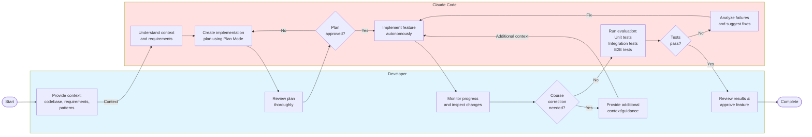
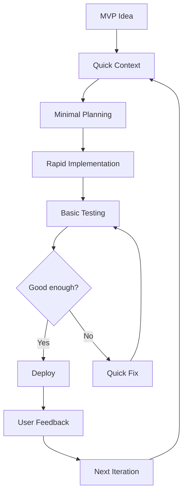
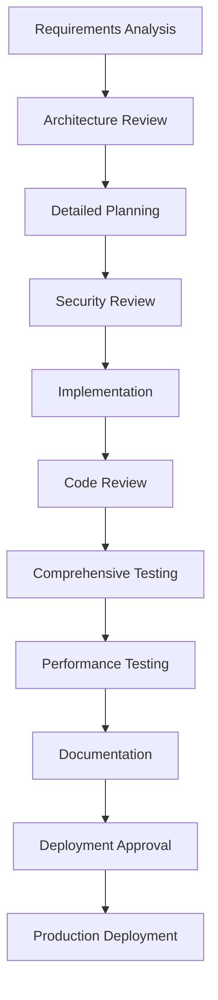
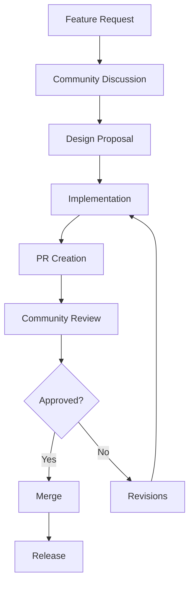
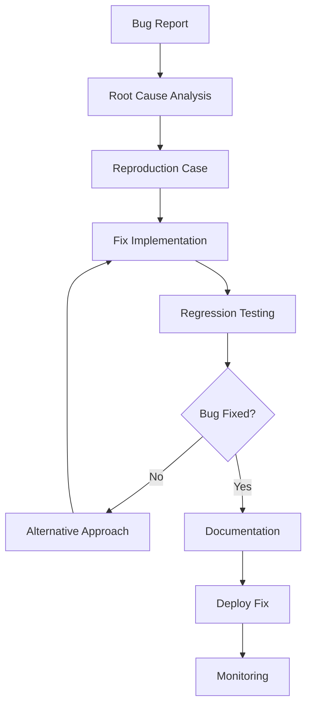

# Глава 5. Жизненный цикл запроса (Request Lifecycle)

## 5.1. Инициация: Как правильно запустить фичу с нуля (Intent-драйвенный подход)

### Введение раздела

В традиционном программировании инициация новой фичи или проекта часто начинается с технических требований: выбора фреймворка, архитектуры, написания спецификаций и планирования задач. Однако в парадигме **Vibe-Coding** фокус смещается с *как* на *зачем* — ключевую роль играет **интенция** (intent), то есть осознанное понимание цели, которую должна решать фича.

Этот раздел посвящён тому, как правильно **инициировать разработку новой функциональности** в рамках Vibe-Coding. Мы разберём:
- Почему классический подход "сначала код, потом бизнес-ценность" уступает места intent-драйвенной инициации;
- Как формулировать запросы к Coder-LLM, чтобы они максимально точно отражали суть задачи;
- Какие практические инструменты и техники помогают перейти от абстрактной идеи к работающему решению.

Если в предыдущих главах мы обсуждали *технические аспекты* взаимодействия с Coder-LLM (промптинг, валидация, оптимизация), то здесь речь пойдёт о **стратегическом уровне** — как начинать работу так, чтобы результат соответствовал ожиданиям с первого раза, а не требовал множества итераций.

**Цели раздела:**
1. Освоить **intent-драйвенный подход** к инициации разработки.
2. Научиться формулировать запросы к Coder-LLM, которые фокусируются на **семантике, а не синтаксисе**.
3. Понять, как избежать типичных ошибок на старте проекта, когда нечёткие требования приводят к неэффективным решениям.

---

## **Основная теория**

### **1. Что такое Intent-драйвенная инициация?**

**Intent-драйвенный подход** (intent-driven development) — это методология, в которой **первоочередное внимание уделяется не технической реализации, а бизнес-цели и контексту задачи**. В отличие от классического подхода, где разработчик начинает с написания кода или архитектурных схем, здесь процесс строится вокруг вопросов:
- *Что именно должна делать фича?*
- *Какую проблему она решает?*
- *Как пользователи будут с ней взаимодействовать?*
- *Какие метрики успеха?*

#### **Исторический контекст: от Waterfall к Intent-Driven**
В традиционных моделях разработки (Waterfall, даже Agile в некоторых интерпретациях) инициация часто сводится к:
1. Сбору требований (документация, спецификации).
2. Проектированию системы (диаграммы, UML).
3. Написанию кода.

Проблема такого подхода в том, что **требования часто формулируются в терминах "как", а не "зачем"**. Например:
❌ *"Нужно добавить кнопку 'Экспорт в PDF' в отчёт."*
✅ *"Пользователям нужно делиться отчётами с коллегами, у которых нет доступа к системе. Как это можно сделать?"*

Во втором случае **интенция** ясна — обеспечить возможность обмена данными. Техническое решение (PDF, CSV, ссылка на веб-версию) может быть выбрано позже, исходя из контекста.

#### **Сравнение традиционного и intent-драйвенного подходов**

| **Аспект**               | **Традиционный подход**                          | **Intent-Driven (Vibe-Coding)**                  |
|--------------------------|------------------------------------------------|------------------------------------------------|
| **Фокус**                | Техническая реализация ("как сделать?")       | Бизнес-ценность ("зачем это нужно?")          |
| **Формулировка задачи**  | Чёткие инструкции ("добавь API endpoint")     | Открытые вопросы ("как улучшить опыт пользователя?") |
| **Роль разработчика**    | Исполнитель требований                        | Партнёр в поиске решения                      |
| **Взаимодействие с LLM** | Запрос на генерацию кода по ТЗ                 | Диалог о целях и альтернативах                |
| **Результат**            | Код, который работает, но может не решать проблему | Решение, которое закрывает потребность          |

🔹 **Ключевая идея:** В Vibe-Coding **запрос к Coder-LLM — это не приказ, а диалог**. Чем лучше сформулирована интенция, тем точнее будет ответ.

---

### **2. Как формулировать интенцию для Coder-LLM?**

Формулировка интенции — это искусство. Она должна быть:
✔ **Конкретной** (избегать абстракций вроде "сделай красиво").
✔ **Контекстной** (учитывать бизнес-цели, ограничения, целевую аудиторию).
✔ **Открытой для альтернатив** (не навязывать решение, а описывать проблему).

#### **Методика формулировки интенции: FRAME**
Для структурированного подхода используем фреймворк **FRAME**:

| **Элемент**  | **Вопрос**                                      | **Пример**                                      |
|--------------|------------------------------------------------|------------------------------------------------|
| **Focus**    | *Какую проблему решаем?*                      | "Пользователи тратят много времени на ручной ввод данных." |
| **Reason**   | *Почему это важно?*                           | "Это снижает продуктивность и увеличивает ошибки." |
| **Actors**   | *Кто вовлечён?*                               | "Менеджеры проектов и бухгалтерия."           |
| **Metrics**  | *Как измерим успех?*                          | "Сокращение времени на ввод данных на 30%."   |
| **Examples** | *Как это выглядит сейчас и как должно быть?*  | "Сейчас: ручной ввод в Excel. Хотим: автоматическая синхронизация с CRM." |

**Пример неудачной и улучшенной формулировки:**

❌ *Плохо:*
> "Напиши функцию, которая парсит CSV и сохраняет в базу данных."

✅ *Хорошо (с FRAME):*
> **Focus:** Пользователи тратят 2 часа в день на ручной перенос данных из отчётов в систему.
> **Reason:** Это отнимает время от аналитики и увеличивает риск ошибок.
> **Actors:** Аналитики и менеджеры проектов.
> **Metrics:** Сократить время на ввод данных до 15 минут в день.
> **Examples:**
> - Сейчас: копирование значений из Excel в форму вручную.
> - Хотим: загрузка файла → автоматическое заполнение БД.
>
> **Вопрос к LLM:** *"Как реализовать систему, которая позволит аналитикам быстро загружать данные из CSV в нашу CRM, избегая ручного ввода? Рассмотри варианты: парсинг файла, API, валидация данных."*

🔹 **Почему это работает?**
- LLM получает **контекст**, а не просто техническое задание.
- Даёт возможность предложить **альтернативные решения** (например, вместо CSV использовать Google Sheets API).
- Фокусируется на **пользовательской ценности**, а не на коде.

---

### **3. От интенции к запросу: шаги инициации**

Процесс инициации в Vibe-Coding можно разбить на **5 шагов**:

1. **Сбор контекста**
   - Какую проблему решаем? Кто конечный пользователь?
   - Какие ограничения (технические, бизнес, юридические)?
   - Пример: *"Нужно сократить время согласования договоров. Сейчас это занимает 3 дня из-за ручных проверок."*

2. **Формулировка интенции (FRAME)**
   - Описываем задачу в терминах бизнес-ценности.
   - Пример: *"Как автоматизировать проверку типовых договоров, чтобы юристы тратили меньше времени на рутину?"*

3. **Генерация запроса к LLM**
   - Не просим "написать код", а описываем проблему.
   - Пример:
     ```
     Наша компания обрабатывает ~50 договоров в месяц. Сейчас юристы вручную проверяют каждый на соответствие шаблону (редакция 2023 года). Это занимает 2-3 часа на договор.

     Задача: создать систему, которая:
     1. Автоматически сравнивает договор с шаблоном.
     2. Выделяет различия (цветом или списком).
     3. Предлагает варианты правок для приведения к шаблону.
     4. Сохраняет историю изменений.

     Какие инструменты можно использовать? Как организовать процесс?
     ```

4. **Анализ альтернатив (от LLM)**
   - LLM может предложить:
     - Регулярные выражения для поиска ключевых фраз.
     - NLP-модели для сравнения текстов.
     - Интеграцию с Google Docs API для правок.
   - На этом этапе **важно обсудить trade-offs** (скорость vs. точность, простота vs. гибкость).

5. **Выбор решения и декомпозиция**
   - После обсуждения выбираем оптимальный вариант.
   - Декомпозируем задачу на подзадачи (например: "Сначала реализовать парсинг PDF, потом сравнение с шаблоном").

🔹 **Внимание!** На этапе инициации **не пишем код** — сначала убеждаемся, что выбрали правильное направление.

---

## **Практические примеры**

### **Пример 1: Формулировка интенции для системы рекомендаций**

**Задача:**
Компания хочет добавить на сайт блок "Похожие товары", но не знает, как это реализовать.

❌ *Плохой запрос:*
> "Напиши код для системы рекомендаций на Python с использованием коллаборативной фильтрации."

✅ *Хороший запрос (с FRAME):*
> **Focus:** Пользователи добавляют товар в корзину, но редко покупают сопутствующие товары.
> **Reason:** Это снижает средний чек и конверсию.
> **Actors:** Посетители интернет-магазина (B2C).
> **Metrics:** Увеличить средний чек на 10% за 3 месяца.
> **Examples:**
> - Сейчас: пользователь смотрит карточку товара → корзина.
> - Хотим: пользователь видит блок "С этим товаром покупают" → увеличение заказов.
>
> **Вопрос к LLM:**
> *"Как реализовать систему рекомендаций для интернет-магазина с ассортиментом ~1000 товаров? У нас есть данные о покупках пользователей за последние 2 года.
> Рассмотри варианты:
> - Коллаборативная фильтрация (user-based/item-based).
> - Контентные рекомендации (по тегам/категориям).
> - Гибридные подходы.
> Какие библиотеки и инструменты можно использовать (Python, ML)? Какие метрики отслеживать?"*

**Результат:**
LLM может предложить:
1. Начать с простого алгоритма (например, по истории покупок "кто купил X, тот купил Y").
2. Использовать библиотеку `Surprise` или `LightFM`.
3. Постепенно усложнять модель с добавлением контентных признаков.

---

### **Пример 2: Инициация микросервиса для обработки платежей**

**Задача:**
Нужно разработать сервис для обработки платежей, но есть неопределённость в выборе архитектуры.

❌ *Плохой запрос:*
> "Сделай микросервис на Go с gRPC, который принимает платежи и отправляет в Kafka."

✅ *Хороший запрос (с контекстом):*
> **Focus:** В компании растёт количество платежей (~10K/день), и текущий монолит не справляется.
> **Reason:** Задержки в обработке приводят к потере клиентов (особенно в пиковые часы).
> **Actors:** Финансовый отдел, клиенты (B2B и B2C).
> **Metrics:** Сократить время обработки платежа с 5 секунд до 500 мс.
> **Constraints:**
> - Должна быть поддержка idempotency (повторные запросы не должны списывать деньги дважды).
> - Интеграция с платёжными системами Stripe и PayPal.
>
> **Вопрос к LLM:**
> *"Как спроектировать микросервис для обработки платежей, который:
> - Выдерживает нагрузку до 1000 RPS.
> - Обеспечивает идемпотентность.
> - Легко масштабируется.
> Рассмотри варианты:
> - Синхронная обработка (REST/gRPC) vs асинхронная (Kafka, RabbitMQ).
> - Хранение состояния (PostgreSQL vs Redis).
> - Языки программирования (Go, Java, Python).
> Какие best practices использовать для обработки платежей?"*

**Результат:**
LLM может предложить:
1. **Архитектуру:** Асинхронная обработка с Kafka для очередей и Redis для хранения состояния.
2. **Язык:** Go для высокой производительности.
3. **База данных:** PostgreSQL для транзакций + Redis для кэша.
4. **Идемпотентность:** Использование ключей идемпотентности в запросах.

---

### **Пример 3: Рефакторинг legacy-кода**

**Задача:**
Есть старый модуль на Python, который парсит лог-файлы, но код нечитаемый и медленный.

❌ *Плохой запрос:*
> "Перепиши этот код так, чтобы он работал быстрее."

✅ *Хороший запрос (с контекстом):*
> **Focus:** Модуль парсинга логов стал узким местом — обрабатывает 1 файл за 10 секунд, а их тысячи в день.
> **Reason:** Это замедляет аналитику и отчётность.
> **Actors:** Дата-аналитики и DevOps.
> **Metrics:** Сократить время обработки 1 файла до 500 мс.
> **Examples:**
> - Сейчас: используются регулярные выражения и циклы `for`.
> - Хотим: быстрый парсинг + возможность добавлять новые форматы логов без переписывания кода.
>
> **Вопрос к LLM:**
> *"Как оптимизировать модуль для парсинга логов? Сейчас он написан на Python и использует regex + циклы, что медленно.
> Требования:
> - Поддержка нескольких форматов логов (Nginx, Apache, custom).
> - Возможность легко добавлять новые форматы.
> - Обработка 1 файла за <500 мс.
> Рассмотри варианты:
> - Использование библиотек (например, `pandas`, `loguru`).
> - Переписывание на более быстром языке (Rust, Go) с Python-биндингами.
> - Параллельная обработка файлов."*

**Результат:**
LLM может предложить:
1. Использовать **`pandas`** для быстрого парсинга структурированных логов.
2. Реализовать **фабрику парсеров**, чтобы легко добавлять новые форматы.
3. Для максимальной производительности — переписать критические участки на **Rust** с помощью `PyO3`.

---

### **Пример 4: Разработка API для мобильного приложения**

**Задача:**
Нужно разработать API для мобильного приложения, но нет чётких требований.

❌ *Плохой запрос:*
> "Сделай REST API для приложения на Node.js с JWT-аутентификацией."

✅ *Хороший запрос (с контекстом):*
> **Focus:** Мобильное приложение должно получать данные о пользователях и заказах в реальном времени.
> **Reason:** Текущий API медленный и не поддерживает веб-сокеты.
> **Actors:** Мобильные пользователи (iOS/Android).
> **Metrics:**
> - Время ответа API <200 мс.
> - Поддержка push-уведомлений.
>
> **Вопрос к LLM:**
> *"Как спроектировать API для мобильного приложения, которое:
> - Отдаёт данные о пользователе и заказах.
> - Поддерживает push-уведомления.
> - Обеспечивает высокую доступность.
> Рассмотри варианты:
> - REST vs GraphQL vs gRPC.
> - Аутентификация (JWT, OAuth 2.0, session tokens).
> - Инфраструктура (Kubernetes, serverless).
> Какие best practices для быстрых API (кэширование, pagination)?"*

**Результат:**
LLM может предложить:
1. **GraphQL** для гибких запросов (мобильные клиенты сами выбирают поля).
2. **WebSockets** для push-уведомлений.
3. **Redis** для кэширования частых запросов.
4. **JWT** для аутентификации с коротким сроком жизни токенов.

---

### **Пример 5: Автоматизация тестирования**

**Задача:**
Команда тратит много времени на ручное тестирование новых фич.

❌ *Плохой запрос:*
> "Напиши автотесты на pytest для нашего проекта."

✅ *Хороший запрос (с контекстом):*
> **Focus:** Каждое изменение в коде требует ручного регрессионного тестирования, что занимает 2 дня на релиз.
> **Reason:** Это замедляет поставку фич и увеличивает риск багов.
> **Actors:** QA-инженеры и разработчики.
> **Metrics:** Сократить время тестирования релиза до 1 часа.
>
> **Вопрос к LLM:**
> *"Как автоматизировать тестирование нашего проекта? Сейчас тесты пишутся вручную на pytest.
> Требования:
> - Покрытие основных сценариев (happy path + edge cases).
> - Возможность запуска в CI/CD (GitHub Actions).
> - Генерация отчётов о покрытии.
> Рассмотри варианты:
> - Юнит-тесты (pytest) + интеграционные тесты.
> - E2E-тесты (Selenium, Playwright).
> - Property-based testing (Hypothesis).
> - Инструменты для генерации тест-кейсов (например, на основе Swagger)."*

**Результат:**
LLM может предложить:
1. **Стратегию тестирования:**
   - Юнит-тесты для бизнес-логики (`pytest`).
   - Интеграционные тесты для API (`requests` + `pytest`).
   - E2E-тесты для UI (`Playwright`).
2. **Генерацию тестов** на основе OpenAPI-спецификации.
3. **CI/CD-пайплайн** с запуском тестов на каждый коммит.

---

## **Распространённые ошибки**

При переходе на intent-драйвенный подход разработчики часто допускают типичные ошибки. Рассмотрим их и способы избежать.

### **1. Излишняя детализация технического решения в запросе**
**Ошибка:**
Формулировка запроса уже содержит готовое техническое решение, которое может быть неоптимальным.

❌ *Пример:*
> "Напиши микросервис на Go с gRPC, который принимает JSON и сохраняет в PostgreSQL."

**Проблема:**
- Разработчик навязывает решение (`gRPC`, `PostgreSQL`), не учитывая альтернативы.
- LLM лишается возможности предложить более подходящие инструменты.

✅ *Как исправить:*
Формулировать задачу в терминах **проблемы**, а не решения:
> "Нужно разработать сервис для обработки заказов в реальном времени. Требования:
> - Низкая задержка (<100 мс).
> - Высокая доступность (99.9%).
> - Интеграция с платёжными системами.
> Какие технологии лучше использовать?"

---

### **2. Отсутствие контекста**
**Ошибка:**
Запрос слишком абстрактный и не содержит бизнес-контекста.

❌ *Пример:*
> "Сделай систему рекомендаций."

**Проблема:**
- LLM не понимает, для чего это нужно (e-commerce, стриминг, соцсеть?).
- Может предложить решение, не подходящее для конкретной сферы.

✅ *Как исправить:*
Добавлять **контекстные данные** (отрасль, нагрузка, пользователи):
> "Нужна система рекомендаций для интернет-магазина электроники (~10K товаров).
> Данные:
> - История покупок пользователей (2 года).
> - Отзывы на товары (рейтинг 1-5).
> Требования:
> - Персонализированные рекомендации на главной странице.
> - Рекомендации в корзине ('С этим товаром покупают').
> Какие алгоритмы и инструменты использовать?"

---

### **3. Игнорирование метрик успеха**
**Ошибка:**
В запросе нет критериев, по которым можно оценить успешность решения.

❌ *Пример:*
> "Сделай быстрый парсер логов."

**Проблема:**
- Нет понимания, что считать "быстрым" (1 секунда? 100 мс?).
- Нет данных о нагрузке (сколько логов в день?).

✅ *Как исправить:*
Указывать **метрики успеха**:
> "Нужно оптимизировать парсер логов. Сейчас он обрабатывает 1 файл (~10K строк) за 10 секунд. Цель: сократить время до 500 мс.
> Объём данных: ~1000 файлов в день.
> Форматы логов: Nginx, custom (приложение).
> Какие оптимизации можно применить?"

---

### **4. Неучёт ограничений**
**Ошибка:**
Запрос не содержит информацию о технических или бизнес-ограничениях.

❌ *Пример:*
> "Сделай API для мобильного приложения."

**Проблема:**
- Нет данных о нагрузке (100 RPS или 10K RPS?).
- Нет информации о безопасности (нужна ли аутентификация?).

✅ *Как исправить:*
Указывать **ограничения** (технические, бюджетные, юридические):
> "Нужно разработать API для мобильного приложения. Требования:
> - Нагрузка: до 10K RPS.
> - Безопасность: аутентификация пользователей (JWT).
> - Ограничения: бюджет на инфраструктуру $500/месяц.
> - Данные: пользовательские профили и заказы.
> Какие технологии и архитектуру выбрать?"

---

### **5. Запрос на конкретный код без обсуждения подходов**
**Ошибка:**
Сразу просить написать код, не обсудив архитектуру.

❌ *Пример:*
> "Напиши класс для парсинга CSV на Python."

**Проблема:**
- Не учитываются альтернативы (например, использование `pandas` вместо кастомного парсера).
- Нет обсуждения обработки ошибок, валидации данных.

✅ *Как исправить:*
Сначала запросить **стратегию решения**, а потом код:
> "Нужно разработать систему для импорта данных из CSV-файлов в базу данных.
> Требования:
> - Поддержка разных форматов (разделители, кодировки).
> - Валидация данных (проверка типов, обязательные поля).
> - Обработка ошибок (логирование, уведомления).
> Какие подходы можно использовать? Стоит ли писать кастомный парсер или взять библиотеку?
> После выбора подхода попрошу сгенерировать код."

---

## **Практические задания**

Для закрепления материала выполните следующие задания.

### **Задание 1: Формулировка интенции для новой фичи**
**Описание:**
Вы работаете над SaaS-приложением для управления проектами.

---

## 5.2. Облака: Итеративное уточнение грубого кода

### Введение раздела

Представьте, что вы заказываете скульптуру у мастера. Вы не начинаете с детального описания каждой мышцы и складки ткани - вы формулируете общее видение: "Мне нужна статуя, передающая грацию танцовщицы в движении". Мастер создает первый эскиз - грубую глиняную модель, а затем вы вместе уточняете детали: "Вот здесь нужно больше динамики", "Пропорции рук кажутся неестественными", "Давайте добавим больше экспрессии в позе".

Итеративное уточнение в Vibe-Coding работает по тому же принципу. В предыдущем разделе мы рассмотрели формирование первичного запроса - создание "эскиза" кода. Теперь мы переходим к самой ответственной фазе жизненного цикла запроса: превращению грубого, несовершенного решения в работающий, эффективный код через последовательную обратную связь.

Центральная идея этого раздела - научиться видеть за синтаксическими ошибками и неоптимальными конструкциями *семантическое ядро* проблемы. Мы изучим, как формулировать обратную связь, фокусируясь на логике, а не на формальных деталях, и как использовать "облака" неопределенности в коде для направления модели к более качественному решению.

Ключевые задачи раздела:
1. Освоить методику выявления и формулирования семантических недостатков в коде
2. Научиться строить диалог с Coder-LLM как процесс совместного творчества
3. Развить навык распознавания "сигналов качества" в генерируемом коде
4. Освоить техники постепенного сужения областей неопределенности

Понимание этих концепций станет мостом между первым черновиком и финальным решением, позволяя вам эффективно использовать потенциал Coder-LLM без потери контроля над процессом разработки.

---

## Основная теория

### Эволюция подходов к кодогенерации

Исторически сложилось так, что первые системы кодогенерации работали по принципу "черного ящика": разработчик формулировал задачу, система генерировала код, и на этом взаимодействие заканчивалось. Такой подход имел очевидные ограничения:

1. **Односторонняя передача информации**: Модель не получала обратной связи о качестве решения
2. **Негибкость**: Невозможно было скорректировать направление генерации без полного перезапуска процесса
3. **Отсутствие контекста**: Каждый запрос обрабатывался изолированно, без учета предыдущих итераций

Сравнение традиционной и современной парадигм кодогенерации:

| Аспект                | Традиционная кодогенерация | Vibe-Coding подход |
|-----------------------|----------------------------|--------------------|
| Взаимодействие        | Однократное                | Итеративное        |
| Фокус обратной связи  | Синтаксис                  | Семантика          |
| Контекст              | Локальный                  | Глобальный         |
| Гибкость              | Низкая                     | Высокая            |
| Творческое участие    | Минимальное                | Активное           |

Vibe-Coding трансформирует процесс кодогенерации в диалог, где каждая итерация приближает решение к идеальному состоянию. Ключевая метафора здесь - *облако возможностей*: на начальном этапе существует широкий спектр потенциальных решений, и задача разработчика - последовательно сужать это облако, направляя модель к оптимальному варианту.

### Семантические слои кода

Чтобы эффективно работать с обратной связью, необходимо понимать иерархию абстракций в программировании:

1. **Синтаксический слой** (поверхностный):
   - Форматирование
   - Именование переменных
   - Отступы
   - Стандарты кодирования

2. **Логический слой** (структурный):
   - Алгоритмическая реализация
   - Поток управления
   - Обработка данных
   - Структура классов и функций

3. **Семантический слой** (глубинный):
   - Соответствие бизнес-требованиям
   - Архитектурные решения
   - Проектные ограничения
   - Нефункциональные требования

В традиционном программировании внимание фокусировалось на первых двух слоях. Vibe-Coding переносит акцент на семантический слой, позволяя разработчику влиять на генерацию на уровне интенции и смысла.

**Пример иерархии слоев:**

```python
# Синтаксический слой (формальные ошибки)
def calculate_discount(price, discount):
    return price * (1 - discount/100  # Отсутствует закрывающая скобка

# Логический слой (структурные проблемы)
def apply_discount(items, discount_rate):
    for item in items:
        item.price *= (1 - discount_rate/100)
    return items  # Мутация входных данных, отсутствие обработки edge cases

# Семантический слой (проблемы смысла)
def calculate_total(orders):
    # Не учитывает налоги, скидки, возможности возврата
    return sum(order.amount for order in orders)
```

### Принципы итеративного уточнения

1. **Принцип минимального вмешательства**:
   Начинайте с наименее деструктивных изменений. Часто небольшое уточнение семантики может привести к значительному улучшению кода без необходимости переписывать его полностью.

2. **Принцип контекстного наследования**:
   Каждая последующая итерация должна сохранять контекст предыдущих уточнений. Это позволяет модели "помнить" принятые решения и строить на их основе.

3. **Принцип прогрессивной детализации**:
   Двигайтесь от общего к частному. Сначала определите архитектурные решения, затем логику, и только потом синтаксические детали.

4. **Принцип семантической плотности**:
   Обратная связь должна содержать максимальное количество смысловой информации при минимальном объеме текста. Избегайте размытых формулировок вроде "сделай это лучше" - конкретизируйте, что именно требует улучшения.

### Модель облаков неопределенности

Концепция "облаков" в Vibe-Coding описывает области потенциальных решений, которые можно последовательно сужать:

1. **Макро-облако** (начальное состояние):
   - Охватывает все возможные архитектурные решения задачи
   - Пример: "Система обработки заказов" может быть реализована как монолит, микросервисы, бессерверная архитектура и т.д.

2. **Меза-облако** (промежуточное состояние):
   - Определяет конкретную архитектуру, но оставляет свободу в реализации логики
   - Пример: "Микросервисная архитектура с REST API"

3. **Микро-облако** (конечное состояние):
   - Остаются только вопросы реализации конкретных функций и деталей
   - Пример: "Как обработать параллельные запросы на обновление инвентаря"

**Визуализация процесса сужения облаков:**

```
Начальное состояние: [----------------------------------------]
Макро-облако:        [=====----------------------------------]
Меза-облако:         [==========---------------==============]
Микро-облако:        [=====================-----=============]
Финальное решение:   [========================================]
```

### Техники формулирования обратной связи

1. **Техника "Трех вопросов"**:
   Для каждого генерируемого фрагмента задавайте три вопроса:
   - *Что реализовано правильно?* (фиксируем положительные аспекты)
   - *Что отсутствует?* (выявляем пробелы)
   - *Что можно улучшить?* (определяем направления оптимизации)

2. **Метод противопоставления**:
   Формулируйте пожелания через антонимы текущих недостатков:
   - Вместо: "Этот код медленный"
   - Лучше: "Требуется реализация с временной сложностью O(log n) вместо O(n)"

3. **Техника рефрейминга**:
   Переформулируйте проблему с разных точек зрения:
   - Техническая: "Необходима оптимизация запросов к базе данных"
   - Бизнес: "Снижение времени отклика системы при обработке кассовых операций"

4. **Метод шаблонов**:
   Используйте структурированные шаблоны обратной связи:
   ```
   Обнаружено: [описание проблемы]
   Ожидается: [требуемое поведение]
   Контекст: [дополнительная информация]
   Пример: [иллюстрация правильного решения]
   ```

### Сравнение с традиционным ревью кода

В классическом процессе code review акцент делается на:
- Соответствии стандартам кодирования
- Выявлении синтаксических ошибок
- Проверке покрытия тестами
- Обнаружении потенциальных багов

В Vibe-Coding фокус смещается:

| Традиционное ревью       | Vibe-Coding подход          |
|--------------------------|-----------------------------|
| Проверка соответствия    | Формирование видения        |
| Выявление ошибок         | Направление эволюции кода   |
| Оценка текущего состояния| Проектирование будущего     |
| Критика реализации       | Сотрудничество в создании   |

---

## Практические примеры

### Пример 1: Уточнение алгоритма поиска

**Исходный запрос:**
"Напиши функцию поиска в отсортированном массиве"

**Первая генерация (наивный подход):**
```python
def search(arr, target):
    for i in range(len(arr)):
        if arr[i] == target:
            return i
    return -1
```
*Проблема*: Линейный поиск O(n) вместо O(log n) для отсортированного массива.

**Первая итерация обратной связи:**
"Функция реализует линейный поиск, но массив отсортирован. Требуется реализация с логарифмической сложностью, как в бинарном поиске. Учти edge cases: пустой массив, дубликаты, отсутствие элемента."

**Вторая генерация (улучшенная версия):**
```python
def binary_search(arr, target):
    left, right = 0, len(arr) - 1

    while left <= right:
        mid = (left + right) // 2
        if arr[mid] == target:
            return mid
        elif arr[mid] < target:
            left = mid + 1
        else:
            right = mid - 1

    return -1
```

**Анализ улучшений:**
1. Алгоритм заменен на бинарный поиск
2. Добавлены комментарии о граничных условиях
3. Сохранена простая сигнатура функции

**Сравнительная таблица:**

| Критерий               | Первая версия | Вторая версия |
|------------------------|---------------|---------------|
| Временная сложность    | O(n)          | O(log n)      |
| Обработка edge cases   | Нет           | Да            |
| Читаемость             | Высокая       | Высокая       |
| Соответствие задаче    | Низкое        | Высокое       |

**Дальнейшее уточнение:**
"Реализация работает для уникальных элементов. Требуется модификация для возврата *первого* вхождения при наличии дубликатов. Также добавь аннотации типов для лучшей документации."

**Финальная версия:**
```python
from typing import List, Optional

def binary_search_first_occurrence(arr: List[int], target: int) -> Optional[int]:
    """
    Returns the index of the first occurrence of target in sorted array arr.
    Returns None if target is not found.
    """
    left, right = 0, len(arr) - 1
    result = None

    while left <= right:
        mid = (left + right) // 2
        if arr[mid] == target:
            result = mid
            right = mid - 1  # Продолжаем поиск слева
        elif arr[mid] < target:
            left = mid + 1
        else:
            right = mid - 1

    return result
```

### Пример 2: Рефакторинг архитектуры сервиса

**Исходный запрос:**
"Создай сервис для управления задачами с REST API"

**Первая генерация (монолитный подход):**
```python
# tasks_service.py
tasks = []

@app.route('/tasks', methods=['GET'])
def get_tasks():
    return jsonify(tasks)

@app.route('/tasks', methods=['POST'])
def create_task():
    task = request.json
    tasks.append(task)
    return jsonify(task), 201

# ... и так далее для всех методов
```
*Проблема*: Монолитная архитектура с состоянием в памяти, отсутствует разделение на слои.

**Первая итерация обратной связи:**
"Текущая реализация имеет несколько архитектурных проблем:
1. Состояние хранится в памяти - неработоспособно при рестарте
2. Нет разделения на слои (сервис, бизнес-логика, хранение)
3. Отсутствует обработка ошибок и валидация
4. Нет поддержки пагинации

Требуется архитектура с:
- Отдельным слоем хранения (можно использовать SQLite для простоты)
- Сервисным слоем с бизнес-логикой
- Контроллерами с обработкой ошибок
- Pydantic моделями для валидации"

**Вторая генерация (улучшенная архитектура):**
```python
# schemas.py
from pydantic import BaseModel
from typing import Optional

class Task(BaseModel):
    id: Optional[int] = None
    title: str
    description: Optional[str] = None
    completed: bool = False

# storage.py
import sqlite3
from typing import List

class TaskStorage:
    def __init__(self, db_path: str = "tasks.db"):
        self.db_path = db_path
        self._init_db()

    def _init_db(self):
        with sqlite3.connect(self.db_path) as conn:
            conn.execute("""
                CREATE TABLE IF NOT EXISTS tasks (
                    id INTEGER PRIMARY KEY AUTOINCREMENT,
                    title TEXT NOT NULL,
                    description TEXT,
                    completed BOOLEAN DEFAULT FALSE
                )
            """)

    def create(self, task: Task) -> Task:
        with sqlite3.connect(self.db_path) as conn:
            cursor = conn.execute(
                "INSERT INTO tasks (title, description, completed) VALUES (?, ?, ?)",
                (task.title, task.description, task.completed)
            )
            task.id = cursor.lastrowid
        return task

    # ... другие методы CRUD

# services.py
class TaskService:
    def __init__(self, storage: TaskStorage):
        self.storage = storage

    def create_task(self, task_data: dict) -> Task:
        task = Task(**task_data)
        return self.storage.create(task)

    def get_tasks(self, limit: int = 10, offset: int = 0) -> List[Task]:
        return self.storage.get_all(limit, offset)

# controllers.py
from fastapi import FastAPI, HTTPException
from typing import List

app = FastAPI()
storage = TaskStorage()
service = TaskService(storage)

@app.post("/tasks/", response_model=Task)
def create_task(task: Task):
    try:
        return service.create_task(task.dict())
    except Exception as e:
        raise HTTPException(status_code=400, detail=str(e))

@app.get("/tasks/", response_model=List[Task])
def get_tasks(limit: int = 10, offset: int = 0):
    return service.get_tasks(limit, offset)
```

**Анализ архитектурных улучшений:**
1. Разделение на слои: хранение, бизнес-логика, API
2. Добавлена валидация через Pydantic
3. Реализовано постоянное хранение
4. Добавлена поддержка пагинации
5. Обработка ошибок через HTTPException

**Сравнительная таблица архитектур:**

| Критерий               | Монолитная версия | Многослойная версия |
|------------------------|-------------------|---------------------|
| Разделение ответственности | Нет           | Да                  |
| Постоянное хранение    | Нет               | Да (SQLite)         |
| Валидация данных       | Нет               | Да (Pydantic)       |
| Обработка ошибок       | Базовая           | Расширенная         |
| Масштабируемость       | Низкая            | Высокая             |
| Тестируемость          | Низкая            | Высокая             |

**Дальнейшее уточнение:**
"Добавь:
1. Кэширование часто запрашиваемых задач
2. Логирование операций
3. Документацию API через Swagger
4. Тесты для сервисного слоя"

### Пример 3: Оптимизация производительности

**Исходный запрос:**
"Напиши функцию для обработки больших CSV файлов с данными о продажах"

**Первая генерация (наивный подход):**
```python
import csv

def process_sales_data(file_path):
    sales = []
    with open(file_path, 'r') as file:
        reader = csv.DictReader(file)
        for row in reader:
            # Обработка каждой строки
            processed = {
                'date': row['date'],
                'amount': float(row['amount']),
                'product': row['product']
            }
            sales.append(processed)
    return sales
```
*Проблема*: Загрузка всего файла в память, медленная обработка.

**Первая итерация обратной связи:**
"Функция загружает весь CSV в память, что неэффективно для больших файлов. Требуется:
1. Построчная обработка без загрузки всех данных
2. Использование генераторов для экономии памяти
3. Оптимизация обработки числовых данных
4. Добавление обработки ошибок формата
5. Поддержка чтения сжатых файлов"

**Вторая генерация (оптимизированная версия):**
```python
import csv
import gzip
from typing import Iterator, Dict, Optional
import logging

logging.basicConfig(level=logging.INFO)
logger = logging.getLogger(__name__)

def process_sales_data(file_path: str) -> Iterator[Dict[str, Optional[float]]]:
    """
    Generator function to process large sales CSV files line by line.
    Handles both regular and gzipped files.
    Yields dictionaries with processed data.
    """
    opener = gzip.open if file_path.endswith('.gz') else open

    try:
        with opener(file_path, 'rt', encoding='utf-8') as file:
            reader = csv.DictReader(file)

            for row in reader:
                try:
                    processed = {
                        'date': row['date'],
                        'amount': _safe_convert_to_float(row['amount']),
                        'product': row['product'],
                        'errors': []
                    }

                    # Дополнительная бизнес-логика валидации
                    if processed['amount'] is None:
                        processed['errors'].append('Invalid amount format')
                    elif processed['amount'] < 0:
                        processed['errors'].append('Negative amount')

                    yield processed

                except Exception as e:
                    logger.error(f"Error processing row {row}: {str(e)}")
                    continue

    except FileNotFoundError:
        logger.error(f"File not found: {file_path}")
        raise
    except Exception as e:
        logger.error(f"Unexpected error: {str(e)}")
        raise

def _safe_convert_to_float(value: str) -> Optional[float]:
    """Safely convert string to float with error handling."""
    try:
        return float(value)
    except (ValueError, TypeError):
        return None
```

**Анализ оптимизаций:**
1. Использование генератора для экономии памяти
2. Поддержка сжатых файлов
3. Обработка ошибок на уровне строк
4. Логирование проблемных случаев
5. Валидация данных с сохранением информации об ошибках

**Сравнительная таблица производительности:**

| Критерий               | Наивная версия | Оптимизированная версия |
|------------------------|----------------|-------------------------|
| Потребление памяти     | O(n)           | O(1)                    |
| Производительность     | Низкая         | Высокая                 |
| Обработка ошибок       | Нет            | Да                      |
| Поддержка сжатия       | Нет            | Да                      |
| Валидация данных       | Минимальная    | Расширенная             |

**Дальнейшее уточнение:**
"Добавь:
1. Параллельную обработку с использованием multiprocessing
2. Возможность обработки потоковых данных из сети
3. Механизм возобновления обработки после сбоев
4. Генерацию отчетов по ошибкам"

### Пример 4: Уточнение бизнес-логики

**Исходный запрос:**
"Реализуй логику расчета бонусов для сотрудников"

**Первая генерация (упрощенный подход):**
```python
def calculate_bonus(salary: float, performance_score: int) -> float:
    if performance_score >= 90:
        return salary * 0.2
    elif performance_score >= 70:
        return salary * 0.1
    else:
        return 0
```
*Проблема*: Упрощенная логика не учитывает бизнес-правила.

**Первая итерация обратной связи:**
"Текущая реализация не учитывает следующие бизнес-правила:
1. Бонусы начисляются только при стаже > 1 года
2. Максимальный бонус не может превышать 30% от оклада
3. Существуют разные шкалы для разных отделов
4. Необходимо учитывать корпоративные праздники
5. Нужна возможность динамического изменения коэффициентов

Требуется реализация с:
- Конфигурируемыми порогами оценок
- Учетом стажа
- Ограничениями на максимальный бонус
- Поддержкой разных шкал для отделов"

**Вторая генерация (расширенная версия):**
```python
from dataclasses import dataclass
from typing import Dict, Optional
from datetime import date

@dataclass
class BonusConfig:
    min_tenure_months: int = 12
    max_bonus_percent: float = 30.0
    department_scales: Dict[str, Dict[int, float]] = None
    holiday_multiplier: float = 1.2

    def __post_init__(self):
        # Значения по умолчанию для шкал
        if self.department_scales is None:
            self.department_scales = {
                'engineering': {
                    90: 0.25,
                    80: 0.15,
                    70: 0.10
                },
                'marketing': {
                    90: 0.20,
                    80: 0.10,
                    70: 0.05
                },
                'default': {
                    90: 0.20,
                    70: 0.10
                }
            }

class BonusCalculator:
    def __init__(self, config: Optional[BonusConfig] = None):
        self.config = config or BonusConfig()

    def calculate_bonus(
        self,
        salary: float,
        performance_score: int,
        department: str,
        hire_date: date,
        is_holiday_season: bool = False
    ) -> float:
        """
        Calculate bonus based on multiple factors.
        Returns 0 if employee doesn't meet minimum requirements.
        """
        # Проверка минимального стажа
        tenure_months = (date.today() - hire_date).days // 30
        if tenure_months < self.config.min_tenure_months:
            return 0.0

        # Определение шкалы для отдела
        department_scales = self.config.department_scales.get(
            department,
            self.config.department_scales['default']
        )

        # Поиск соответствующего коэффициента
        bonus_percent = 0.0
        for score_threshold, percent in sorted(
            department_scales.items(),
            reverse=True
        ):
            if performance_score >= score_threshold:
                bonus_percent = percent
                break

        # Применение ограничений
        bonus_percent = min(bonus_percent, self.config.max_bonus_percent/100)

        # Применение праздничного множителя
        if is_holiday_season:
            bonus_percent *= self.config.holiday_multiplier

        return salary * bonus_percent
```

**Анализ бизнес-логики.**

---

## 5.3. Фидбек-петли: Как эффективно сообщать об ошибках, не ломая поток беседы

### Введение раздела

В традиционном программировании обратная связь между разработчиком и системой реализуется через компиляторы, отладчики и тесты — строгие, формальные и зачастую односторонние механизмы. Однако в парадигме **Vibe-Coding**, где взаимодействие с Coder-LLM строится на основе семантической интенции, а не синтаксической точности, фидбек приобретает принципиально иное значение. Он становится не столько механизмом исправления ошибок, сколько инструментом **динамической калибровки** общего понимания между человеком и моделью.

В предыдущем разделе (5.2) мы рассмотрели процесс валидации и верификации результатов работы Coder-LLM. Сегодня мы делаем следующий логичный шаг: изучаем, как **эффективно формулировать обратную связь** в процессе взаимодействия, не нарушая целостность диалога и не снижая продуктивность потока мышления. Фидбек-петли в Vibe-Coding — это не просто реакция на ошибки, а **стратегический инструмент управления контекстом**, позволяющий удерживать фокус на цели, корректировать траекторию решения и углублять взаимопонимание с моделью.

В этом разделе мы детально разберем:
- Что такое **фидбек-петля** в контексте Vibe-Coding и почему она критически важна;
- Как исторически эволюционировали подходы к обратной связи в программировании;
- Почему традиционные методы дебаггинга неэффективны в диалоге с Coder-LLM;
- Какие стратегии и тактики позволяют давать обратную связь **без прерывания потока**;
- Какие ошибки чаще всего допускают разработчики при формулировке фидбека;
- Как практиковать эффективную обратную связь через реальные примеры и упражнения.

Освоив принципы построения фидбек-петель, вы научитесь не только исправлять ошибки, но и **управлять процессом генерации кода**, улучшая качество и скорость взаимодействия с Coder-LLM.

---

## **Основная теория**

### **1. Что такое фидбек-петля в Vibe-Coding?**

Фидбек-петля (feedback loop) — это замкнутый цикл взаимодействия, в котором информация о результатах предыдущего действия используется для корректировки последующих шагов. В контексте Vibe-Coding этот цикл включает:
- Генерацию кода или решения Coder-LLM;
- Анализ разработчиком полученного результата;
- Формулировку обратной связи;
- Повторную генерацию с учетом коррекций.

Однако ключевое отличие фидбек-петель в Vibe-Coding от традиционного дебаггинга заключается в **непрерывности и диалогичности** процесса. Вместо того чтобы останавливать выполнение, искать ошибку и исправлять её вручную, разработчик **сообщает модели о несоответствии ожиданиям**, а модель в ответ генерирует новое, более точное решение.

> ⚠️ **Важно!** Фидбек в Vibe-Coding — это не критическая оценка, а **семантическая коррекция**. Его цель — не указать на ошибку, а **уточнить интенцию**.

---

### **2. Исторический контекст: от компиляторов к диалогу**

Чтобы понять революционность подхода, рассмотрим эволюцию обратной связи в программировании:

| Этап | Инструмент обратной связи | Характеристики | Ограничения |
|------|----------------------------|----------------|-------------|
| 1950–1960 | Машинный код, перфокарты | Отсутствие обратной связи до запуска | Полная потеря контекста при ошибке |
| 1970–1980 | Компиляторы | Сообщения об ошибках на этапе компиляции | Низкая информативность, отсутствие контекста |
| 1990–2000 | Интегрированные среды (IDE) | Подсветка синтаксиса, автодополнение | Обратная связь ограничена синтаксисом |
| 2000–2010 | Статические анализаторы, тесты | Раннее обнаружение логических ошибок | Требуют ручного вмешательства |
| 2010–2020 | CI/CD, DevOps | Автоматизированная обратная связь в пайплайне | Запаздывание, отсутствие интерактивности |
| 2020–н.в. | Coder-LLM в Vibe-Coding | **Диалоговая обратная связь в реальном времени** | Требует новой коммуникативной компетентности |

Традиционные системы обратной связи работают по принципу **«найди и исправь»**: ошибка возникает → система сообщает → разработчик исправляет. В Vibe-Coding этот подход трансформируется в **«сообщи и уточни»**: модель генерирует → разработчик оценивает → модель корректирует.

Это принципиальный сдвиг от **реактивного** к **интерактивному** взаимодействию.

---

### **3. Почему традиционные методы не работают с Coder-LLM?**

Разработчики, привыкшие к IDE и компиляторам, часто переносят привычные модели обратной связи на взаимодействие с Coder-LLM — и сталкиваются с проблемами:

1. **Формальный тон и императивность**
   ❌ «Это неправильно. Исправь.»
   ✅ «Этот фрагмент не учитывает обработку пустых значений. Можно добавить проверку на `None`?»
   *Проблема*: модель не понимает «неправильно» как концепцию. Ей нужна конкретная семантическая коррекция.

2. **Отсутствие контекста**
   ❌ «Вторая строка неверна.»
   ✅ «В функции `validate_input` на строке 3: проверка `if x > 0` не учитывает отрицательные числа. Нужно расширить условие.»
   *Проблема*: модель не знает, какая строка вторая. Требуется точное указание места и смысла ошибки.

3. **Указание на проблему без решения**
   ❌ «Это не работает.»
   ✅ «Код выбрасывает `KeyError` при отсутствии ключа `user_id`. Можно использовать метод `.get()` с дефолтным значением?»
   *Проблема*: модель не может угадать, что именно не работает. Нужно описать симптом и предложить направление решения.

4. **Избыточная критика и эмоциональность**
   ❌ «Это ужасно! Как ты мог такое написать?»
   ✅ «Этот подход выглядит сложным и менее читаемым. Давай попробуем более лаконичный вариант с использованием list comprehension.»
   *Проблема*: эмоциональная окраска не помогает модели учиться; лучше фокусироваться на конструктивной коррекции стиля.

---

### **4. Семантическая обратная связь: ключевые принципы**

Эффективная фидбек-петля в Vibe-Coding строится на трех ключевых принципах:

| Принцип | Описание | Пример |
|--------|----------|--------|
| **Конкретность** | Указание точного места и характера проблемы | «В функции `fetch_data` на строке 12: используй асинхронный вызов `await client.get()` вместо синхронного» |
| **Конструктивность** | Предложение направления решения или альтернативы | «Вместо вложенных циклов можно использовать `itertools.product` для более читаемого кода» |
| **Контекстуальность** | Сохранение связи с общей целью и интенцией | «Учитывая, что мы пишем API для высоконагруженной системы, важно минимизировать блокирующие вызовы. Давай заменим синхронные операции на асинхронные» |

Эти принципы формируют **семантический фидбек** — обратную связь, которая не столько критикует, сколько **направляет** мысль модели в нужное русло.

---

### **5. Метафора: фидбек как навигация в тумане**

Представьте, что вы ведете корабль в тумане. У вас нет карты, но есть радар (модель), который показывает возможные пути. Ваша задача — не ругать радар за неточности, а **корректировать его показания**, уточняя направление.

- ❌ «Радар неправильный!»
- ✅ «Радар показывает скалы справа. Нам нужно держаться левее, чтобы избежать столкновения.»

Так и в Vibe-Coding: фидбек — это не критика, а **навигационная коррекция**.

---

### **6. Формальные модели фидбек-петель**

Для анализа фидбек-петель используем модель **OODA** (Observe-Orient-Decide-Act), адаптированную к взаимодействию с Coder-LLM:

| Фаза | Действие разработчика | Действие модели | Результат |
|------|------------------------|-----------------|-----------|
| **Observe** | Анализирует сгенерированный код на соответствие ожиданиям | Ждёт оценки | Понимание ситуации |
| **Orient** | Формулирует семантическое несоответствие (что не так и почему) | Интерпретирует фидбек | Выравнивание контекста |
| **Decide** | Предлагает корректирующее действие или вопрос | Генерирует новый вариант | Формирование альтернативы |
| **Act** | Принимает или отклоняет результат | Предоставляет обновлённое решение | Замыкание петли |

Каждая итерация OODA-цикла — это **один шаг фидбек-петли**. Чем короче и точнее цикл, тем эффективнее взаимодействие.

---

## **Практические примеры**

Рассмотрим несколько реальных сценариев взаимодействия с Coder-LLM, в которых корректная обратная связь играет ключевую роль. Для каждого примера покажем **неправильный** и **правильный** подходы, а также результат после фидбек-петли.

---

### **Пример 1: Обработка исключений в функции чтения файла**

**Запрос:**
```text
Напиши функцию на Python, которая читает файл и возвращает его содержимое.
```

**Первая генерация модели:**
```python
def read_file(filename):
    with open(filename) as f:
        return f.read()
```

**Проблема:** Функция не обрабатывает исключения (файл может не существовать, быть недоступным и т.д.).

---

#### **Неправильный фидбек:**
❌ «Это неправильно. Исправь.»
*Результат:* Модель генерирует другой код, возможно, более декоративный, но все так же без обработки ошибок.

---

#### **Правильный фидбек:**
✅ «Функция не обрабатывает исключения. Добавь обработку `FileNotFoundError` и `PermissionError`. Также было бы хорошо вернуть `None` при ошибке и записать сообщение в лог.»
*Результат модели после коррекции:*
```python
import logging

def read_file(filename):
    try:
        with open(filename, 'r') as f:
            return f.read()
    except FileNotFoundError:
        logging.error(f"File {filename} not found")
        return None
    except PermissionError:
        logging.error(f"Permission denied for file {filename}")
        return None
```

> 🔍 **Анализ:**
> - Конкретность: указаны типы исключений.
> - Конструктивность: предложено действие (логирование, возврат `None`).
> - Контекстуальность: учтена общая цель — безопасное чтение файла.

---

### **Пример 2: Оптимизация SQL-запроса**

**Запрос:**
```text
Напиши SQL-запрос, который возвращает список клиентов с суммой их заказов за последний год.
```

**Первая генерация:**
```sql
SELECT c.id, c.name, SUM(o.amount) as total_amount
FROM customers c
JOIN orders o ON c.id = o.customer_id
WHERE o.order_date >= DATE_SUB(CURRENT_DATE(), INTERVAL 1 YEAR)
GROUP BY c.id, c.name;
```

**Проблема:** Запрос неэффективен при большом объёме данных из-за отсутствия индексов, полного сканирования таблиц и возможной блокировки.

---

#### **Неправильный фидбек:**
❌ «Этот запрос тормозит. Оптимизируй.»
*Результат:* Модель может добавить `LIMIT` или изменить сортировку, но не решит проблему изначально.

---

#### **Правильный фидбек:**
✅ «Этот запрос может быть неэффективен на большой базе данных. Оптимизируем его:
1. Убедись, что индексы есть на `customer_id` и `order_date`.
2. Используй `JOIN` только по необходимости — возможно, `EXISTS` будет быстрее для фильтрации.
3. Ограничь количество возвращаемых строк с помощью `LIMIT` и пагинации.
4. Рассмотри возможность денормализации для улучшения производительности.»

*Результат модели:*
```sql
-- С индексами и оптимизированным JOIN
SELECT c.id, c.name, COALESCE(SUM(o.amount), 0) as total_amount
FROM customers c
WHERE EXISTS (
    SELECT 1 FROM orders o
    WHERE o.customer_id = c.id
    AND o.order_date >= DATE_SUB(CURRENT_DATE(), INTERVAL 1 YEAR)
)
GROUP BY c.id, c.name
LIMIT 1000;
```

> 🔍 **Анализ:**
> - Конструктивность: предложены конкретные улучшения (индексы, `EXISTS`, пагинация).
> - Контекстуальность: учтены потребности высоконагруженной системы.
> - Глубина: модель получила сигнал не только «исправить», но и «оптимизировать», что привело к более качественному решению.

---

### **Пример 3: Ошибки в бизнес-логике**

**Запрос:**
```text
Напиши функцию на Python, которая проверяет, может ли пользователь получить скидку.
Условия: скидка доступна только для пользователей старше 18 лет с суммой покупок за год > 1000.
```

**Первая генерация:**
```python
def can_get_discount(user):
    return user.age > 18 and user.total_purchases > 1000
```

**Проблема:** Функция не учитывает, что `total_purchases` может быть `None`, а также не проверяет тип данных.

---

#### **Неправильный фидбек:**
❌ «Здесь ошибка. Исправь.»
*Результат:* Модель может добавить проверку на `None`, но не решит проблему типов или бизнес-логики.

---

#### **Правильный фидбек:**
✅ «Функция должна быть более надежной:
1. Проверь, что `user.age` — это число больше 0.
2. Убедись, что `user.total_purchases` не `None` и больше 1000.
3. Верни `False` при любом несоответствии.
4. Добавь обработку случая, когда передан `None` вместо пользователя.»

*Результат модели:*
```python
def can_get_discount(user):
    if not user:
        return False

    try:
        age = int(user.age) if user.age is not None else 0
        purchases = float(user.total_purchases) if user.total_purchases is not None else 0.0
    except (ValueError, TypeError):
        return False

    return age > 18 and purchases > 1000
```

> 🔍 **Анализ:**
> - Точность: указаны конкретные проверки (тип, `None`, бизнес-логика).
> - Безопасность: добавлена обработка исключений и валидация входных данных.
> - Результат: функция стала устойчивой к реальным данным.

---

### **Пример 4: Корректировка стиля кода**

**Запрос:**
```text
Напиши функцию для фильтрации списка словарей по значению ключа.
```

**Первая генерация:**
```python
def filter_list(lst, key, value):
    result = []
    for item in lst:
        if item[key] == value:
            result.append(item)
    return result
```

**Проблема:** Код работает, но стиль не питоничный, можно использовать более лаконичное решение.

---

#### **Неправильный фидбек:**
❌ «Этот код ужасен. Перепиши.»
*Результат:* Модель может предложить другой цикл, но не изменит подход.

---

#### **Правильный фидбек:**
✅ «Этот код работает, но можно улучшить читаемость и лаконичность:
1. Используй list comprehension.
2. Добавь обработку случая, когда ключ отсутствует (верни пустой список).
3. Рассмотри возможность использования фильтрации через `filter()` с лямбдой.»

*Результат модели:*
```python
def filter_list(lst, key, value):
    return [item for item in lst if key in item and item[key] == value]
```

Или (по запросу):
```python
def filter_list(lst, key, value):
    return list(filter(lambda x: key in x and x[key] == value, lst))
```

> 🔍 **Анализ:**
> - Конструктивность: предложены конкретные улучшения стиля.
> - Гибкость: модель предложила два варианта решения.
> - Безопасность: добавлена проверка наличия ключа.

---

### **Пример 5: Исправление логической ошибки в алгоритме**

**Запрос:**
```text
Напиши функцию, которая ищет первое четное число в списке. Верни -1, если такого нет.
```

**Первая генерация:**
```python
def find_first_even(numbers):
    for num in numbers:
        if num % 2 == 0:
            return num
    return None
```

**Проблема:** Функция возвращает `None`, а не `-1`, как указано в требованиях. Также не проверяется тип элементов.

---

#### **Неправильный фидбек:**
❌ «Верни -1, а не None.»
*Результат:* Модель исправит только возвращаемое значение, но не решит проблему типов.

---

#### **Правильный фидбек:**
✅ «Функция должна:
1. Возвращать `-1`, если четное число не найдено (вместо `None`).
2. Проверять, что все элементы — целые числа.
3. Выбрасывать `TypeError`, если передано не число.
4. Игнорировать `None` или другие нечисловые значения.»

*Результат модели:*
```python
def find_first_even(numbers):
    for num in numbers:
        if num is None:
            continue
        if not isinstance(num, int):
            raise TypeError(f"Expected integer, got {type(num)}")
        if num % 2 == 0:
            return num
    return -1
```

> 🔍 **Анализ:**
> - Полнота: учтены все требования и edge cases.
> - Безопасность: добавлена валидация типов.
> - Консистентность: возвращаемое значение соответствует спецификации.

---

### **Сравнительная таблица: до и после фидбек-петли**

| Пример | До фидбека | После правильного фидбека | Улучшение |
|-------|------------|----------------------------|-----------|
| Чтение файла | Нет обработки исключений | Обработаны `FileNotFoundError`, `PermissionError` | Устойчивость к ошибкам |
| SQL-запрос | Полное сканирование таблиц | Использован `EXISTS`, добавлен `LIMIT` | Производительность ↑ |
| Скидка | Нет проверки типов и `None` | Добавлена валидация и безопасность | Надёжность ↑ |
| Фильтрация | Цикл с append | List comprehension, проверка ключа | Читаемость ↑ |
| Четное число | Нет обработки `None`, неверный return | Валидация типов, возврат `-1` | Соответствие требованиям |

---

## **Распространенные ошибки**

При переходе от традиционного программирования к Vibe-Coding разработчики часто допускают типичные ошибки в формулировке обратной связи. Рассмотрим их и способы их избежать.

---

### **1. Формулировка фидбека как приказа, а не диалога**

**Ошибка:**
❌ «Исправь это немедленно.»
❌ «Это надо переписать.»

**Проблема:** Модель не понимает, что именно нужно исправить. Такие формулировки звучат как команды без контекста.

**Решение:**
✅ Используйте форму вопроса или конструктивного предложения:
- «Можно добавить обработку ошибок ввода?»
- «Давай заменим этот цикл на list comprehension для лучшей читаемости.»

---

### **2. Отсутствие указания на место и характер ошибки**

**Ошибка:**
❌ «Здесь ошибка.»

**Проблема:** Модель не знает, о каком именно аспекте идёт речь.

**Решение:**
✅ Указывайте конкретное место и причину:
- «В функции `calculate_discount` на строке 5: сумма покупок может быть `None`. Нужно добавить проверку.»
- «В SQL-запросе используется `JOIN` без индексов. Это может замедлить выполнение.»

---

### **3. Критика без конструктива**

**Ошибка:**
❌ «Это ужасный код.»
❌ «Ты не понимаешь задачу.»

**Проблема:** Эмоциональная нагрузка не помогает модели учиться и корректировать результат.

**Решение:**
✅ Фокусируйтесь на конкретных улучшениях:
- «Этот подход работает, но выглядит сложным. Можно упростить с помощью генератора?»
- «Код решает задачу, но не учитывает масштабируемость. Давай добавим асинхронность.»

---

### **4. Игнорирование edge cases**

**Ошибка:**
❌ «Функция работает для моих данных.»

**Проблема:** Модель может не учитывать редкие, но важные случаи (`None`, пустые списки, граничные значения).

**Решение:**
✅ Всегда спрашивайте себя: «Что может пойти не так?»
- «А что, если пользователь передаст `None`?»
- «Как функция поведёт себя при пустом списке?»

---

### **5. Прерывание потока вместо усиления контекста**

**Ошибка:**
❌ Начинать каждый новый запрос с нуля, не ссылаясь на предыдущий контекст.

**Проблема:** Модель теряет контекст взаимодействия, что приводит к повторению ошибок.

**Решение:**
✅ Сохраняйте нить диалога:
- «В прошлом ответе ты предложил использовать `asyncio`. Давай доработаем этот вариант.»
- «Ранее мы обсуждали обработку ошибок. Теперь добавим логирование.»

---

### **Предупреждающие знаки**

Как понять, что вы неправильно формулируете фидбек?
- Модель повторяет одни и те же ошибки;
- Вы получаете слишком общие или декоративные ответы;
- Требуется более 3 итераций для достижения результата;
- Вы чувствуете раздражение или неудовлетворённость процессом.

Если вы наблюдаете эти признаки — пересмотрите свою стратегию обратной связи.

---

## **Практические задания**

Для закрепления материала выполните следующие задания. Они помогут развить навыки эффективной формулировки фидбек-петель в Vibe-Coding.

---

### **Задание 1: Корректировка функции с бизнес-логикой**

**Ситуация:**
Вы попросили Coder-LLM написать функцию, которая определяет, может ли пользователь получить премию.
Условия:
- Премия доступна пользователям старше 25 лет;
- С суммой годового дохода > 50 000;
- Имеющим не менее 5 лет ста

## 5.4. тупиков

# **5.4. Тупики: Зацикливание, галлюцинации и техники выхода**

## **Введение раздела**

В предыдущих разделах главы мы рассмотрели ключевые этапы жизненного цикла запроса в Vibe-Coding: от подготовки контекста до интерпретации ответов Coder-LLM. Однако даже при тщательном планировании взаимодействие с ИИ может зайти в тупик. Два наиболее распространенных сценария — **зацикливание** (когда модель повторяет одни и те же идеи или решения, не продвигаясь вперед) и **галлюцинации** (когда модель генерирует некорректный или вымышленный код, не соответствующий реальности).

Эти явления не являются случайными ошибками — они отражают фундаментальные ограничения современных LLM, связанные с их архитектурой и обучающими данными. В традиционном программировании разработчик сам контролирует поток выполнения, но в Vibe-Coding ответственность за корректность диалога распределена между человеком и моделью. Понимание причин тупиков и освоение техник их преодоления — **Reset** и **Rephrase** — критически важно для эффективной работы в новой парадигме.

В этом разделе мы:
1. Разберем природу зацикливания и галлюцинаций с технической и психологической точек зрения.
2. Сравним эти явления с аналогичными проблемами в классическом программировании.
3. Продемонстрируем на практических примерах, как распознавать тупики и выходить из них.
4. Предложим систематические алгоритмы для применения техник Reset и Rephrase.
5. Проанализируем типичные ошибки разработчиков при работе с тупиками.

Освоение этих навыков позволит вам превратить потенциально разочаровывающий опыт взаимодействия с ИИ в продуктивный диалог, где даже "ошибки" модели становятся источником новых идей.

---

## **Основная теория**

### **1. Зацикливание: Когда диалог превращается в бег по кругу**

#### **Определение и механизмы возникновения**
Зацикливание в контексте Vibe-Coding — это ситуация, при которой модель начинает генерировать повторяющиеся или циклические ответы, не продвигаясь к решению задачи. Это явление родственно **mode collapse** в генеративных моделях, когда алгоритм застревает в локальном минимуме вероятностного пространства.

Причины зацикливания можно разделить на три категории:

| **Категория**          | **Описание**                                                                 | **Пример**                                                                 |
|------------------------|-----------------------------------------------------------------------------|----------------------------------------------------------------------------|
| **Контекстная петля**  | Модель фиксируется на определенном фрагменте контекста и не может выйти за его пределы. | Запрос: *"Напиши функцию сортировки на Python"*. Модель раз за разом предлагает `sorted()`, хотя требуется кастомная реализация. |
| **Семантическая инерция** | Модель продолжает развивать одну и ту же идею, игнорируя альтернативные подходы. | Запрос: *"Как оптимизировать SQL-запрос?"*. Модель предлагает индексы, но игнорирует денормализацию или кэширование. |
| **Токенизационный шум** | Проблемы в обработке токенов приводят к повторению одних и тех же паттернов. | Модель начинает генерировать код с повторяющимися комментариями или отступами. |

#### **Сравнение с классическим программированием**
В традиционной разработке аналогом зацикливания может служить **бесконечный цикл** (`while True`) или **рекурсивный вызов без базового случая**. Однако ключевое отличие в том, что в Vibe-Coding "цикл" формируется не на уровне кода, а на уровне **диалога**. Если в классическом программировании зацикливание — это баг, который можно отладить, то в Vibe-Coding это **особенность взаимодействия**, требующая иных методов исправления.

#### **Психологический аспект: Почему разработчики не замечают зацикливание?**
Человеческий мозг склонен к **подтверждающему искажению** (*confirmation bias*) — мы игнорируем информацию, противоречащую нашим ожиданиям. В контексте Vibe-Coding это проявляется так:
- Разработчик ожидает, что модель предложит "правильный" ответ, и не замечает повторяющихся паттернов.
- Вместо того чтобы переформулировать запрос, программист начинает "подсказывать" модели, усугубляя зацикливание.
- Культурный фактор: в традиционном программировании повторение — признак ошибки, но в диалоге с ИИ оно воспринимается как "упорство модели".

**Внимание!** Зацикливание не всегда очевидно. Модель может предлагать **разные формулировки одной и той же идеи**, создавая иллюзию прогресса. Например:
```python
# Вариант 1 (зацикливание)
def sort_list(lst):
    return sorted(lst)  # Повторяет встроенную функцию

# Вариант 2 (зацикливание в другой формулировке)
def custom_sort(lst):
    lst.sort()  # Тот же подход, но через in-place метод
```

### **2. Галлюцинации: Когда ИИ придумывает реальность**

#### **Определение и причины**
Галлюцинации — это генерация моделью **некорректных, вымышленных или несуществующих** данных, которые она выдает за правду. В контексте программирования это может проявляться как:
- Несуществующие API или библиотеки.
- Неверные сигнатуры функций.
- Выдуманные алгоритмы или решения.
- Ложные утверждения о языке или фреймворке.

Причины галлюцинаций:
1. **Ограниченность обучающих данных**: Модель не видела всех возможных вариантов кода и домысливает на основе паттернов.
2. **Смещение в обучении**: Если в датасете преобладали определенные решения, модель будет склонна их повторять, даже если они неверны.
3. **Недостаток контекста**: Без явного указания ограничений модель может предложить "креативное" решение, выходящее за рамки реальности.
4. **Вероятностная природа генерации**: Даже при низкой температуре модель может выбрать маловероятный токен, ведущий к галлюцинации.

#### **Типы галлюцинаций в коде**
| **Тип галлюцинации**       | **Описание**                                                                 | **Пример**                                                                 |
|----------------------------|-----------------------------------------------------------------------------|----------------------------------------------------------------------------|
| **Библиотечные галлюцинации** | Модель ссылается на несуществующие модули или функции.                   | `"Используйте библиотеку pandas_extended для обработки данных"` (такой не существует). |
| **Синтаксические галлюцинации** | Предлагается некорректный синтаксис для данного языка.                   | `"В Python можно использовать for i in 1..10"` (нет такого синтаксиса).    |
| **Алгоритмические галлюцинации** | Выдуманные алгоритмы или неработающие решения.                           | `"Для сортировки используйте алгоритм 'QuickMerge' — гибрид QuickSort и MergeSort"` (не существует). |
| **Документационные галлюцинации** | Ложные утверждения о поведении функций или библиотек.                    | `"Функция numpy.random.choice всегда возвращает уникальные элементы"` (неверно). |

#### **Сравнение с традиционной отладкой**
В классическом программировании аналогом галлюцинаций можно считать:
- **Ошибки компиляции** (если модель генерирует невалидный код).
- **Логические баги** (если решение выглядит рабочим, но неверно по сути).
- **Опечатки в документации** (если модель ссылается на несуществующие функции).

Однако ключевое отличие в том, что галлюцинации в Vibe-Coding **не сопровождаются явными ошибками**. Код может компилироваться и даже работать, но решать не ту задачу или использовать неверные подходы.

**Метафора для понимания**: Представьте, что вы просите архитектора спроектировать дом. Вместо плана он рисует красивый фасад, но забывает про фундамент, водопровод и электричество. Внешне все выглядит правильно, но дом невозможно построить. Так и галлюцинации в коде — поверхностно они могут казаться рабочими, но не выдерживают проверки реальностью.

### **3. Техники выхода из тупиков: Reset и Rephrase**

#### **Reset: Перезапуск диалога с чистого листа**
**Reset** — это техника, при которой разработчик **полностью обнуляет контекст диалога** и начинает взаимодействие заново, часто с другим подходом. Эта техника эффективна в следующих случаях:
- Зацикливание на одной идее.
- Галлюцинации, повторяющиеся в разных формулировках.
- Когда модель начинает "изобретать" решения вместо использования стандартных подходов.

**Как выполнять Reset:**
1. Прервите текущий диалог (закройте сессию или начните новую).
2. Сформулируйте задачу **с нуля**, используя другие ключевые слова.
3. Измените структуру запроса (например, вместо вопроса дайте инструкцию).
4. При необходимости разбейте задачу на более мелкие подзадачи.

**Пример Reset в действии:**
```markdown
# Исходный запрос (зацикливание)
Пользователь: Как реализовать сортировку слиянием на Python?
Модель: Вот реализация с использованием рекурсии и функции sorted():
    def merge_sort(arr):
        if len(arr) <= 1:
            return sorted(arr)
        mid = len(arr) // 2
        left = merge_sort(arr[:mid])
        right = merge_sort(arr[mid:])
        return sorted(left + right)

# Проблема: Модель использует sorted() вместо слияния вручную.
# Решение: Reset и новый запрос
Пользователь (новый диалог): Реализуй сортировку слиянием на Python без использования встроенных функций сортировки. Вот базовый алгоритм:
    1. Разделить массив на две половины.
    2. Рекурсивно отсортировать каждую половину.
    3. Слить отсортированные половины.
Модель: Вот корректная реализация:
    def merge_sort(arr):
        if len(arr) <= 1:
            return arr
        mid = len(arr) // 2
        left = merge_sort(arr[:mid])
        right = merge_sort(arr[mid:])
        return merge(left, right)

    def merge(left, right):
        result = []
        i = j = 0
        while i < len(left) and j < len(right):
            if left[i] < right[j]:
                result.append(left[i])
                i += 1
            else:
                result.append(right[j])
                j += 1
        result.extend(left[i:])
        result.extend(right[j:])
        return result
```

#### **Rephrase: Переформулирование запроса**
**Rephrase** — это техника, при которой разработчик **сохраняет контекст диалога**, но изменяет формулировку запроса, чтобы направить модель в нужное русло. Она полезна, когда:
- Модель неправильно поняла интенцию.
- Требуется уточнить или сузить задачу.
- Нужно сместить акцент на другие аспекты проблемы.

**Как выполнять Rephrase:**
1. Проанализируйте, **какую часть ответа модель поняла неверно**.
2. Переформулируйте запрос, используя:
   - Другие синонимы или термины.
   - Более конкретные инструкции.
   - Примеры "желаемого" и "нежелаемого" поведения.
3. Добавьте ограничения или условия, которые модель проигнорировала.

**Пример Rephrase в действии:**
```markdown
# Исходный запрос (галлюцинация)
Пользователь: Как сделать HTTP-запрос в Python?
Модель: Используйте библиотеку httpx:
    import httpx
    response = httpx.get("https://example.com")
    print(response.text)

# Проблема: httpx — сторонняя библиотека, а пользователь может хотеть стандартный requests.
# Решение: Rephrase с уточнением
Пользователь (тот же диалог): Я предпочитаю использовать стандартную библиотеку Python. Как сделать HTTP-запрос с помощью urllib?
Модель: Вот пример с urllib.request:
    from urllib.request import urlopen
    response = urlopen("https://example.com")
    print(response.read().decode())
```

#### **Когда использовать Reset, а когда — Rephrase?**
| **Критерий**               | **Reset**                          | **Rephrase**                      |
|----------------------------|------------------------------------|-----------------------------------|
| Контекст диалога           | Поздний этап, много накопленного контекста | Ранний этап, мало контекста      |
| Тип проблемы               | Зацикливание, повторяющиеся галлюцинации | Недопонимание интенции          |
| Требуемая глубина изменений | Радикальная смена подхода         | Небольшие корректировки           |
| Время на исправление       | Быстрое решение                    | Постепенное уточнение             |

---

## **Практические примеры**

### **Пример 1: Зацикливание при генерации тестов**
**Задача**: Написать unit-тесты для функции, которая проверяет, является ли строка палиндромом.

**Исходный запрос**:
*"Напиши pytest-тесты для функции is_palindrome(s: str) -> bool."*

**Ответ модели (зацикливание)**:
```python
def test_is_palindrome():
    assert is_palindrome("racecar") == True
    assert is_palindrome("hello") == False
    assert is_palindrome("madam") == True
    assert is_palindrome("") == True  # Повторяет идею про пустую строку
```

**Проблема**: Модель предлагает тесты только для тривиальных случаев, игнорируя граничные условия (например, строки с пробелами, регистр букв).

**Решение с Rephrase**:
```markdown
Пользователь: Тесты слишком простые. Добавь тесты для следующих случаев:
    1. Строки с пробелами: "A man a plan a canal Panama"
    2. Строки с разным регистром: "RaceCar"
    3. Строки с неалфавитными символами: "A1B2 2B1A"
    4. None или нестроковые входные данные.
```

**Исправленный ответ модели**:
```python
def test_is_palindrome():
    assert is_palindrome("racecar") == True
    assert is_palindrome("hello") == False
    assert is_palindrome("A man a plan a canal Panama".replace(" ", "").lower()) == True
    assert is_palindrome("RaceCar".lower()) == True
    assert is_palindrome("A1B2 2B1A".replace(" ", "")) == True
    assert is_palindrome("") == True
    with pytest.raises(TypeError):
        is_palindrome(None)
    with pytest.raises(TypeError):
        is_palindrome(123)
```

**Сравнительная таблица**:

| **До Rephrase**                          | **После Rephrase**                          |
|------------------------------------------|--------------------------------------------|
| Тесты только для тривиальных случаев    | Покрыты граничные условия и исключения     |
| Нет обработки пробелов/регистра         | Добавлены нормализация строк и проверка типов |
| Повторяющаяся идея про пустую строку    | Разнообразные тест-кейсы                  |

---

### **Пример 2: Галлюцинация API в веб-разработке**
**Задача**: Реализовать middleware для FastAPI, который логирует время выполнения запросов.

**Исходный запрос**:
*"Напиши middleware для FastAPI, который логирует время выполнения запросов."*

**Ответ модели (галлюцинация)**:
```python
from fastapi import FastAPI, Request
from fastapi.middleware import TimingMiddleware  # Галлюцинация: такого middleware нет

app = FastAPI()

app.add_middleware(TimingMiddleware, logger=logger)
```

**Проблема**: Модель придумала несуществующий `TimingMiddleware`. В FastAPI нет такого встроенного компонента.

**Решение с Reset**:
```markdown
# Новый диалог с Reset
Пользователь: Реализуй кастомный middleware для FastAPI, который измеряет время выполнения запросов и логирует его. Используй стандартный подход с классами.
```

**Исправленный ответ модели**:
```python
import time
from fastapi import FastAPI, Request
import logging

logging.basicConfig(level=logging.INFO)
logger = logging.getLogger(__name__)

class TimingMiddleware:
    def __init__(self, app):
        self.app = app

    async def __call__(self, scope, receive, send):
        if scope["type"] != "http":
            await self.app(scope, receive, send)
            return

        start_time = time.time()
        await self.app(scope, receive, send)
        process_time = time.time() - start_time
        logger.info(f"Request processed in {process_time:.4f}s")

app = FastAPI()
app.add_middleware(TimingMiddleware)
```

**Ключевые отличия**:
| **До Reset**                          | **После Reset**                          |
|---------------------------------------|------------------------------------------|
| Использование несуществующего API    | Реализация с нуля                       |
| Нет логики измерения времени         | Добавлен таймер и логирование           |
| Поверхностное решение                | Полноценная работающая реализация      |

---

### **Пример 3: Зацикливание при оптимизации SQL-запросов**
**Задача**: Оптимизировать медленный SQL-запрос для PostgreSQL.

**Исходный запрос**:
*"Как ускорить этот запрос: SELECT * FROM orders WHERE customer_id = 123 AND status = 'completed' ORDER BY created_at DESC LIMIT 10?"*

**Ответ модели (зацикливание)**:
```sql
-- Вариант 1
CREATE INDEX idx_orders_customer_id ON orders(customer_id);
-- Вариант 2
CREATE INDEX idx_orders_status ON orders(status);
-- Вариант 3
CREATE INDEX idx_orders_customer_id_status ON orders(customer_id, status);
```

**Проблема**: Модель зациклилась на идее индексов, хотя реальная проблема может быть в другом (например, в `SELECT *` или отсутствии покрывающего индекса).

**Решение с Rephrase**:
```markdown
Пользователь: Я уже создал индексы для customer_id и status, но запрос все равно медленный. Проблема может быть в:
    1. Использовании SELECT * вместо конкретных колонок.
    2. Отсутствии индекса для ORDER BY.
    3. Большом количестве данных в таблице.
Как оптимизировать запрос с учетом этих факторов?
```

**Исправленный ответ модели**:
```sql
-- Решение 1: Использовать покрывающий индекс
CREATE INDEX idx_orders_covering ON orders(customer_id, status, created_at) INCLUDE (id, amount);

-- Решение 2: Оптимизировать SELECT *
SELECT id, amount, created_at FROM orders
WHERE customer_id = 123 AND status = 'completed'
ORDER BY created_at DESC LIMIT 10;

-- Решение 3: Денормализация (если часто запрашиваются одни и те же поля)
ALTER TABLE orders ADD COLUMN customer_status_created AS (customer_id, status, created_at);
CREATE INDEX idx_orders_denorm ON orders(customer_status_created);
```

**Пошаговый алгоритм оптимизации**:
1. Проверить текущие индексы (`EXPLAIN ANALYZE`).
2. Убедиться, что `SELECT` запрашивает только нужные колонки.
3. Создать покрывающий индекс для `WHERE`, `ORDER BY` и возвращаемых колонок.
4. Рассмотреть денормализацию для часто запрашиваемых данных.

---

### **Пример 4: Галлюцинация в архитектуре микросервисов**
**Задача**: Реализовать сервис аутентификации с использованием JWT.

**Исходный запрос**:
*"Как реализовать JWT-аутентификацию в микросервисной архитектуре на Python?"*

**Ответ модели (галлюцинация)**:
```python
from fastapi import FastAPI, Depends
from fastapi.security import JWTAuthentication  # Галлюцинация: такого модуля нет

app = FastAPI()

jwt_auth = JWTAuthentication(secret_key="secret")

@app.get("/protected")
async def protected_route(token: str = Depends(jwt_auth)):
    return {"message": "Access granted"}
```

**Проблема**: Модель придумала несуществующий модуль `JWTAuthentication`. В FastAPI для JWT используются `OAuth2PasswordBearer` и `PyJWT`.

**Решение с Reset**:
```markdown
# Новый диалог с Reset
Пользователь: Реализуй JWT-аутентификацию в FastAPI с использованием стандартных библиотек:
    1. Используй OAuth2PasswordBearer для получения токена.
    2. Для генерации и валидации токена используй PyJWT.
    3. Храни секретный ключ в окружении.
```

**Исправленный ответ модели**:
```python
from fastapi import FastAPI, Depends, HTTPException, status
from fastapi.security import OAuth2PasswordBearer
import jwt
from pydantic import BaseModel
import os

SECRET_KEY = os.getenv("JWT_SECRET_KEY", "secret")
ALGORITHM = "HS256"

app = FastAPI()
oauth2_scheme = OAuth2PasswordBearer(tokenUrl="token")

class TokenData(BaseModel):
    username: str

def create_access_token(data: dict):
    return jwt.encode(data, SECRET_KEY, algorithm=ALGORITHM)

def verify_token(token: str):
    try:
        payload = jwt.decode(token, SECRET_KEY, algorithms=[ALGORITHM])
        return TokenData(**payload)
    except jwt.PyJWTError:
        raise HTTPException(
            status_code=status.HTTP_401_UNAUTHORIZED,
            detail="Invalid token",
        )

@app.get("/protected")
async def protected_route(token: str = Depends(oauth2_scheme)):
    token_data = verify_token(token)
    return {"message": f"Hello, {token_data.username}!"}
```

**Чек-лист для проверки галлюцинаций в архитектуре**:
1. Все ли импортированные модули существуют в стандартной библиотеке или на PyPI?
2. Соответствует ли код документации фреймворка (например, FastAPI)?
3. Есть ли аналогичные реализации в официальных примерах?
4. Можно ли найти упоминания предложенного подхода в issue-трекерах или форумах?

---

### **Пример 5: Зацикливание при генерации документации**
**Задача**: Сгенерировать docstring для функции, которая рассчитывает средневзвешенное значение.

**Исходный запрос**:
*"Напиши docstring для функции calculate_weighted_average(values: list[float], weights: list[float]) -> float."*

**Ответ модели (зацикливание)**:
```python
def calculate_weighted_average(values: list[float], weights: list[float]) -> float:
    """
    Calculate the weighted average of values.

    Args:
        values: List of values.
        weights: List of weights.

    Returns:
        Weighted average.
    """
    # Реализация...
```

**Проблема**: Docstring слишком общий и не объясняет:
- Ожидаемую длину списков.
- Поведение при несовпадении длин.
- Формат весов (нормализованы ли они?).

**Решение с Rephrase**:
```markdown
Пользователь: Уточни docstring. Он должен включать:
    1. Условие len(values) == len(weights).
    2. Что происходит, если веса не нормализованы (сумма != 1).
    3. Пример использования.
    4. Исключения (например, если списки пустые).
```

**Исправленный ответ модели**:
```python
def calculate_weighted_average(values: list[float], weights: list[float]) -> float:
    """
    Calculate the weighted average of values using corresponding weights.
    
    Args:
        values: List of numeric values to average.
        weights: List of weights corresponding to each value. 
                Must have same length as values. Weights don't need to be normalized.
    
    Returns:
        Weighted average as float.
    
    Raises:
        ValueError: If lists are empty or have different lengths.
    
    Example:
        >>> calculate_weighted_average([1, 2, 3], [0.5, 0.3, 0.2])
        1.7
    """
    if not values or not weights:
        raise ValueError("Lists cannot be empty")
    if len(values) != len(weights):
        raise ValueError("Lists must have same length")
    
    # Normalize weights if they don't sum to 1
    weight_sum = sum(weights)
    if weight_sum != 1:
        weights = [w / weight_sum for w in weights]
    
    return sum(v * w for v, w in zip(values, weights))
```

---

## **Заключение раздела**

Техника **Rephrase** — это мощный инструмент для преодоления тупиковых ситуаций в диалоге с Coder-LLM. Ключевые выводы:

### **Когда использовать Rephrase:**
1. **Контекстное истощение** — ИИ забывает предыдущие детали
2. **Семантический дрейф** — смещение от изначальной цели
3. **Зацикливание** — повторение одних и тех же паттернов
4. **Непонимание** — неверная интерпретация запроса

### **Эффективные стратегии:**
- **Конкретизация** вместо обобщения
- **Контекстное напоминание** ключевых деталей
- **Структурирование** сложных запросов
- **Примеры** для уточнения ожиданий

### **Избегайте:**
- Полного переписывания запроса без сохранения сути
- Добавления противоречивой информации
- Излишней детализации, ведущей к перегрузке

Освоив Rephrase, вы сможете эффективно управлять диалогом с ИИ, преодолевая любые коммуникационные барьеры.

---

## 5.4. Обратная связь: Как давать ИИ конструктивную критику и улучшать результаты

### Введение раздела

В традиционной разработке code review — это стандартная практика, позволяющая улучшать качество кода и передавать знания между разработчиками. Однако в Vibe-Coding **обратная связь (feedback)** приобретает новое измерение — это не просто проверка кода, а **обучение Coder-LLM** вашим предпочтениям, стандартам и паттернам.

Представьте, что вы обучаете стажера. Если просто говорить "это плохо", он не поймёт, что именно нужно исправить. Но если объяснить "здесь лучше использовать async/await вместо колбэков, потому что это улучшает читаемость и соответствует нашим стандартам", то стажер не только исправит конкретный код, но и усвоит общий принцип.

То же самое с Coder-LLM: **качественная обратная связь** — это инвестиция в будущие взаимодействия.

---

## **Основная теория**

### **1. Почему обратная связь критически важна в Vibe-Coding?**

#### **1.1. Адаптация модели под ваш стиль**

Каждый разработчик имеет уникальный стиль кодирования:
- Предпочитаемые паттерны (функциональное vs ООП)
- Стандарты именования (camelCase vs snake_case)
- Архитектурные предпочтения (microservices vs monolith)
- Уровень детализации комментариев

**Обратная связь** позволяет ИИ адаптироваться к вашему стилю, делая будущие генерации более релевантными.

#### **1.2. Контекстуальное обучение**

Coder-LLM обучается на огромном датасете, но не знает специфики вашего проекта:
- Бизнес-логику
- Технические ограничения
- Командные конвенции
- Исторические решения

Через обратную связь вы **передаёте этот контекст** модели.

#### **1.3. Предотвращение деградации качества**

Без обратной связи ИИ может:
- Повторять одни и те же ошибки
- Генерировать код, не соответствующий стандартам
- Игнорировать важные аспекты проекта

**Регулярный фидбэк** поддерживает качество генерации на высоком уровне.

---

### **2. Типы обратной связи**

#### **2.1. Немедленная обратная связь (Immediate Feedback)**

Делается сразу после генерации кода:

**Пример:**
> "Хороший подход, но давай используем TypeScript вместо JavaScript для типизации. Это поможет избежать runtime ошибок."

**Преимущества:**
- Модель немедленно корректирует поведение
- Связь между действием и последствием очевидна
- Эффективно для обучения конкретным паттернам

#### **2.2. Системная обратная связь (Systematic Feedback)**

Обобщает несколько случаев в общий принцип:

**Пример:**
> "Я заметил, что в последних 3 функциях ты используешь var. В нашем проекте мы всегда используем const/let. Пожалуйста, придерживайся этого правила."

**Преимущества:**
- Формирует общие принципы
- Эффективнее для долгосрочного обучения
- Помогает установить стандарты

#### **2.3. Проактивная обратная связь (Proactive Feedback)**

Делается до генерации кода:

**Пример:**
> "Сейчас я попрошу тебя создать API endpoint. Помни, что мы используем FastAPI, все эндпоинты должны иметь docstrings в формате Google, и обязательно валидацию входных данных через Pydantic."

**Преимущества:**
- Предотвращает ошибки до их появления
- Устанавливает чёткие ожидания
- Снижает количество итераций

---

## **Практические примеры**

### **Пример 1: Архитектурная обратная связь**

**Сгенерированный код:**
```python
# Монолитный подход
class UserManager:
    def create_user(self, data):
        # Валидация
        if not data.get('email'):
            raise ValueError('Email required')
        
        # Сохранение в базу
        user = User.objects.create(**data)
        
        # Отправка email
        send_welcome_email(user.email)
        
        # Логирование
        logger.info(f'User created: {user.id}')
        
        return user
```

**Обратная связь:**
> "Хорошая базовая реализация, но давай разделим ответственности. В нашем проекте мы следуем принципу Single Responsibility. Создай отдельные сервисы: UserService для работы с пользователями, EmailService для отправки писем, и ValidationService для валидации. Это улучшит тестируемость и поддерживаемость."

**Улучшенный код:**
```python
# Разделённый подход
class UserService:
    def __init__(self, validator, email_service, repository):
        self.validator = validator
        self.email_service = email_service
        self.repository = repository
    
    def create_user(self, data):
        # Валидация через отдельный сервис
        self.validator.validate_user_data(data)
        
        # Сохранение через репозиторий
        user = self.repository.create(data)
        
        # Отправка через отдельный сервис
        self.email_service.send_welcome(user.email)
        
        return user
```

### **Пример 2: Обратная связь по стилю кода**

**Сгенерированный код:**
```javascript
function getData() {
  var result = [];
  for(var i = 0; i < items.length; i++) {
    result.push(items[i].value);
  }
  return result;
}
```

**Обратная связь:**
> "Код работает, но давай придерживаемся современных стандартов:
> 1. Используй const/let вместо var
> 2. Предпочитай функциональные методы (map) вместо циклов for
> 3. Используй стрелочные функции для краткости"

**Улучшенный код:**
```javascript
const getData = () => items.map(item => item.value);
```

### **Пример 3: Обратная связь по безопасности**

**Сгенерированный код:**
```python
def login(username, password):
    user = User.objects.filter(username=username).first()
    if user and user.password == password:
        return user.token
    return None
```

**Обратная связь:**
> "Критическая проблема безопасности! Никогда не храни и не сравнивай пароли в открытом виде. Используй bcrypt для хеширования. Также добавь защиту от brute-force атак и логирование неудачных попыток."

**Улучшенный код:**
```python
import bcrypt
from datetime import datetime, timedelta
from django.core.cache import cache

def login(username, password):
    # Защита от brute-force
    cache_key = f"login_attempts:{username}"
    attempts = cache.get(cache_key, 0)
    if attempts >= 5:
        raise SecurityError("Too many login attempts")
    
    user = User.objects.filter(username=username).first()
    if user and bcrypt.checkpw(password.encode(), user.password_hash):
        cache.delete(cache_key)  # Сброс счётчика при успехе
        return user.generate_token()
    
    # Увеличение счётчика неудачных попыток
    cache.set(cache_key, attempts + 1, timeout=300)
    logger.warning(f"Failed login attempt for {username}")
    return None
```

---

## **Продвинутые техники**

### **1. Метод "Сэндвич"**

Структурируйте обратную связь как: позитив → критика → позитив:

> "Отличная идея использовать кэширование для производительности! 👍 Однако я бы порекомендовал использовать Redis вместо Memcached, так как Redis поддерживает persistency и более сложные структуры данных. В целом, подход к оптимизации очень правильный, продолжай в том же духе! 🚀"

### **2. Обратная связь через примеры**

Показывайте "до" и "после":

> "**Было:** `if x != None:`  
> **Стало:** `if x is not None:`  
> **Почему:** В Python `is not None` более идиоматичный и быстрый способ проверки на None."

### **3. Количественная обратная связь**

Используйте метрики:

> "Текущее решение имеет O(n²) сложность, что будет проблемой для 10к+ записей. Давай оптимизируем до O(n) используя set для поиска."

---

## **Распространенные ошибки**

### **Ошибка 1: Слишком общая критика**

**Плохо:**
> "Этот код плохой"

**Хорошо:**
> "Функция делает слишком много вещей. Давай разделим её на три отдельные функции"

### **Ошибка 2: Игнорирование положительных аспектов**

**Плохо:**
> "Тут нужно исправить 5 ошибок"

**Хорошо:**
> "Отличная архитектура! Есть несколько моментов для улучшения..."

### **Ошибка 3: Излишняя резкость**

**Плохо:**
> "Никогда так не делай!"

**Хорошо:**
> "В нашем проекте мы избегаем такого подхода, потому что..."

---

## **Практические задания**

### **Задание 1: Анализ и улучшение**

**Задача:**
Получите от ИИ код для простой задачи и дайте конструктивную обратную связь по улучшению.

### **Задание 2: Формирование стандартов**

**Задача:**
Создайте список правил кодирования для вашего проекта и обучите им ИИ через серию обратных связей.

---

## **Заключение главы**

В этой главе мы изучили полный жизненный цикл запроса в Vibe-Coding:

1. **Инициация** — правильное начало с фокусом на интенции
2. **Итеративное уточнение** — постепенное улучшение через диалог
3. **Преодоление тупиков** — техники Rephrase и смены подхода
4. **Обратная связь** — обучение ИИ вашим стандартам

**Ключевые выводы:**
- Vibe-Coding — это итеративный процесс, а не однократный запрос
- Качество результата напрямую зависит от качества коммуникации
- Обратная связь — это инвестиция в будущие взаимодействия
- Конструктивный диалог важнее генерации идеального кода с первой попытки

В следующих главах мы перейдём к изучению продвинутых паттернов и архитектурных решений.

---

## **5.3. Feature Development Loop**

### **Введение раздела**

В предыдущих разделах мы изучили основы жизненного цикла запроса, но для эффективной работы в реальных проектов необходима **систематизация процесса разработки фич**. Feature Development Loop — это структурированный подход, который превращает хаотичную генерацию кода в предсказуемый и управляемый процесс.

Этот подход основан на лучших практиках из Claude Code и AI Efficiency Handbooks, адаптированных для Vibe-Coding парадигмы.

В этом разделе мы рассмотрим:
- Структурированный цикл разработки фич с ИИ
- Роли разработчика и ИИ в каждом этапе
- Визуализация процесса через Mermaid диаграммы
- Практические примеры для разных типов проектов

**Цели раздела:**
1. Освоить системный подход к разработке с ИИ
2. Понять распределение ответственности между человеком и ИИ
3. Научиться визуализировать и оптимизировать процессы
4. Создать повторяемый workflow для команды

---

### **Основная теория**

#### **1. Feature Development Loop - Mermaid диаграмма**



#### **2. Детальное описание этапов**

##### **Этап 1: Context Priming (Подготовка контекста)**

**Роль разработчика:**
- Предоставить полную картину проекта
- Описать архитектурные решения
- Указать на стилистические паттерны
- Определить ограничения и требования

**Роль ИИ:**
- Анализировать предоставленный контекст
- Идентифицировать потенциальные проблемы
- Запрашивать уточняющую информацию

**Пример диалога:**
```markdown
Разработчик:
"Работаем над e-commerce платформой на Next.js.
Архитектура: микросервисы, PostgreSQL, Redis.
Стиль кода: TypeScript, функциональные компоненты, Tailwind.
Нужно добавить систему отзывов к товарам.

ИИ:
"Понял контекст. Для системы отзывов мне нужно уточнить:
1. Отзывы только текстовые или с рейтингом?
2. Нужна модерация или автоматическая публикация?
3. Как связаны с существующей системой пользователей?
4. Есть ли требования к производительности?"
```

##### **Этап 2: Planning Phase (Планирование)**

**Роль разработчика:**
- Утвердить план реализации
- Проверить соответствие архитектуре
- Оценить риски и зависимости

**Роль ИИ:**
- Создать детальный план реализации
- Разбить задачу на подзадачи
- Предложить оптимальный порядок работ

**Пример плана:**
```markdown
## План реализации системы отзывов

### Фаза 1: Backend (2-3 дня)
1. **Database Schema**
   - Создать таблицу reviews
   - Добавить индексы для производительности
   - Миграция базы данных

2. **API Endpoints**
   - POST /api/products/:id/reviews
   - GET /api/products/:id/reviews
   - PUT /api/reviews/:id
   - DELETE /api/reviews/:id

3. **Business Logic**
   - Валидация рейтингов (1-5)
   - Проверка покупки товара
   - Анти-спам фильтры

### Фаза 2: Frontend (2-3 дня)
1. **Components**
   - ReviewList компонент
   - ReviewForm компонент
   - ReviewCard компонент

2. **Integration**
   - Подключение к product page
   - State management с Zustand
   - Real-time обновления

### Фаза 3: Testing (1-2 дня)
1. **Unit Tests**
   - API endpoints тесты
   - Component тесты
   - Utility функции тесты

2. **Integration Tests**
   - E2E сценарии
   - Performance тесты
```

##### **Этап 3: Implementation (Реализация)**

**Роль разработчика:**
- Мониторить прогресс реализации
- Проверять соответствие плану
- Предоставлять обратную связь

**Роль ИИ:**
- Автономно реализовывать запланированные компоненты
- Следовать установленным паттернам
- Генерировать код с учетом всех требований

##### **Этап 4: Evaluation (Оценка)**

**Роль разработчика:**
- Проверять функциональность
- Запускать тесты
- Оценивать качество кода

**Роль ИИ:**
- Генерировать тестовые сценарии
- Анализировать результаты тестирования
- Предлагать исправления проблем

---

#### **3. Адаптация Loop для разных типов проектов**

##### **3.1. Startup Loop (быстрая разработка)**



**Особенности:**
- Минимальное планирование (1-2 часа)
- Быстрая реализация (1-2 дня)
- Базовое тестирование
- Быстрый деплой и сбор фидбэка

##### **3.2. Enterprise Loop (качественная разработка)**



**Особенности:**
- Глубокое планирование (3-5 дней)
- Множественные ревью
- Комплексное тестирование
- Формальное утверждение перед деплоем

##### **3.3. Open Source Loop (community-разработка)**



---

### **Практические примеры**

#### **Пример 1: Разработка фичи для SaaS-платформы**

**Контекст:** HR-платформа, команда 5 разработчиков

```markdown
## Feature Development Loop - Employee Onboarding System

### Этап 1: Context Priming
Разработчик:
"HR-платформа на Django + React.
Нужна система онбординга новых сотрудников.
Интеграция с Slack и Google Workspace.
Требуется compliance с GDPR."

ИИ:
"Понял. Для онбординга нужно:
1. Какой процесс онбординга сейчас?
2. Какие документы собираются?
3. Нужна ли автоматическая генерация контрактов?
4. Как интегрироваться с существующей системой пользователей?"

### Этап 2: Planning
ИИ сгенерировал детальный план на 2 недели с разбивкой по фазам.

### Этап 3: Implementation
Разработчик монитори progress, предоставляет обратную связь.

### Этап 4: Evaluation
Автоматические тесты + ручное тестирование HR-менеджером.
```

**Результат:** Фича реализована за 10 дней вместо плановых 14, качество соответствует стандартам.

---

#### **Пример 2: Bug Fix Loop**



---

### **Практические задания**

#### **Задание 1: Создание персонального Feature Loop**

**Цель:** Адаптировать Feature Development Loop под свой проект

**Задание:**
1. Определите тип вашего проекта (startup/enterprise/open source)
2. Создайте Mermaid диаграмму вашего workflow
3. Определите роли и ответственности на каждом этапе
4. Протестируйте цикл на реальной фиче

**Критерии выполнения:**
- Работающая Mermaid диаграмма
- Четкое распределение ролей
- Протестированный процесс
- Документация результатов

---

#### **Задание 2: Оптимизация существующего процесса**

**Цель:** Улучшить текущий процесс разработки с ИИ

**Задание:**
1. Проанализируйте текущий workflow
2. Выявите узкие места и проблемы
3. Адаптируйте Feature Development Loop
4. Измерьте эффективность до и после

**Требования:**
- Метрики эффективности процесса
- Сравнительный анализ
- План улучшений
- Рекомендации по внедрению

---

## **Заключение раздела**

Feature Development Loop превращает хаотичную генерацию кода в **структурированный и предсказуемый процесс**. Правильно настроенный loop позволяет балансировать скорость разработки с качеством результата.

**Ключевые идеи раздела:**
1. **Системный подход критически важен** — структурированные процессы дают предсказуемые результаты
2. **Четкое распределение ролей** — разработчик и ИИ должны понимать свои зоны ответственности
3. **Визуализация процессов** — Mermaid диаграммы помогают оптимизировать workflow
4. **Адаптация под контекст** — разные типы проектов требуют разных подходов

В следующем разделе мы изучим **контекстные паттерны** — техники управления информацией в длительных сессиях работы с ИИ.

Помните: **хороший процесс важнее хорошего инструмента**. Инвестируйте время в настройку Feature Development Loop, и он окупится многократно.


