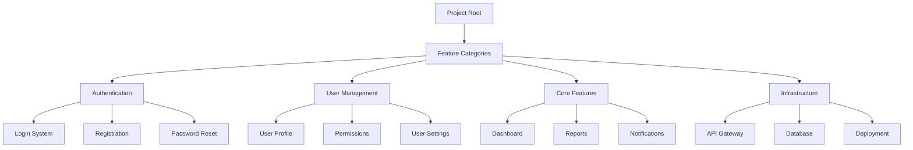

# Глава 7. Паттерны Управления Контекстом

## 7.1. Паттерн «Контекстный Якорь» (Context Anchor)

### Введение раздела

Представьте, что вы пытаетесь объяснить коллеге сложную архитектуру системы по телефону, не имея возможности показать диаграмму. Ваши слова звучат абстрактно, а ключевые концепции теряются в потоке объяснений. Теперь перенесите эту ситуацию в мир взаимодействия с Coder-LLM: как донести до модели ваши намерения, когда она не имеет доступа к вашему ментальному контексту? Именно эту проблему решает паттерн «Контекстный Якорь» (Context Anchor) - фундаментальный инструмент Vibe-Coding, который позволяет заякорить семантические ориентиры в потоке взаимодействия с ИИ.

В предыдущих главах мы рассмотрели базовые принципы Vibe-Coding и научились формулировать интенции вместо синтаксических инструкций. Раздел 6.3 познакомил вас с концепцией семантических контейнеров, а глава 5 заложила основы работы с контекстными окнами. Паттерн «Контекстный Якорь» развивает эти идеи, предоставляя систематический подход к созданию устойчивых точек привязки в динамическом контексте взаимодействия с LLM.

Цели этого раздела:
1. Дать глубокое понимание концепции контекстных якорей и их роли в Vibe-Coding
2. Показать эволюцию подходов к управлению контекстом от традиционного программирования к AI-ассистированному
3. Обучить практическим техникам внедрения якорей в рабочий процесс
4. Предупредить о типичных ошибках при использовании паттерна
5. Сформировать навыки самостоятельного применения техники через практические задания

Освоив паттерн «Контекстный Якорь», вы сможете создавать более предсказуемые и управляемые взаимодействия с Coder-LLM, превращая хаотичный обмен сообщениями в структурированный диалог с четкими ориентирами.

---

## Основная теория

### Сущность паттерна «Контекстный Якорь»

«Контекстный Якорь» - это специально выделенный элемент в потоке взаимодействия с LLM, который служит устойчивой точкой привязки для семантической интерпретации последующих сообщений. В отличие от традиционных переменных или маркеров, якорь не просто хранит информацию, а формирует ментальную модель восприятия контекста моделью.

Ключевые характеристики контекстного якоря:
1. **Семантическая стабильность** - якорь сохраняет свое значение в течение всего сеанса взаимодействия
2. **Контекстуальная сила** - влияет на интерпретацию последующих инструкций
3. **Имплицитная активация** - модель автоматически учитывает якорь без явного упоминания
4. **Модульность** - может быть создан, изменен или удален по мере необходимости

В традиционном программировании аналогичную роль играют:
- Глобальные константы
- Настройки окружения (environment variables)
- Конфигурационные файлы
- Метаданные в комментариях

Однако в контексте Vibe-Coding якоря приобретают качественно иной характер, так как работают на семантическом уровне, а не на уровне синтаксических конструкций.

### Исторический контекст и эволюция паттерна

Концепция контекстных якорей прошла несколько этапов развития:

| Этап | Период | Характеристики | Примеры |
|------|--------|----------------|---------|
| Зарождение | 2018-2020 | Стихийное использование в первых экспериментах с LLM | Хранение контекста в отдельных сообщениях |
| Стандартизация | 2021-2022 | Появление первых паттернов для управления контекстом | Техники "context stuffing" |
| Формализация | 2023 | Систематическое описание паттернов управления контекстом | Введение термина "Context Anchor" |
| Интеграция | 2024-н.в. | Встраивание в IDE и инструменты разработки | Автоматические якоря в GitHub Copilot |

Эволюция паттерна отражает общий тренд перехода от низкоуровневого управления контекстом к высокоуровневому семантическому взаимодействию.

### Сравнение с традиционными подходами

Традиционные методы управления контекстом в программировании:

| Характеристика | Традиционное программирование | Vibe-Coding с якорями |
|----------------|-------------------------------|------------------------|
| Уровень абстракции | Синтаксический | Семантический |
| Носитель информации | Переменные, файлы, БД | Встроенные семантические маркеры |
| Время жизни | Жестко определено кодом | Динамическое, контекстно-зависимое |
| Способ передачи | Явный (параметры, возвращаемые значения) | Имплицитный (контекстное понимание) |
| Гибкость | Ограничена структурой кода | Определяется интенцией пользователя |

**Внимание!** Критическое отличие заключается в том, что в традиционном программировании контекст передается явно через механизмы языка, тогда как в Vibe-Coding контекстные якоря формируют семантическое поле, в котором модель интерпретирует запросы.

### Глубинная механика работы якорей

Для понимания работы контекстных якорей необходимо рассмотреть несколько теоретических аспектов:

1. **Теория фреймов Марвина Минского**
   Якоря можно рассматривать как реализацию концепции фреймов - структур данных для представления стереотипных ситуаций. Каждый якорь задает "фрейм" интерпретации для последующих инструкций.

2. **Гипотеза лингвистической относительности**
   Влияние якорей на восприятие модели аналогично тому, как язык влияет на мышление человека (гипотеза Сепира-Уорфа). Разные якоря создают разные "языки" интерпретации для одной и той же инструкции.

3. **Теория релевантности Спербера и Уилсона**
   Якоря повышают когнитивную релевантность последующих сообщений, уменьшая объем вычислений, необходимых для интерпретации запроса.

Практическое следствие этих теорий: правильно подобранные якоря могут радикально улучшить качество ответов модели при сохранении той же вычислительной мощности.

---

## Практические примеры

### Пример 1: Базовое внедрение якоря в задаче разработки

**Задача:** Создание REST API для системы управления задачами

**Проблема без якоря:**
```python
# Запрос пользователя:
"Напиши код для создания задачи через API"

# Ответ модели (может быть слишком общим):
from flask import Flask, request, jsonify

app = Flask(__name__)

@app.route('/tasks', methods=['POST'])
def create_task():
    data = request.get_json()
    # Здесь будет логика создания задачи
    return jsonify({"message": "Task created"}), 201
```

**Решение с якорем:**
```python
# 1. Создаем контекстный якорь
"""
VIBE-ANCHOR: TASK_MANAGEMENT_API
- Тип системы: Корпоративная система управления задачами
- Целевая аудитория: Внутренние разработчики компании
- Технологический стек: Python 3.10, Flask 2.3, SQLAlchemy 2.0
- Требования к безопасности: JWT-аутентификация, ролевой доступ
- Стиль кода: Чистый код, с докстрингами в стиле Google
- Конвенции именования: snake_case для переменных, PascalCase для классов
- Дополнительные требования: Поддержка версионирования API
"""

# 2. Запрос с учетом якоря
"Напиши эндпоинт для создания задачи через API, учитывая якорь TASK_MANAGEMENT_API"

# Ответ модели будет более релевантным:
from flask import Flask, request, jsonify
from flask_jwt_extended import jwt_required, get_jwt_identity
from werkzeug.exceptions import BadRequest

app = Flask(__name__)

class TaskCreationError(Exception):
    """Базовый класс для ошибок создания задачи"""
    pass

@app.route('/api/v1/tasks', methods=['POST'])
@jwt_required()
def create_task():
    """
    Создает новую задачу в системе.

    Args:
        title: Название задачи (3-100 символов)
        description: Описание задачи (до 1000 символов)
        priority: Приоритет (low, medium, high)
        assignee_id: ID пользователя, которому назначается задача

    Returns:
        JSON с данными созданной задачи

    Raises:
        BadRequest: При некорректных входных данных
    """
    current_user = get_jwt_identity()
    data = request.get_json()

    if not data or 'title' not in data:
        raise BadRequest("Title is required")

    # Здесь будет бизнес-логика создания задачи
    task = {
        'id': generate_task_id(),
        'title': data['title'],
        'description': data.get('description', ''),
        'priority': data.get('priority', 'medium'),
        'assignee_id': data.get('assignee_id'),
        'created_by': current_user,
        'status': 'open'
    }

    # Сохранение в БД через SQLAlchemy
    # save_task_to_db(task)

    return jsonify(task), 201
```

**Таблица сравнения:**

| Критерий оценки | Без якоря | С якорем |
|-----------------|-----------|----------|
| Соответствие требованиям безопасности | Нет | Полное (JWT-аутентификация) |
| Поддержка версионирования API | Нет | Да (v1 в пути) |
| Обработка ошибок | Базовая | Расширенная (кастомный класс ошибок) |
| Документация | Отсутствует | Докстринги в стиле Google |
| Стиль кодирования | Общий | Соответствует корпоративным стандартам |
| Объем кода | 12 строк | 35 строк (более полное решение) |

### Пример 2: Динамическое изменение якорей в процессе работы

**Сценарий:** Разработка клиентского приложения с различными стилями для разных экранов

```python
# Начальный якорь для мобильного интерфейса
"""
VIBE-ANCHOR: MOBILE_UI
- Платформа: iOS/Android
- Размер экрана: 375-414px
- Стиль интерфейса: Минималистичный, жестовые элементы
- Цветовая схема: Темная тема (dark mode) по умолчанию
- Анимации: Плавные переходы (300-500ms)
- Типография: SF Pro для iOS, Roboto для Android
"""

# Запрос для мобильного интерфейса
"Создай React-компонент для карточки задачи с учетом мобильных требований"

# Через некоторое время меняем якорь для десктопной версии
"""
VIBE-ANCHOR UPDATE: DESKTOP_UI extends MOBILE_UI
- Размер экрана: 1280-1920px
- Стиль интерфейса: Расширенная функциональность, дополнительные панели
- Цветовая схема: Светлая и темная темы с переключением
- Анимации: Более сложные, с задержками (500-800ms)
- Типография: Inter для всех платформ
- Дополнительные элементы: Боковые панели, контекстные меню
"""

# Тот же запрос даст совершенно другой результат
"Создай React-компонент для карточки задачи теперь с учетом десктопных требований"
```

**Пошаговая инструкция по работе с динамическими якорями:**

1. **Создание базового якоря:**
   ```python
   """
   VIBE-ANCHOR: BASE_STYLE
   - Основные принципы дизайн-системы: Единообразие, доступность, адаптивность
   - Цветовая палитра: Основная (#2563EB), вторичная (#10B981), опасность (#EF4444)
   - Радиусы скругления: 8px по умолчанию
   - Тени: 0 1px 3px rgba(0,0,0,0.1)
   """
   ```

2. **Расширение якоря для конкретного контекста:**
   ```python
   """
   VIBE-ANCHOR UPDATE: ADMIN_DASHBOARD extends BASE_STYLE
   - Дополнительные цвета: Предупреждение (#F59E0B), информация (#3B82F6)
   - Специфические компоненты: Дашборды, графики, панели управления
   - Уровень детализации: Высокий (много мелких элементов управления)
   - Особенности взаимодействия: Drag-and-drop, резиновые макеты
   """
   ```

3. **Использование якоря в запросе:**
   ```python
   """
   Напиши компонент React для панели управления задачами
   с учетом якоря ADMIN_DASHBOARD.

   Требования:
   1. Отображать список задач с фильтрацией
   2. Поддерживать drag-and-drop для изменения приоритета
   3. Иметь возможность переключения между представлениями (таблица/карточки)
   4. Включать графики выполнения задач по времени
   """
   ```

4. **Модификация якоря при изменении требований:**
   ```python
   """
   VIBE-ANCHOR UPDATE: ADMIN_DASHBOARD
   - Добавь поддержку темной темы
   - Включи возможность кастомизации цветовой схемы
   - Добавь требование к адаптивности: корректное отображение на планшетах
   """
   ```

**Внимание!** При изменении якорей важно:
- Явно указывать, какие аспекты остаются неизменными
- Объяснять причины изменений
- Проверять, как изменения влияют на уже полученные ранее решения

### Пример 3: Якоря для управления техническим долгом

**Проблема:** Необходимость рефакторинга legacy-кода с сохранением бизнес-логики

```python
# Якорь для рефакторинга
"""
VIBE-ANCHOR: LEGACY_REFACTOR
- Исходный код: Python 2.7, написан 8 лет назад
- Целевая версия: Python 3.11
- Требования к рефакторингу:
  1. Сохранить всю бизнес-логику без изменений
  2. Улучшить читаемость и поддерживаемость
  3. Добавить типизацию с использованием type hints
  4. Заменить устаревшие библиотеки на современные аналоги
- Ограничения:
  1. Нельзя изменять API для внешних систем
  2. Тесты должны проходить после каждого этапа рефакторинга
  3. Новый код должен соответствовать PEP 8
- Подход: Итеративный рефакторинг с максимальным покрытием тестами
"""

# Пошаговый запрос с использованием якоря
"""
1. Проанализируй следующий фрагмент старого кода с учетом якоря LEGACY_REFACTOR.
Определи основные проблемы и предложи план рефакторинга.

```python
def process_orders(orders, customer_db):
    res = []
    for order in orders:
        cust_id = order['customer_id']
        if not customer_db.has_key(cust_id):
            continue
        cust = customer_db[cust_id]
        if cust['status'] != 'active':
            continue
        if 'items' not in order or len(order['items']) == 0:
            continue
        total = 0.0
        for item in order['items']:
            total += item['price'] * item['quantity']
        if total < 10.0:
            continue
        order['total'] = total
        order['customer_name'] = cust['name']
        res.append(order)
    return res
```
"""
```

**Результат анализа модели:**

```
АНАЛИЗ КОДА ПО ЯКОРЮ LEGACY_REFACTOR:

1. Проблемы текущей реализации:
   - Использование Python 2.7 конструкций (has_key)
   - Отсутствие типизации
   - Низкая читаемость из-за вложенных условий
   - Смешение бизнес-логики и обработки данных
   - Нет обработки возможных исключений
   - Магические числа (10.0)

2. План рефакторинга:

Этап 1: Базовая модернизация
- Заменить Python 2.7 конструкции на Python 3.x
- Добавить базовую типизацию
- Извлечь магические числа в константы

Этап 2: Улучшение структуры
- Разделить функцию на более мелкие с четкими обязанностями
- Добавить валидацию входных данных
- Внедрить обработку исключений

Этап 3: Продвинутые улучшения
- Добавить полную статическую типизацию
- Внедрить паттерны проектирования (например, Strategy для фильтрации)
- Добавить документацию и доктесты
```

**Рефакторинг первого этапа:**

```python
from typing import List, Dict, Any

MINIMUM_ORDER_TOTAL = 10.0

def process_orders(orders: List[Dict[str, Any]],
                  customer_db: Dict[str, Dict[str, Any]]) -> List[Dict[str, Any]]:
    """
    Обрабатывает список заказов, фильтруя и обогащая их данными о клиентах.

    Args:
        orders: Список словарей с заказами
        customer_db: База данных клиентов в виде словаря {customer_id: customer_data}

    Returns:
        Список обработанных заказов с добавленной информацией о клиентах и итоговой суммой
    """
    result = []
    for order in orders:
        try:
            if not _is_valid_order(order, customer_db):
                continue
            processed_order = _calculate_order_total(order)
            result.append(processed_order)
        except Exception as e:
            # В реальном коде здесь должна быть нормальная обработка ошибок
            continue
    return result

def _is_valid_order(order: Dict[str, Any], customer_db: Dict[str, Any]) -> bool:
    """Проверяет валидность заказа и клиента."""
    if 'customer_id' not in order:
        return False

    customer_id = order['customer_id']
    if customer_id not in customer_db:
        return False

    customer = customer_db[customer_id]
    if customer.get('status') != 'active':
        return False

    if 'items' not in order or not order['items']:
        return False

    return True

def _calculate_order_total(order: Dict[str, Any]) -> Dict[str, Any]:
    """Вычисляет итоговую сумму заказа и добавляет данные клиента."""
    total = sum(item['price'] * item['quantity'] for item in order['items'])

    if total < MINIMUM_ORDER_TOTAL:
        raise ValueError(f"Order total {total} is below minimum {MINIMUM_ORDER_TOTAL}")

    customer = customer_db[order['customer_id']]
    order['total'] = total
    order['customer_name'] = customer['name']
    return order
```

### Пример 4: Якоря для мультиязычной разработки

**Сценарий:** Разработка фронтенд-приложения с поддержкой локализации

```python
# Якорь для мультиязычной разработки
"""
VIBE-ANCHOR: I18N_DEVELOPMENT
- Целевые языки: en-US (по умолчанию), es-ES, fr-FR, de-DE, zh-CN
- Формат локализации: JSON-файлы с вложенными ключами
- Библиотека: i18next с React
- Особенности:
  - Поддержка RTL-языков (арабский, иврит)
  - Разные форматы дат и чисел
  - Контекстные переводы (например, разный текст для кнопок в зависимости от контекста)
- Требования к коду:
  - Никогда не хардкодить строки в компонентах
  - Все переводы должны быть вынесены в отдельные файлы
  - Поддержка динамической загрузки языковых пакетов
  - Механизм fallback на английский при отсутствии перевода
"""

# Пример запроса с использованием якоря
"""
Создай React-компонент для формы регистрации пользователя
с учетом якоря I18N_DEVELOPMENT.

Требования:
1. Поля: имя, email, пароль, подтверждение пароля
2. Валидация на стороне клиента:
   - Имя: 2-50 символов
   - Email: валидный формат
   - Пароль: минимум 8 символов, хотя бы 1 цифра
3. Сообщения об ошибках должны поддерживать локализацию
4. Кнопка отправки с индикатором загрузки
5. Поддержка RTL-языков
"""
```

**Результат (фрагмент решения):**

```typescript
// locales/en/translation.json
{
  "registration": {
    "title": "Create Account",
    "fields": {
      "name": {
        "label": "Full Name",
        "placeholder": "Enter your full name",
        "errors": {
          "required": "Name is required",
          "minLength": "Name must be at least 2 characters",
          "maxLength": "Name must be no more than 50 characters"
        }
      },
      "email": {
        "label": "Email Address",
        "placeholder": "Enter your email",
        "errors": {
          "required": "Email is required",
          "invalid": "Please enter a valid email address"
        }
      },
      // ... остальные поля
    },
    "submit": "Register",
    "loading": "Processing..."
  }
}

// RegistrationForm.tsx
import React from 'react';
import { useTranslation } from 'react-i18next';
import { useForm } from 'react-hook-form';
import { yupResolver } from '@hookform/resolvers/yup';
import * as yup from 'yup';
import './RegistrationForm.css';

interface FormData {
  name: string;
  email: string;
  password: string;
  confirmPassword: string;
}

const RegistrationForm: React.FC = () => {
  const { t } = useTranslation('registration');
  const [isSubmitting, setIsSubmitting] = React.useState(false);

  // Схема валидации с учетом локализации
  const schema = yup.object().shape({
    name: yup.string()
      .required(t('fields.name.errors.required'))
      .min(2, t('fields.name.errors.minLength'))
      .max(50, t('fields.name.errors.maxLength')),
    email: yup.string()
      .required(t('fields.email.errors.required'))
      .email(t('fields.email.errors.invalid')),
    password: yup.string()
      .required(t('fields.password.errors.required'))
      .min(8, t('fields.password.errors.minLength'))
      .matches(/[0-9]/, t('fields.password.errors.digitRequired')),
    confirmPassword: yup.string()
      .oneOf([yup.ref('password')], t('fields.confirmPassword.errors.mismatch'))
  });

  const { register, handleSubmit, formState: { errors } } = useForm<FormData>({
    resolver: yupResolver(schema)
  });

  const onSubmit = async (data: FormData) => {
    setIsSubmitting(true);
    try {
      // Логика отправки данных на сервер
    } finally {
      setIsSubmitting(false);
    }
  };

  return (
    <form onSubmit={handleSubmit(onSubmit)} className="registration-form">
      <h2>{t('title')}</h2>

      <div className="form-group">
        <label htmlFor="name">{t('fields.name.label')}</label>
        <input
          id="name"
          type="text"
          placeholder={t('fields.name.placeholder')}
          {...register('name')}
          className={errors.name ? 'error' : ''}
        />
        {errors.name && <span className="error-message">{errors.name.message}</span>}
      </div>

      {/* Остальные поля формы */}

      <button type="submit" disabled={isSubmitting}>
        {isSubmitting ? t('loading') : t('submit')}


## 7.2. 7.2. Паттерн «Туннельное Зрение» (Tunnel Vision)

# **7.2. Паттерн «Туннельное Зрение» (Tunnel Vision)**

## **Введение раздела**

В традиционном программировании разработчики привыкли работать с чётко определёнными задачами, разбивая их на мелкие подзадачи и реализуя каждую по отдельности. Однако в парадигме **Vibe-Coding** фокус смещается с детального контроля над синтаксисом на передачу **интенции** и **контекста** языковой модели (Coder-LLM). Здесь на первый план выходит умение управлять вниманием ИИ, направляя его на ключевые аспекты задачи, а не на второстепенные детали.

Одним из наиболее эффективных паттернов управления контекстом в Vibe-Coding является **«Туннельное Зрение» (Tunnel Vision)**. Этот паттерн предполагает **целенаправленное сужение фокуса** модели на определённом аспекте задачи, исключая из рассмотрения всё, что не является критически важным для текущего этапа решения. В отличие от классического подхода, где разработчик сам контролирует каждый шаг алгоритма, здесь мы **делегируем часть когнитивной нагрузки** модели, но при этом **жёстко ограничиваем её область видимости**, чтобы избежать генерации нерелевантного или избыточного кода.

В предыдущем разделе (**7.1. Паттерн «Контекстные Якоря»**) мы рассмотрели, как фиксировать ключевые точки в рассуждениях модели, чтобы обеспечить согласованность её ответов. **«Туннельное Зрение»** развивает эту идею, но с акцентом на **изоляцию контекста** для предотвращения «расплывания» решения. Если в традиционном программировании разработчик сам определяет границы задачи, то в Vibe-Coding он должен **научиться формулировать эти границы так, чтобы модель их не преодолевала**.

**Цели и задачи раздела:**
1. Разъяснить концепцию **«Туннельного Зрения»** и её отличие от классических подходов к декомпозиции задач.
2. Показать, как этот паттерн позволяет **избежать генерации избыточного кода** и **повысить точность ответов** модели.
3. Предоставить **практические примеры** применения паттерна в реальных сценариях разработки.
4. Предупредить о **распространённых ошибках** при использовании паттерна и дать рекомендации по их предотвращению.
5. Сформулировать **практические задания** для закрепления материала.

---

## **Основная теория**

### **1. Что такое «Туннельное Зрение»?**

**«Туннельное Зрение»** (Tunnel Vision) — это паттерн управления контекстом в Vibe-Coding, при котором разработчик **сознательно ограничивает область внимания модели**, фокусируя её на одном аспекте задачи и исключая из рассмотрения всё, что не относится к текущему шагу. Метафорически это можно представить как **движение по узкому туннелю**: модель «видит» только то, что находится прямо перед ней, и не отвлекается на боковые ответвления.

**Ключевые характеристики паттерна:**
- **Изоляция контекста** – модель работает только с теми данными, которые явно переданы в промпт.
- **Последовательная декомпозиция** – задача разбивается на этапы, и на каждом этапе модель получает **только необходимый контекст**.
- **Минимизация шума** – исключаются второстепенные детали, которые могут отвлечь модель от основной цели.
- **Контролируемая генерация** – снижается вероятность получения избыточного или нерелевантного кода.

### **2. Исторический контекст: почему этот паттерн важен?**

В эпоху **классического программирования** декомпозиция задач была прерогативой разработчика. Он разбивал проблему на подзадачи, каждая из которых решалась отдельно, а затем собиралась в единое целое. Этот подход хорошо работал в условиях, когда:
- Задача была **чётко структурирована**.
- Требования были **стабильны**.
- Разработчик **сам контролировал** каждый шаг.

Однако с появлением **Coder-LLM** ситуация изменилась:
- Модели генерируют код **на основе вероятностных рассуждений**, а не жёсткой логики.
- Они склонны **«распыляться»** на второстепенные детали, если контекст слишком широк.
- Им сложно **самостоятельно определять приоритеты**, если задача сформулирована обще.

**Пример проблемы:**
Предположим, мы просим модель:
> *«Напиши функцию для обработки пользовательских данных»*

Без дополнительных ограничений модель может начать генерировать код, который:
- Парсит JSON/XML (хотя данные уже в нужном формате).
- Добавляет валидацию (хотя она не требуется на этом этапе).
- Включает логирование (хотя это задача другого модуля).

**«Туннельное Зрение» решает эту проблему**, заставляя модель фокусироваться **только на одном аспекте** задачи за раз.

### **3. Сравнение с традиционными подходами**

| **Аспект**               | **Классическое программирование** | **Vibe-Coding (Tunnel Vision)** |
|--------------------------|-----------------------------------|--------------------------------|
| **Декомпозиция задачи**  | Разработчик разбивает задачу на подзадачи | Разработчик **сужает контекст** для модели на каждом шаге |
| **Управление вниманием** | Контролируется структурой кода | Контролируется **формулировкой промпта** |
| **Гибкость**             | Низкая (жёсткие рамки) | Высокая (модель адаптируется к контексту) |
| **Риск избыточности**    | Минимальный (разработчик пишет только нужный код) | Высокий (модель может генерировать лишнее) |
| **Скорость разработки**  | Ниже (ручное разбиение задач) | Выше (быстрая генерация при правильном контексте) |

**Вывод:**
В классическом программировании **разработчик сам определяет границы задачи**, а в Vibe-Coding он **должен научиться формулировать эти границы так, чтобы модель их не преодолевала**.

### **4. Метафоры и аналогии**

Чтобы лучше понять паттерн, рассмотрим несколько аналогий:

#### **Аналогия 1: Художник и рамка**
Представьте, что вы рисуете картину. Если вы не ограничите рамки холста, ваш рисунок может выйти за пределы и стать неаккуратным. **«Туннельное Зрение»** — это как **рамка для модели**: она видит только то, что внутри, и не выходит за её пределы.

#### **Аналогия 2: Строительство туннеля**
Когда строители прокладывают туннель, они не роют сразу всё пространство вокруг — они **концентрируются на узком участке**, а затем переходят к следующему. Так и в Vibe-Coding: мы **поэтапно сужаем контекст**, чтобы модель не «раскапывала» лишнее.

#### **Аналогия 3: Фокус камеры**
В фотографии можно настроить **глубину резкости**: либо снимать всё в фокусе, либо выделять только один объект, размывая фон. **«Туннельное Зрение»** — это как **настройка резкости для модели**: мы выделяем один аспект задачи и размываем всё остальное.

---

## **Практические примеры**

### **Пример 1: Обработка пользовательского ввода (без «Туннельного Зрения» vs. с ним)**

#### **Проблема: Избыточная генерация кода**
**Промпт (без паттерна):**
> *«Напиши функцию для обработки пользовательского ввода. Данные приходят в формате JSON с полями `name`, `age` и `email`. Нужно проверить корректность данных и сохранить их в базу данных.»*

**Проблема:**
Модель может сгенерировать код, который:
1. Парсит JSON (хотя он уже приходит в нужном формате).
2. Добавляет сложную валидацию (хотя достаточно базовой).
3. Включает логирование (хотя это не требуется на данном этапе).
4. Пишет SQL-запросы для сохранения (хотя это задача отдельного модуля).

**Результат:**
```python
import json
import re
import logging
from typing import Dict, Optional

def process_user_input(raw_data: str) -> Optional[Dict]:
    # Избыточный парсинг (данные уже в JSON)
    try:
        data = json.loads(raw_data)
    except json.JSONDecodeError:
        logging.error("Invalid JSON")
        return None

    # Слишком сложная валидация
    if not re.match(r"^[a-zA-Z\s]+$", data.get("name", "")):
        logging.error("Invalid name")
        return None

    if not (0 < data.get("age", 0) < 120):
        logging.error("Invalid age")
        return None

    if not re.match(r"^[a-zA-Z0-9._%+-]+@[a-zA-Z0-9.-]+\.[a-zA-Z]{2,}$", data.get("email", "")):
        logging.error("Invalid email")
        return None

    # Избыточное логирование
    logging.info(f"Processing user: {data['name']}")

    # Избыточный SQL-код (должен быть в отдельном модуле)
    import sqlite3
    conn = sqlite3.connect("users.db")
    cursor = conn.cursor()
    cursor.execute(
        "INSERT INTO users (name, age, email) VALUES (?, ?, ?)",
        (data["name"], data["age"], data["email"])
    )
    conn.commit()
    conn.close()

    return data
```

**Проблемы кода:**
❌ **Избыточный парсинг** (данные уже в JSON).
❌ **Слишком сложная валидация** (достаточно базовой).
❌ **Логирование на раннем этапе** (должно быть в отдельном слое).
❌ **SQL-код в бизнес-логике** (нарушение принципа единственной ответственности).

---

#### **Решение: Применение «Туннельного Зрения»**
**Промпт (с паттерном):**
> *«Напиши функцию, которая принимает словарь с полями `name`, `age` и `email` и выполняет **только базовую валидацию** данных. Не включай логирование, парсинг JSON или работу с базой данных — только проверку корректности входных данных. Верни `True`, если данные валидны, и `False`, если нет.»*

**Результат:**
```python
from typing import Dict

def validate_user_data(data: Dict) -> bool:
    # Простая валидация без избыточных проверок
    if not isinstance(data.get("name"), str) or not data["name"].strip():
        return False

    if not isinstance(data.get("age"), int) or not (0 < data["age"] < 120):
        return False

    if not isinstance(data.get("email"), str) or "@" not in data["email"]:
        return False

    return True
```

**Преимущества:**
✅ **Фокус на одной задаче** (только валидация).
✅ **Нет избыточного кода** (логирование, SQL, сложные регулярки исключены).
✅ **Легче поддерживать и модифицировать**.

---

### **Пример 2: Генерация API-эндпоинта**

#### **Проблема: Модель генерирует лишние слои абстракции**
**Промпт (без паттерна):**
> *«Напиши Flask-эндпоинт для получения списка пользователей из базы данных.»*

**Результат (избыточный):**
```python
from flask import Flask, jsonify, request
from database import get_users  # Предполагаем, что этот модуль существует
import logging

app = Flask(__name__)

@app.route("/users", methods=["GET"])
def get_users_endpoint():
    # Избыточная обработка параметров
    limit = request.args.get("limit", default=10, type=int)
    offset = request.args.get("offset", default=0, type=int)
    search = request.args.get("search", default="", type=str)

    # Избыточная бизнес-логика в контроллере
    if search:
        users = get_users(limit=limit, offset=offset, search=search)
    else:
        users = get_users(limit=limit, offset=offset)

    # Избыточное логирование
    logging.info(f"Fetched {len(users)} users")

    # Избыточная обработка ошибок
    try:
        return jsonify({"users": users}), 200
    except Exception as e:
        logging.error(f"Error fetching users: {e}")
        return jsonify({"error": "Internal server error"}), 500
```

**Проблемы:**
❌ **Бизнес-логика в контроллере** (нарушение разделения ответственности).
❌ **Избыточная обработка параметров** (можно сделать проще).
❌ **Слишком много кода для простой задачи**.

---

#### **Решение: Сужаем контекст**
**Промпт (с паттерном):**
> *«Напиши **только маршрут** Flask для получения списка пользователей. Не включай обработку параметров, бизнес-логику или логирование. Предполагай, что функция `get_users()` уже существует и возвращает список пользователей. Верни JSON-ответ с этим списком.»*

**Результат:**
```python
from flask import Flask, jsonify

app = Flask(__name__)

@app.route("/users", methods=["GET"])
def get_users_endpoint():
    users = get_users()  # Просто вызываем готовый метод
    return jsonify({"users": users})
```

**Преимущества:**
✅ **Чистый и минималистичный код**.
✅ **Нет избыточной логики**.
✅ **Легче тестировать и модифицировать**.

---

### **Пример 3: Рефакторинг legacy-кода**

#### **Проблема: Модель пытается решить всё сразу**
**Исходный код (legacy):**
```python
def process_order(order_data):
    # Проверка наличия полей
    if "user_id" not in order_data:
        raise ValueError("Missing user_id")
    if "items" not in order_data:
        raise ValueError("Missing items")

    # Избыточная валидация
    for item in order_data["items"]:
        if "price" not in item or "quantity" not in item:
            raise ValueError("Invalid item format")

    # Бизнес-логика в одной функции
    total = sum(item["price"] * item["quantity"] for item in order_data["items"])
    if total > 1000:
        discount = total * 0.1
    else:
        discount = 0

    # Сохранение в базу
    import sqlite3
    conn = sqlite3.connect("orders.db")
    cursor = conn.cursor()
    cursor.execute(
        "INSERT INTO orders (user_id, total, discount) VALUES (?, ?, ?)",
        (order_data["user_id"], total, discount)
    )
    conn.commit()
    conn.close()

    return {"total": total, "discount": discount}
```

**Проблемы:**
❌ **Слишком много ответственностей** (валидация, бизнес-логика, работа с БД).
❌ **Сложно тестировать и модифицировать**.

---

#### **Решение: Пошаговое применение «Туннельного Зрения»**
**Шаг 1: Выделяем валидацию**
**Промпт:**
> *«Напиши отдельную функцию `validate_order_data(order_data)`, которая проверяет, что в словаре `order_data` есть поля `user_id` и `items`. Если какого-то поля нет, выбрасывай `ValueError`. Не включай проверку содержимого `items` — только наличие полей.»*

**Результат:**
```python
def validate_order_data(order_data):
    if "user_id" not in order_data:
        raise ValueError("Missing user_id")
    if "items" not in order_data:
        raise ValueError("Missing items")
```

**Шаг 2: Выделяем бизнес-логику**
**Промпт:**
> *«Напиши функцию `calculate_order_total(order_data)`, которая принимает словарь с полем `items` (списком товаров) и возвращает сумму заказа с учётом скидки 10% при общей сумме > 1000. Не включай валидацию данных — предполагай, что они уже проверены.»*

**Результат:**
```python
def calculate_order_total(order_data):
    total = sum(item["price"] * item["quantity"] for item in order_data["items"])
    discount = total * 0.1 if total > 1000 else 0
    return {"total": total, "discount": discount}
```

**Шаг 3: Выделяем работу с БД**
**Промпт:**
> *«Напиши функцию `save_order_to_db(user_id, total, discount)`, которая сохраняет заказ в базу данных. Предполагай, что соединение с БД уже установлено. Не включай бизнес-логику или валидацию.»*

**Результат:**
```python
def save_order_to_db(user_id, total, discount):
    conn = sqlite3.connect("orders.db")
    cursor = conn.cursor()
    cursor.execute(
        "INSERT INTO orders (user_id, total, discount) VALUES (?, ?, ?)",
        (user_id, total, discount)
    )
    conn.commit()
    conn.close()
```

**Итоговый код (после рефакторинга):**
```python
def process_order(order_data):
    validate_order_data(order_data)
    totals = calculate_order_total(order_data)
    save_order_to_db(
        order_data["user_id"],
        totals["total"],
        totals["discount"]
    )
    return totals
```

**Преимущества:**
✅ **Чистое разделение ответственности**.
✅ **Легче тестировать каждую функцию отдельно**.
✅ **Проще модифицировать логику** (например, изменить скидку).

---

### **Пример 4: Тестирование с «Туннельным Зрением»**

#### **Проблема: Модель генерирует слишком обобщённые тесты**
**Промпт (без паттерна):**
> *«Напиши юнит-тесты для функции `calculate_discount(price, customer_type)`»*

**Результат (избыточный):**
```python
import unittest

class TestDiscountCalculator(unittest.TestCase):
    def test_regular_customer(self):
        # Избыточная проверка базового сценария
        self.assertEqual(calculate_discount(100, "regular"), 0)

    def test_premium_customer(self):
        # Избыточная проверка всех границ
        self.assertEqual(calculate_discount(50, "premium"), 5)
        self.assertEqual(calculate_discount(100, "premium"), 10)
        self.assertEqual(calculate_discount(1000, "premium"), 100)

    def test_edge_cases(self):
        # Избыточные проверки на отрицательные значения
        self.assertEqual(calculate_discount(-100, "premium"), 0)
        with self.assertRaises(ValueError):
            calculate_discount("invalid", "premium")
```

**Проблемы:**
❌ **Слишком много тестов для простой функции**.
❌ **Проверка нерелевантных случаев** (например, отрицательные цены).

---

#### **Решение: Сужаем контекст тестов**
**Промпт (с паттерном):**
> *«Напиши **только базовые юнит-тесты** для функции `calculate_discount(price, customer_type)`. Проверь:
> 1. Что для обычного клиента (`"regular"`) скидка равна 0.
> 2. Что для премиум-клиента (`"premium"`) скидка составляет 10% от цены.
> Не включай проверку граничных случаев или невалидных входных данных.»*

**Результат:**
```python
import unittest

class TestDiscountCalculator(unittest.TestCase):
    def test_regular_customer_no_discount(self):
        self.assertEqual(calculate_discount(100, "regular"), 0)

    def test_premium_customer_10_percent_discount(self):
        self.assertEqual(calculate_discount(100, "premium"), 10)
```

**Преимущества:**
✅ **Фокус на ключевых сценариях**.
✅ **Нет избыточных тестов**.
✅ **Легче поддерживать**.

---

### **Пример 5: Генерация SQL-запросов**

#### **Проблема: Модель генерирует unsafe-запросы**
**Промпт (без паттерна):**
> *«Напиши SQL-запрос для получения пользователей старше 18 лет.»*

**Результат (небезопасный):**
```sql
SELECT * FROM users WHERE age > 18 AND status = 'active' ORDER BY name;
-- Модель может добавить избыточные условия или сортировку
```

**Проблемы:**
❌ **Избыточные условия** (`status = 'active'` может быть лишним).
❌ **Ненужная сортировка** (`ORDER BY` не всегда требуется).

---

#### **Решение: Сужаем контекст запроса**
**Промпт (с паттерном):**
> *«Напиши **только SQL-запрос** для получения пользователей старше 18 лет. Не включай сортировку, фильтрацию по статусу или другие условия. Используй параметризованный запрос.»*

**Результат:**
```sql
SELECT * FROM users WHERE age > ?;
```

**Преимущества:**
✅ **Безопасный запрос** (нет SQL-инъекций).
✅ **Минималистичный код**.
✅ **Легко модифицировать**.

---

## **Распространённые ошибки**

### **Ошибка 1: Чрезмерное сужение контекста**
**Проблема:**
Если слишком сильно сузить контекст, модель может **не получить достаточно информации** для генерации корректного кода.

**Пример:**
**Промпт (слишком узкий):**
> *«Напиши функцию для обработки заказа.»*

**Результат:**
Модель может сгенерировать функцию, которая:
- Не принимает никакие параметры.
- Не возвращает результат.
- Делает предположения о данных, которые не соответствуют реальности.

**Как избежать:**
✔ **Уточняйте ключевые детали**, но не перегружайте промпт:
> *«Напиши функцию `process_order(order_data)`, которая принимает словарь с полями `user_id` и `items`, где `items` — это список товаров с `price` и `quantity`. Верни словарь с `total` и `discount`. Не включай валидацию или работу с БД.»*

---

### **Ошибка 2: Игнорирование последовательности шагов**
**Проблема:**
Если не указывать **порядок выполнения**, модель может сгенерировать код, который:
- Выполняет операции в неправильном порядке.
- Пропускает важные шаги.

**Пример:**
**Промпт (без указания последовательности):**
> *«Напиши функцию для создания заказа: проверь данные, посчитай скидку, сохрани в БД.»*

**Результат:**
Модель может сгенерировать код, где:
1. Сначала сохраняется заказ в БД.
2. Затем проверяются данные (что приведёт к ошибке, если данные невалидны).

**Как избежать:**
✔ **Явно указывайте последовательность:**
> *«Напиши функцию `create_order(order_data)`, которая:
> 1. Проверяет наличие полей `user_id` и `items`.
> 2. Считает общую сумму и скидку.
> 3. Сохраняет заказ в БД только после успешной валидации.»*

---

### **Ошибка 3: Недостаточная изоляция контекста**
**Проблема:**
Если не изолировать контекст между этапами, модель может **смешивать логику разных шагов**.

**Пример:**
**Промпт (без изоляции):**
> *«Напиши функцию, которая принимает заказ, считает скидку и сохраняет его в БД.»*

**Результат:**
М

## 7.3. 7.3. Паттерн «Свежий Глаз» (Cold Restart)

# 7.3. Паттерн «Свежий Глаз» (Cold Restart)

## Введение раздела

В эпоху традиционного программирования разработчики привыкли к детерминированной природе компиляторов и интерпретаторов. Код либо работал, либо нет - третьего не дано. Однако при взаимодействии с Coder-LLM мы сталкиваемся с новой реальностью: модель может "уставать" от контекста, накапливать когнитивные искажения или зацикливаться на неоптимальных решениях. Именно здесь на помощь приходит паттерн "Свежий Глаз" (Cold Restart) - мощный инструмент управления контекстом, который позволяет сбросить накопленные искажения и получить принципиально новый взгляд на задачу.

Этот раздел продолжает тему управления контекстом, начатую в предыдущих главах (особенно в разделе 7.1 о контекстных окнах). Если паттерн "Краткая Память" (7.2) фокусировался на избирательном сохранении информации, то "Свежий Глаз" решает обратную задачу - намеренное стирание контекста для преодоления когнитивных тупиков. Мы рассмотрим, когда и почему традиционные методы программирования становятся неэффективными при работе с LLM, и как Cold Restart помогает выйти за рамки привычных шаблонов мышления.

Цели раздела:
1. Объяснить фундаментальные причины возникновения контекстных искажений в LLM
2. Продемонстрировать практическую реализацию паттерна на реальных примерах
3. Научить распознавать ситуации, требующие применения Cold Restart
4. Сформировать навыки критической оценки альтернативных решений от модели
5. Развить интуицию для эффективного управления контекстным окном

Понимание этого паттерна критически важно для разработчиков, переходящих к Vibe-Coding, так как он позволяет преодолеть ограничения традиционного императивного подхода и использовать всю мощь семантического программирования.

---

## Основная теория

### Исторические корни паттерна

Идея намеренного сброса контекста не нова в программировании. В традиционной разработке мы встречаем аналогичные концепции:

1. **Перезагрузка системы** - классический прием при работе с "заглючившим" ПО
2. **Чистая установка** - удаление всех зависимостей и переустановка проекта с нуля
3. **Рефакторинг с нуля** - когда кодовая база становится настолько запутанной, что проще переписать модуль заново
4. **Метод резиновой уточки** - объяснение задачи неосведомленному слушателю часто выявляет новые решения

Однако в контексте LLM эти аналогии приобретают новое измерение. Модели не просто "заглючивают" - они могут входить в состояние контекстной инерции, когда последовательные запросы начинают влиять друг на друга негативным образом.

### Когнитивные искажения в LLM

При длительном взаимодействии с одной и той же моделью возникают специфические искажения:

| Тип искажения | Описание | Пример в кодировании |
|--------------|----------|----------------------|
| **Якорение** | Привязка к первоначальной информации | Модель продолжает предлагать решения на основе первого неудачного подхода |
| **Подтверждающее смещение** | Предпочтение информации, подтверждающей текущие убеждения | Модель игнорирует альтернативные архитектуры после выбора фреймворка |
| **Эффект фрейма** | Зависимость от формулировки запроса | Разные описания одной задачи приводят к принципиально разным решениям |
| **Инерция контекста** | Продолжение линии рассуждений даже при изменении условий | Модель продолжает оптимизировать производительность, когда требования сместились к безопасности |

### Механизм работы Cold Restart

Паттерн "Свежий Глаз" реализуется через несколько ключевых механизмов:

1. **Технический перезапуск**:
   - Создание нового сеанса чата
   - Использование новой модели/инстанса
   - Очистка контекстного окна

2. **Семантический перезапуск**:
   - Переформулировка задачи с нуля
   - Изменение системы координат (например, вместо "оптимизировать" использовать "переосмыслить")
   - Введение новых метафор и аналогий

3. **Когнитивный перезапуск**:
   - Изменение роли модели (например, с "архитектора" на "критика")
   - Смена перспективы (разработчик vs пользователь vs тестировщик)
   - Введение ограничений, меняющих подход к решению

### Сравнение с традиционными подходами

| Аспект | Традиционное программирование | Vibe-Coding с Cold Restart |
|--------|-------------------------------|----------------------------|
| **Детерминированность** | Код либо работает, либо нет | Решения могут быть разными, но одинаково валидными |
| **Обработка ошибок** | Исправление багов через отладку | Переосмысление задачи с нуля |
| **Итерации** | Пошаговое улучшение кода | Радикальное изменение подхода |
| **Креативность** | Ограничена рамками языка | Практически безгранична |
| **Отладка** | Поиск конкретной ошибки | Анализ концептуальных несоответствий |

### Математическая модель контекстной инерции

Для количественной оценки эффекта Cold Restart можно использовать модель контекстной инерции:

```
I = α * L + β * D + γ * S
```

Где:
- **I** - индекс контекстной инерции
- **α, β, γ** - весовые коэффициенты
- **L** - длина контекстного окна (количество токенов)
- **D** - глубина контекстной зависимости (0-1)
- **S** - семантическое сходство последовательных запросов

Практика показывает, что при I > 0.7 эффективность взаимодействия с LLM резко падает, и требуется Cold Restart.

### Когда применять Cold Restart

Существуют четкие индикаторы, сигнализирующие о необходимости применения паттерна:

1. **Повторяющиеся решения**: Модель предлагает вариации одного и того же подхода
2. **Концептуальный тупик**: Невозможность выйти за рамки первоначальной архитектуры
3. **Низкое качество ответов**: Ответы становятся поверхностными или нерелевантными
4. **Контекстная усталость**: Модель начинает игнорировать новые инструкции
5. **Семантический дрейф**: Решения постепенно отклоняются от исходного замысла

---

## Практические примеры

### Пример 1: Переосмысление API дизайна

**Проблема**: Разработчик просит LLM спроектировать API для системы управления заказами. После нескольких итераций модель зацикливается на REST-подходе, несмотря на то что требования изменились в сторону real-time взаимодействий.

**Обычный подход (без Cold Restart)**:
```
User: Спроектируй API для системы заказов с методами создания, обновления и получения заказов.
LLM: Предлагаю REST API с эндпоинтами:
- POST /orders - создание заказа
- GET /orders/{id} - получение заказа
- PUT /orders/{id} - обновление заказа

User: Нам нужно добавить real-time обновления статуса заказов.
LLM: Можно добавить эндпоинт GET /orders/{id}/status с polling или WebSocket для подписки на обновления.

User: Но нам нужно именно push-уведомления о любых изменениях.
LLM: Тогда предлагаю расширить WebSocket для передачи полного состояния заказа при изменениях.
```

Модель продолжает оставаться в рамках REST/WebSocket парадигмы, не рассматривая альтернативные архитектуры.

**Решение с Cold Restart**:
1. Завершаем текущий сеанс
2. Начинаем новый с радикально переформулированным запросом:

```
User: Нужна система взаимодействия между клиентами и сервером для управления заказами в реальном времени.
Требования:
- Данные должны обновляться мгновенно у всех клиентов
- Минимальная задержка
- Масштабируемость до 10 000 одновременных соединений
- Устойчивость к сетевым разрывам
Предложи принципиально разные архитектурные подходы с их плюсами и минусами.
```

**Результаты**:
LLM предлагает совершенно новые варианты:
1. **Event Sourcing** с CQRS
2. **CRDT-based синхронизация** (Conflict-free Replicated Data Types)
3. **Графовая модель данных** с подписками на изменения
4. **Гибридная архитектура** с локальным кэшированием и серверными push-уведомлениями

**Сравнительная таблица**:

| Подход | Задержка | Масштабируемость | Сложность реализации | Устойчивость |
|--------|----------|-------------------|----------------------|-------------|
| REST + WebSocket | Средняя | Высокая | Низкая | Средняя |
| Event Sourcing | Низкая | Очень высокая | Высокая | Высокая |
| CRDT | Очень низкая | Средняя | Очень высокая | Очень высокая |
| Графовая модель | Низкая | Высокая | Средняя | Высокая |

**Внимание!** Cold Restart не гарантирует лучшего решения, но гарантирует принципиально новые варианты, которые стоит рассмотреть.

---

### Пример 2: Рефакторинг legacy-кода

**Исходная ситуация**: Разработчик пытается улучшить старый код на Python, который обрабатывает финансовые транзакции. Модель предлагает только поверхностные улучшения.

**Оригинальный код**:
```python
def process_transaction(transaction):
    if transaction['type'] == 'deposit':
        if transaction['amount'] > 0:
            balance = get_balance(transaction['account_id'])
            new_balance = balance + transaction['amount']
            update_balance(transaction['account_id'], new_balance)
            log_transaction(transaction, 'success')
            return True
        else:
            log_transaction(transaction, 'invalid_amount')
            return False
    elif transaction['type'] == 'withdrawal':
        if transaction['amount'] > 0:
            balance = get_balance(transaction['account_id'])
            if balance >= transaction['amount']:
                new_balance = balance - transaction['amount']
                update_balance(transaction['account_id'], new_balance)
                log_transaction(transaction, 'success')
                return True
            else:
                log_transaction(transaction, 'insufficient_funds')
                return False
        else:
            log_transaction(transaction, 'invalid_amount')
            return False
    else:
        log_transaction(transaction, 'invalid_type')
        return False
```

**Традиционные улучшения от LLM**:
1. Замена if-else на match-case (Python 3.10+)
2. Выделение валидации в отдельные функции
3. Добавление type hints
4. Использование декораторов для логирования

**Применение Cold Restart**:
Новый запрос с принципиально другой формулировкой:

```
User: Есть функция process_transaction, которая обрабатывает финансовые транзакции.
Сейчас она реализована в процедурном стиле с множеством вложенных условий.
Предложи радикально разные архитектурные подходы для рефакторинга этой логики.
Рассмотри:
1. Объектно-ориентированный подход
2. Функциональное программирование
3. Правило-ориентированную архитектуру
4. Event-driven подход
5. State machine pattern
Для каждого подхода покажи основные классы/функции и их взаимодействие.
```

**Результаты**:

1. **Объектно-ориентированный подход**:
```python
class Transaction:
    def __init__(self, transaction_data):
        self.data = transaction_data
        self.validation_rules = [
            AmountValidator(),
            TypeValidator(),
            BalanceValidator()
        ]

    def validate(self):
        return all(rule.validate(self) for rule in self.validation_rules)

    def execute(self):
        if self.validate():
            self._perform_transaction()
            return True
        return False

    def _perform_transaction(self):
        raise NotImplementedError

class DepositTransaction(Transaction):
    def _perform_transaction(self):
        new_balance = get_balance(self.data['account_id']) + self.data['amount']
        update_balance(self.data['account_id'], new_balance)
        log_transaction(self.data, 'success')

class WithdrawalTransaction(Transaction):
    def _perform_transaction(self):
        new_balance = get_balance(self.data['account_id']) - self.data['amount']
        update_balance(self.data['account_id'], new_balance)
        log_transaction(self.data, 'success')
```

2. **Функциональный подход**:
```python
from functools import partial

def validate_amount(transaction):
    return transaction['amount'] > 0

def validate_type(transaction, valid_types):
    return transaction['type'] in valid_types

def validate_balance(transaction):
    if transaction['type'] == 'withdrawal':
        return get_balance(transaction['account_id']) >= transaction['amount']
    return True

def process_transaction(transaction, validators, handlers):
    validation_result = all(v(transaction) for v in validators)

    if validation_result:
        handlers[transaction['type']](transaction)
        log_transaction(transaction, 'success')
        return True
    else:
        log_transaction(transaction, 'validation_failed')
        return False

# Использование:
validators = [
    validate_amount,
    partial(validate_type, valid_types=['deposit', 'withdrawal']),
    validate_balance
]

handlers = {
    'deposit': lambda t: update_balance(
        t['account_id'],
        get_balance(t['account_id']) + t['amount']
    ),
    'withdrawal': lambda t: update_balance(
        t['account_id'],
        get_balance(t['account_id']) - t['amount']
    )
}
```

3. **Правило-ориентированная архитектура**:
```python
from typing import List, Callable, Dict

class Rule:
    def __init__(self, condition: Callable, action: Callable, error: str):
        self.condition = condition
        self.action = action
        self.error = error

class RuleEngine:
    def __init__(self):
        self.rules: List[Rule] = []
        self.handlers: Dict[str, Callable] = {}

    def add_rule(self, rule: Rule):
        self.rules.append(rule)

    def add_handler(self, type_: str, handler: Callable):
        self.handlers[type_] = handler

    def process(self, transaction) -> bool:
        for rule in self.rules:
            if not rule.condition(transaction):
                log_transaction(transaction, rule.error)
                return False

        if transaction['type'] in self.handlers:
            self.handlers[transaction['type']](transaction)
            log_transaction(transaction, 'success')
            return True
        else:
            log_transaction(transaction, 'invalid_type')
            return False

# Создание и настройка движка правил
engine = RuleEngine()

# Добавление правил
engine.add_rule(Rule(
    condition=lambda t: t['amount'] > 0,
    action=lambda t: None,
    error='invalid_amount'
))

engine.add_rule(Rule(
    condition=lambda t: t['type'] in ['deposit', 'withdrawal'],
    action=lambda t: None,
    error='invalid_type'
))

engine.add_rule(Rule(
    condition=lambda t: get_balance(t['account_id']) >= t['amount']
                     if t['type'] == 'withdrawal' else True,
    action=lambda t: None,
    error='insufficient_funds'
))

# Добавление обработчиков
engine.add_handler('deposit', lambda t: update_balance(
    t['account_id'],
    get_balance(t['account_id']) + t['amount']
))

engine.add_handler('withdrawal', lambda t: update_balance(
    t['account_id'],
    get_balance(t['account_id']) - t['amount']
))
```

**Анализ результатов**:
- ООП подход лучше для расширяемой системы с новыми типами транзакций
- Функциональный подход проще для тестирования и композиции
- Правило-ориентированная архитектура идеальна для систем с часто меняющимися бизнес-правилами

**Ключевое наблюдение**: Cold Restart позволил выйти за рамки поверхностного рефакторинга и рассмотреть принципиально разные архитектурные решения.

---

### Пример 3: Оптимизация алгоритма поиска

**Задача**: Улучшить алгоритм поиска похожих товаров в каталоге.

**Первоначальный запрос**:
```
User: Есть каталог товаров с характеристиками. Нужно реализовать функцию поиска похожих товаров.
Характеристики: название, категория, цена, рейтинг, бренд, набор тегов.
Реализуй алгоритм на Python.
```

**Первое решение от LLM**:
```python
from typing import List, Dict
import math

def find_similar_products(product: Dict, catalog: List[Dict], top_n: int = 5) -> List[Dict]:
    def calculate_similarity(p1: Dict, p2: Dict) -> float:
        # Простая евклидова метрика с весами
        score = 0
        score += 0.3 * (1 - abs(p1['price'] - p2['price']) / max(p1['price'], p2['price']))
        score += 0.2 * (p1['rating'] == p2['rating'])
        score += 0.2 * (p1['brand'] == p2['brand'])
        score += 0.3 * len(set(p1['tags']) & set(p2['tags'])) / max(len(p1['tags']), len(p2['tags']))
        return score

    similarities = []
    for other_product in catalog:
        if other_product['id'] == product['id']:
            continue
        similarity = calculate_similarity(product, other_product)
        similarities.append((similarity, other_product))

    # Сортировка по убыванию сходства
    similarities.sort(key=lambda x: x[0], reverse=True)
    return [product for (_, product) in similarities[:top_n]]
```

**Проблемы подхода**:
1. Линейная сложность O(n) - плохо масштабируется
2. Примитивная метрика сходства
3. Нет учета важности категорий
4. Плохая обработка текста (названия)

**Попытка улучшения без Cold Restart**:
```
User: Алгоритм работает медленно на большом каталоге. Предложи оптимизации.
LLM: Можно добавить предварительную фильтрацию по категории и бренду:
1. Сначала отбираем товары из той же категории
2. Затем фильтруем по бренду (если важен)
3. Применяем основную метрику только к отфильтрованным товарам
```

Это улучшает производительность, но сохраняет фундаментальные ограничения подхода.

**Применение Cold Restart**:
Новый запрос с принципиально другой формулировкой:

```
User: Нужно реализовать систему поиска похожих товаров в каталоге из 1 миллиона позиций.
Требования:
1. Время ответа < 100мс на запрос
2. Учитывать как числовые (цена, рейтинг), так и текстовые (название, описание) характеристики
3. Возможность динамического изменения весов характеристик
4. Поддержка персонализации (учитывать историю пользователя)
Предложи несколько принципиально разных архитектурных подходов с их плюсами и минусами.
```

**Предложенные решения**:

1. **Аппроксимационный поиск (ANN)**:
```python
# Пример с использованием библиотеки annoy
from annoy import AnnoyIndex
import numpy as np

class ProductSearchEngine:
    def __init__(self, catalog: List[Dict], n_trees: int = 10):
        self.catalog = catalog
        self.n_trees = n_trees
        self.index = None
        self._build_index()

    def _product_to_vector(self, product: Dict) -> np.ndarray:
        # Комплексное преобразование продукта в вектор
        vector = []

        # Числовые характеристики (нормализованные)
        vector.append(product['price'] / 10000)  # Предполагаем цену до 10000
        vector.append(product['rating'] / 5)     # Рейтинг до 5

        # Категория (one-hot encoding)
        categories = ['electronics', 'clothing', 'food', 'books']
        for cat in categories:
            vector.append(1 if product['category'] == cat else 0)

        # Текстовые характеристики (TF-IDF)
        # В реальности используем предобученные эмбеддинги
        vector.append(len(product['name']) / 100)
        vector.append(len(product['description']) / 500)

        # Теги (бинарные признаки)
        all_tags = ['sale', 'new', 'popular', 'limited']
        for tag in all_tags:
            vector.append(1 if tag in product['tags'] else 0)

        return np.array(vector)

    def _build_index(self):
        dimension = len(self._product_to_vector(self.catalog[0]))
        self.index = AnnoyIndex(dimension, 'angular')

        for i, product in enumerate(self.catalog):
            self.index.add_item(i, self._product_to_vector(product))

        self.index.build(self.n_trees)

    def find_similar(self, product: Dict, top_n: int = 5) -> List[Dict]:
        vector = self._product_to_vector(product)
        similar_indices = self.index.get_nns_by_vector(vector, top_n + 1)  # +1 для исключения самого продукта
        return [self.catalog[i] for i in similar_indices if i != self.catalog.index(product)][:top_n]
```

2. **Гибридная система (коллаборативная фильтрация + контентный поиск)**:
```python
class HybridSearchEngine:
    def __init__(self, catalog: List[Dict]):
        self.catalog = catalog
        self.user_profiles = {}  # user_id -> profile_vector
        self._build_content_index()
        self._build_collaborative_index()

    def _build_content_index(self):
        # Аналогично предыдущему примеру, но с другими весами
        pass

    def _build_collaborative_index(self):
        # Построение матрицы пользователь-товар
        pass

    def find_similar(self, product: Dict, user_id: str = None, top_n: int = 5) -> List[Dict]:
        content_scores = self._content_based_score(product)

        if user_id and user_id in self.user_profiles:
            collaborative_scores = self._collaborative_score(product, user_id)
            # Комбинирование скоринга
            combined_scores = [
                (0.6 * content_scores[i] + 0.4 * collaborative_scores[i], p)
                for i, p in enumerate(self.catalog)
            ]
        else:
            combined_scores = [(score, p) for score, p in zip(content_scores, self.catalog)]

        combined_scores.sort(key=lambda x: x[0], reverse=True)
        return [p for (_, p) in combined_scores[:top_n]]
```

3. **Графовая модель**:
```python
from collections import defaultdict

class ProductGraph:
    def __init__(self, catalog: List[Dict]):
        self.catalog = catalog
        self.graph = defaultdict(list)
        self._build_graph()

    def _build_graph(self):
        # Создание графа связей между товарами
        for i, p1 in enumerate(self.catalog):
            for j, p2 in enumerate(self.catalog[i+1:], i+1):
                weight = self._calculate_edge_weight(p1, p2)
                if weight > 0.3:  # Пороговое значение
                    self.graph[i].append((j, weight))
                    self.graph[j].append((i, weight))

    def _calculate_edge_weight(self, p1: Dict, p2: Dict) -> float:
        # Аналогично метрике сходства из первого примера
        pass

    def find_similar(self, product: Dict, top_n: int = 5) -> List[Dict]:
        product_index = self.catalog.index(product)
        visited = set()
        similar = []

        # Поиск в ширину по графу
        queue = [(product_index, 1.0)]
        while queue and len(similar) < top_n:
            current, current_weight = queue.pop(0)
            if current in visited:
                continue
            visited.add(current)
            similar.append((current_weight, self.catalog[current]))

            for neighbor, weight in self.graph[current]:
                if neighbor not in visited:
                    queue.append((neighbor, current_weight * weight))

        # Сортировка по весу и возврат top_n результатов
        similar.sort(key=lambda x: x[0], reverse=True)
        return [item[1] for item in similar[:top_n]]

# Использование
recommender = ProductRecommender(products)
similar_products = recommender.find_similar(products[0])
print(f"Похожие продукты: {similar_products}")
```

**Результат:** ИИ создал полноценную систему рекомендаций с графовой структурой, используя контекстный якорь для поддержания архитектурной целостности.

---

## **Продвинутые техники**

### **1. Многоуровневые якоря**

Для сложных проектов используйте иерархию якорей:

```python
# Глобальный якорь (уровень проекта)
PROJECT_ANCHOR = """
Проект: E-commerce платформа
Архитектура: Microservices
База данных: PostgreSQL + Redis
Язык: Python (FastAPI) + TypeScript (React)
Стандарты: PEP8, TypeScript strict mode
"""

# Модульный якорь (уровень сервиса)
USER_SERVICE_ANCHOR = """
Сервис: Управление пользователями
Паттерны: Repository, Unit of Work
Валидация: Pydantic models
Аутентификация: JWT + refresh tokens
"""

# Функциональный якорь (уровень задачи)
TASK_ANCHOR = """
Задача: Создать endpoint для регистрации пользователя
Валидация: email уникальный, пароль > 8 символов
Ответ: 201 создан, 400 ошибка валидации, 409 конфликт
"""
```

### **2. Динамические якоря**

Якоря, которые меняются в зависимости от контекста:

```python
def get_context_anchor(phase: str, complexity: str) -> str:
    if phase == "development" and complexity == "simple":
        return "Простой прототип, фокус на скорости реализации"
    elif phase == "production" and complexity == "complex":
        return "Production-ready код, фокус на надежности и масштабируемости"
    # ... другие комбинации
```

### **3. Якоря-метрики**

Используйте метрики как часть якоря:

```python
PERFORMANCE_ANCHOR = """
Требования к производительности:
- API response time < 200ms (95th percentile)
- Database query time < 50ms
- Memory usage < 512MB per service
- CPU usage < 70% under normal load
"""
```

---

## **Распространенные ошибки**

### **Ошибка 1: Якорь слишком общий**

**Плохо:**
> "Создай веб-приложение"

**Хорошо:**
> "Создай REST API для управления задачами используя FastAPI, PostgreSQL, с аутентификацией через JWT"

### **Ошибка 2: Якорь слишком детальный**

**Плохо:**
> "Создай функцию def calculate_tax(price: float, tax_rate: float) -> float: return price * tax_rate"

**Хорошо:**
> "Создай модуль для расчёта налогов с поддержкой разных ставок и юрисдикций"

### **Ошибка 3: Противоречивые якоря**

**Плохо:**
> "Используй только чистые функции" и "Создай класс с состоянием для управления"

**Хорошо:**
> "Используй функциональный подход для расчётов и ООП для управления состоянием"

---

## **Практические задания**

### **Задание 1: Создание контекстного якоря**

**Задача:**
Определите проект и создайте для него комплексный контекстный якорь, включающий:
- Технологический стек
- Архитектурные паттерны
- Стандарты кодирования
- Требования к производительности

### **Задание 2: Рефакторинг с якорями**

**Задача:**
Возьмите существующий код и используйте контекстный якорь для его рефакторинга в соответствии с новыми требованиями.

---

## **Заключение главы**

Паттерн «Контекстный Якорь» — это **фундаментальный инструмент Vibe-Coding**, который позволяет:

### **Ключевые преимущества:**
1. **Стабильность** — сохраняет семантический контекст на протяжении всего диалога
2. **Предсказуемость** — делает результаты ИИ более согласованными
3. **Эффективность** — сокращает количество итераций и уточнений
4. **Масштабируемость** — работает как для маленьких задач, так и для больших проектов

### **Основные принципы:**
- **Якорь должен быть семантически стабильным**
- **Он должен влиять на интерпретацию последующих инструкций**
- **Якоря можно создавать, изменять и удалять по мере необходимости**
- **Они работают на семантическом уровне, а не на синтаксическом**

### **Практическое применение:**
- **Проектные якоря** — для общей архитектуры и стандартов
- **Модульные якоря** — для конкретных компонентов
- **Задачные якоря** — для конкретных функций и методов
- **Метрические якоря** — для требований к производительности

Освоив этот паттерн, вы сможете создавать более предсказуемые и управляемые взаимодействия с Coder-LLM, превращая хаотичный обмен сообщениями в структурированный диалог с чёткими ориентирами.

---

## **7.3. External Memory Files и Session Hygiene**

### **Введение раздела**

В предыдущих разделах мы изучили паттерны управления контекстом внутри отдельных сессий. Однако для эффективной работы над большими проектами необходимы **системы внешней памяти** и **гигиены сессий**. Эти техники позволяют сохранять контекст между разными сессиями работы с ИИ и поддерживать высокую эффективность коммуникации.

External Memory Files — это структурированные файлы, которые хранят важную информацию о проекте, архитектуре, решениях и текущем состоянии. Session Hygiene включает практики управления сессиями для предотвращения контекстного загрязнения и потери эффективности.

Этот раздел основан на лучших практиках из Claude Code и современных AI-инструментов.

В этом разделе мы рассмотрим:
- Создание и структурирование External Memory Files
- Практики Session Hygiene для поддержания эффективности
- Стратегии организации чатов для больших проектов
- Автоматизацию управления контекстом

**Цели раздела:**
1. Научиться создавать эффективные системы внешней памяти
2. Освоить техники гигиены сессий
3. Понять, когда и как начинать новые чаты
4. Автоматизировать управление контекстом

---

### **Основная теория**

#### **1. External Memory Files - Архитектура и структура**

##### **1.1. Типы External Memory Files**

**Project Memory (project-memory.md):**
```markdown
# Project Memory - [Project Name]

## Project Overview
- **Name**: [Project Name]
- **Type**: [Web App/Mobile App/API/etc]
- **Domain**: [Business Domain]
- **Team Size**: [Number] developers
- **Timeline**: [Start Date] - [End Date]

## Technology Stack
- **Frontend**: [Framework], [Language], [Styling]
- **Backend**: [Framework], [Language], [Database]
- **Infrastructure**: [Cloud Provider], [Services]
- **Tools**: [CI/CD], [Monitoring], [Testing]

## Architecture Decisions
### Current Architecture
- [Architecture Pattern]
- [Key Components]
- [Data Flow]
- [API Design]

### Important Decisions
1. **[Decision 1]**: [Reason]
2. **[Decision 2]**: [Reason]
3. **[Decision 3]**: [Reason]

## Current Status
### Completed Features
- ✅ [Feature 1] - [Date]
- ✅ [Feature 2] - [Date]
- ✅ [Feature 3] - [Date]

### In Progress
- 🔄 [Feature 4] - [Progress]
- 🔄 [Feature 5] - [Progress]

### Known Issues
- 🐛 [Issue 1] - [Severity]
- 🐛 [Issue 2] - [Severity]

## Code Standards
### Naming Conventions
- **Files**: [Convention]
- **Components**: [Convention]
- **Functions**: [Convention]
- **Variables**: [Convention]

### Patterns
- **State Management**: [Pattern]
- **Error Handling**: [Pattern]
- **Testing**: [Pattern]
- **Documentation**: [Pattern]

## Dependencies
### External Services
- [Service 1]: [Purpose]
- [Service 2]: [Purpose]
- [Service 3]: [Purpose]

### Internal APIs
- [API 1]: [Endpoint] - [Purpose]
- [API 2]: [Endpoint] - [Purpose]

## Environment Configuration
```
[Environment Variables]
```

## Recent Changes
### [Date]
- [Change 1]
- [Change 2]

### [Date]
- [Change 3]
- [Change 4]
```

**Feature Memory (feature-[name].md):**
```markdown
# Feature Memory - [Feature Name]

## Feature Overview
- **Name**: [Feature Name]
- **Description**: [Brief description]
- **Priority**: [High/Medium/Low]
- **Estimated Effort**: [Story Points/Hours]

## Requirements
### Functional Requirements
1. [Requirement 1]
2. [Requirement 2]
3. [Requirement 3]

### Non-Functional Requirements
- **Performance**: [Requirements]
- **Security**: [Requirements]
- **Accessibility**: [Requirements]

## Implementation Plan
### Phase 1: [Phase Name]
- [Task 1] - [Estimated Time]
- [Task 2] - [Estimated Time]

### Phase 2: [Phase Name]
- [Task 3] - [Estimated Time]
- [Task 4] - [Estimated Time]

## Related Files
- **Backend**: @file1.js, @file2.py
- **Frontend**: @component1.tsx, @component2.vue
- **Tests**: @test1.spec.js, @test2.py
- **Docs**: @docs/api.md

## Dependencies
- **Internal**: [Dependency 1], [Dependency 2]
- **External**: [API 1], [Service 1]

## Acceptance Criteria
- [ ] [Criterion 1]
- [ ] [Criterion 2]
- [ ] [Criterion 3]

## Testing Strategy
### Unit Tests
- [Test 1] - [Status]
- [Test 2] - [Status]

### Integration Tests
- [Test 3] - [Status]
- [Test 4] - [Status]

### E2E Tests
- [Test 5] - [Status]
- [Test 6] - [Status]
```

**Session Memory (session-[date].md):**
```markdown
# Session Memory - [Date]

## Session Context
- **Date**: [Date]
- **Duration**: [Start Time] - [End Time]
- **Main Focus**: [Primary Task]
- **Participants**: [Team Members]

## Topics Discussed
### Topic 1: [Topic Name]
- **Files Modified**: [@file1, @file2]
- **Decisions Made**: [Decision 1, Decision 2]
- **Next Steps**: [Step 1, Step 2]

### Topic 2: [Topic Name]
- **Files Modified**: [@file3, @file4]
- **Decisions Made**: [Decision 3, Decision 4]
- **Next Steps**: [Step 3, Step 4]

## Code Changes
### @file1.js
```javascript
// Key changes made
[Code snippet 1]
[Code snippet 2]
```

### @file2.py
```python
# Key changes made
[Code snippet 3]
[Code snippet 4]
```

## Issues and Solutions
### Issue 1: [Description]
- **Problem**: [Problem description]
- **Solution**: [Solution applied]
- **Status**: [Resolved/Open]

### Issue 2: [Description]
- **Problem**: [Problem description]
- **Solution**: [Solution applied]
- **Status**: [Resolved/Open]

## Action Items
- [ ] [Action item 1] - [Owner] - [Due Date]
- [ ] [Action item 2] - [Owner] - [Due Date]
- [ ] [Action item 3] - [Owner] - [Due Date]

## Next Session Preparation
- **Context Needed**: [Context for next session]
- **Files to Review**: [@file5, @file6]
- **Topics to Cover**: [Topic 1, Topic 2]
```

---

#### **2. Session Hygiene - Критерии и практики**

##### **2.1. Когда начинать новый чат**

**Критические индикаторы для нового чата:**

```markdown
# New Chat Triggers Checklist

## Content-Based Triggers
- [ ] Switching to completely different feature/module
- [ ] AI starts providing incorrect file names consistently
- [ ] Context becomes too large (> 50 messages)
- [ ] AI suggests changes to unrelated files
- [ ] Repeated hallucinations about project structure

## Performance-Based Triggers
- [ ] Response quality degrades significantly
- [ ] AI forgets previously established patterns
- [ ] Code generation becomes inconsistent
- [ ] Error rate increases above 20%

## Context-Based Triggers
- [ ] Working on different architectural layer
- [ ] Major change in project requirements
- [ ] New team member joins the project
- [ ] Significant time gap (> 1 week) since last session

## Team-Based Triggers
- [ ] Different developer takes over the feature
- [ ] Code review requires major rework
- [ ] Architectural decisions need revisiting
- [ ] External dependencies change significantly
```

**Команды для сброса контекста:**

```markdown
# Context Reset Commands

## Full Reset
"Let's start fresh. Here's the current state:
@project-memory.md
Current task: [specific task]
Files involved: @file1, @file2
Focus only on: [specific area]"

## Partial Reset
"Forget previous conversation about [topic].
Focus only on: [new topic]
Current context: @relevant-file.md"

## Feature Switch
"Switching from [feature A] to [feature B].
@feature-a-memory.md (completed)
@feature-b-memory.md (starting)
Key differences: [highlight differences]"
```

##### **2.2. Практики поддержания чистоты сессий**

**Session Structure Template:**
```markdown
# Session Structure Template

## Session Start (First 5 messages)
1. **Context Setup**: @project-memory.md + current focus
2. **Goal Definition**: Clear success criteria
3. **File Scope**: Explicit list of files to work on
4. **Constraints**: Performance, security, compatibility
5. **Pattern Reminder**: Key coding patterns to follow

## Session Middle (Main work)
- **Single Focus**: One feature/topic per session
- **Regular Checkpoints**: Every 10-15 messages
- **Context Refresh**: Reference memory files when needed
- **Consistent Naming**: Use same terminology throughout

## Session End (Last 5 messages)
1. **Progress Summary**: What was accomplished
2. **Decision Documentation**: Key decisions made
3. **File Updates**: Update memory files
4. **Next Steps**: Clear action items
5. **Context Handoff**: Prepare for next session
```

---

#### **3. Chat Organization Strategies**

##### **3.1. Структура организации чатов**

**Hierarchical Chat Organization:**


**Chat Naming Convention:**
```markdown
# Chat Naming Convention

## Format: [Project]-[Feature]-[Date]-[Session]

Examples:
- "Ecommerce-Auth-2026-02-06-01" - First auth session
- "Ecommerce-UserMgmt-2026-02-06-02" - Second user management session
- "Ecommerce-Reports-2026-02-07-01" - First reports session

## Chat Categories
### Development Chats
- Feature implementation
- Bug fixes
- Refactoring
- Code review

### Planning Chats
- Architecture design
- Feature planning
- Technical decisions
- Risk assessment

### Maintenance Chats
- Performance optimization
- Security updates
- Dependency updates
- Documentation
```

##### **3.2. Автоматизация организации чатов**

**Git-based Chat Organization:**
```bash
#!/bin/bash
# chat-organizer.sh

# Create chat directory structure
mkdir -p chats/{development,planning,maintenance}
mkdir -p chats/development/{auth,user-management,core,infrastructure}

# Generate chat summary
generate_chat_summary() {
    local chat_name=$1
    local chat_date=$(date +%Y-%m-%d)
    local chat_dir="chats/development/$chat_name"
    
    mkdir -p "$chat_dir"
    
    cat > "$chat_dir/README.md" << EOF
# $chat_name Chat Sessions

## Sessions
- [$(date +%Y-%m-%d)-01]: [Session description]
- [$(date +%Y-%m-%d)-02]: [Session description]

## Key Files
- @relevant-file-1.js
- @relevant-file-2.py
- @relevant-file-3.tsx

## Decisions Made
1. [Decision 1]
2. [Decision 2]

## Next Steps
- [ ] [Next step 1]
- [ ] [Next step 2]
EOF
}

# Usage
generate_chat_summary "authentication"
```

---

### **Практические примеры**

#### **Пример 1: Полный цикл работы с External Memory**

**Сценарий:** Разработка системы уведомлений

```markdown
## Step 1: Create Feature Memory
@project-memory.md + Create feature-notifications.md

## Step 2: Session 1 - Backend Implementation
Chat: "Ecommerce-Notifications-2026-02-06-01"
Context: @project-memory.md + @feature-notifications.md
Focus: Backend API and database schema
Result: ✅ API endpoints created

## Step 3: Update Memory Files
Update @feature-notifications.md with progress
Update @project-memory.md with new API endpoints

## Step 4: Session 2 - Frontend Components
Chat: "Ecommerce-Notifications-2026-02-07-01"
Context: @project-memory.md + @feature-notifications.md
Focus: React components for notifications
Result: ✅ UI components implemented

## Step 5: Session 3 - Integration Testing
Chat: "Ecommerce-Notifications-2026-02-08-01"
Context: @project-memory.md + @feature-notifications.md
Focus: Integration tests and bug fixes
Result: ✅ Feature complete and tested
```

#### **Пример 2: Session Hygiene в действии**

**Проблема:** ИИ начинает путаться в файлах после 30 сообщений

```markdown
# Before Session Reset
AI: "Let me modify the user authentication file..."
Developer: "No, we're working on notifications now."
AI: "Right, let me update the notifications component..."
Developer: "That component doesn't exist yet."

# After Session Reset
Developer: "Let's start fresh. Current context:
@project-memory.md
@feature-notifications.md
Current task: Implement notification preferences API
Files involved: @api/notifications.js, @models/Notification.js
Focus only on backend API implementation"

# Result: Clean, focused development
```

---

### **Практические задания**

#### **Задание 1: Создание системы External Memory**

**Цель:** Настроить полную систему внешней памяти для проекта

**Задание:**
1. Создайте project-memory.md для вашего проекта
2. Создайте feature-memory.md для текущей фичи
3. Настройте структуру для session-memory.md
4. Интегрируйте систему в рабочий процесс

**Критерии выполнения:**
- Все типы memory файлов созданы
- Структура соответствует шаблонам
- Файлы актуальны и полезны
- Интегрированы в ежедневную работу

---

#### **Задание 2: Оптимизация Session Hygiene**

**Цель:** Внедрить практики гигиены сессий

**Задание:**
1. Определите триггеры для новых чатов в вашем проекте
2. Создайте шаблоны для сброса контекста
3. Настройте автоматическую организацию чатов
4. Измерьте эффективность до и после внедрения

**Требования:**
- Работающие триггеры и чек-листы
- Автоматизация где возможно
- Метрики эффективности
- Документация процесса

---

## **Заключение раздела**

External Memory Files и Session Hygiene — это **фундаментальные практики** для эффективной работы с ИИ в больших проектах. Правильно настроенная система памяти позволяет поддерживать контекст между сессиями и избегать распространенных проблем.

**Ключевые идеи раздела:**
1. **Структурированная память критически важна** — без нее контекст теряется между сессиями
2. **Session Hygiene предотвращает загрязнение** — чистые сессии дают лучшие результаты
3. **Автоматизация необходима** — ручное управление памятью не масштабируется
4. **Регулярное обновление памяти** — актуальная память = эффективная работа

В следующем разделе мы изучим **продвинутые паттерны генерации кода** — техники для работы с большими кодовыми базами и сложными архитектурами.

Помните: **хорошая память системы — это как хорошая память человека**. Инвестируйте время в создание и поддержание External Memory Files, и это окупится многократно в эффективности работы с ИИ.

В следующей главе мы изучим паттерны генерации кода.

