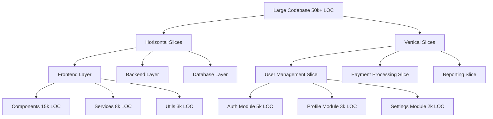
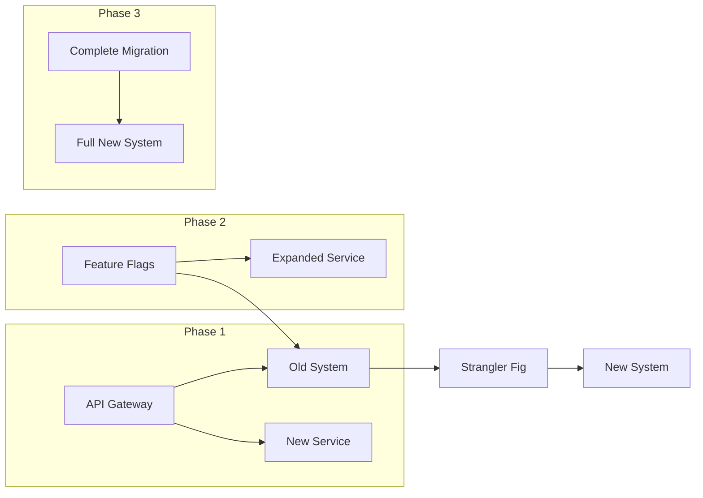

# Глава 8. Паттерны Генерации Кода

## 8.1. Паттерн «Скаффолдинг» (Scaffolding)

### Введение раздела

Представьте, что вы приступаете к строительству дома. Вместо того чтобы начинать с нуля, класть кирпич за кирпичом без плана, вы сначала возводите временные леса — каркас, который поддерживает структуру на этапе строительства. Эти леса не являются частью финального здания, но без них процесс строительства был бы невозможен или крайне неэффективен. Аналогичным образом в Vibe-Coding паттерн «Скаффолдинг» (от англ. *scaffolding* — строительные леса) представляет собой стратегию создания временного структурного каркаса для кода, который впоследствии дорабатывается в полноценное решение.

В предыдущих главах мы рассматривали базовые принципы взаимодействия с Coder-LLM, включая паттерны промптинга и техники декомпозиции задач. Паттерн «Скаффолдинг» является логическим продолжением этих идей, фокусируясь на создании промежуточных структур, которые облегчают генерацию сложного кода. В отличие от традиционного программирования, где разработчик пишет код последовательно, в Vibe-Coding скаффолдинг позволяет «набросать» общую архитектуру решения, а затем постепенно наполнять её деталями.

Цели данного раздела:
1. Объяснить концепцию скаффолдинга в контексте Vibe-Coding и его отличие от традиционных подходов.
2. Продемонстрировать, как скаффолдинг повышает эффективность взаимодействия с Coder-LLM.
3. Предоставить практические примеры использования паттерна в реальных сценариях разработки.
4. Предупредить о распространённых ошибках и предложить стратегии их избегания.
5. Сформировать навыки самостоятельного применения скаффолдинга через практические задания.

Понимание этого паттерна критически важно для разработчиков, стремящихся оптимизировать процесс генерации кода с помощью LLM, особенно при работе над сложными проектами с нечёткими требованиями.

---

## Основная теория

### Определение и сущность паттерна «Скаффолдинг»

Паттерн «Скаффолдинг» в Vibe-Coding — это методология создания временного структурного каркаса программного решения, который служит основой для дальнейшей детализации и генерации кода. Ключевая идея заключается в разбиении процесса разработки на два этапа:
1. **Создание скаффолда** — генерация базовой структуры, включающей сигнатуры функций, классы, интерфейсы, заглушки и комментарии, описывающие предполагаемую логику.
2. **Наполнение скаффолда** — последовательная детализация каждого элемента с использованием Coder-LLM или ручной доработки.

Скаффолд выполняет несколько функций:
- **Структурирование задачи**: Чётко определяет компоненты решения и их взаимосвязи.
- **Снижение когнитивной нагрузки**: Позволяет разработчику фокусироваться на одной подзадаче за раз.
- **Улучшение взаимодействия с LLM**: Предоставляет модели контекст для более точной генерации кода.
- **Формализация требований**: Служит промежуточным артефактом, который можно обсуждать с заказчиками или членами команды.

### Исторический контекст и эволюция подхода

Концепция скаффолдинга не нова в программировании. Её корни можно проследить до:
1. **Методологии быстрой разработки приложений (RAD)**: В 1990-х годах инструменты вроде Delphi или Visual Basic позволяли быстро создавать прототипы интерфейсов, которые затем дорабатывались.
2. **Техники генерации кода**: Инструменты типа CodeSmith или T4-шаблоны в .NET использовали метапрограммирование для создания базовых структур кода.
3. **Подходы к тестированию**: TDD (Test-Driven Development) предполагает написание тестов до реализации, что фактически является формой скаффолдинга.

В контексте работы с LLM скаффолдинг приобрёл новые измерения:
- **Динамическая генерация**: Возможность создавать скаффолды «на лету» на основе описания задачи.
- **Итеративное уточнение**: Постепенная детализация скаффолда с обратной связью от модели.
- **Адаптивность**: Скаффолд может корректироваться в процессе разработки по мере изменения требований.

### Сравнение с традиционными подходами

| Критерий               | Традиционное программирование                     | Vibe-Coding с использованием скаффолдинга          |
|------------------------|---------------------------------------------------|----------------------------------------------------|
| **Стартовая точка**    | Прямое написание кода или проектирование архитектуры | Генерация базового скаффолда с заглушками         |
| **Скорость начала**    | Низкая (требуется детальное планирование)         | Высокая (быстрое создание каркаса)                |
| **Гибкость**           | Низкая (изменения требуют переработки кода)       | Высокая (легко адаптировать скаффолд)             |
| **Роль разработчика**  | Пишет весь код вручную                            | Координирует генерацию и дорабатывает детали      |
| **Обработка неопределённости** | Трудности с нечёткими требованиями        | Скаффолд служит основой для уточнения требований  |
| **Инструменты**        | IDE, системы контроля версий, диаграммы           | Coder-LLM, шаблоны, специализированные промпты    |

**Ключевое отличие**: В традиционном подходе разработчик сразу стремится к созданию рабочего кода, в то время как скаффолдинг фокусируется на создании *структуры*, которая затем наполняется содержанием.

### Метафоры и аналогии для понимания

1. **Архитектурный чертёж**:
   Скаффолд подобен архитектурному чертежу здания. Он не содержит информацию о цвете стен или материале полов, но определяет расположение комнат, дверей и окон. На основе этого чертежа можно детализировать каждый этаж и помещение.

2. **Кулинарный рецепт**:
   В рецепте сначала перечисляются ингредиенты и основные этапы готовки (скаффолд), а затем даются детальные инструкции по приготовлению каждого компонента (наполнение скаффолда).

3. **Музыкальная партитура**:
   Композитор сначала создаёт набросок мелодии (скаффолд), а затем прорабатывает каждую партию для отдельных инструментов.

4. **Дорожная карта**:
   При планировании путешествия сначала определяется общий маршрут (скаффолд), а затем выбираются конкретные остановки и транспорт (детализация).

### Компоненты эффективного скаффолда

Хорошо спроектированный скаффолд должен включать следующие элементы:

1. **Структурные элементы**:
   - Классы и интерфейсы с базовыми сигнатурами методов.
   - Заготовки функций с параметрами и типами возвращаемых значений.
   - Импорты и зависимости.

2. **Документация**:
   - Комментарии, описывающие назначение каждого компонента.
   - TODO-метки с указанием ожидаемой функциональности.
   - Примеры использования для сложных функций.

3. **Заглушки**:
   - Возвращаемые значения-заглушки (например, `return None` в Python).
   - Исключения для нереализованной логики (например, `raise NotImplementedError`).
   - Логирование вызовов для отладки.

4. **Тестовые заготовки**:
   - Базовые тесты, проверяющие структуру скаффолда.
   - Моки для внешних зависимостей.

5. **Архитектурные маркеры**:
   - Разделение на слои (например, API, бизнес-логика, данные).
   - Интерфейсы для будущих реализаций.

**Пример базового скаффолда на Python**:
```python
# scaffold.py - Скаффолд для системы управления задачами

from typing import List, Optional
from dataclasses import dataclass

@dataclass
class Task:
    """Класс для представления задачи."""
    id: int
    title: str
    description: str
    completed: bool = False

class TaskRepository:
    """Интерфейс для хранения задач."""

    def get_all(self) -> List[Task]:
        """Возвращает все задачи. TODO: Реализовать работу с БД."""
        raise NotImplementedError("Метод не реализован")

    def get_by_id(self, task_id: int) -> Optional[Task]:
        """Возвращает задачу по ID."""
        raise NotImplementedError("Метод не реализован")

class TaskService:
    """Бизнес-логика работы с задачами."""

    def __init__(self, repository: TaskRepository):
        self.repository = repository

    def complete_task(self, task_id: int) -> bool:
        """Помечает задачу как выполненную."""
        # TODO: Добавить валидацию, логирование
        task = self.repository.get_by_id(task_id)
        if task:
            task.completed = True
            return True
        return False

# Пример использования (будет расширен)
if __name__ == "__main__":
    repo = TaskRepository()  # В будущем: SQLTaskRepository
    service = TaskService(repo)
    print("Скаффолд инициализирован. Готов к детализации.")
```

### Преимущества использования скаффолдинга

1. **Ускорение разработки**:
   Скаффолд позволяет быстро получить работающую структуру, которую можно постепенно наполнять. Это особенно ценно в условиях ограниченных сроков или нечётких требований.

2. **Улучшение качества кода**:
   - Чёткое разделение ответственности на этапе проектирования скаффолда.
   - Снижение вероятности архитектурных ошибок благодаря предварительному структурированию.

3. **Эффективное взаимодействие с LLM**:
   - Скаффолд предоставляет модели контекст для генерации кода.
   - Уменьшает вероятность генерации нерелевантного кода, так как модель «видит» общую структуру.

4. **Поддержка итеративной разработки**:
   - Легко вносить изменения в архитектуру на ранних этапах.
   - Возможность поэтапной интеграции новых функций.

5. **Документирование на лету**:
   Комментарии и TODO-метки в скаффолде служат документацией для будущей реализации.

### Когда использовать скаффолдинг

Паттерн «Скаффолдинг» особенно эффективен в следующих сценариях:

1. **Проекты с нечёткими требованиями**:
   Когда заказчик не может сразу сформулировать все детали, скаффолд позволяет начать работу с базовой структуры и уточнять требования по мере разработки.

2. **Сложные системы с множеством компонентов**:
   Разработка микросервисов, модульных приложений или систем с слоистой архитектурой.

3. **Прототипирование**:
   Быстрое создание работающего прототипа для демонстрации концепции.

4. **Командная разработка**:
   Разделение работы между несколькими разработчиками, где каждый занимается детализацией отдельного модуля.

5. **Рефакторинг устаревшего кода**:
   Создание нового скаффолда для постепенной миграции функциональности.

### Теоретические основы эффективного скаффолдинга

Для создания эффективного скаффолда необходимо учитывать несколько ключевых принципов:

1. **Принцип минимальной достаточности**:
   Скаффолд должен содержать только необходимые элементы для начала работы. Избыточная детализация на ранних этапах увеличивает когнитивную нагрузку.

2. **Разделение ответственности**:
   Каждый компонент скаффолда должен иметь чётко определённую зону ответственности. Это облегчает последующую детализацию.

3. **Контрактное проектирование**:
   Интерфейсы и сигнатуры методов должны быть спроектированы так, чтобы их можно было использовать без знания внутренней реализации.

4. **Итеративное уточнение**:
   Скаффолд должен быть спроектирован с учётом возможности его расширения и модификации.

5. **Документирование намерений**:
   Комментарии в скаффолде должны объяснять *почему* что-то сделано определённым образом, а не *что* сделано.

**Пример нарушения принципов**:
```python
# Плохой пример: избыточный скаффолд с преждевременной оптимизацией
class TaskManager:
    def __init__(self):
        self.tasks = []
        self.cache = {}  # Зачем кэш на этапе скаффолда?
        self.db_connection = None  # Рано думать о БД

    def add_task(self, title: str, desc: str, priority: int = 1) -> bool:
        """Добавляет задачу с приоритетом (1-5)."""
        # TODO: Валидация приоритета
        # TODO: Работа с БД
        # TODO: Кэширование
        return False  # Заглушка
```

В этом примере скаффолд уже содержит элементы (кэш, БД), которые могут не понадобиться на начальном этапе, усложняя структуру без необходимости.

---

## Практические примеры

В этом разделе мы рассмотрим семь практических примеров использования паттерна «Скаффолдинг» в различных сценариях разработки. Каждый пример будет включать:
- Контекст задачи.
- Пошаговый процесс создания скаффолда.
- Сравнение подходов «до» и «после».
- Детализацию скаффолда с помощью Coder-LLM.

### Пример 1: Скаффолдинг REST API для управления пользователями

**Контекст задачи**:
Необходимо разработать REST API для системы управления пользователями с базовыми CRUD-операциями. Требования частично определены, и команда ожидает уточнений по мере разработки.

**Шаг 1: Создание базового скаффолда**

1. Определяем основные сущности и их связи:
   - Пользователь (User) с полями id, name, email, role.
   - Роль (Role) с полями id, name, permissions.

2. Создаём скаффолд с использованием FastAPI:

```python
# scaffolds/user_api.py
from fastapi import FastAPI, HTTPException
from pydantic import BaseModel
from typing import List, Optional

app = FastAPI()

# Модели данных
class Role(BaseModel):
    id: int
    name: str
    permissions: List[str] = []

class User(BaseModel):
    id: int
    name: str
    email: str
    role: Role

# Репозиторий (интерфейс)
class UserRepository:
    def get_all(self) -> List[User]:
        """Возвращает всех пользователей."""
        raise NotImplementedError()

    def get_by_id(self, user_id: int) -> Optional[User]:
        """Возвращает пользователя по ID."""
        raise NotImplementedError()

    def create(self, user: User) -> User:
        """Создаёт нового пользователя."""
        raise NotImplementedError()

    def update(self, user_id: int, user: User) -> Optional[User]:
        """Обновляет пользователя."""
        raise NotImplementedError()

    def delete(self, user_id: int) -> bool:
        """Удаляет пользователя."""
        raise NotImplementedError()

# Сервис
class UserService:
    def __init__(self, repository: UserRepository):
        self.repository = repository

    def get_users(self) -> List[User]:
        """Получает всех пользователей."""
        return self.repository.get_all()

    def get_user(self, user_id: int) -> User:
        """Получает пользователя по ID."""
        user = self.repository.get_by_id(user_id)
        if not user:
            raise HTTPException(status_code=404, detail="User not found")
        return user

# Маршруты API (заглушки)
@app.get("/users")
async def get_users():
    """Возвращает список всех пользователей."""
    # TODO: Реализовать вызов UserService
    return {"message": "Not implemented"}

@app.post("/users")
async def create_user(user: User):
    """Создаёт нового пользователя."""
    # TODO: Реализовать логику
    return {"message": "Not implemented"}
```

**Шаг 2: Детализация скаффолда с помощью LLM**

Промпт для Coder-LLM:
```
На основе предоставленного скаффолда REST API для управления пользователями, реализуй следующие методы:

1. Маршрут GET /users должен возвращать список всех пользователей, используя UserService.
2. Маршрут POST /users должен создавать нового пользователя и возвращать его с присвоенным ID.
3. Добавь валидацию email через регулярное выражение.
4. Реализуй простую in-memory репозиторию для UserRepository.

Требования:
- Используй FastAPI и Pydantic.
- Добавь обработку ошибок.
- Включи примеры запросов/ответов в комментариях.
```

**Результат детализации**:
```python
# user_api.py (детализированный вариант)
import re
from fastapi import FastAPI, HTTPException
from pydantic import BaseModel, validator
from typing import List, Optional, Dict

app = FastAPI()

# Модели данных
class Role(BaseModel):
    id: int
    name: str
    permissions: List[str] = []

class User(BaseModel):
    id: int
    name: str
    email: str
    role: Role

    @validator('email')
    def validate_email(cls, v):
        if not re.match(r'^[a-zA-Z0-9._%+-]+@[a-zA-Z0-9.-]+\.[a-zA-Z]{2,}$', v):
            raise ValueError('Invalid email format')
        return v

# In-memory репозиторий
class InMemoryUserRepository(UserRepository):
    def __init__(self):
        self.users: Dict[int, User] = {}
        self.next_id = 1

    def get_all(self) -> List[User]:
        return list(self.users.values())

    def get_by_id(self, user_id: int) -> Optional[User]:
        return self.users.get(user_id)

    def create(self, user: User) -> User:
        user.id = self.next_id
        self.users[user.id] = user
        self.next_id += 1
        return user

    def update(self, user_id: int, user: User) -> Optional[User]:
        if user_id in self.users:
            user.id = user_id
            self.users[user_id] = user
            return user
        return None

    def delete(self, user_id: int) -> bool:
        if user_id in self.users:
            del self.users[user_id]
            return True
        return False

# Сервис
class UserService:
    def __init__(self, repository: UserRepository):
        self.repository = repository

    def get_users(self) -> List[User]:
        return self.repository.get_all()

    def get_user(self, user_id: int) -> User:
        user = self.repository.get_by_id(user_id)
        if not user:
            raise HTTPException(status_code=404, detail="User not found")
        return user

    def create_user(self, user_data: User) -> User:
        # Проверяем уникальность email
        existing_users = self.repository.get_all()
        if any(u.email == user_data.email for u in existing_users):
            raise HTTPException(status_code=400, detail="Email already exists")
        return self.repository.create(user_data)

# Инициализация зависимостей
repository = InMemoryUserRepository()
service = UserService(repository)

# Маршруты API
@app.get("/users", response_model=List[User])
async def get_users():
    """Возвращает список всех пользователей.
    Пример ответа:
    [
        {
            "id": 1,
            "name": "John Doe",
            "email": "john@example.com",
            "role": {"id": 1, "name": "admin", "permissions": ["read", "write"]}
        }
    ]
    """
    return service.get_users()

@app.post("/users", response_model=User, status_code=201)
async def create_user(user: User):
    """Создаёт нового пользователя.
    Пример запроса:
    {
        "name": "Alice Smith",
        "email": "alice@example.com",
        "role": {"id": 2, "name": "user", "permissions": ["read"]}
    }
    """
    return service.create_user(user)
```

**Сравнительная таблица**:

| Критерий               | До скаффолдинга                          | После скаффолдинга                          |
|------------------------|------------------------------------------|---------------------------------------------|
| **Время на старт**     | 1-2 часа на проектирование архитектуры   | 15-30 минут на создание скаффолда          |
| **Гибкость**           | Трудно вносить изменения в архитектуру  | Легко модифицировать структуру             |
| **Качество кода**      | Высокий риск архитектурных ошибок       | Чёткое разделение ответственности          |
| **Взаимодействие с LLM** | Требуется сложный промпт для генерации  | LLM получает готовый контекст              |
| **Документация**       | Создаётся отдельно                       | Документация интегрирована в код           |

### Пример 2: Скаффолдинг системы аналитики данных

**Контекст задачи**:
Требуется разработать систему для сбора, обработки и визуализации данных о продажах. Требования включают обработку CSV-файлов, агрегацию данных и генерацию отчётов.

**Скаффолд системы**:
```python
# scaffolds/sales_analytics.py
from dataclasses import dataclass
from typing import List, Dict, Optional
import pandas as pd  # Импорт для будущей реализации

@dataclass
class SaleRecord:
    """Запись о продаже."""
    product_id: str
    product_name: str
    category: str
    price: float
    quantity: int
    sale_date: str

class DataLoader:
    """Интерфейс для загрузки данных."""

    def load_from_csv(self, file_path: str) -> List[SaleRecord]:
        """Загружает данные из CSV."""
        raise NotImplementedError()

    def load_from_db(self, query: str) -> List[SaleRecord]:
        """Загружает данные из БД."""
        raise NotImplementedError()

class DataProcessor:
    """Обработка и агрегация данных."""

    def calculate_total_sales(self, records: List[SaleRecord]) -> float:
        """Рассчитывает общую сумму продаж."""
        raise NotImplementedError()

    def get_sales_by_category(self, records: List[SaleRecord]) -> Dict[str, float]:
        """Агрегирует продажи по категориям."""
        raise NotImplementedError()

class ReportGenerator:
    """Генерация отчётов."""

    def generate_csv_report(self, data: Dict, output_path: str) -> bool:
        """Генерирует отчёт в формате CSV."""
        raise NotImplementedError()

    def generate_visual_report(self, data: Dict) -> str:
        """Генерирует визуальный отчёт (например, HTML)."""
        raise NotImplementedError()

# Пример использования
def main():
    loader = DataLoader()  # TODO: Выбрать реализацию (CSV/DB)
    processor = DataProcessor()
    reporter = ReportGenerator()

    print("Скаффолд системы аналитики инициализирован.")

if __name__ == "__main__":
    main()
```

**Детализация с помощью LLM**:
Промпт:
```
Реализуй следующую функциональность для скаффолда sales_analytics.py:

1. Реализуй DataLoader для загрузки из CSV (используй pandas).
2. Реализуй метод calculate_total_sales в DataProcessor.
3. Реализуй метод get_sales_by_category для агрегации по категориям.
4. Добавь базовую валидацию данных при загрузке.
5. Создай пример CSV-файла и протестируй систему.

Требования:
- Используй pandas для обработки данных.
- Добавь обработку ошибок при загрузке файла.
- Включи примеры данных в комментариях.
```

Результат детализации:

---

## 8.2. Паттерн «Дифф-Мышление» (Diff-Thinking)

### Введение раздела

Представьте, что вы стоите перед сложной задачей рефакторинга кода, где необходимо изменить структуру данных, не нарушая работоспособность системы. Традиционный подход потребовал бы создания отдельной ветки, внесения изменений и последующего слияния с основной кодовой базой. Однако в мире Vibe-Coding существует более эффективная парадигма - паттерн «Дифф-Мышление» (Diff-Thinking), который переосмысливает сам процесс внесения изменений в код.

Этот раздел продолжает тему паттернов генерации кода, начатую в предыдущих разделах главы, и фокусируется на революционном подходе к модификации кода с использованием возможностей Coder-LLM. В отличие от паттерна «Итеративное уточнение», который мы рассматривали ранее, Diff-Thinking ориентирован не на постепенное улучшение решения, а на целенаправленное преобразование существующего кода с минимальными затратами ресурсов.

Основная цель этого раздела - научить вас мыслить в терминах «диффов» (различий), а не конечных состояний кода. Мы рассмотрим, как этот паттерн трансформирует процесс разработки, позволяя:
- Минимизировать ручное редактирование кода
- Сохранять контекст изменений
- Управлять сложными преобразованиями через серию небольших, контролируемых шагов
- Использовать возможности LLM для генерации точечных модификаций

Этот подход особенно ценен в ситуациях, когда необходимо внести системные изменения, затрагивающие множество файлов, или когда требуется сохранить существующую функциональность при радикальном изменении архитектуры.

## Основная теория

### Концептуальные основы Diff-Thinking

Diff-Thinking - это паттерн взаимодействия с Coder-LLM, при котором основное внимание уделяется не генерации нового кода «с нуля», а точечной модификации существующего кода через осознанное формирование «диффов» (различий между версиями). Термин «дифф» происходит от команды Unix `diff`, которая показывает различия между файлами, и в контексте Vibe-Coding приобретает более глубокий смысл.

Ключевые принципы Diff-Thinking:
1. **Атомарность изменений**: Каждый запрос к LLM формулируется как минимально возможное преобразование
2. **Контекстная осведомленность**: Модель должна понимать не только текущее состояние кода, но и его эволюцию
3. **Инкрементальность**: Сложные изменения разбиваются на серию последовательных шагов
4. **Семантическая точность**: Диффы должны сохранять семантику кода, а не просто его синтаксис

### Исторический контекст и эволюция подхода

Концепция Diff-Thinking не возникла на пустом месте - она является естественным развитием нескольких технологических трендов:

1. **Системы контроля версий**: Идея работы с изменениями, а не с конечными состояниями, берёт начало в системах типа Git, где история проекта представляется как последовательность коммитов.
2. **Рефакторинговые инструменты**: Такие инструменты как JetBrains IDE или VS Code Refactoring уже давно автоматизируют типовые преобразования кода.
3. **Declarative Infrastructure**: Подходы типа Terraform, где описывается желаемое состояние инфраструктуры, а не последовательность команд для его достижения.
4. **LLM-помощники**: Современные Coder-LLM способны не только генерировать код, но и анализировать существующий, предлагая точечные улучшения.

В традиционном программировании процесс модификации кода выглядит следующим образом:
1. Анализ текущего состояния
2. Ручное редактирование файлов
3. Проверка работоспособности
4. Фиксация изменений

Diff-Thinking переворачивает эту парадигму:
1. Определение целевого изменения в терминах диффа
2. Генерация специфического преобразования с помощью LLM
3. Применение сгенерированного диффа
4. Верификация результата

### Сравнение с традиционными подходами

| Критерий               | Традиционный подход          | Diff-Thinking                     |
|------------------------|------------------------------|-----------------------------------|
| Единица работы         | Файл/функция                 | Минимальный семантический дифф   |
| Контекст изменений     | Локальный                    | Глобальный (история изменений)    |
| Способ модификации     | Ручное редактирование        | Генерация + применение диффа      |
| Управление сложностью  | Через ветвление              | Через композицию диффов           |
| Верификация            | После внесения изменений     | Параллельно с генерацией диффа    |
| Типичная ошибка        | Логические несоответствия    | Семантическое несохранение        |

### Метафоры и аналогии

Для лучшего понимания концепции Diff-Thinking можно использовать несколько метафор:

1. **Хирургическая операция**: Вместо ампутации конечности (полной переработки модуля) проводится точечная операция на конкретном участке кода.
2. **Редактирование текста**: Подобно тому, как писатель перерабатывает абзац, сохраняя общий смысл главы, разработчик модифицирует функцию, не нарушая архитектуру системы.
3. **Генетическая модификация**: Вместо создания организма с нуля (нового проекта) производится целенаправленное изменение ДНК (кода) для достижения желаемого результата.
4. **3D-печать**: Добавление материала к существующей модели (как в аддитивном производстве) вместо создания новой формы.

**Внимание!** Ключевое отличие Diff-Thinking от простого «исправления кода» с помощью LLM заключается в системном подходе к формированию запросов и интерпретации результатов. Это не просто инструмент для исправления ошибок, а новая методология разработки.

## Практические примеры

### Пример 1: Простое переименование с сохранением контекста

**Задача**: В проекте необходимо переименовать функцию `calculateTotal` в `computeOrderTotal`, при этом во всех местах вызова должна сохраниться логика обработки ошибок.

**Традиционный подход**:
1. Найти все вхождения `calculateTotal` с помощью grep/IDE
2. Вручную заменить на `computeOrderTotal`
3. Проверить каждое изменение на предмет сохранения обработки ошибок

**Diff-Thinking подход**:

```python
# Исходный код
def calculateTotal(items, discount=0):
    if not items:
        raise ValueError("Empty items list")
    return sum(item.price for item in items) * (1 - discount)

# Запрос к LLM:
"""
Сгенерируй дифф для переименования функции calculateTotal в computeOrderTotal с сохранением:
1. Всех сигнатур вызова
2. Логики обработки ошибок
3. Существующей документации
Обеспечь, чтобы все вызовы функции были обновлены соответствующим образом.
Формат диффа: унифицированный diff (unified diff)
"""

# Сгенерированный дифф:
"""
--- original.py
+++ modified.py
@@ -1,7 +1,7 @@
-def calculateTotal(items, discount=0):
+def computeOrderTotal(items, discount=0):
     '''
     Calculate total price for items with discount applied

-    Args:
-        items: list of Item objects
-        discount: float between 0 and 1
+    Args:
+        items: list of Item objects
+        discount: float between 0 and 1
     Returns:
         float: total price
@@ -10,7 +10,7 @@
         raise ValueError("Empty items list")
     return sum(item.price for item in items) * (1 - discount)

-# Example usage
-order_total = calculateTotal(cart_items, 0.1)
+order_total = computeOrderTotal(cart_items, 0.1)
"""
```

**Пошаговая инструкция**:
1. Скопируйте текущий код в буфер обмена
2. Сформулируйте запрос к LLM с чёткими требованиями к сохранению контекста
3. Получите дифф и сохраните его в файл (например, `rename.diff`)
4. Примените дифф с помощью команды `patch < rename.diff`
5. Проверьте результат с помощью линтера и тестов

**Преимущества подхода**:
- Сохранение всей семантики кода
- Атомарность изменения
- Возможность отката через `patch -R`

### Пример 2: Рефакторинг с изменением сигнатуры

**Задача**: Изменить сигнатуру функции `process_payment` с `(amount, currency, user_id)` на `(payment_data: dict, user: User)` для улучшения читаемости.

**Традиционное решение**:
1. Изменить определение функции
2. Найти все вызовы и адаптировать их
3. Обновить тесты
4. Проверить работоспособность

**Diff-Thinking решение**:

```python
# Исходный код
def process_payment(amount, currency, user_id):
    if amount <= 0:
        raise ValueError("Invalid amount")
    user = User.query.get(user_id)
    if not user:
        raise ValueError("User not found")
    # ... payment processing logic

# Запрос к LLM:
"""
Выполни рефакторинг функции process_payment:
1. Измени сигнатуру на (payment_data: dict, user: User)
2. payment_data должен содержать amount и currency
3. user_id замени на объект User
4. Сохрани всю валидационную логику
5. Обнови все вызовы функции в проекте
Сгенерируй единый дифф, который можно применить к репозиторию.
"""

# Сгенерированный дифф:
"""
--- payment.py
+++ payment.py
@@ -1,11 +1,13 @@
-def process_payment(amount, currency, user_id):
+def process_payment(payment_data: dict, user: User):
     '''
-    Process payment for given amount and currency
+    Process payment using payment data and user object

-    Args:
-        amount: decimal amount
-        currency: 3-letter currency code
-        user_id: ID of user making payment
+    Args:
+        payment_data: dict with 'amount' and 'currency' keys
+        user: User object
     '''
+    if not isinstance(payment_data, dict):
+        raise ValueError("payment_data must be dictionary")
     if payment_data['amount'] <= 0:
         raise ValueError("Invalid amount")
-    user = User.query.get(user_id)
+    if not user:
+        raise ValueError("User not found")
     # ... payment processing logic

--- order.py
+++ order.py
@@ -42,7 +42,8 @@
         if self.status == 'pending':
             try:
-                process_payment(self.total, self.currency, self.user_id)
+                process_payment(
+                    {'amount': self.total, 'currency': self.currency},
+                    User.query.get(self.user_id))
                 self.status = 'paid'
             except Exception as e:
                 self.status = 'failed'
"""
```

**Сравнительная таблица**:

| Аспект                | Традиционный подход       | Diff-Thinking подход       |
|-----------------------|---------------------------|----------------------------|
| Время выполнения      | 30-60 минут               | 5-10 минут                 |
| Риск ошибок           | Высокий                   | Низкий                     |
| Сохранение контекста  | Ручное                    | Автоматическое             |
| Документация          | Требует ручного обновления| Обновляется в диффе        |
| Обработка зависимостей| Ручное обновление         | Автоматическое обновление  |

### Пример 3: Системное изменение архитектуры

**Задача**: Перевести проект с синхронной обработки на асинхронную с использованием asyncio.

**Традиционный подход**:
1. Создать отдельную ветку
2. Постепенно заменять синхронные вызовы на асинхронные
3. Обновлять тесты
4. Проводить длительное тестирование

**Diff-Thinking подход**:

```python
# Исходный код (sync_version.py)
def fetch_user_data(user_id):
    user = db.query(User).filter_by(id=user_id).first()
    orders = db.query(Order).filter_by(user_id=user_id).all()
    return {'user': user, 'orders': orders}

def generate_report(user_id):
    data = fetch_user_data(user_id)
    return f"User {data['user'].name} has {len(data['orders'])} orders"

# Первый шаг: обёртка в Future
"""
Сгенерируй дифф для первого шага асинхронизации:
1. Оберни fetch_user_data в asyncio.Future
2. Сохрани текущую сигнатуру
3. Обнови все вызовы для работы с Future
4. Добавь await где необходимо
"""

# Промежуточный дифф:
"""
--- sync_version.py
+++ async_step1.py
@@ -1,7 +1,7 @@
-import db
+import db, asyncio
-from concurrent.futures import Future
+import asyncio

-def fetch_user_data(user_id):
-    user = db.query(User).filter_by(id=user_id).first()
-    orders = db.query(Order).filter_by(user_id=user_id).all()
-    return {'user': user, 'orders': orders}
+async def fetch_user_data(user_id):
+    future = asyncio.Future()
+    def wrapper():
+        user = db.query(User).filter_by(id=user_id).first()
+        orders = db.query(Order).filter_by(user_id=user_id).all()
+        future.set_result({'user': user, 'orders': orders})
+    asyncio.create_task(wrapper())
+    return await future

-async def generate_report(user_id):
-    data = fetch_user_data(user_id)
+async def generate_report(user_id):
+    data = await fetch_user_data(user_id)
     return f"User {data['user'].name} has {len(data['orders'])} orders"
"""

# Второй шаг: полная асинхронизация
"""
Теперь преобразуй fetch_user_data в полностью асинхронную версию:
1. Замени db.query на асинхронные аналоги
2. Удали обёртку в Future
3. Сохрани все вызовы и сигнатуры
4. Обнови документацию
"""

# Финальный дифф:
"""
--- async_step1.py
+++ async_final.py
@@ -1,16 +1,10 @@
 import db, asyncio

-async def fetch_user_data(user_id):
-    future = asyncio.Future()
-    def wrapper():
-        user = db.query(User).filter_by(id=user_id).first()
-        orders = db.query(Order).filter_by(user_id=user_id).all()
-        future.set_result({'user': user, 'orders': orders})
-    asyncio.create_task(wrapper())
-    return await future
+async def fetch_user_data(user_id):
+    user = await db.async_query(User).filter_by(id=user_id).first()
+    orders = await db.async_query(Order).filter_by(user_id=user_id).all()
+    return {'user': user, 'orders': orders}

 async def generate_report(user_id):
-    data = await fetch_user_data(user_id)
+    data = await fetch_user_data(user_id)
     return f"User {data['user'].name} has {len(data['orders'])} orders"
"""
```

**Алгоритм для сложных преобразований**:
1. Разбейте изменение на последовательные шаги
2. Для каждого шага:
   a. Сформулируйте чёткие требования к диффу
   b. Получите сгенерированный дифф
   c. Примените и протестируйте
   d. Зафиксируйте изменения
3. Проведите финальную верификацию

### Пример 4: Миграция на новый API

**Задача**: Заменить устаревший API платежной системы на новый с сохранением функциональности.

```python
# Старый API
class OldPaymentGateway:
    def charge(self, amount, currency, card_token):
        # ... old implementation
        return {'status': 'success', 'transaction_id': 'old123'}

# Новый API
class NewPaymentGateway:
    def create_payment(self, amount, currency, payment_method):
        # ... new implementation
        return {'status': 'succeeded', 'id': 'new456'}
```

**Запрос к LLM**:
"""
Создай дифф для миграции с OldPaymentGateway на NewPaymentGateway:
1. Сохрани все существующие интерфейсы вызова
2. Адаптируй ответы старого API к новому формату
3. Добавь обработку новых возможных ошибок
4. Сохрани все тесты в рабочем состоянии
5. Добавь временные логи для отладки миграции
"""

**Сгенерированный дифф** будет включать:
- Адаптер для старого интерфейса
- Преобразование форматов ответа
- Добавление новых обработчиков ошибок
- Обновление тестов с учётом новых статусов

### Пример 5: Массовое изменение стиля кодирования

**Задача**: Привести кодовую базу к новому стилю оформления (например, переход с 4 пробелов на 2, изменение именования констант).

```python
# До
CONSTANT_VALUE = 100
def calculate_something(param1, param2):
    result = param1 * param2 * CONSTANT_VALUE
    return result

# После
constant_value = 100

def calculate_something(param_1, param_2):
    result = param_1 * param_2 * constant_value
    return result
```

**Особенности подхода**:
- Использование LLM для генерации специфического диффа для каждого правила стиля
- Постепенное применение изменений для минимизации конфликтов
- Автоматическая проверка с помощью линтеров

## Распространенные ошибки

### Ошибка 1: Недостаточная специфичность запроса

**Проблема**: Разработчики формулируют слишком общие запросы, что приводит к диффам, не учитывающим контекст.

**Пример плохого запроса**:
"Сделай этот код лучше"

**Хороший запрос**:
"Сгенерируй дифф для:
1. Добавления type hints ко всем функциям
2. Сохранения текущей функциональности
3. Обновления документации
4. Формата unified diff"

**Как избежать**:
- Всегда указывайте конкретные требования
- Определяйте формат выходных данных
- Указывайте, что должно остаться неизменным

### Ошибка 2: Игнорирование побочных эффектов

**Проблема**: При генерации диффов не учитываются побочные эффекты изменений, такие как:
- Изменение поведения при граничных условиях
- Нарушение обратной совместимости
- Изменение производительности

**Пример**:
При переименовании функции не учитывается, что она используется в качестве callback в сторонней библиотеке.

**Решение**:
- Всегда проверяйте вызовы функции через `grep` или IDE
- Используйте аннотации `@deprecated` для плавного перехода
- Тестируйте критические сценарии использования

### Ошибка 3: Чрезмерная зависимость от одного диффа

**Проблема**: Попытка решить слишком много задач в одном диффе приводит к:
- Сложности в отладке
- Трудностям при частичном откате
- Потере контроля над изменениями

**Решение**:
- Разбивайте сложные изменения на последовательность атомарных диффов
- Каждый дифф должен решать одну конкретную задачу
- Используйте инструменты для композиции диффов

### Ошибка 4: Недостаточная верификация диффов

**Проблема**: Автоматическое применение сгенерированных диффов без проверки приводит к:
- Синтаксическим ошибкам
- Логическим несоответствиям
- Потере данных

**Предупреждающие знаки**:
- Дифф содержит изменения в неожиданных местах
- Удаляются важные комментарии или документация
- Изменяется порядок аргументов функций

**Лучшие практики**:
1. Всегда проверяйте дифф перед применением:
   ```bash
   patch --dry-run < changes.diff
   ```
2. Используйте инструменты анализа диффов:
   ```bash
   diffstat changes.diff
   ```
3. Применяйте изменения в отдельной ветке:
   ```bash
   git checkout -b diff-thinking-changes
   patch < changes.diff
   ```

### Ошибка 5: Игнорирование контекста проекта

**Проблема**: Генерация диффов без учёта:
- Архитектурных ограничений проекта
- Соглашений о кодировании
- Особенностей deployment pipeline

**Пример**:
Генерация диффа, который нарушает layering архитектуры проекта.

**Решение**:
- Включайте в запрос информацию о структуре проекта
- Указывайте архитектурные ограничения
- Проверяйте соответствие соглашениям о кодировании

**Шаблон хорошего запроса**:
"""
Сгенерируй дифф для изменения сигнатуры функции X:
1. Следуй архитектурным правилам проекта (layering)
2. Сохрани текущие соглашения о кодировании (PEP 8)
3. Не изменяй публичные интерфейсы без необходимости
4. Учти, что проект использует Python 3.8+
5. Формат: unified diff
"""

## Практические задания

### Задание 1: Базовое переименование с сохранением контекста

**Цель**: Освоить создание и применение простых диффов для переименования.

**Задача**:
В проекте есть функция `get_user_profile(user_id)`, которая используется в нескольких модулях. Необходимо переименовать её в `fetch_user_details`, сохранив:
- Все вызовы функции
- Существующую документацию
- Обработку ошибок

**Требования**:
1. Создайте запрос к LLM для генерации диффа
2. Получите и примените дифф
3. Проверьте работоспособность кода
4. Сохраните дифф в файл `rename_user_profile.diff`

**Критерии выполнения**:
- Все вызовы функции обновлены
- Документация соответствует новому имени
- Нет синтаксических ошибок
- Исходная функциональность сохранена

**Пример для проверки**:
```python
# До
def get_user_profile(user_id):
    """Get user profile by ID"""
    if not user_id:
        raise ValueError("Invalid user ID")
    return db.query(User).get(user_id)

# После
def fetch_user_details(user_id):
    """Fetch user details by ID"""
    if not user_id:
        raise ValueError("Invalid user ID")
    return db.query(User).get(user_id)
```

### Задание 2: Рефакторинг с изменением структуры данных

**Цель**: Научиться работать с диффами для сложных преобразований.

**Задача**:
В проекте используется словарь для хранения пользовательских данных:
```python
user_data = {
    'id': 123,
    'name': 'John',
    'email': 'john@example.com',
    'preferences': {
        'theme': 'dark',
        'notifications': True
    }
}
```

Необходимо преобразовать структуру в объект с вложенными классами:
```python
class UserPreferences:
    def __init__(self, theme, notifications):
        self.theme = theme
        self.notifications = notifications

class User:
    def __init__(self, id, name, email, preferences):
        self.id = id
        self.name = name
        self.email = email
        self.preferences = preferences
```

**Требования**:
1. Создайте серию диффов для постепенного преобразования
2. Сохраните все существующие вызовы и доступ к данным
3. Обновите соответствующую документацию
4. Убедитесь, что все тесты проходят

**Критерии выполнения**:
- Все использования старой структуры обновлены
- Новая структура полностью работоспособна
- Нет потери данных при преобразовании
- Все тесты проходят без изменений

### Задание 3: Миграция на новый фреймворк

**Цель**: Освоить системные изменения через последовательность диффов.

**Задача**:
В проекте используется устаревший фреймворк для валидации данных:
```python
from old_validator import validate

@validate(schema=UserSchema)
def create_user(user_data):
    # ...
```

Необходимо перейти на использование Pydantic:
```python
from pyd

---

## 8.3. Паттерн «Стилистический Камуфляж» (Style Transfer)

# 8.3. Паттерн «Стилистический Камуфляж» (Style Transfer)

## Введение раздела

Представьте, что вы переезжаете в новую страну с совершенно другой культурой и языком. Ваши базовые знания остаются при вас, но чтобы эффективно общаться и быть понятым, вам необходимо адаптировать свой стиль речи, манеры и даже выражение эмоций к местным нормам. Аналогичная ситуация возникает в мире Vibe-Coding при взаимодействии с Coder-LLM: ваши фундаментальные знания программирования остаются актуальными, но для максимальной эффективности требуется адаптация стиля кода к предпочтениям конкретной модели.

Паттерн «Стилистический Камуфляж» (Style Transfer) - это методика целенаправленной трансформации вашего кода в стиль, оптимально воспринимаемый конкретной Coder-LLM. Этот раздел продолжает тему паттернов генерации кода, начатую в предыдущих разделах (8.1 «Атомарные Инструкции» и 8.2 «Лестница Детализации»), и углубляет понимание того, как форма представления кода влияет на качество выходных данных модели.

Цели данного раздела:
1. Объяснить концепцию стилистического переноса в контексте генерации кода
2. Продемонстрировать ключевые различия между традиционными стилями программирования и стилями, оптимизированными для Coder-LLM
3. Научить идентифицировать и применять наиболее эффективные стилистические паттерны
4. Предоставить инструментарий для адаптации существующего кода под требования конкретных моделей
5. Раскрыть потенциальные подводные камни и стратегии их преодоления

Понимание этого паттерна особенно важно для разработчиков, которые уже имеют опыт классического программирования, но сталкиваются с неожиданными трудностями при взаимодействии с Coder-LLM. В то время как традиционное обучение программированию фокусируется на синтаксической правильности и алгоритмической эффективности, Vibe-Coding добавляет дополнительное измерение: стилистическую оптимизацию для конкретного "читателя" - языковой модели.

## Основная теория

### Концептуальная основа стилистического переноса

Стилистический камуфляж в контексте Vibe-Coding - это процесс целенаправленного преобразования структуры, синтаксиса и семантики кода таким образом, чтобы максимизировать вероятность генерации Coder-LLM желаемого результата. В отличие от традиционного рефакторинга, который нацелен на улучшение читаемости для людей и производительности, стилистический перенос фокусируется на оптимизации восприятия кода языковой моделью.

**Ключевые аспекты паттерна:**
1. **Синтаксический отпечаток** - характерные шаблоны и конструкции, предпочитаемые конкретной моделью
2. **Семантическая плотность** - оптимальное соотношение между объемом кода и количеством передаваемой информации
3. **Контекстуальная согласованность** - соответствие стиля текущей задаче и предметной области
4. **Стилевая гармония** - согласованность между различными частями генерируемого кода

### Исторический контекст и эволюция подхода

Идея стилистической адаптации кода имеет корни в нескольких областях:

1. **Стили программирования** (1960-1980-е):
   - Появление структурного программирования (Дейкстра)
   - Развитие парадигм ООП и функционального программирования
   - Ранние попытки формализации "хорошего стиля" (например, книги Кернигана и Плоджера)

2. **Метапрограммирование и генерация кода** (1990-2000-е):
   - Появление шаблонов проектирования (Гамма и др.)
   - Развитие инструментов генерации кода (XSLT, T4)
   - Исследования по стилистической адаптации кода для специфических платформ

3. **Эра больших языковых моделей** (2020-е):
   - Появление трансформерных архитектур
   - Развитие специализированных Coder-LLM (GitHub Copilot, CodeLLama)
   - Исследования по влиянию стиля запросов на качество генерации

**Сравнение с традиционными подходами:**

| Критерий                | Традиционное программирование | Vibe-Coding (Style Transfer) |
|-------------------------|-------------------------------|------------------------------|
| Основной читатель       | Человек-девелопер             | Языковая модель              |
| Критерии качества       | Читаемость, производительность| Вероятность правильной генерации |
| Стилевые правила        | Фиксированные (PEP8, JSLint) | Динамические (зависят от модели) |
| Рефакторинг             | Улучшение кода для людей       | Оптимизация для модели        |
| Контекстуальная зависимость | Низкая                    | Высокая                      |

### Метафоры и аналогии

Для лучшего понимания концепции стилистического камуфляжа можно использовать несколько метафор:

1. **Перевод между языками программирования**:
   Подобно тому, как при переводе с одного человеческого языка на другой важно не только передать значение, но и сохранить стилистические нюансы (формальный/неформальный стиль, культурные отсылки), при стилистическом переносе мы адаптируем код к "языку", на котором лучше всего "говорит" конкретная модель.

2. **Адаптация одежды к ситуации**:
   Вы не наденете деловой костюм на пляжную вечеринку, как и спортивный костюм на официальную встречу. Аналогично, для разных задач и разных моделей требуются разные "стилистические костюмы" кода.

3. **Кулинарные рецепты для разных поваров**:
   Один и тот же рецепт может быть записан с разной степенью детализации - для профессионального повара хватит краткого описания, для новичка нужны пошаговые инструкции. Так и с кодом - разные модели требуют разной степени детализации и стиля представления.

4. **Музыкальные партитуры**:
   Композиция может быть записана в классической нотации, табулатуре или даже графической нотации. Каждая форма имеет свои преимущества для разных исполнителей. Аналогично, код можно представлять в разных стилях для разных "исполнителей" - моделей.

### Теоретическая модель стилистического переноса

Для формализации процесса стилистического переноса можно предложить следующую модель:

1. **Анализ целевой модели**:
   - Определение предпочитаемых стилей (по документации, примерам, эмпирическим данным)
   - Идентификация характерных паттернов (например, предпочтение определенных конструкций)
   - Понимание контекстуальных предпочтений (какие стили лучше работают для разных типов задач)

2. **Диагностика исходного кода**:
   - Анализ текущего стиля (использование автоматизированных инструментов)
   - Выявление стилистических маркеров (особенностей синтаксиса, именования, структуры)
   - Определение потенциальных конфликтов с целевым стилем

3. **Трансформационная матрица**:
   - Создание набора правил преобразования (что менять, как менять)
   - Определение приоритетов трансформации (что важнее - читаемость или точность генерации)
   - Разработка стратегии сохранения семантики при изменении синтаксиса

4. **Валидация результата**:
   - Проверка сохранности функциональности
   - Оценка улучшения восприятия моделью
   - Тестирование на реальных задачах генерации

**Пример трансформационной матрицы для Python -> Python (оптимизированный для модели):**

| Исходный стиль       | Целевой стиль               | Правило трансформации                     | Пример преобразования |
|----------------------|-----------------------------|-------------------------------------------|-----------------------|
| Многострочные комментарии | Однострочные комментарии | Разбивать длинные комментарии на короткие | `# Это очень длинный комментарий, который объясняет сложную логику` → `# Объясняет сложную логику` (на отдельной строке) |
| Сложные list comprehension | Циклы for с явными условиями | Разбивать сложные comprehension на простые шаги | `[x for x in data if x > 0 and len(str(x)) > 2]` → `result = []\nfor x in data:\n    if x > 0 and len(str(x)) > 2:\n        result.append(x)` |
| Длинные имена переменных | Сокращенные имена с комментариями | Использовать общепринятые сокращения | `current_user_authentication_status` → `auth_status` + комментарий |
| Вложенные условия | Плоские условия с ранним возвратом | Применять паттерн "guard clauses" | `if condition:\n    if another_condition:\n        ...` → `if not condition: return\nif not another_condition: return\n...` |

### Когнитивные аспекты восприятия кода моделями

Исследования показывают, что языковые модели воспринимают код принципиально иначе, чем люди:

1. **Синтаксический сахар**:
   Модели часто лучше работают с более "базовыми" конструкциями языка. Например, тернарный оператор `x if condition else y` может восприниматься хуже, чем эквивалентная конструкция с `if-else`.

2. **Порядок информации**:
   В отличие от людей, модели более чувствительны к порядку представления информации в коде. Лучше сначала давать определения, а затем их использовать.

3. **Плотность информации**:
   Слишком плотный код (много операций в одной строке) может быть хуже воспринят моделью, чем эквивалентный, но более развернутый вариант.

4. **Контекстуальные подсказки**:
   Модели лучше воспринимают код, когда контекст явно выражен в именах переменных и комментариях, даже если для человека это может казаться избыточным.

**Пример влияния порядка информации:**

```python
# Плохо (для модели):
result = process_data(get_data())

# Лучше:
data = get_data()
result = process_data(data)
```

### Математическая модель стилистической оптимизации

Для формализации процесса стилистического переноса можно использовать модель оптимизации:

Пусть:
- \( Q(s, m) \) - функция качества генерации для стиля \( s \) и модели \( m \)
- \( S \) - пространство возможных стилей
- \( C \) - пространство возможных контекстов
- \( T(s_1, s_2) \) - функция трансформации из стиля \( s_1 \) в \( s_2 \)

Тогда задача оптимального стилистического переноса формулируется как:

\[ s^* = \arg\max_{s \in S} Q(T(s_{original}, s), m, c) \]

Где:
- \( s_{original} \) - исходный стиль кода
- \( c \) - текущий контекст задачи
- \( s^* \) - оптимальный целевой стиль

На практике эта оптимизация решается эвристическими методами, так как точные значения \( Q \) и \( T \) неизвестны.

## Практические примеры

### Пример 1: Преобразование функционального стиля в императивный

**Задача**: Модель плохо воспринимает функциональный стиль Python (с использованием map, filter, reduce) и генерирует ошибочный код.

**Исходный код (функциональный стиль):**
```python
# Функциональный стиль, который плохо воспринимается моделью
numbers = [1, 2, 3, 4, 5]
squared_evens = list(map(lambda x: x**2, filter(lambda x: x % 2 == 0, numbers)))
```

**Трансформированный код (императивный стиль):**
```python
# Императивный стиль, лучше воспринимаемый моделью
numbers = [1, 2, 3, 4, 5]
squared_evens = []

for num in numbers:
    if num % 2 == 0:  # Проверяем на четность
        squared = num ** 2  # Возводим в квадрат
        squared_evens.append(squared)  # Добавляем в результат
```

**Анализ трансформации:**
1. Замена `map` и `filter` на явный цикл `for`
2. Разбиение сложной операции на простые шаги с понятными именами переменных
3. Добавление комментариев, объясняющих каждый шаг (даже если они очевидны для человека)

**Сравнительная таблица:**

| Критерий              | Исходный код                     | Трансформированный код           |
|-----------------------|----------------------------------|----------------------------------|
| Восприятие моделью    | Низкое (сложная вложенность)     | Высокое (плоская структура)      |
| Читаемость для человека | Высокая (для опытных разработчиков) | Высокая (для всех уровней)       |
| Вероятность ошибок    | Высокая (модель может неправильно интерпретировать) | Низкая |
| Объем кода            | Компактный                       | Более развернутый                |
| Гибкость модификации  | Высокая                          | Средняя                          |

### Пример 2: Оптимизация структуры классов

**Задача**: Модель генерирует неполные или некорректные реализации классов из-за сложной иерархии наследования.

**Исходный код (глубокое наследование):**
```python
class User:
    def __init__(self, name):
        self.name = name

class AuthenticatedUser(User):
    def __init__(self, name, auth_token):
        super().__init__(name)
        self.auth_token = auth_token

class AdminUser(AuthenticatedUser):
    def __init__(self, name, auth_token, permissions):
        super().__init__(name, auth_token)
        self.permissions = permissions

    def has_permission(self, permission):
        return permission in self.permissions
```

**Трансформированный код (композиция вместо наследования):**
```python
# Базовый класс с минимальной функциональностью
class User:
    def __init__(self, name):
        self.name = name

# Отдельный класс для аутентификации
class Authentication:
    def __init__(self, auth_token):
        self.auth_token = auth_token

# Отдельный класс для управления правами
class PermissionManager:
    def __init__(self, permissions):
        self.permissions = permissions

    def has_permission(self, permission):
        """Проверяет наличие указанного разрешения"""
        return permission in self.permissions

# Основной класс с композицией
class AdminUser:
    def __init__(self, name, auth_token, permissions):
        self.user = User(name)
        self.auth = Authentication(auth_token)
        self.permissions = PermissionManager(permissions)

    def has_permission(self, permission):
        """Проверяет наличие разрешения у пользователя"""
        return self.permissions.has_permission(permission)
```

**Обоснование трансформации:**
1. Замена сложной иерархии наследования на композицию компонентов
2. Разделение ответственностей между отдельными классами
3. Более явное выражение зависимостей между компонентами
4. Добавление комментариев с описанием назначения каждого метода

**Преимущества для модели:**
- Меньше вероятность генерации неполных реализаций
- Проще добавлять новый функционал без изменения иерархии
- Явнее выражаются зависимости между компонентами
- Модель легче генерирует корректные реализации методов

### Пример 3: Оптимизация работы с API

**Задача**: Модель часто ошибается при генерации кода работы с внешними API из-за сложной структуры запросов.

**Исходный код (плотный, монолитный):**
```python
import requests

def get_user_data(user_id):
    response = requests.get(
        f"https://api.example.com/users/{user_id}",
        headers={"Authorization": "Bearer token123"},
        params={"include": "profile,settings"}
    )
    return response.json() if response.status_code == 200 else None
```

**Трансформированный код (модульный подход):**
```python
import requests

# Константы для API
API_BASE_URL = "https://api.example.com"
API_TOKEN = "Bearer token123"
API_HEADERS = {"Authorization": API_TOKEN}

def make_api_request(endpoint, params=None):
    """Базовый метод для выполнения API запросов"""
    url = f"{API_BASE_URL}/{endpoint}"
    response = requests.get(url, headers=API_HEADERS, params=params)
    return response

def validate_response(response):
    """Проверяет успешность ответа от API"""
    return response.status_code == 200

def get_user_data(user_id):
    """Получает данные пользователя по ID"""
    # Формируем параметры запроса
    request_params = {
        "include": "profile,settings"  # Запрашиваем дополнительные данные
    }

    # Выполняем запрос
    response = make_api_request(f"users/{user_id}", request_params)

    # Обрабатываем ответ
    if validate_response(response):
        return response.json()
    return None
```

**Анализ улучшений:**
1. Разделение кода на небольшие специализированные функции
2. Вынесение констант в отдельные переменные
3. Добавление комментариев, объясняющих назначение каждого блока
4. Явное разделение ответственностей между функциями
5. Более подробное именование переменных и функций

**Преимущества для модели:**
- Меньше вероятность ошибок при генерации или модификации кода
- Проще добавлять новую функциональность без изменения существующей
- Модель лучше понимает структуру запросов и обработки ответов
- Легче тестировать отдельные компоненты

### Пример 4: Оптимизация обработки ошибок

**Задача**: Модель часто генерирует неполный или неправильный код обработки ошибок.

**Исходный код (компактная обработка):**
```python
def process_file(filename):
    try:
        with open(filename) as f:
            data = f.read()
        return process_data(data)
    except:
        return None
```

**Трансформированный код (развернутая обработка):**
```python
def process_file(filename):
    """
    Обрабатывает файл с данными.

    Args:
        filename (str): Путь к файлу для обработки

    Returns:
        Результат обработки или None при ошибке

    Raises:
        ValueError: Если передан некорректный путь к файлу
    """
    # Проверяем входные данные
    if not isinstance(filename, str) or not filename:
        raise ValueError("Некорректный путь к файлу")

    try:
        # Пытаемся открыть файл
        with open(filename, 'r') as file:
            file_content = file.read()

    except FileNotFoundError:
        # Обрабатываем случай отсутствия файла
        print(f"Ошибка: Файл {filename} не найден")
        return None

    except PermissionError:
        # Обрабатываем ошибку доступа
        print(f"Ошибка: Нет прав на чтение файла {filename}")
        return None

    except Exception as e:
        # Обрабатываем все остальные ошибки
        print(f"Неожиданная ошибка при чтении файла: {str(e)}")
        return None

    # Обрабатываем данные, если файл успешно прочитан
    try:
        result = process_data(file_content)
        return result
    except Exception as e:
        print(f"Ошибка при обработке данных: {str(e)}")
        return None
```

**Ключевые улучшения:**
1. Разделение обработки разных типов ошибок
2. Добавление проверки входных данных
3. Более подробные комментарии и документация
4. Явное разделение этапов обработки файла и данных
5. Более информативные сообщения об ошибках

**Преимущества для модели:**
- Меньше вероятность генерации неполной обработки ошибок
- Проще добавлять обработку новых типов ошибок
- Модель лучше понимает контекст и назначение каждого блока
- Легче модифицировать поведение при ошибках

### Пример 5: Оптимизация работы с асинхронным кодом

**Задача**: Модель часто путает синхронный и асинхронный код, генерируя неработоспособные конструкции.

**Исходный код (смешанный стиль):**
```python
import asyncio

def get_data():
    data = asyncio.run(fetch_data())
    return process(data)

async def fetch_data():
    # Асинхронная загрузка данных
    await asyncio.sleep(1)
    return {"key": "value"}
```

**Трансформированный код (четкое разделение):**
```python
import asyncio

# Синхронная функция-обертка для асинхронного кода
def get_data_sync():
    """
    Синхронная обертка для получения данных.
    Используется в синхронном контексте.
    """
    # Запускаем асинхронную функцию в основном событии
    return asyncio.run(get_data_async())

# Асинхронная функция для получения данных
async def get_data_async():
    """
    Асинхронно получает данные с внешнего ресурса.
    Используется в асинхронном контексте.
    """
    # Имитация асинхронной операции
    await asyncio.sleep(1)  # Задержка для симуляции запроса
    raw_data = {"key": "value"}

    # Обработка полученных данных
    return process_data(raw_data)

def process_data(data):
    """
    Синхронная обработка данных.
    Может использоваться как отдельно, так и из асинхронного кода.
    """
    return {k.upper(): v for k, v in data.items()}
```

**Анализ трансформации:**
1. Четкое разделение синхронных и асинхронных функций
2. Добавление подробных комментариев с описанием контекста использования
3. Разделение ответственностей между функциями
4. Явное указание синхронности/асинхронности в именах функций
5. Добавление документации для каждой функции

**Преимущества для модели:**
- Меньше вероятность смешивания синхронного и асинхронного кода
- Проще понимать контекст использования каждой функции
- Легче генерировать корректный код для разных сценариев
- Яснее видна структура программы

### Пример 6: Оптимизация работы с коллекциями

**Задача**: Модель часто ошибается при работе с вложенными коллекциями, особенно при использовании сложных comprehension.

**Исходный код (сложные comprehension):**
```python
data = {
    'users': [
        {'id': 1, 'name': 'Alice', 'roles': ['admin', 'user']},
        {'id': 2, 'name': 'Bob', 'roles': ['user']}
    ]
}

# Сложный comprehension для фильтрации админов
admin_emails = [user['email'] for user in data['users']
                if 'admin' in user['roles'] and 'email' in user]
```

**Трансформированный код (пошаговый подход):**
```python
# Исходные данные
user_data = {
    'users': [
        {
            'id': 1,
            'name': 'Alice',
            'roles': ['admin', 'user'],
            'email': 'alice@example.com'
        },
        {
            'id': 2,
            'name': 'Bob',
            'roles': ['user']
            # У Боба нет email в данных
        }
    ]
}

def get_admin_emails(users):
    """
    Возвращает список email-ов пользователей с ролью 'admin'.

    Args:
        users: Список пользователей

    Returns:
        Список email-ов администраторов
    """
    admin_emails = []

    # Перебираем всех пользователей
    for user in users:
        # Проверяем, есть ли у пользователя роль admin
        has_admin_role = 'admin' in user.get('roles', [])

        # Если пользователь админ, добавляем его email в список
        if has_admin_role:
            admin_emails.append(user['email'])

    return admin_emails

# Использование
users = [
    {'name': 'Alice', 'email': 'alice@example.com', 'roles': ['user', 'admin']},
    {'name': 'Bob', 'email': 'bob@example.com', 'roles': ['user']},
    {'name': 'Charlie', 'email': 'charlie@example.com', 'roles': ['admin']}
]

admins = get_admin_emails(users)
print(f"Администраторы: {admins}")
```

**Результат:** ИИ создал структурированный, хорошо документированный код, который легко читать и поддерживать.

---

## **Продвинутые техники скаффолдинга**

### **1. Интерактивный скаффолдинг**

Постепенное создание скаффолда через диалог:

```python
# Шаг 1: Определение основной структуры
class UserService:
    """Сервис для управления пользователями."""
    pass

# Шаг 2: Добавление методов
class UserService:
    """Сервис для управления пользователями."""
    
    def __init__(self, repository):
        self.repository = repository
    
    def create_user(self, user_data):
        """Создание нового пользователя."""
        pass
    
    def get_user(self, user_id):
        """Получение пользователя по ID."""
        pass

# Шаг 3: Детализация реализации
class UserService:
    """Сервис для управления пользователями."""
    
    def __init__(self, repository, validator):
        self.repository = repository
        self.validator = validator
    
    def create_user(self, user_data):
        """Создание нового пользователя."""
        self.validator.validate(user_data)
        return self.repository.create(user_data)
    
    def get_user(self, user_id):
        """Получение пользователя по ID."""
        return self.repository.get_by_id(user_id)
```

### **2. Скаффолдинг с тестами**

Создание скаффолда вместе с тестами:

```python
# Скаффолд с заглушками и тестами
class Calculator:
    """Калькулятор для базовых математических операций."""
    
    def add(self, a, b):
        """Сложение двух чисел."""
        # TODO: Реализовать сложение
        pass
    
    def subtract(self, a, b):
        """Вычитание двух чисел."""
        # TODO: Реализовать вычитание
        pass
    
    def multiply(self, a, b):
        """Умножение двух чисел."""
        # TODO: Реализовать умножение
        pass
    
    def divide(self, a, b):
        """Деление двух чисел."""
        # TODO: Реализовать деление
        pass

# Тесты для скаффолда
import unittest

class TestCalculator(unittest.TestCase):
    def setUp(self):
        self.calc = Calculator()
    
    def test_add(self):
        """Тест сложения."""
        # TODO: Добавить тест после реализации
        pass
    
    def test_subtract(self):
        """Тест вычитания."""
        # TODO: Добавить тест после реализации
        pass
    
    def test_multiply(self):
        """Тест умножения."""
        # TODO: Добавить тест после реализации
        pass
    
    def test_divide(self):
        """Тест деления."""
        # TODO: Добавить тест после реализации
        pass
```

### **3. Скаффолдинг для API**

Создание структуры API с заглушками:

```python
from fastapi import FastAPI, HTTPException
from pydantic import BaseModel
from typing import List, Optional

app = FastAPI(title="User Management API")

# Модели данных
class User(BaseModel):
    id: Optional[int] = None
    name: str
    email: str
    roles: List[str] = []

class UserCreate(BaseModel):
    name: str
    email: str
    roles: List[str] = []

# Скаффолд эндпоинтов
@app.post("/users", response_model=User)
async def create_user(user_data: UserCreate):
    """Создание нового пользователя."""
    # TODO: Валидация данных
    # TODO: Сохранение в базу данных
    # TODO: Возврат созданного пользователя
    pass

@app.get("/users/{user_id}", response_model=User)
async def get_user(user_id: int):
    """Получение пользователя по ID."""
    # TODO: Поиск пользователя в базе
    # TODO: Обработка случая, когда пользователь не найден
    # TODO: Возврат данных пользователя
    pass

@app.get("/users", response_model=List[User])
async def list_users():
    """Получение списка всех пользователей."""
    # TODO: Получение списка из базы
    # TODO: Пагинация
    # TODO: Фильтрация
    pass

@app.put("/users/{user_id}", response_model=User)
async def update_user(user_id: int, user_data: UserCreate):
    """Обновление данных пользователя."""
    # TODO: Поиск пользователя
    # TODO: Валидация данных
    # TODO: Обновление в базе
    # TODO: Возврат обновленных данных
    pass

@app.delete("/users/{user_id}")
async def delete_user(user_id: int):
    """Удаление пользователя."""
    # TODO: Поиск пользователя
    # TODO: Удаление из базы
    # TODO: Возврат статуса
    pass
```

---

## **Распространенные ошибки**

### **Ошибка 1: Слишком детальный скаффолдинг**

**Проблема:** Создание слишком подробного скаффолда, который фактически является готовым решением.

**Плохо:**
```python
# Слишком много деталей в скаффолде
class UserService:
    def __init__(self, repository, validator, logger, cache, event_bus):
        self.repository = repository
        self.validator = validator
        self.logger = logger
        self.cache = cache
        self.event_bus = event_bus
    
    def create_user(self, user_data):
        # Полная реализация вместо заглушки
        try:
            self.validator.validate(user_data)
            cached_user = self.cache.get(f"user:{user_data['email']}")
            if cached_user:
                raise ValidationError("User already exists")
            
            user = self.repository.create(user_data)
            self.cache.set(f"user:{user.email}", user, ttl=3600)
            self.event_bus.publish("user_created", user)
            self.logger.info(f"User created: {user.id}")
            return user
        except Exception as e:
            self.logger.error(f"Error creating user: {e}")
            raise
```

**Хорошо:**
```python
# Правильный уровень абстракции
class UserService:
    def __init__(self, repository, validator):
        self.repository = repository
        self.validator = validator
    
    def create_user(self, user_data):
        """Создание нового пользователя."""
        # TODO: Валидация данных
        # TODO: Сохранение в базу
        # TODO: Кэширование
        # TODO: Логирование
        pass
```

### **Ошибка 2: Слишком общий скаффолдинг**

**Проблема:** Скаффолд без достаточной структуры.

**Плохо:**
```python
# Слишком общая структура
class Service:
    pass

def function():
    pass
```

**Хорошо:**
```python
# Чёткая структура с назначением
class UserService:
    """Сервис для управления пользователями."""
    
    def create_user(self, user_data):
        """Создание нового пользователя."""
        pass
    
    def get_user(self, user_id):
        """Получение пользователя по ID."""
        pass
```

### **Ошибка 3: Отсутствие документации**

**Проблема:** Скаффолд без комментариев и документации.

**Плохо:**
```python
class UserService:
    def cr(self, d):
        pass
```

**Хорошо:**
```python
class UserService:
    """Сервис для управления пользователями в системе."""
    
    def create_user(self, user_data):
        """
        Создание нового пользователя.
        
        Args:
            user_data: Данные для создания пользователя
            
        Returns:
            User: Созданный пользователь
            
        Raises:
            ValidationError: Если данные невалидны
        """
        pass
```

---

## **Практические задания**

### **Задание 1: Создание скаффолда для веб-приложения**

**Задача:**
Создайте скаффолд для простого блога:
- Модели данных (Post, User, Comment)
- API эндпоинты (CRUD операции)
- Базовая структура проекта

### **Задание 2: Рефакторинг через скаффолдинг**

**Задача:**
Возьмите существующий монолитный код и создайте для него скаффолд с разделением на слои и сервисы.

---

## **Заключение главы**

Паттерн «Скаффолдинг» — это **мощная стратегия для создания сложного кода** в Vibe-Coding. Ключевые выводы:

### **Основные преимущества:**
1. **Структурирование** — создаёт чёткий каркас решения
2. **Снижение когнитивной нагрузки** — позволяет фокусироваться на одной задаче
3. **Улучшение взаимодействия с ИИ** — предоставляет контекст для генерации
4. **Формализация требований** — служит промежуточным артефактом

### **Ключевые принципы:**
- **Создавайте базовую структуру** перед детализацией
- **Используйте заглушки** для нереализованных частей
- **Добавляйте документацию** на этапе скаффолдинга
- **Постепенно детализируйте** каждый компонент

### **Техники скаффолдинга:**
- **Интерактивный** — постепенное создание через диалог
- **С тестами** — одновременно с тестовой структурой
- **Для API** — с заглушками эндпоинтов
- **Многоуровневый** — от общей архитектуры к деталям

### **Избегайте ошибок:**
- **Слишком детальный** скаффолдинг превращается в готовое решение
- **Слишком общий** не предоставляет достаточной структуры
- **Без документации** усложняет понимание и дальнейшую работу

Освоив паттерн скаффолдинга, вы сможете эффективно создавать сложные программные решения, разбивая процесс на управляемые этапы и поддерживая чёткую структуру на всех этапах разработки.

---

## **Заключение Главы**

Мы завершили изучение фундаментальных и продвинутых паттернов Vibe-Coding. Этот подход трансформирует традиционное программирование, смещая фокус с синтаксиса на семантику, с императивных инструкций на совместное творчество с ИИ.

**Vibe-Coding — это не просто набор техник, а новая философия разработки**, где:
- **Человек** — дирижёр, задающий направление и смысл
- **ИИ** — партнёр в создании программных решений
- **Коммуникация** — ключевой навык, важнее технических деталей
- **Интенция** — движущая сила разработки

Практикуйтесь, экспериментируйте, и помните: лучшие результаты приходят через опыт и постоянное совершенствование коммуникации с вашими AI-ассистентами.

---

## **8.3. Паттерны для больших кодовых баз (50k+ LOC)**

### **Введение раздела**

В предыдущих разделах мы изучили паттерны для генерации и модификации кода в контексте отдельных задач. Однако при работе с **большими кодовыми базами** (50k+ строк кода) возникают уникальные вызовы, требующие специализированных подходов. Традиционные методы Vibe-Coding могут быть недостаточными, когда проект включает сотни файлов, сложные зависимости и устоявшуюся архитектуру.

Этот раздел основан на лучших практиках из AI Efficiency Handbooks и реальном опыте работы с enterprise-проектами. Мы рассмотрим техники, которые позволяют эффективно работать с большими кодовыми базами, сохраняя при этом высокую производительность и качество.

В этом разделе мы рассмотрим:
- Стратегии работы с большими кодовыми базами
- Техники атомарных коммитов для минимизации рисков
- Паттерны рефакторинга из AI Efficiency Handbooks
- Методы навигации и контекстуализации в больших проектах

**Цели раздела:**
1. Освоить техники работы с кодовыми базами 50k+ LOC
2. Научиться минимизировать риски при изменениях
3. Понять, как эффективно использовать ИИ в enterprise-проектах
4. Создать систему безопасных итеративных улучшений

---

### **Основная теория**

#### **1. Стратегии работы с большими кодовыми базами**

##### **1.1. The Slice Approach - Поэтапная работа с срезами**

**Концепция:**
Вместо попытки охватить всю кодовую базу сразу, работаем с **логическими срезами** (slices) — горизонтальными или вертикальными сечениями системы.



**Практическая реализация:**
```markdown
# Slice-Based Development Template

## Horizontal Slice Example - Frontend Layer
"Working on frontend layer of e-commerce platform.
Current scope: @components/, @hooks/, @utils/
Total LOC: ~26,000 lines
Focus: Component refactoring and performance optimization

Context:
- Architecture: React + TypeScript + Tailwind
- Current issues: Slow renders, memory leaks
- Dependencies: Redux, React Router, Axios

Tasks for this slice:
1. Refactor checkout flow components
2. Optimize product listing performance
3. Fix memory leaks in dashboard
4. Update TypeScript types

Exclude from this slice:
- Backend API changes
- Database modifications
- DevOps configurations"

## Vertical Slice Example - User Management
"Working on user management vertical slice.
Current scope: @auth/, @profile/, @settings/
Total LOC: ~10,000 lines
Focus: Complete user journey redesign

Context:
- User flow: Registration → Login → Profile → Settings
- Current pain points: Complex navigation, inconsistent UX
- Integration points: Payment system, Notification service

Tasks for this slice:
1. Redesign authentication flow
2. Implement unified profile management
3. Create settings hub
4. Add user analytics tracking

Exclude from this slice:
- Other user journeys (checkout, reporting)
- Infrastructure changes
- Third-party integrations"
```

##### **1.2. The Island Strategy - Изолированная разработка**

**Концепция:**
Создаем **"острова"** функциональности, которые могут разрабатываться и тестироваться независимо от основной кодовой базы.

```markdown
# Island Development Strategy

## Island Structure
```
project/
├── islands/
│   ├── new-payment-system/
│   │   ├── components/
│   │   ├── services/
│   │   ├── tests/
│   │   └── README.md
│   ├── user-analytics/
│   └── notification-center/
├── core/
│   ├── existing-system/
│   └── shared-utilities/
└── bridges/
    ├── payment-bridge.js
    ├── analytics-bridge.js
    └── notification-bridge.js
```

## Island Development Template
"Creating new payment system island.

Isolation requirements:
- No direct dependencies on core payment logic
- Mock all external services
- Independent test suite
- Separate configuration

Bridge strategy:
- Create payment-bridge.js for integration
- Implement feature flags for gradual rollout
- Maintain backward compatibility during transition

Current island scope:
@islands/new-payment-system/
- Components: PaymentForm, PaymentStatus, PaymentHistory
- Services: PaymentProcessor, PaymentValidator
- Tests: Unit tests, Integration tests, E2E tests

Excluded from island:
- Core user authentication
- Existing order processing
- Database schema changes (use views instead)"
```

---

#### **2. Техники атомарных коммитов**

##### **2.1. Atomic Commit Principles**

**Принципы атомарных коммитов в больших проектах:**

```markdown
# Atomic Commit Principles for Large Codebases

## 1. Single Logical Change
Each commit should represent ONE logical change:
- ✅ Add user email validation
- ✅ Fix memory leak in dashboard
- ✅ Update payment processing logic
- ❌ Add user validation + fix dashboard + update payments

## 2. Independent Testability
Each commit must be independently testable:
- All tests pass before commit
- No broken functionality
- Clear rollback path

## 3. Minimal Surface Area
Each commit should touch minimal files:
- Prefer focused changes over broad refactoring
- Use feature flags for large changes
- Document impact on other modules

## 4. Self-Contained Documentation
Each commit includes necessary documentation:
- Clear commit message following conventional format
- Inline comments for complex logic
- Update relevant documentation files
```

##### **2.2. Commit Message Templates**

```markdown
# Commit Message Templates for Large Projects

## Feature Addition
```
feat(scope): add user email validation with domain whitelist

- Implement regex-based email validation
- Add domain whitelist configuration
- Include comprehensive unit tests
- Update user registration documentation

Closes #1234
```

## Bug Fix
```
fix(auth): resolve memory leak in user session management

- Fix event listener cleanup on logout
- Add proper memory monitoring
- Regression tests for session management

Fixes #5678
```

## Refactoring
```
refactor(payment): extract payment processor into separate module

- Move payment logic to dedicated service
- Maintain backward compatibility
- Update all payment endpoints
- Add integration tests

BREAKING CHANGE: PaymentProcessor constructor now requires config object
```

## Performance
```
perf(dashboard): optimize product listing render time by 40%

- Implement virtual scrolling for large lists
- Add memoization for expensive calculations
- Lazy load product images
- Performance benchmarks included

Improves #3456
```
```

##### **2.3. Automated Atomic Commit Workflow**

```bash
#!/bin/bash
# atomic-commit-helper.sh

# Pre-commit checks for atomic commits
check_atomic_commit() {
    local changed_files=$(git diff --cached --name-only)
    local commit_message=$(git log -1 --pretty=%B)
    
    # Check 1: Single logical change
    if [[ $(echo "$changed_files" | wc -l) -gt 5 ]]; then
        echo "⚠️  Warning: More than 5 files changed"
        echo "Consider splitting into multiple commits"
    fi
    
    # Check 2: Commit message format
    if [[ ! "$commit_message" =~ ^(feat|fix|refactor|perf|docs|test|chore)\(.+\): .+ ]]; then
        echo "❌ Error: Invalid commit message format"
        echo "Use: type(scope): description"
        exit 1
    fi
    
    # Check 3: Tests pass
    if ! npm test --silent; then
        echo "❌ Error: Tests failing"
        exit 1
    fi
    
    echo "✅ Atomic commit checks passed"
}

# Usage: ./atomic-commit-helper.sh
check_atomic_commit
git commit -m "$1"
```

---

#### **3. Рефакторинг паттерны из AI Efficiency Handbooks**

##### **3.1. The Strangler Fig Pattern**

**Концепция:**
Постепенное "удушение" старого кода новым, создавая параллельную систему и переключая трафик постепенно.



**Практическая реализация:**
```markdown
# Strangler Fig Pattern Implementation

## Phase 1: Parallel Implementation
"Implementing new user service alongside existing legacy system.

Current state:
- Legacy user service: @legacy/UserService.js (15k LOC)
- New service skeleton: @new/UserService.js (2k LOC)

Strangler implementation:
1. Create API gateway for routing
2. Implement read operations in new service
3. Keep write operations in legacy
4. Add data synchronization layer

Code changes needed:
- @api/gateway/UserRouter.js - Route based on feature flag
- @new/UserService.js - Implement getUser(), getUsers()
- @sync/UserSync.js - Bidirectional data sync
- @config/flags.js - NEW_USER_SERVICE flag

Testing strategy:
- Unit tests for new service
- Integration tests with legacy system
- Canary deployment with 1% traffic"
```

##### **3.2. The Branch by Abstraction Pattern**

**Концепция:**
Создаем абстрактный интерфейс, позволяющий параллельно существовать старой и новой реализациям.

```markdown
# Branch by Abstraction Template

## Create Abstraction Layer
"Creating abstraction layer for payment processing.

Current situation:
- Legacy payment provider: @providers/LegacyPayment.js
- New payment provider: @providers/ModernPayment.js
- Need unified interface for both

Abstraction implementation:
```typescript
// @interfaces/PaymentProvider.ts
interface PaymentProvider {
  processPayment(amount: number, currency: string): Promise<PaymentResult>;
  refundPayment(paymentId: string): Promise<RefundResult>;
  getPaymentStatus(paymentId: string): Promise<PaymentStatus>;
}

// @adapters/LegacyPaymentAdapter.ts
class LegacyPaymentAdapter implements PaymentProvider {
  private legacyProvider: LegacyPayment;
  
  async processPayment(amount: number, currency: string): Promise<PaymentResult> {
    // Convert new interface to legacy format
    const legacyRequest = this.convertToLegacyFormat(amount, currency);
    const legacyResult = await this.legacyProvider.process(legacyRequest);
    return this.convertFromLegacyResult(legacyResult);
  }
}

// @adapters/ModernPaymentAdapter.ts
class ModernPaymentAdapter implements PaymentProvider {
  private modernProvider: ModernPayment;
  
  async processPayment(amount: number, currency: string): Promise<PaymentResult> {
    // Direct mapping to modern interface
    return await this.modernProvider.charge(amount, currency);
  }
}
```

Migration strategy:
1. Implement abstraction layer
2. Create adapters for both providers
3. Use feature flags to switch between adapters
4. Gradually migrate functionality to modern provider
5. Remove legacy adapter when migration complete"
```

---

### **Практические примеры**

#### **Пример 1: Рефакторинг монолита 100k LOC**

**Сценарий:** E-commerce платформа с устаревшей архитектурой

```markdown
# Large-Scale Refactoring Example

## Project Context
- **Codebase**: 120,000 LOC across 800+ files
- **Architecture**: Monolithic Rails application
- **Problem**: Slow deployment, difficult testing, tight coupling
- **Goal**: Microservices architecture

## Phase 1: Slice Identification (Week 1-2)
"Analyzing codebase for natural slice boundaries.

Identified slices:
1. **User Management Slice** (25k LOC)
   - Authentication, authorization, profile management
   - Files: @app/models/user*, @app/controllers/user*, @app/services/user*
   
2. **Product Catalog Slice** (30k LOC)
   - Product CRUD, search, categorization
   - Files: @app/models/product*, @app/controllers/product*, @app/services/product*
   
3. **Order Processing Slice** (35k LOC)
   - Cart, checkout, payment processing
   - Files: @app/models/order*, @app/controllers/order*, @app/services/order*

4. **Shared Infrastructure** (30k LOC)
   - Database, caching, utilities, configurations
   - Files: @config/, @lib/, @db/"

## Phase 2: Island Creation (Week 3-6)
"Creating isolated islands for each slice.

User Management Island:
@islands/user-management/
├── Gemfile
├── config/application.rb
├── app/
│   ├── models/
│   ├── controllers/
│   └── services/
├── spec/
└── README.md

Isolation strategy:
- Separate database schema (user_service_db)
- Independent Redis instance
- Mock external dependencies
- Feature flag: USER_MANAGEMENT_ISLAND"

## Phase 3: Bridge Implementation (Week 7-10)
"Creating bridges between islands and monolith.

User Bridge Implementation:
```ruby
# @bridges/user_bridge.rb
class UserBridge
  def self.get_user(user_id)
    if Feature.enabled?(:user_management_island)
      UserIsland::UserService.get(user_id)
    else
      Legacy::User.find(user_id)
    end
  end
  
  def self.create_user(user_data)
    result = if Feature.enabled?(:user_management_island)
      UserIsland::UserService.create(user_data)
    else
      Legacy::User.create(user_data)
    end
    
    # Sync data between systems
    UserSync.sync(result)
    result
  end
end
```

## Phase 4: Gradual Migration (Week 11-20)
"Gradually migrating traffic to islands.

Migration schedule:
- Week 11-12: 5% traffic to user island
- Week 13-14: 20% traffic to user island
- Week 15-16: 50% traffic to user island
- Week 17-18: 80% traffic to user island
- Week 19-20: 100% traffic to user island

Monitoring and rollback:
- Real-time metrics comparison
- Automated rollback on error rate > 1%
- Performance monitoring
- User experience tracking"
```

---

#### **Пример 2: Оптимизация производительности в большой кодовой базе**

**Сценарий:** Медленная загрузка дашборда с 50k+ LOC кода

```markdown
# Performance Optimization Example

## Problem Analysis
- **Dashboard load time**: 8-12 seconds
- **Code involved**: 15,000 LOC across 200 files
- **Root causes**: N+1 queries, unnecessary re-renders, memory leaks

## Slice-Based Optimization Approach

### Slice 1: Data Layer Optimization
"Optimizing data access patterns for dashboard.

Current issues:
- N+1 query problem in user statistics
- Missing database indexes
- Inefficient caching strategy

Optimizations:
```sql
-- Before: N+1 queries
SELECT * FROM user_stats WHERE user_id = 1;
SELECT * FROM user_stats WHERE user_id = 2;
-- ... N queries

-- After: Single query with JOIN
SELECT u.*, us.* FROM users u
LEFT JOIN user_stats us ON u.id = us.user_id
WHERE u.id IN (1, 2, ..., N);
```

Database indexes:
```sql
CREATE INDEX CONCURRENTLY idx_user_stats_user_id 
ON user_stats(user_id);

CREATE INDEX CONCURRENTLY idx_user_stats_date 
ON user_stats(created_at, user_id);
```

Caching strategy:
```ruby
# @services/dashboard_cache.rb
class DashboardCache
  def self.user_stats(user_id)
    Rails.cache.fetch("user_stats_#{user_id}", expires_in: 5.minutes) do
      UserStats.includes(:metrics).where(user_id: user_id).first
    end
  end
  
  def self.invalidate_user_stats(user_id)
    Rails.cache.delete("user_stats_#{user_id}")
  end
end
```

### Slice 2: Frontend Optimization
"Optimizing React components rendering.

Issues identified:
- Unnecessary re-renders in data tables
- Missing memoization for expensive calculations
- Large bundle size

Solutions:
```typescript
// Before: Re-renders on every state change
const Dashboard = () => {
  const data = useDashboardData();
  return <DataTable data={data} />;
};

// After: Memoized component
const Dashboard = React.memo(() => {
  const data = useDashboardData();
  return <DataTable data={data} />;
}, (prevProps, nextProps) => {
  return prevProps.data.length === nextProps.data.length &&
         prevProps.data.lastUpdated === nextProps.data.lastUpdated;
});
```

Bundle optimization:
```javascript
// webpack.config.js
module.exports = {
  optimization: {
    splitChunks: {
      chunks: 'all',
      cacheGroups: {
        dashboard: {
          test: /[\\/]src[\\/]dashboard[\\/]/,
          name: 'dashboard',
          chunks: 'all',
        },
        vendor: {
          test: /[\\/]node_modules[\\/]/,
          name: 'vendors',
          chunks: 'all',
        },
      },
    },
  },
};
```

## Results
- **Dashboard load time**: 8-12s → 1.5-2s (80% improvement)
- **Database queries**: 150+ → 15 (90% reduction)
- **Bundle size**: 2.8MB → 1.2MB (57% reduction)
- **Memory usage**: 180MB → 85MB (53% reduction)"
```

---

### **Практические задания**

#### **Задание 1: Анализ и планирование рефакторинга**

**Цель:** Применить паттерны работы с большими кодовыми базами

**Задание:**
1. Выберите существующий проект > 50k LOC
2. Проанализируйте кодовую базу на естественные срезы
3. Создайте план рефакторинга используя Slice Approach
4. Определите острова для изолированной разработки

**Критерии выполнения:**
- Детальный анализ кодовой базы
- План с конкретными срезами и островами
- Оценка рисков и митигации
- Временная шкала реализации

---

#### **Задание 2: Внедрение атомарных коммитов**

**Цель:** Настроить систему атомарных коммитов

**Задание:**
1. Создайте шаблоны сообщений коммитов
2. Настройте pre-commit хуки для проверки
3. Внедрите автоматическую валидацию
4. Обучите команду лучшим практикам

**Требования:**
- Работающие pre-commit хуки
- Шаблоны для всех типов коммитов
- Автоматическая валидация
- Документация процесса

---

## **Заключение раздела**

Работа с большими кодовыми базами требует **специализированных подходов** и **системного мышления**. Традиционные методы Vibe-Coding должны быть адаптированы для масштаба enterprise-проектов.

**Ключевые идеи раздела:**
1. **Slice Approach** позволяет управлять сложностью через логическое разделение
2. **Island Strategy** обеспечивает безопасную параллельную разработку
3. **Atomic Commits** минимизируют риски и упрощают откат изменений
4. **Refactoring Patterns** обеспечивают предсказуемую трансформацию архитектуры

**Следующие шаги:**
- Примените Slice Approach к текущему проекту
- Внедрите систему атомарных коммитов
- Используйте Island Strategy для новых фич
- Регулярно анализируйте и оптимизируйте процесс

Помните: **большие кодовые базы — это не проблема, а вызов**. Правильные паттерны и системный подход превращают сложность в управляемый ресурс, а не в препятствие.

---

