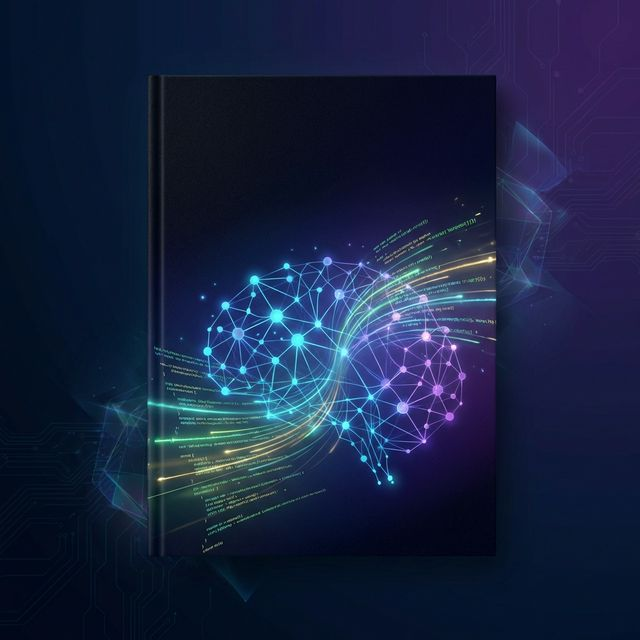

# 📚 Искусство Vibe-Coding

> **Полное руководство по эффективному взаимодействию с Coder-LLM**



[](README.md)
[](LICENSE.md)
[](CONTRIBUTING.md)

---

## 🎯 О чём эта книга?

**Vibe-Coding** — это новая парадигма программирования, где фокус смещается с написания синтаксически корректного кода на **формулирование интенции**. Вы определяете *что* нужно сделать, а ИИ реализует *как*.

Эта книга научит вас:
- 🧠 Эффективно формулировать запросы к LLM
- 🔧 Использовать паттерны управления контекстом
- 🏗️ Проектировать архитектуру совместно с ИИ
- 🔒 Обеспечивать безопасность сгенерированного кода
- 🤖 Работать с мульти-агентными системами

---

## 📖 Читать онлайн

### Быстрый старт
1. [Введение](Introduction.md) — Что такое Vibe-Coding и для кого эта книга
2. [Глава 1](Chapter_chapter_1.md) — От кодирования к вибрации: история и философия
3. [Глава 16](Chapter_chapter_16.md) — Приложения: глоссарий и шпаргалки

### Полное оглавление

<details>
<summary><b>Часть I: Философия и Менталитет</b></summary>

| Глава | Название | Темы |
|-------|----------|------|
| [Глава 1](Chapter_chapter_1.md) | От кодирования к вибрации | История, роль Vibe-Coder |
| [Глава 2](Chapter_chapter_2.md) | Психология общения с ИИ | Метафора стажёра, контекстное окно |
| [Глава 3](Chapter_chapter_3.md) | Настройка среды | Cursor, Warp, Zed |

</details>

<details>
<summary><b>Часть II: Практика Диалога</b></summary>

| Глава | Название | Темы |
|-------|----------|------|
| [Глава 4](Chapter_chapter_4.md) | Алфавит Vibe-Coding | Prompt Engineering, Few-Shot |
| [Глава 5](Chapter_chapter_5.md) | Жизненный цикл запроса | FRAME модель, итерации |
| [Глава 6](Chapter_chapter_6.md) | Преодоление разрыва | Intent vs Implementation |

</details>

<details>
<summary><b>Часть III: Каталог Паттернов</b></summary>

| Глава | Название | Паттерны |
|-------|----------|----------|
| [Глава 7](Chapter_chapter_7.md) | Управление контекстом | Context Anchor, Tunnel Vision |
| [Глава 8](Chapter_chapter_8.md) | Генерация кода | Scaffolding, Diff-Thinking |
| [Глава 9](Chapter_chapter_9.md) | Решение проблем | Devil's Advocate, Intent Reset |

</details>

<details>
<summary><b>Часть IV: Архитектура и QA</b></summary>

| Глава | Название | Темы |
|-------|----------|------|
| [Глава 10](Chapter_chapter_10.md) | Проектирование с ИИ | Выбор стека, архитектура |
| [Глава 11](Chapter_chapter_11.md) | Техническая гигиена | Code Review, Quality Gates |

</details>

<details>
<summary><b>Часть V: Мастерство</b></summary>

| Глава | Название | Темы |
|-------|----------|------|
| [Глава 12](Chapter_chapter_12.md) | Мульти-агентные системы | Dev/Test/Lead агенты |
| [Глава 13](Chapter_chapter_13.md) | Безопасность и этика | Уязвимости, приватность |
| [Глава 14](Chapter_chapter_14.md) | Продвинутый промптинг | Шаблоны, Project Memory |
| [Глава 15](Chapter_chapter_15.md) | CI/CD Integration | AI-пайплайны |

</details>

<details>
<summary><b>Часть VI: Справочник</b></summary>

| Глава | Название | Содержание |
|-------|----------|------------|
| [Глава 16](Chapter_chapter_16.md) | Приложения | Глоссарий, чек-листы, шаблоны |
| [Глава 17](Chapter_chapter_17.md) | Заключение | Итоги, рекомендации |

</details>

---

## 📥 Скачать для офлайн-чтения

```bash
# Клонировать репозиторий
git clone https://github.com/FineINK/vibe-coding-textbook.git

# Перейти в директорию
cd vibe-coding-textbook
```

### Рекомендуемые инструменты для чтения

| Инструмент | Платформа | Поддержка Mermaid |
|------------|-----------|-------------------|
| [Obsidian](https://obsidian.md/) | Windows/Mac/Linux | ✅ |
| [Typora](https://typora.io/) | Windows/Mac/Linux | ✅ |
| [VS Code](https://code.visualstudio.com/) + Markdown Preview Mermaid | Все | ✅ |
| GitHub Web | Браузер | ✅ |

---

## 👤 Об авторе


**Лебедев Алексей** (FineINK)

Практик Vibe-Coding с многолетним опытом работы с различными LLM и AI-интегрированными IDE. Обучаю разработчиков и команды эффективному взаимодействию с ИИ — от индивидуальных сессий до корпоративных воркшопов.

📧 Связаться: [GitHub](https://github.com/FineINK)

---

## 🙏 Благодарности

Этот учебник создан с помощью передовых инструментов ИИ:

### IDE и редакторы
- **[[Antigravity](https://antigravity.ai/)](https://antigravity.google/)** — AI-first IDE
- **[Windsurf](https://codeium.com/windsurf)** — IDE от Codeium

### Языковые модели
- **[Google Gemini](https://gemini.google.com/)** — модели Google DeepMind
- **[Kimi K2](https://kimi.moonshot.cn/)** — модель Moonshot AI
- **[Qwen](https://qwen.aliyun.com/)** — модели Alibaba

> Все упомянутые инструменты использовались в их **бесплатных некоммерческих версиях**.

---

## 📜 Лицензия

Этот материал распространяется под лицензией **[Creative Commons Attribution-ShareAlike 4.0 International (CC BY-SA 4.0)](LICENSE.md)**.

Вы можете:
- ✅ **Использовать** — для любых целей, включая коммерческие
- ✅ **Адаптировать** — изменять, дополнять, переводить
- ✅ **Распространять** — делиться копиями

При условии:
- 📝 **Указание авторства** — укажите автора (Лебедев Алексей / FineINK) и ссылку на оригинал
- 🔄 **Сохранение лицензии** — производные работы должны использовать ту же лицензию

---

## 🤝 Как помочь проекту

Мы приглашаем всех желающих внести свой вклад в развитие этого учебника!

### Способы участия

| Тип вклада | Описание |
|------------|----------|
| 🐛 **Исправления** | Нашли опечатку или ошибку? Откройте Issue или PR |
| 📝 **Дополнения** | Предложите новые примеры, паттерны, чек-листы |
| 🌍 **Переводы** | Помогите перевести на другие языки |
| 📢 **Распространение** | Поделитесь с коллегами и в соцсетях |
| ⭐ **Поддержка** | Поставьте звезду репозиторию |

### Быстрый старт для контрибьюторов

```bash
# 1. Форкните репозиторий на GitHub

# 2. Клонируйте свой форк
git clone https://github.com/YOUR_USERNAME/vibe-coding-textbook.git

# 3. Создайте ветку для изменений
git checkout -b feature/my-improvement

# 4. Внесите изменения и закоммитьте
git add .
git commit -m "Добавлен новый пример в Главу 5"

# 5. Отправьте изменения
git push origin feature/my-improvement

# 6. Откройте Pull Request на GitHub
```

Подробные инструкции: [CONTRIBUTING.md](CONTRIBUTING.md)

---

## 🌍 Переводы

| Язык | Статус | Контрибьютор |
|------|--------|-------------|
| 🇷🇺 Русский | ✅ Оригинал | [@FineINK](https://github.com/FineINK) |
| 🇬🇧 English | 🔜 В планах | Нужна помощь! |
| 🇨🇳 中文 | 🔜 В планах | Нужна помощь! |
| 🇪🇸 Español | 🔜 В планах | Нужна помощь! |

Хотите помочь с переводом? Откройте Issue с пометкой `translation`.

---

## ⭐ Поддержите проект

Если этот учебник оказался полезен:

1. ⭐ **Поставьте звезду** этому репозиторию
2. 🔀 **Форкните** для своих заметок
3. 📢 **Поделитесь** с коллегами
4. 🐛 **Сообщите** об ошибках через Issues

---

<p align="center">
  <i>Вибрация начинается с интенции.</i><br>
  <b>© 2026 Лебедев Алексей (FineINK)</b>
</p>
